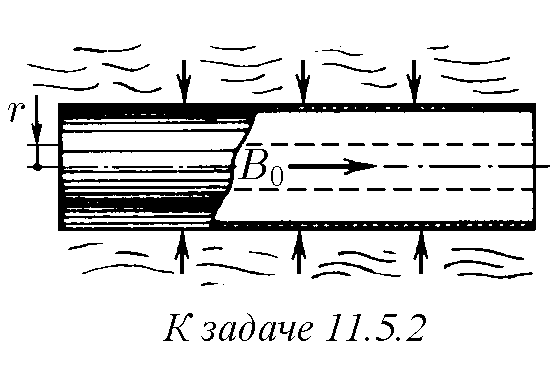
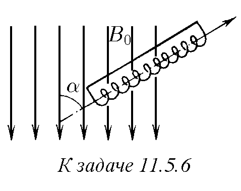
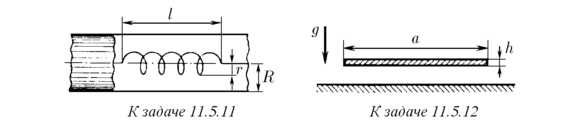
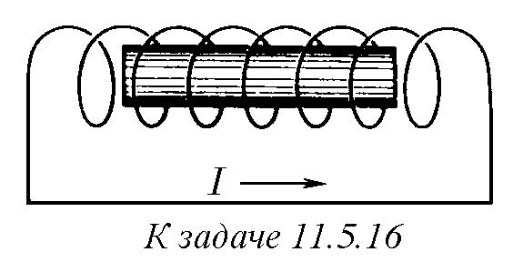
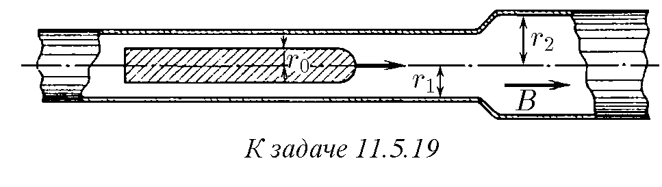
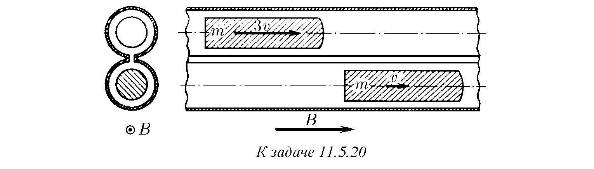
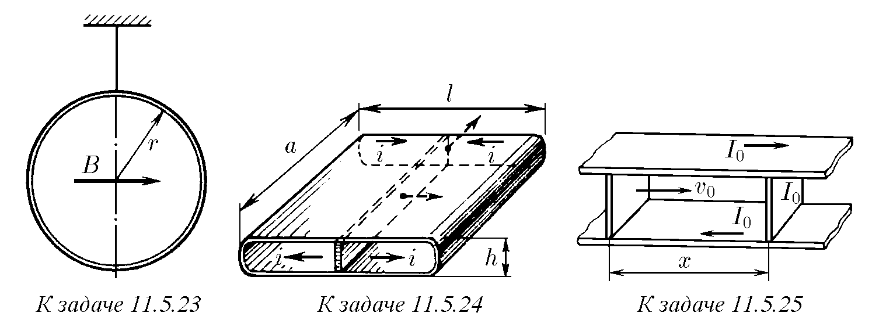

11.5.1. Защо при деформация на свръхпроводящ пръстен с ток пълният магнитен поток през пръстена се запазва?

♦ 11.5.2. Дълга цилиндрична метална обвивка с радиус r₀, която се е намирала в постоянно магнитно поле с индукция B₀, е свита чрез експлозия. Определете индукцията на магнитното поле вътре в свитата обвивка, ако нейният радиус е станал равен на r. Активното съпротивление на обвивката да се пренебрегне.

11.5.3. Колко пъти ще се промени токът в два отдалечени един от друг тънки свръхпроводящи пръстена с еднопосочен ток при тяхното събиране?

11.5.4. Когато в късосъединен свръхпроводящ дълъг соленоид с ток е вкаран свръхпроводящ прът, токът в соленоида се е увеличил три пъти. Определете колко пъти сечението на соленоида е по-голямо от сечението на пръта.

11.5.5. Късосъединен дълъг соленоид с ток I, направен от свръхпроводник, е свит така, че дължината му е намаляла три пъти. Как ще се промени токът в соленоида? Стъпката на навивката на соленоида е много по-малка от неговия радиус.

♦ 11.5.6∗. Дълъг късосъединен свръхпроводящ соленоид се вкарва в магнитно поле с индукция B₀ под ъгъл α спрямо посоката на полето. Как ще се разпредели индукцията на магнитното поле в соленоида, ако той влезе само наполовина във външното поле?

11.5.7. Свръхпроводящ пръстен с индуктивност L, в който тече ток I₀, се внася в еднородно магнитно поле с индукция B₀. Намерете тока, който ще протича по пръстена. Нормалата към равнината на пръстена сключва с посоката на полето ъгъл α; радиусът на пръстена е r.

11.5.8. В постоянно еднородно поле с индукция B около своя диаметър, ориентиран перпендикулярно на полето, се върти свръхпроводящ пръстен. Индуктивността на пръстена е L, неговият диаметър е D. Определете амплитудата на променливия ток в пръстена.

11.5.9. Дълъг късосъединен свръхпроводящ соленоид е нанизан съосно върху още по-дълъг стоманен цилиндър, чието сечение е два пъти по-малко от сечението на соленоида. С колко ще се промени индукцията на магнитното поле извън и вътре в частта от стоманения цилиндър, намираща се вътре в соленоида, ако магнитното поле на соленоида е много по-голямо от магнитното поле на насищане на стоманата B₀?

11.5.10∗. През бобина със сечение S и дължина h, изработена от свръхпроводящ проводник, прелита с постоянна скорост свръхпроводящ прът със сечение σ и дължина l. Начертайте графика на зависимостта на тока в бобината от положението на пръта, ако бобината е съединена накъсо и началният ток в нея е I₀. Разгледайте случаите: а) l > h; б) l < h. Крайните ефекти да се пренебрегнат.

♦ 11.5.11∗. Изчислете индуктивността на дълъг соленоид с радиус r и дължина l, поставен вътре в дълга свръхпроводяща тръба с радиус R по протежение на нейната ос. Броят на навивките на соленоида е N.

♦ 11.5.12. Плоска медна шина, чието сечение е a×h = 100×1 mm, е успоредна на хоризонталната повърхност на свръхпроводник. Какъв ток трябва да се пропусне през шината, за да не падне тя върху свръхпроводника?

11.5.13∗. През дълъг прав проводник, който се намира на височина h над свръхпроводяща равнина, е пуснат ток I. На колко е равно максималното магнитно налягане върху повърхността на свръхпроводника? С каква сила действа свръхпроводникът върху единица дължина от проводника?

11.5.14. Дълъг соленоид с отворени краища е разположен по протежение на постоянно магнитно поле с индукция B = 2 T. Броят на навивките на единица дължина от соленоида е n = 1000 m⁻¹. С каква скорост е прелетял през този соленоид дълъг метален снаряд с радиус r = 9 cm, ако максималното напрежение, което се е появило в краищата на соленоида, е V = 100 kV? Съпротивлението на метала на снаряда да се пренебрегне.

11.5.15∗. Защо отговорът на задача 11.5.14 не зависи от формата на краищата на снаряда?

♦ 11.5.16∗. Когато цилиндричен метален снаряд с маса m, дължина l и радиус r, летящ със скорост v₀, се е намирал вътре в соленоид с брой навивки N, дължина L и радиус R ≫ l, в соленоида е създаден ток I, а след това веригата му е дадена накъсо. С колко ще се увеличи скоростта на снаряда, излетял от соленоида? Съпротивлението на метала да се пренебрегне.

♦ 11.5.17∗. На голямо разстояние от дълга свръхпроводяща кръгла тръба с радиус r, съосно с нея е разположена късосъединена свръхпроводяща бобина с ток I. Броят на навивките в бобината е N, дължината на бобината l ≪ r, радиусът r/2, масата на бобината m. Каква скорост трябва да се придаде на бобината, за да прелети тя през закрепената тръба?

♦ 11.5.18∗. Каква минимална скорост трябва да притежава свръхпроводящ тънък прът със сечение S, дължина l и маса m, за да влети в надлъжно магнитно поле с индукция B?

♦ 11.5.19. Дълга метална тръба, имаща участък с радиус r₁ и участък с радиус r₂, е поставена по протежение на еднородно магнитно поле с индукция B. С колко ще се промени енергията на свръхпроводящ снаряд с радиус r₀ и дължина l ≫ r₁, r₂, летящ по оста на тръбата, при пресичането от него на границата между участъците на тръбата с различен радиус? Влиянието на съпротивлението на метала върху процеса на взаимодействие на снаряда с тръбата да се пренебрегне.

♦ 11.5.20. Двуканален магнитен преразпределител на енергията на снаряди има следната конструкция. Две метални тръби с прорез са съединени с метални превръзки така, както е показано на фигурата. Еднородно магнитно поле с индукция B е насочено по оста на тръбите. По оста на всяка тръба се движат еднакви дълги свръхпроводящи снаряди. Един от снарядите, имащ скорост 3v, застига втория снаряд, имащ скорост v. Дължината на всеки снаряд е l, сечението s, масата m. Сечението на всяка тръба е S. Определете скоростта на снарядите след тяхното взаимодействие. Съпротивлението на тръбата да се пренебрегне.

11.5.21. Решете задача 11.5.20 в случай, че масата на първия снаряд е m₁, а на втория m₂, а скоростта на снарядите е съответно v₁ и v₂ (v₁ > v₂).

11.5.22∗. Докажете, че свръхпроводящ пръстен с индуктивност L, връхлитащ със скорост v върху съосно на него магнитно поле, ще се отблъсне от това поле, ако кинетичната енергия на пръстена е по-малка от Φ²/2L, където Φ е максималният поток на магнитното поле през пръстена.

♦ 11.5.23∗. Меден пръстен с радиус r и маса m виси на нишка, извършвайки малки усукващи трептения с период T. Индуктивността на пръстена е L. Как ще се промени периодът на трептене на пръстена, ако той бъде поставен в хоризонтално еднородно магнитно поле с индукция B, успоредно на равнината на пръстена в равновесно положение? Инерционният момент на пръстена спрямо оста, минаваща по диаметъра, е J. Съпротивлението на пръстена да се пренебрегне.

♦ 11.5.24∗. Свръхпроводяща кутия е разделена на две равни части също от свръхпроводяща преграда с дебелина d. Размерите на кутията са показани на фигурата (h ≪ a, l). По кутията в посока, перпендикулярна на преградата, циркулира ток, чиято линейна плътност е i. С каква честота ще трепти преградата, ако ѝ се придаде малка скорост в посоката, показана на фигурата? Масата на преградата е m.

♦ 11.5.25∗. Между две свръхпроводящи шини с постоянна скорост v₀ се движи бутало по посока към преграда с маса m, образувайки свръхпроводяща верига. Намерете максималната скорост на преградата, ако в началния момент тя е била в покой, токът във веригата е бил равен на I₀, а разстоянието между буталото и преградата е било равно на x. Индуктивността на единица дължина от шините е L. Триенето да се пренебрегне.

11.5.26∗. Вътре в проводяща цилиндрична обвивка е създадено магнитно поле. На обвивката се предава скорост v по такъв начин, че тя започва да се свива към оста, без да губи симетрия. Намерете максималната индукция на магнитното поле, която може да бъде получена по този начин, ако началната индукция е B₀ = 10 T, v = 3 km/s, началният радиус на обвивката е r₀ = 20 cm, нейната дебелина е ∆ = 0,5 cm, а плътността на материала на обвивката е ρ = 8,9 g/cm³. Намерете максималното магнитно налягане, действащо върху обвивката. Електрическото съпротивление на обвивката да се пренебрегне.

11.5.27∗. Външно магнитно поле с индукция B, в което се намира дълга идеално проводяща тръбичка, не се екранира напълно от стените на тръбичката поради това, че масата на електроните е крайна. Полето частично прониква вътре в тръбичката. Оста на тръбичката е насочена по протежение на магнитното поле, нейният радиус r е много по-голям от дебелината на стените h. Броят на електроните на проводимост в единица обем от материала на тръбичката е nₑ. Изчислете индукцията на полето, проникнало вътре в тръбичката, в случай че B = 10 T, r = 1 mm, h = 0,1 mm, nₑ = 10²⁰ cm⁻³.

11.5.28∗. Ако дълъг идеално проводящ тънкостенен цилиндър се завърти около своята ос, то вътре в цилиндъра възниква магнитно поле. Намерете неговата индукция, ако ъгловата скорост на цилиндъра е ω.