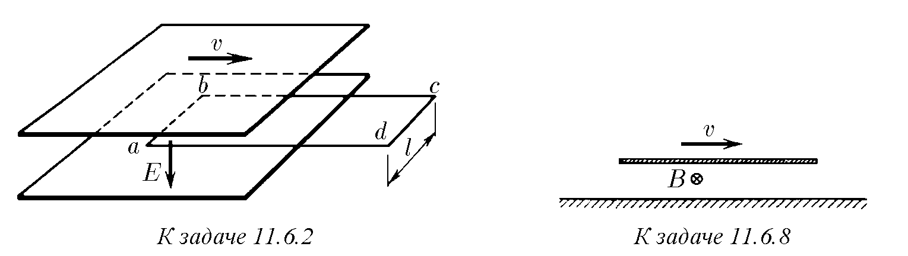
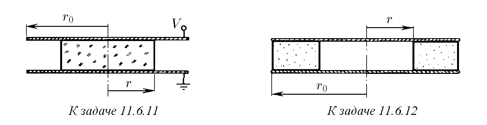

♦ 11.6.1. Съгласно закона за електромагнитната индукция променливото магнитно поле поражда вихрово електрическо поле. По същия начин променливото електрическо поле поражда вихрово магнитно поле, но при изменение на електрическото поле посоката на вектора B образува десен винт с посоката на вектора dE/dt. Коефициентът на пропорционалност в СГС, свързващ тези полета, е еднакъв и в двете явления. Използвайки това свойство на електромагнитното поле, определете в СГС и в СИ зависимостта на циркулацията на индукцията на магнитното поле по затворен контур от скоростта на изменение на потока на електрическата индукция през този контур.

♦ 11.6.2. а. Плосък кондензатор се движи със скорост v, както е показано на фигурата. Интензитетът на електрическото поле между плочите е E. Определете скоростта на изменение на потока на електрическото поле през правоъгълния контур abcd и циркулацията на индукцията на магнитното поле по този контур. Как са свързани помежду си търсените величини в СИ? в СГС?
б. Дайте примери, потвърждаващи пропорционалността на циркулацията на индукцията на магнитното поле по контур към скоростта на изменение на потока на електрическото поле през повърхността, ограничена от този контур.

11.6.3. На колко е равен потокът на електрическата индукция през площ, ограничена от затворен контур, ако при равномерно намаляване на този поток до нула в продължение на 1 μs в контура възниква циркулация на индукцията на магнитното поле 0,001 Tl · m?

11.6.4*. Магнитното поле при разряд на кондензатор се създава не само от тока в проводника, но и от изменящото се електрическо поле в пространството между обкладките на кондензатора, като изменящото се електрическо поле създава такова магнитно поле, сякаш между обкладките съществува ток, равен на тока в проводника. Докажете това.

11.6.5. Интензитетът на еднородното електрическо поле вътре в плосък кондензатор с плочи с радиус 10 cm нараства линейно с времето: E = αt, където α = 9 · 10¹⁰ V/(m · s). На колко е равна индукцията на магнитното поле вътре в кондензатора на разстояние 5 cm от неговата ос?

11.6.6. В трептящ кръг са възбудени свободни трептения. Колко пъти максималната индукция на магнитното поле вътре в плоския кондензатор е по-малка от максималната индукция на магнитното поле в бобината? Радиусът на плочите на кондензатора е r, разстоянието между тях е h, дължината на бобината е L, броят на навивките е N.

11.6.7. Плосък кондензатор, интензитетът на електрическото поле вътре в който е E, се движи със скорост v. Скоростта образува ъгъл α с плочите. Каква е индукцията на магнитното поле вътре в кондензатора?

♦ 11.6.8. При движение на равномерно заредена пластина успоредно на повърхността на метал със скорост v възниква магнитно поле с индукция B. Определете повърхностната плътност на заряда на пластината.

11.6.9. Вътре в плосък кондензатор успоредно на неговите плочи се движи със скорост v провеждаща пластина, чиято дебелина е равна на половината от разстоянието между плочите на кондензатора. На плочите на кондензатора се поддържа напрежение V, разстоянието между тях е h.
а. На колко е равна индукцията на магнитното поле вътре в проводника? между движещия се проводник и плочите на кондензатора?
б. Как ще се промени индукцията на магнитното поле в пластината, ако проводникът се замени с диелектрик с диелектрична проницаемост ε?

11.6.10*. В неподвижна диелектрична среда с диелектрична проницаемост ε се движи успоредно на своите плочи плосък зареден кондензатор. Как ще се промени индукцията на магнитното поле вътре в кондензатора, ако средата се движи заедно с него?

♦ 11.6.11*. а. Интензитетът на електрическото поле вътре в кръгъл плосък кондензатор, запълнен с вещество с диелектрична проницаемост ε, нараства линейно с времето: E = αt. Определете индукцията на магнитното поле вътре в кондензатора на разстояние r от неговия център.
б. Напрежението върху плочите на плосък кондензатор нараства линейно с времето: V = αt. Радиусът на плочите е r₀, разстоянието между тях е h. По оста на кондензатора е поставен диелектричен цилиндър с радиус r и диелектрична проницаемост ε. Определете индукцията на магнитното поле върху околната повърхност на цилиндъра и на ръба на кондензатора.

♦ 11.6.12*. Плосък изолиран кондензатор, чиито плочи са паралелни метални кръгове с радиус r₀, е запълнен с вещество, с изключение на централната цилиндрична област с радиус r. Кондензаторът се разрежда през това вещество. Токът на разряда е I. Определете зависимостта на индукцията на магнитното поле вътре в кондензатора от разстоянието до неговата ос. Постройте графика на тази зависимост.