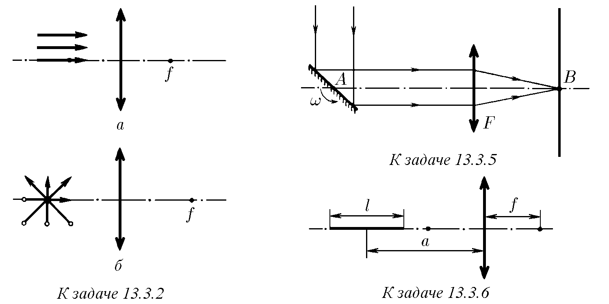
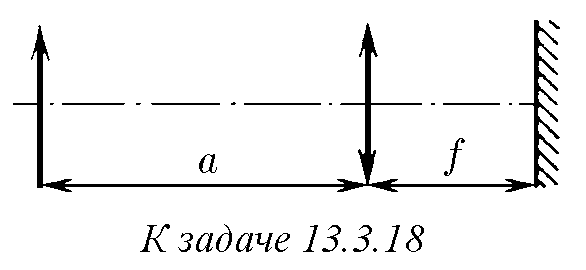
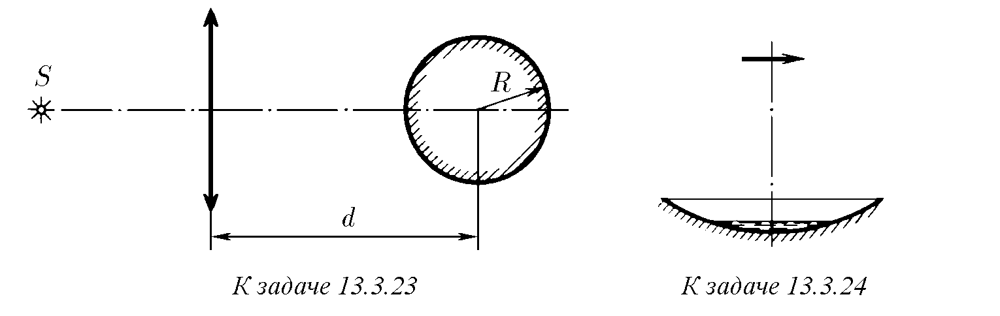

♦ 13.3.1. На фигурите са показани в определен мащаб предмети и фокуси на лещи. Постройте изображенията на тези предмети. На колко е равно увеличението във всеки случай?

♦ 13.3.2. Постройте изображенията на стрелките.

13.3.3. Източник на светлина се намира на разстояние 90 см от екран. Тънка събирателна леща, разположена между екрана и източника, дава ясен образ на източника върху екрана в две положения. Определете фокусното разстояние на лещата, ако разстоянието между двете положения на лещата, даващи ясен образ, е 30 см.

13.3.4. На какво разстояние от лещата е разположен предметът, ако разстоянието между предмета и неговия действителен образ е минимално? Фокусното разстояние на лещата е $f$.

♦ 13.3.5. Върху оптичната ос $AB$ на събирателна леща е разположено плоско огледалце, въртящо се с ъглова скорост $\omega$ около ос, минаваща през точка $A$ и перпендикулярна на равнината на чертежа. Върху огледалцето пада успореден сноп лъчи, който след отражение се фокусира върху екран. Фокусното разстояние на лещата е $f$. Намерете скоростта на светлинното петно върху екрана в момента, когато то пресича оптичната ос. Равнината на екрана е перпендикулярна на оптичната ос.

♦ 13.3.6. Предмет във вид на отсечка с дължина $l$ е разположен по протежение на оптичната ос на събирателна леща с фокусно разстояние $f$, даваща действителен образ на всички негови точки. Средата на отсечката се намира на разстояние $a$ от лещата. Определете надлъжното увеличение на предмета.

13.3.7. Изображението на предмет върху матовото стъкло на фотоапарат при фотографиране от разстояние 15 м е с височина 30 мм, а от разстояние 9 м – с височина 51 мм. Намерете фокусното разстояние на обектива.

13.3.8. За какво време може да бъде отворен затворът на фотоапарат при заснемане на скок във вода от кула? Фотографира се моментът на потапяне във водата. Височината на кулата е 5 м, фотографът се намира на разстояние 10 м от скачащия. Обективът на апарата има фокусно разстояние 10 см, върху негатива е допустимо размиване на изображението 0,5 мм.

13.3.9. Обектът на заснемане се движи към кинокамерата със скорост $v$. С каква скорост трябва да се променя фокусното разстояние на обектива и дълбочината на кинокамерата, за да остане размерът на изображението постоянен, ако увеличението, давано от кинокамерата, е $k$?

13.3.10. При фотографиране на Луната е получено размито изображение във вид на диск с радиус $r_1$. Резко изображение на Луната би имало радиус $r_2$. Определете на какво разстояние трябва да се премести фотопластинката, за да се получи рязко изображение върху нея. Фокусното разстояние на лещата е $f$, диаметърът е $D$, като $r_2 > D/2 > r_1$. За област на изображението се счита областта на попадане на светлината върху фотопластинката.

13.3.11*. Изображението на предмети, отдалечени от фотоапарата на разстояние от 2 до 4 м, се е получило достатъчно ясно при диафрагма 4. Определете границата на рязкост (дълбочината на рязкост) при диафрагма 2 и 8.

13.3.12. Какви очила ще предпишете на късоглед човек, който може да чете текст, разположен не по-далеч от 20 см от очите, и какви на далекоглед, който може да чете текст, разположен не по-близо от 50 см от очите?

13.3.13. Късоглед или далекоглед е човек, който вижда нормално във водата?

13.3.14. Известно е, че ако в лист тъмна хартия внимателно се пробие малка дупчица, през нея могат да се разглеждат дребни обекти с увеличение няколко пъти. Обяснете това явление.

13.3.15. Върху рамката на лупа има надпис „×10“, т.е. лупата увеличава ъгловия размер на разглеждания обект десет пъти. Определете нейното фокусно разстояние.

13.3.16*. Върхът на конус с ъгъл $2\alpha$ се разглежда през леща с фокусно разстояние $f$, разположена на разстояние $a$ от върха на конуса ($a < f$). Какъв изглежда ъгълът на конуса през лещата? Оста на лещата минава през оста на симетрия на конуса.

13.3.17. Определете максималното увеличение, с което се вижда рибка, плуваща в сферичен аквариум.

♦ 13.3.18. а. На фокусно разстояние $f$ от леща е разположено плоско огледало. Намерете на какво разстояние от лещата ще се намира изображението на предмет, разположен на разстояние $a$ от лещата.
б. Плоската страна на плоско-изпъкнала леща, чието фокусно разстояние е $f$, е посребрена. Намерете фокусното разстояние на полученото огледало.

13.3.19. Фокусното разстояние на две тънки лещи е $f_1$ и $f_2$. На колко е равно фокусното разстояние на системата от тези две лещи, събрани заедно? На колко е равна оптичната сила на тази система?

13.3.20. Система се състои от две еднакви лещи с обща оптична ос. Разстоянието между лещите е $l$, фокусното разстояние на лещите е $f$. Намерете фокусното разстояние на системата, ако $l \ll f$.

13.3.21. Две лещи с фокусно разстояние 30 см се намират на разстояние 15 см една от друга. Намерете при кои положения на предмета системата дава действителен образ.

13.3.22. Разсейвателна леща с фокусно разстояние 0,6 м е разположена така, че един от нейните фокуси съвпада с полюса на вдлъбнато огледало. Определете фокусното разстояние на огледалото, ако е известно, че системата дава недействителен образ на предмет, поставен на произволно разстояние пред лещата. Изображението се създава от лъчите, преминали втори път през лещата след отражението им от огледалото.

13.3.23. Оптична система се състои от събирателна леща с фокусно разстояние $f$ и огледално топче с радиус $R$, чийто център се намира на оптичната ос на лещата на разстояние $d$ от нея. Определете разстоянието от лещата до точков източник $S$, разположен на оптичната ос на системата, при което изображението на източника съвпада със самия източник.

♦ 13.3.24*. Вдлъбнато сферично огледало с радиус $R$ дава изображение на източник, което съвпада със самия източник. Когато в огледалото се налее малко течност, между източника и огледалото се появява второ изображение, разположено на разстояние $l$ от източника, $l < R$. Намерете показателя на пречупване на течността.

13.3.25*. Две тънки плоско-изпъкнали лещи, всяка от които има фокусно разстояние във въздуха $f$, са поставени в рамка така, че изпъкналите им повърхности се допират. Определете фокусното разстояние на такава система в течност с показател на пречупване $n$. Смятайте, че вътре в рамката не попада течност. Как ще се промени отговорът, ако между лещите попадне течност? Показателят на пречупване на стъклото, от което са направени лещите, е $n_0$.

13.3.26. Изображението на Луната, получено с помощта на телескоп, в първия случай се фиксира директно върху фотолента, а в другия се фотографира с помощта на камера с дълбочина $l$, чийто обектив има фокусно разстояние $f$. Колко пъти се различават размерите на изображението?

13.3.27. Фокусното разстояние на обектива на телескоп е $f$. Колко пъти ще се промени неговото ъглово увеличение при наблюдение на обекти, отдалечени от телескопа на крайно разстояние $a$?

13.3.28. Микроскоп има обектив и окуляр с фокусни разстояния съответно $f_1$ и $f_2$. С колко ще се промени увеличението на микроскопа, ако разстоянието между обектива и окуляра се увеличи с $l$? Колко пъти ще се промени увеличението на микроскопа, ако всички негови размери, включително и размерите на лещите, се променят $k$ пъти?