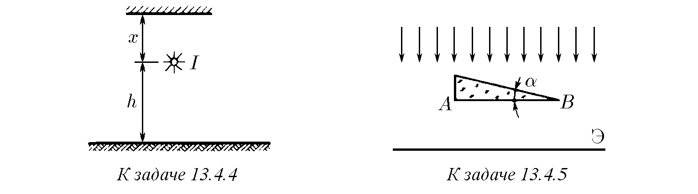
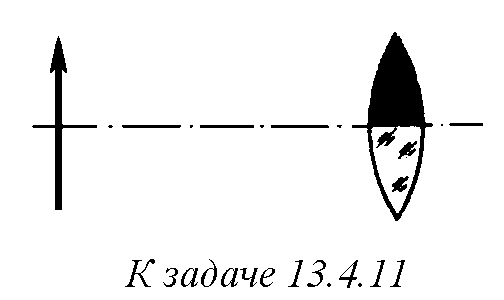
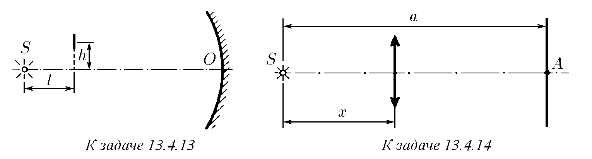

13.4.1. Съгласно нормите осветеността на работното място за прецизна работа трябва да бъде не по-малко от 100 lx. На каква максимална височина над работното място трябва да бъде поставена лампа със сила на светлината 100 cd?

13.4.2. Осветеността на плоска повърхност в точката, най-близка до точков източник на светлина, е 200 lx. Каква е осветеността в точките, където ъгълът на падане на лъча спрямо нормалата към повърхността е 30°, 45°, 60°?

13.4.3. Над повърхност на височина 2 m е разположен точков източник със сила на светлината 120 cd. На разстояние 1 m от източника, перпендикулярно на повърхността, се намира плоско абсолютно отразяващо огледало. Определете осветеността на повърхността непосредствено под източника.

♦ 13.4.4. Точков източник със сила на светлината $I$ е разположен на височина $h$ над хоризонтална повърхност. Над източника се намира плоско огледало, успоредно на повърхността. Как зависи осветеността на повърхността непосредствено под източника от разстоянието $x$ между огледалото и източника?

♦ 13.4.5. Екран се осветява от успореден сноп светлина. Как ще се измени осветеността на екрана, ако на пътя на лъчите се постави призма с ъгъл $\alpha$ и страна $AB$, успоредна на екрана? Начертайте графика на изменението на осветеността по протежение на екрана.

13.4.6. Оценете колко пъти осветеността на една и съща повърхност в лунна нощ при пълнолуние е по-малка, отколкото в слънчев ден? Височината на Луната и Слънцето над хоризонта е еднаква. Считайте, че участъците на Луната разсейват цялата падаща върху тях светлина равномерно във всички посоки. Приемете разстоянието от Луната до Земята за 400 000 km, а радиуса на Луната — за 2000 km.

13.4.7. Сноп светлина с интензитет $I$ пада върху плоскопаралелна пластина по нормалата към нейната повърхност. Пренебрегвайки поглъщането и считайки, че коефициентът на отражение на светлината от всяка от повърхностите на пластината във всяка посока е равен на $k$, определете интензитета на снопа, преминал през нея.

13.4.8*. Изкуствен спътник на Земята с радиус 1 m, осветен от Слънцето, се вижда от разстояние 300 km като обикновена звезда. Оценете разстоянието до такава звезда.

13.4.9. За локация на повърхността на Венера от Земята и за приемане на сигнал от изкуствен спътник на Венера се използва един и същ приемник, като нивото на приемания сигнал в единия и в другия случай е еднакво. Оценете колко пъти мощността на предавателя на спътника е по-малка от мощността на излъчвателя на локатора.

13.4.10. Сътрудник на пътната полиция използва излъчвател на електромагнитни вълни и приемник за определяне скоростта на автомобил. $R$ е пределното разстояние до автомобила, при което приемникът фиксира отразения сигнал. Любител на бързото шофиране има абсолютно същия приемник. Оценете от какво разстояние той ще открие работата на излъчвателя.

♦ 13.4.11. Какво ще се случи с изображението, давано от леща, ако горната половина на лещата се боядиса с черна боя?

13.4.12. Как ще се измени осветеността на изображението на Слънцето, давано от плоскоизпъкнала леща, ако лещата се разреже по диаметъра и двете части се долепят с плоските си страни?

♦ 13.4.13. Пред сферично огледало с радиус на кривината $R$, в чийто фокус се намира точков източник на светлина $S$, на височина $h$ над оста на огледалото $SO$ е поставена малка пластинка, чиято равнина е перпендикулярна на оста. Намерете отношението на осветеностите на лявата и дясната страна на пластинка平, ако $h \ll R, l$.

♦ 13.4.14*. Точков източник на светлина $S$ е разположен на разстояние $a < 4f$ от плосък екран. Как ще се измени осветеността на екрана в точка $A$, ако между източника и екрана се постави леща с фокусно разстояние $f$ на разстояние $x$ от източника? При кое $x$ осветеността в точка $A$ ще бъде максимална?

13.4.15. Точков източник на светлина може да бъде забелязан от разстояние $L_0$ с помощта на телескоп с обектив с диаметър $D_0$. От какво разстояние може да се види този източник с телескоп с диаметър на обектива $D$?

13.4.16*. Може ли с помощта на леща или огледало да се получи такова изображение на Слънцето, чиято яркост превишава яркостта на Слънцето? Каква максимална осветеност на изображението на Слънцето може да се получи с помощта на вдлъбнато огледало с диаметър $D$ и радиус на кривината $R$? Яркостта на повърхността на Слънцето е $B$.

13.4.17. Във фокуса на сферично огледало е поставен съд, съдържащ 100 g вода. Какъв трябва да бъде диаметърът на огледалото, за да изкипи водата след 1 min, ако огледалото е насочено право към Слънцето? Плътността на енергийния поток от Слънцето е 0,14 W/cm². Загубите да се пренебрегнат.

13.4.18*. Според известна легенда жителите на Сиракуза, под ръководството на Архимед, изгорили корабите на римския флот, фокусирайки върху тях слънчевата светлина с помощта на плоски огледални щитове. Приемайки, че диаметърът на щита е $d = 1$ m, разстоянието до корабите е $x = 500$ m и температурата, при която дървото се запалва, е $T \approx 1000$ K, оценете необходимия брой щитове.

13.4.19. В капака на затворена кутия с височина 1 m има кръгъл отвор. Ще се измени ли осветеността на дъното под отвора, ако в него се постави леща с оптична сила 1 dpt? Кутията стои под открито небе, равномерно покрито с облачна пелена.

13.4.20. Защо при наблюдение с телескоп ярките звезди се виждат дори през деня?

13.4.21*. Бръмбар се фотографира в два мащаба, като апаратът се доближава на разстояние, равно първо на тройното, а след това на петкратното фокусно разстояние на обектива. Как трябва да се измени диаметърът на диафрагмата на обектива, за да бъде осветеността на изображението върху филма еднаква и в двата случая? Диаметърът на диафрагмата и в двата случая е много по-малък от разстоянието до бръмбара.

13.4.22*. Каква експозиция (време на затвора) е нужна при фотографиране на чертеж с линейно увеличение $k_1$, ако при фотографиране с увеличение $k_2$ е установена експозиция $t_2$?

13.4.23*. Интензитетът на светлината на фар на разстояние $L$ е намалял с 10% поради мъгла. Радиусът на капките мъгла е $r$. Оценете количеството капки мъгла в единица обем въздух.

13.4.24*. В димна завеса от непрозрачни частици с радиус 5 μm, при съдържание 0,004 g вещество в 1 m³ въздух, видимостта е 50 m. Колко вещество в 1 m³ въздух се разпръсква от източник на завеса, създаващ частици с радиус 10 μm, ако видимостта при това се съкращава до 20 m?

13.4.25*. В система за оптична връзка лазерен лъч, предаващ информация, има формата на конус с ъгъл при върха 10⁻⁴ rad (ъгъл на разходимост). В приемното устройство светлинната енергия се фокусира върху фотоелемент с помощта на леща с диаметър 1 m. Оказало се, че при промяна на разстоянието между предавателя и приемника от 5 на 10 km сигналът, приет от фотоелемента, е намалял два пъти (поради поглъщане на светлината в атмосферата). Колко пъти ще се измени сигналът при увеличаване на разстоянието от 10 на 20 km?