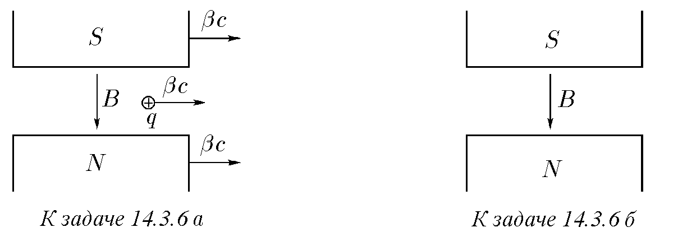
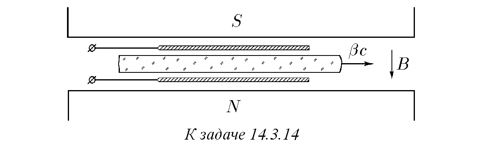
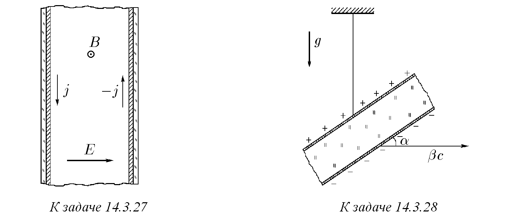

\*) В този параграф се използва системата единици СГС.

14.3.1. Определете плътността на повърхностния заряд, електрическото и магнитното поле в кондензатор, движещ се със скорост $\vec{\beta}c$ паралелно на своите плочи, ако в отправната система, движеща се заедно с кондензатора, интензитетът на електрическото поле е равен на $E$. (Елементарният електрически заряд на частиците при движение на системата не се променя, но се променя разстоянието между зарядите.)

14.3.2*. Решете задача 14.3.1 в случая, когато скоростта $\vec{\beta}c$ е насочена под ъгъл $\alpha$ спрямо плочите на кондензатора. Как са свързани помежду си интензитетът на електрическото поле и магнитната индукция в този кондензатор?

14.3.3. Намерете електрическото и магнитното поле на равномерно заредена нишка, движеща се в надлъжно направление със скорост $\vec{\beta}c$, ако в отправната система, в която нишката е неподвижна, плътността на заряда на единица дължина от нишката е равна на $\rho$.

14.3.4. а. В прав неподвижен проводник скоростта на електроните е равна на $-\vec{\beta}c$, а скоростта на протоните е равна на нула. Плътностите на обемния заряд на електроните и йоните са равни на $\pm\rho$. Как ще се промени плътността на електроните и йоните при движение на проводника със скорост $\vec{\beta}c$?
б. Колко пъти ще се промени индукцията на магнитното поле в движещия се проводник?
в. Как са свързани помежду си индукцията на магнитното поле в движещия се проводник $\vec{B}$ с интензитета на електрическото поле $\vec{E}$?

14.3.5*. Решете задача 14.3.4 в случая, когато проводникът се движи със скорост $\vec{\beta}_1 c$, $\beta_1 = k\beta$.

♦ 14.3.6. а. Нека имаме неподвижен заряд и магнитно поле, което не действа върху този заряд. При движение*) на това състояние със скорост $\vec{\beta}c$ зарядът ще се движи със скорост $\vec{\beta}c$. Силата, действаща върху заряда в новото състояние, е равна на нула поради това, че освен магнитното поле върху заряда действа възникващото при движението електрическо поле. Определете, използвайки условието за равновесие на силите, действащи върху заряда, връзката в новото състояние на индукцията на магнитното поле $\vec{B}$ с интензитета на електрическото поле $\vec{E}$.
б. Какво електрическо поле възниква при движение със скорост $\vec{\beta}c$ на магнитно поле с индукция $B$, ако $\beta \ll 1$?
в. На рисунката е изобразен постоянен магнит с магнитна индукция $\vec{B}$, движещ се, както твърди експериментатор 1, покрай него със скорост $\vec{\beta}c$, тъй като той е открил чрез действието върху заряд $q$ електрическо поле с интензитет $\vec{E} = -[\vec{\beta} \times \vec{B}]$, което трябва да възникне при движещия се магнит. Обаче експериментатор 2, седящ върху магнита, твърди, че при този магнит няма никакво електрическо поле и той е неподвижен. Силата пък, действаща върху заряда $q$, е свързана не с електрическото, а с магнитното поле. „Експериментатор 1, — твърди експериментатор 2, — заедно със своя заряд се движи в магнитно поле с индукция $\vec{B}$ със скорост $-\vec{\beta}c$. Затова върху заряда действа сила не от страна на електрическото поле с интензитет $\vec{E} = -[\vec{\beta} \times \vec{B}]$, а от страна на магнитното поле с индукция $\vec{B}$“.
Кой от тях е прав?
\*) Под движение на състояние със скорост $\vec{\beta}c$ се разбира ново състояние, което в отправна система, движеща се със скорост $\vec{\beta}c$ спрямо първоначалната отправна система, съвпада с първоначалното състояние.

14.3.7*. а. При движение със скорост $\vec{\beta}c$ на състояние, в което е имало само електрическо поле, възниква магнитно поле с индукция $\vec{B}$, свързано с новото електрическо поле $\vec{E}$ чрез съотношението $\vec{B} = [\vec{\beta} \times \vec{E}]$. Докажете това съотношение в случая, когато полето $\vec{E}$ е перпендикулярно на скоростта $\vec{\beta}c$.
б. Какво магнитно поле възниква при движение със скорост $\vec{\beta}c$ на електрическо поле с интензитет $\vec{E}$, ако $\beta \ll 1, \beta \approx 1$?

14.3.8. а. Формулата за преобразуване на полетата $\vec{E}$ и $\vec{B}$ при движението им със скорост $\vec{\beta}c$ има следния вид:
$\vec{E}' = \vec{E}_\parallel + \gamma(\vec{E}_\perp + [\vec{\beta} \times \vec{B}])$,
$\vec{B}' = \vec{B}_\parallel + \gamma(\vec{B}_\perp - [\vec{\beta} \times \vec{E}])$,
$\gamma = 1/\sqrt{1 - \beta^2}$,
където $\vec{E}'$ и $\vec{B}'$ са електрическите и магнитните полета при движението; $\vec{E}_\parallel, \vec{E}_\perp$ и $\vec{B}_\parallel, \vec{B}_\perp$ са съставните на електрическите и магнитните полета, паралелни и перпендикулярни на $c\vec{\beta}$ в началната система. Движението на полетата $\vec{E}'$ и $\vec{B}'$ със скорост $-c\vec{\beta}$ връща предишното състояние. Проверете това.
в. Използвайки дадените в точка а формули за преобразуване на полетата, решете задачи 14.3.1–14.3.3, 14.3.5*.
г. Използвайки дадените в точка а формули за преобразуване на полетата, решете задачи 14.3.6 а, б и 14.3.7.
д. Докажете, че при $\beta \to 1$ полетата $\vec{E}'$ и $\vec{B}'$ са перпендикулярни.

14.3.9. Колко пъти ще се промени потенциалната разлика и капацитетът на плосък кондензатор при движението му със скорост $\vec{\beta}c$: а) по протежение на плочите? б) перпендикулярно на плочите?

14.3.10. Колко пъти ще се промени потенциалната разлика и капацитетът на дълъг цилиндричен кондензатор при движението му със скорост $\vec{\beta}c$ по протежение на оста?

14.3.11. На неподвижна сфера с радиус $R$ с равномерно разпределен повърхностен заряд $Q$ е придадена скорост $\vec{\beta}c$. Определете максималния електрически интензитет и максималната и минималната плътност на повърхностния заряд в новото състояние.

14.3.12*. Определете разпределението на електрическия интензитет и магнитната индукция на движещ се със скорост $\vec{\beta}c$ заряд $q$.

14.3.13*. Между неподвижните плочи на кондензатор със скорост $\vec{\beta}c$ се движи пластина от вещество с диелектрична проницаемост $\epsilon$. Интензитетът на електрическото поле между диелектрика и плочите е $E$. На колко са равни интензитетът на електрическото поле и индукцията на магнитното поле вътре в диелектрика?

♦ 14.3.14*. Диелектрична пластина с дебелина $h$ се движи със скорост $\vec{\beta}c$ между плочите на кондензатор, който е пронизан от външно магнитно поле с индукция $B$, перпендикулярна на плочите и пластината. Диелектричната проницаемост на веществото на пластината е $\epsilon$. Определете потенциалната разлика между отворените плочи на кондензатора.

14.3.15. Колко пъти ще се промени амплитудата на плоска електромагнитна вълна при преминаване в координатна система, движеща се със скорост $\vec{\beta}c$ в посоката на разпространение на вълната?

14.3.16*. Решете задача 14.3.15 при разпространение на плоска вълна в диелектрична среда с коефициент на пречупване $n$.

14.3.17. Върху движеща се със скорост $\vec{\beta}c$ метална стена пада перпендикулярно плоска електромагнитна вълна. Колко пъти ще се промени амплитудата на вълната при отражение?

14.3.18*. Решете задача 14.3.17, когато електромагнитната вълна пада върху движеща се стена под ъгъл $\alpha$.

14.3.19. Скоростта на електроните в паралелен сноп е $\vec{\beta}c$. Как ще се промени плътността на електроните при движение спрямо снопа със скорост $\vec{\beta}_1 c$ в надлъжно направление?

14.3.20. В прав проводник плътността на тока е равна на $j$. Как ще се промени тази плътност при движение на проводника със скорост $\vec{\beta}_1 c$ в надлъжно направление? Какъв обемен заряд възниква в проводника?

14.3.21*. Ще се промени ли плътността на тока в проводник при движението му перпендикулярно на посоката на тока?

♦ 14.3.22. Дебелината на неподвижен плосък кондензатор е $h$, плътността на тока на утечка е $j$. Началната плътност на повърхностните заряди е $\sigma$. Как ще се променя електрическото поле вътре в кондензатора при движението му със скорост $\vec{\beta}c$ паралелно на плочите?

14.3.23*. Решете задача 14.3.21 в случая на движение на кондензатора със скорост $\vec{\beta}c$ перпендикулярно на плочите.

♦ 14.3.24. Магнитният момент на дълъг плосък соленоид с ток е равен на $M$. Какъв електрически момент ще възникне при този соленоид при напречното му движение със скорост $v$ паралелно на плоските повърхности?

14.3.25*. Решете задача 14.3.24 в случая на кръгъл дълъг соленоид.

14.3.26. а. „... За движещ се електрон електрическото поле $\vec{E}$ е еквивалентно на допълнително магнитно поле $\vec{B} = [\vec{\beta} \times \vec{E}]$“ (Г. Бете, Е. Солпитър. Квантова механика на атоми с един и два електрона. М.: Физматгиз, 1960). Определете, използвайки това твърдение, силата, действаща върху магнитния момент на електрона в водородния атом, ако електронът*) се движи по кръгова орбита.

♦ 14.3.27. Някога в космическото пространство ще бъдат създавани гигантски акумулатори на електромагнитна енергия. Един от вариантите за такъв акумулатор е магнитоелектричен плосък кондензатор, в който разноименни електрически заряди, разположени върху плочите, създават електрическо поле с интензитет $E$, а циркулярният ток на свръхпроводяща подложка (изолирана от плочите) създава магнитно поле с индукция $B$, равна по величина (в система СГС) на $E$. В такъв кондензатор магнитното поле, раздалечаващо плочите, ще бъде равно на електрическото налягане, привличащо плочите, и като цяло кондензаторът ще се намира в равновесие. Затова могат да се създават такива акумулатори с много големи размери, тъй като те не изискват допълнително укрепване. Докажете, че равновесието в акумулатора няма да се промени при тяхното движение както по протежение на, така и напречно на плочите.

14.3.28*. Зареден кондензатор, окачен на нишка, изглежда не би могъл заедно с нишката и окачването да се движи транслационно, ако ъгълът $\alpha$ не е прав, тъй като магнитната сила на взаимодействие между два съвместно движещи се заряда създава въртящ момент. Този въртящ момент би могъл да се открие експериментално, ако се счита, че кондензаторът заедно със Земята се движи със скорост $\vec{\beta}c$. Така ли е?