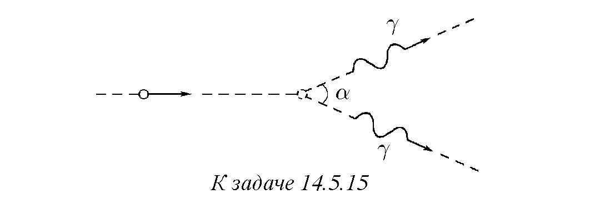
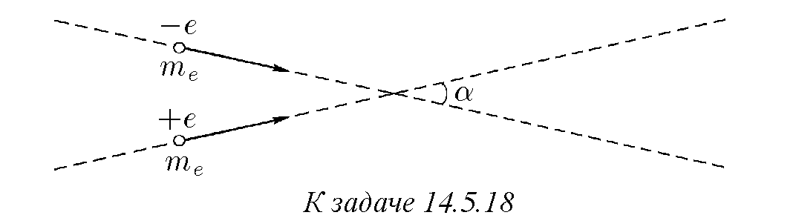

14.5.1. Неподвижна частица с маса M се разпада на два γ-кванта. Определете масата на всеки γ-квант.

14.5.2. Мощността на излъчване на Слънцето W е близка до 4 · 10²⁶ W. Оценете масата, губена от Слънцето поради излъчване в рамките на една секунда.

14.5.3. Скоростите на две частици, образуващи се при разпада на неподвижно ядро с маса M, са еднакви по величина и равни на βc. Определете пълната маса, масата на покой и кинетичната енергия на всяка частица.

14.5.4. При челен сблъсък на протони може да се роди частица с маса на полето k пъти по-голяма от масата на покой на протона mp:
p + p → p + p + M,
M = kmp.
Определете минималната маса на движещите се протони, за които е възможна тази реакция. На колко е равна минималната скорост на протоните?

14.5.5. При каква кинетична енергия на електроните и позитроните (в MeV) в експерименти с насрещни снопове се наблюдава раждането на протон-антипротонна двойка: e⁻ + e⁺ → p + p̄? раждане на π⁰-мезон: e⁺ + e⁻ → π⁰?

14.5.6. Неподвижен атом с маса M поглъща фотон с маса m. Определете масата и импулса на атома след поглъщането на фотона.

14.5.7*. Определете скоростта на „откат“ на неподвижен атом с маса M след излъчване на фотон с маса m.

14.5.8. Фотонна ракета, стартираща от Земята, според наблюдения от Земята губи за единица време маса m. Началната маса на ракетата е M. Как се променят с времето скоростта и масата на покой на ракетата? Действието на гравитационното поле на Земята върху ракетата да се пренебрегне.

14.5.9. Две частици с маси m₁ и m₂, летящи със скорости v₁ и v₂, насочени една към друга под ъгъл α, се сливат в една частица. Определете масата и скоростта на образувалата се частица.

14.5.10. В ядрената физика масите на частиците се измерват в енергийни единици, когато вместо маса m се дава енергията на масата mc² (1 MeV = 1,6 · 10⁻¹³ J). Определете в MeV масите на електрона, протона, π⁰-мезона и ψ-мезона, ако масите на тези частици са съответно 0,911 · 10⁻²⁷ g, 1,673 · 10⁻²⁴ g, 2,4 · 10⁻²⁵ g, 5 · 10⁻²⁴ g.

14.5.11. π⁰-Мезонът се разпада на два γ-кванта: π⁰ → γ + γ. Намерете кинетичната енергия на π⁰-мезона, ако детектора, разположен по направление на неговото движение, регистрира γ-квант с енергия 270 MeV.

14.5.12*. При какви кинетични енергии на π⁰-мезона γ-квантът, възникващ при разпада π⁰ → γ + γ и летящ назад, може да роди електрон-позитронна двойка при сблъсък с тежко ядро?

14.5.13. Неподвижно ядро, разпадайки се, излъчва електрон с кинетична енергия Ee = 1,73 MeV и перпендикулярно на посоката на движение на електрона — неутрино с енергия Eν = 1 MeV. Масата на покой на неутриното е равна на нула. На колко ще бъде равна кинетичната енергия на ядрото, ако останалата маса на ядрото е M = 3,9 · 10⁻²² g.

14.5.14*. Масата и импулсът на състоянието, което се получава при движение със скорост v на състояние с маса M и нулев импулс, са равни на γM и γMv, γ = 1/√(1 - v²/c²). Докажете това твърдение за състояние, в което се движат две невзаимодействащи частици.

♦ 14.5.15. Движеща се частица се разпада на два γ-кванта с еднаква маса, които се разлитат под ъгъл α един спрямо друг. С каква скорост се е движила частицата?

14.5.16. Бързи протони се сблъскват с неподвижни протони. При каква кинетична енергия на бързите протони могат да се раждат π⁰-мезони: p + p → p + p + π⁰? ψ-мезони: p + p → p + p + ψ? протон-антипротонни двойки: p + p → p + p + (p̄ + p)?

14.5.17. При каква минимална кинетична енергия на позитрона неговият сблъсък с неподвижен електрон може да предизвика появата на протон-антипротонна двойка: e⁺ + e⁻ → p + p̄? Колко пъти тази енергия е по-голяма от минималната кинетична енергия на позитрона, който ражда протон-антипротонна двойка при челен сблъсък с електрон?

♦ 14.5.18. Определете минималната енергия на електрона и позитрона, които, имайки еднакви скорости, насочени под ъгъл α един към друг, могат да родят протон-антипротонна двойка: e⁺ + e⁻ → p + p̄.

14.5.19. а. С каква скорост се е движило възбудено ядро с маса M, ако след излъчване на γ-квант с маса m то е спряло? С колко се различават масата и енергията на възбуденото и невъзбуденото ядро?
б. В какъв диапазон от скорости на възбуденото ядро от задачата в точка а е възможно следното събитие: излъченият от възбуденото ядро γ-квант се поглъща от невъзбудено неподвижно ядро.

14.5.20. Определете минималната и максималната енергия на неутриното, образуващо се при разпада на π⁰-мезон с енергия 6 GeV: π⁰ → µ⁺ + e⁻ + ν. (Забележка: в оригиналния текст вероятно е имало предвид разпад на зареден мезон или друг процес, но преводът следва оригинала).

14.5.21. В какъв диапазон от енергии лежат кинетичните енергии на електроните и неутриното, възникващи при разпада на µ⁻-мезон: µ⁻ → e⁻ + ν + ν̄?