2.1.1. По достоверни сведения, веднъж барон Мюнхгаузен, затънал в блато, се изтеглил сам за косата си. Кои закони на физиката е нарушил баронът?

2.1.2. Шайба, плъзгаща се по лед, е спряла след време $t = 5 \text{ с}$ след удар с

хокейната стика на разстояние $l = 20 \text{ м}$ от мястото на удара. Масата на шайбата е $m = 100 \text{ г}$. Определете силата на триене, действала върху шайбата.

♦ 2.1.3. В електронно-лъчева тръба електрони с начална хоризонтална скорост $v$ влитат в област на електрично поле с дължина $l$, където върху тях действа вертикална сила от страна на заредени отклоняващи пластини. На колко е равна тази сила, ако електроните, попадайки на екрана, се отклоняват на разстояние $y$ в сравнение със случая на незаредени пластини? Екранът се намира на разстояние $L$ от центъра на областта на действие на електричната сила. Масата на електрона е $m_e$.

♦ 2.1.4. Четири опънати нишки закрепват товар към количка. Силата на напрежение на хоризонталните нишки е съответно $T_1$ и $T_2$, а на вертикалните — $T_3$ и $T_4$. С какво ускорение се движи количката по хоризонтална равнина?

♦ 2.1.5. Каква сила действа в напречното сечение на еднороден прът с дължина $l$ на разстояние $x$ от онзи край, към който по дължината на пръта е приложена сила $F$?

♦ 2.1.6. Две тела с маси $m_1$ и $m_2$ са свързани с нишка, издържаща на сила на напрежение $T$. Към телата са приложени сили $F_1 = \alpha t$ и $F_2 = 2 \alpha t$, където $\alpha$ е постоянна константа, $t$ е времето на действие на силата. Определете в кой момент от време нишката ще се скъса.

  

2.1.7. За измерване на масата на космонавт на орбитална станция се използва подвижно седалище с известна маса $m_0$, прикрепено към пружина. При една и съща начална деформация (свиване) на пружината, празно седалище се връща в изходно положение след време $t_0$, а ако на седалището има космонавт — след време $t > t_0$. Каква е масата на космонавта?

♦ 2.1.8. Динамометър се състои от два цилиндъра, свързани с лека пружина. Намерете отношението на масите на тези цилиндри, ако при приложени към тях сили $F_1$ и $F_2$ динамометърът показва сила $F$.

  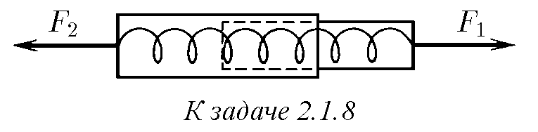

2.1.9. За изпитване на оборудване в условия на безтегловност, контейнер се подхвърля нагоре с пневматично бутално устройство, намиращо се на дъното на вакуумирана шахта. Буталото действа върху контейнера в продължение на време $\Delta t$ със сила $F = n m g$, където $m$ е масата на контейнера с оборудването. След какво време контейнерът ще падне на дъното на шахтата? За какво време продължава състоянието на безтегловност за оборудването, ако $\Delta t = 0,04 \text{ с}$, а $n = 125$?

2.1.10. За подготовка за работа в условия на безтегловност, космонавти, облечени в скафандри, тренират във вода. При това силата на тежестта, действаща върху тях, се уравновесява от изтласкваща сила. Каква е разликата между такава "безтегловност" и истинската?

♦ 2.1.11. Намерете ускорението на товарите и силите на напрежение на нишките в системата, изобразена на рисунката. Макарата и нишките са безтегловни, няма триене.

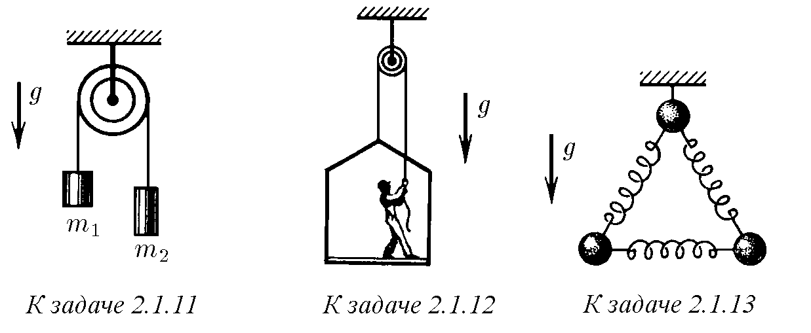

♦ 2.1.12. Бояджия работи в висяща люлка. Потрябвало му е спешно да се изкачи нагоре. Той започва да тегли въжето с такава сила, че силата му на натиск върху пода на люлката намалява до $400 \text{ Н}$. Масата на люлката е $12 \text{ кг}$, масата на бояджията е $72 \text{ кг}$. На колко е равно ускорението на люлката?

♦ 2.1.13. Система от три еднакви топки, свързани с еднакви пружини, е окачена на нишка. Нишката се прерязва. Намерете ускоренията на топките веднага след прерязването на нишката.

  

♦ 2.1.14. Тела с маси $m_1$ и $m_2$ са съединени с пружина с коефициент на еластичност $k$. Върху тялото с маса $m_2$ действа постоянна сила $F$, насочена по дължината на пружината към тялото с маса $m_1$. Намерете с колко е свита пружината, ако няма други външни сили, а колебанията вече са прекратени. Какво ще бъде ускорението на телата веднага след прекратяване на действието на силата $F$?

♦ 2.1.15. Тяло с маса $m$ е съединено с две пружини с коефициент на еластичност $k_1$ и $k_2$ към неподвижни стени, като пружините първоначално не са деформирани. При възникналите колебания, най-голямото ускорение на тялото е равно на $a$. Намерете максималното отклонение на тялото от равновесното положение и максималните сили, с които пружините действат върху стените.

♦ 2.1.16. Тяло с маса $m$ е прикрепено към две последователно свързани пружини с коефициент на еластичност $k_1$ и $k_2$. Към свободния край на веригата от пружини е приложена постоянна сила $F$. Какво е общото удължение на пружините, ако колебанията вече са прекратени?

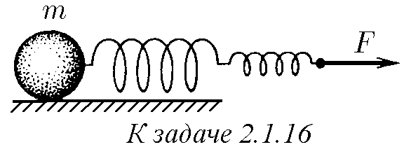

♦ 2.1.17. Лек магнит с кука на вертикална стоманена плоча остава неподвижен, докато закаченият към него товар не превишава маса $m_0$. На колко е равна магнитната сила, ако коефициентът на триене на магнита по стоманата е равен на $\mu$? С какво ускорение се плъзга магнитната висулка, ако масата на товара е $m > m_0$?

2.1.18. Тяло, намиращо се на хоризонтална равнина, се дърпа с нишка в хоризонтално направление. Нарисувайте графика на зависимостта на силата на триене, действаща върху тялото от страна на равнината, от силата на напрежение на нишката. Първоначално тялото е неподвижно. Масата на тялото е $10 \text{ кг}$, коефициентът на триене е $0,51$.

♦ 2.1.19. Ако натискате с пръст химикалка, опираща се на твърда повърхност, като едновременно я накланяте, то, докато химикалката образува малък ъгъл с перпендикуляра към повърхността, тя послушно ще следва пръста на ръката. Щом ъгълът на наклон на химикалката превиши някакво максимално значение $\alpha_{\text{max}}$, тя ще се изплъзне изпод пръста, колкото и силно или слабо да натискате върху нея. Експериментирайте сами и оценете коефициента на триене между топчето на химикалката и повърхността, на която тя се опира.

♦ 2.1.20. На хоризонтална дъска лежи трупче с маса $m$. Дъската бавно се накланя. Определете зависимостта на силата на триене, действаща върху трупчето, от ъгъла на наклон на дъската $\alpha$. Коефициентът на триене е $\mu$.

♦ 2.1.21. Лентов подемник образува ъгъл $\alpha$ с хоризонта. С какво максимално ускорение може да се издига сандък на такъв подемник, ако коефициентът на триене е равен на $\mu$? Лентата не се огъва.

2.1.22. След какво време скоростта на тяло, на което е съобщена скорост $v$ нагоре по наклонена равнина, отново ще бъде равна на $v$? Коефициентът на триене е $\mu$, ъгълът между равнината и хоризонта е $\alpha$, $\text{tg} \alpha > \mu$.

2.1.23. Върху тяло с маса $m$, лежащо на хоризонтална равнина, действа сила $F$ под ъгъл $\alpha$ към хоризонта. Коефициентът на триене е $\mu$. Намерете ускорението на тялото, ако то не се откъсва от равнината.

♦ 2.1.24. Цилиндър се плъзга по улей, имащ формата на двугранен ъгъл с разтвор $\alpha$. Ръбът на двугранения ъгъл е наклонен под ъгъл $\beta$ към хоризонта. Равнините на двугранения ъгъл образуват еднакви ъгли с хоризонта. Определете ускорението на цилиндъра. Коефициентът на триене между цилиндъра и повърхността на улея е $\mu$.

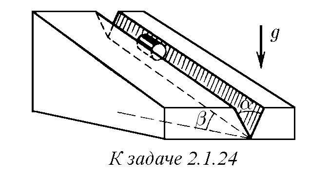

♦ 2.1.25. Нишка, прехвърлена през макара с неподвижна ос, е прекарана през процеп. На краищата на нишката са окачени тежести с маси $m_1$ и $m_2$. Определете ускоренията на тежестите, ако при движение на нишката върху нея от страна на процепа действа постоянна сила на триене $F_{\text{тр}}$.

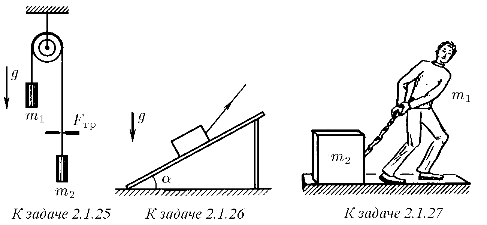

♦ 2.1.26$^*$. По дървена стълба, образуваща ъгъл $\alpha$ с хоризонта, се тегли сандък с вързано към него въже. Коефициентът на триене на сандъка по стълбата е $\mu$. Под какъв ъгъл към хоризонта трябва да се дърпа въжето, за да се изтегли сандъкът с най-малко усилие?

♦ 2.1.27$^*$. Човек с маса $m_1$, оставайки на място, тегли с въже товар с маса $m_2$. Коефициентът на триене по хоризонталната равнина е равен на $\mu$. При каква най-малка сила на напрежение на въжето товарът ще започне да се движи? Под какъв ъгъл спрямо хоризонталната равнина трябва да бъде насочено въжето?

  

2.1.28. На заледен участък от шосето коефициентът на триене между колелата и пътя е десет пъти по-малък, отколкото на незаледен. Колко пъти трябва да се намали скоростта на автомобила, за да остане спирачният път на заледения участък същият?

2.1.29. Автомобил с мощен двигател, потегляйки от място, за $5 \text{ с}$ набира скорост $72 \text{ км/ч}$. Намерете коефициента на триене между колелата и пътя. Какъв е най-малкият спирачен път на автомобила, набрал тази скорост?

  

♦ 2.1.30$^*$. Тяло с маса $m_1$ лежи на дъска с маса $m_2$, намираща се на гладка хоризонтална равнина. Коефициентът на триене между тялото и дъската е $\mu$.

а. Каква сила трябва да се приложи към дъската, за да се плъзне тялото от нея? За какво време тялото ще се плъзне, ако към дъската е приложена сила $F_0$, а дължината на дъската е $l$?

б. С какво ускорение се движат тялото и дъската, ако силата $F_0$ действа върху тялото с маса $m_1$?

♦ 2.1.31. На гладка хоризонтална маса е разположена система от товари, изобразена на рисунката. Десният долен товар се дърпа по масата със сила $F$, както е показано на рисунката. Коефициентът на триене между товарите с маси $m_1$ и $m_2$ е равен на $\mu$. Намерете ускорението на всички товари в системата.

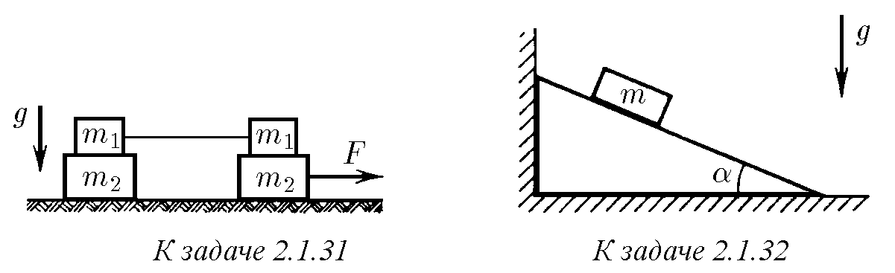

♦ 2.1.32. Определете силата, действаща върху вертикалната стена от страна на клин, ако върху него е поставен товар с маса $m$. Ъгълът при основата на клина е $\alpha$. Коефициентът на триене между товара и повърхността на клина е $\mu$. Няма триене между пода и клина.

  

2.1.33. Защо скоростта на дъждовните капки не зависи от височината на облаците и силно зависи от размерите на капките?

2.1.34. Силата на съпротивление на въздуха, действаща върху велосипедист, е пропорционална на квадрата на скоростта на велосипедиста: $f = \alpha v^2$. На хоризонтален път най-голямата скорост на велосипедиста е приблизително $20 \text{ м/с}$. Оценете коефициента на пропорционалност $\alpha$, ако масата на велосипедиста заедно с велосипеда е $70 \text{ кг}$, а коефициентът на триене между колелата и пътя е $0,4$.

♦ 2.1.35$^*$. Масата на балона заедно с въжето, влачещо се по земята, е равна на $m$; изтласкващата сила, действаща върху балона, е равна на $F$; коефициентът на триене на въжето по земята е равен на $\mu$. Силата на съпротивление на въздуха, действаща върху балона, е пропорционална на квадрата на скоростта на балона спрямо въздуха: $f = \alpha v^2$. Намерете скоростта на балона спрямо земята, ако духа хоризонтален вятър със скорост $u$.

2.1.36$^*$. Скоростта на тяло с маса $m$ във вискозна течност намалява с изминатото разстояние $l$ по закона $v = v_0 - \beta l$, където $v_0$ е началната скорост, а $\beta$ е постоянна константа. Как зависи силата на вискозното триене, действаща върху тялото от страна на течността, от скоростта на тялото?

2.1.37. Силата на съпротивление на въздуха, действаща върху дъждовните капки, е пропорционална на произведението на квадрата на скоростта на капките по квадрата на техния радиус: $f = A \rho_0 r^2 v^2$, където $\rho_0 \approx 1,3 \text{ кг/м}^3$ е плътността на въздуха, а безразмерният коефициент $A$ за кръгли капки е от порядъка на $1$. Кои капки, големите или малките, падат на земята с по-голяма скорост? Оценете скоростта на капка с радиус $r = 1 \text{ мм}$ при падането й от голяма височина.

2.1.38. Силата на съпротивление на въздуха, действаща върху капките мъгла, е пропорционална на произведението на радиуса по скоростта: $f = \gamma r v$. Капките с радиус $r = 0,1 \text{ мм}$, падайки от голяма височина, имат скорост около $1 \text{ м/с}$ близо до земята. Каква скорост ще имат капките, чийто радиус е два пъти по-малък? десет пъти по-малък?

2.1.39$^*$. Силата на съпротивление на течност или газ, пропорционална на квадрата на скоростта на движещото се тяло, е свързана с образуването на вихри в средата в близост до повърхността на това тяло. Силата на съпротивление, пропорционална на скоростта на движещото се тяло, е свързана с приплъзване на слоевете на средата при обтичането й от това тяло. И двете явления протичат едновременно. Защо въпреки това при едни или други условия може да се вземе предвид само един някакъв вид съпротивление? По данните от двете предишни задачи оценете, при каква стойност на произведението на радиуса на кръгла капка по нейната скорост, двата вида съпротивление на въздуха са сравними по своето въздействие върху движението на капката.

♦ 2.1.40. Лентата на хоризонтален транспортьор се движи със скорост $u$. Върху лентата по тангентата към нея влита шайба, чиято начална скорост $v$ е перпендикулярна на ръба на лентата. Намерете максималната ширина на лентата, при която шайбата ще достигне другия й край, ако коефициентът на триене между шайбата и лентата е $\mu$.

♦ 2.1.41. Коя шайба, въртяща се около оста си или не въртяща се, ще измине по-голям път до спиране на грапава хоризонтална повърхност? Началната скорост на центровете на шайбите е еднаква.

2.1.42. Защо здраво заседнал в дънер пирон е по-лесно да се извади, ако при изваждането едновременно се върти около собствената му ос?

♦ 2.1.43$^*$. Хоризонтална ос с радиус $R$, въртяща се с ъглова скорост $\omega$, се обхваща от втулка, снабдена с противотежест, така че, придвижвайки се по дължината на оста, тя да не се върти. Определете установената скорост на втулката под действието на сила $F$, приложена към нея по дължината на оста. Максималната сила на триене на оста по втулката $F_{\text{тр}} > F$.

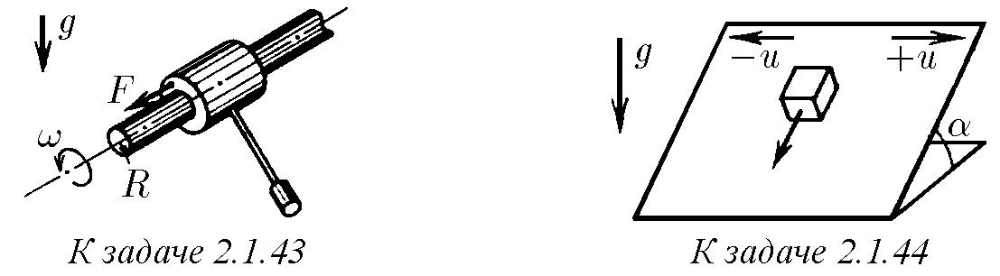

♦ 2.1.44$^*$. Определете установената скорост на тяло, намиращо се на наклонена равнина, която с голяма честота сменя едно направление на своята скорост $u$ на противоположно. Направлението на движение на равнината е показано на рисунката. Коефициентът на триене е $\mu$, ъгълът на наклон на равнината е $\alpha$, $\text{tg} \alpha < \mu$.

2.1.45$^*$. На равнина, тангенсът на ъгъла на наклон на която е равен на коефициента на триене, лежи монета. В хоризонтално направление по дължината на равнината на монетата е съобщена скорост $v$. Намерете установената скорост на монетата.

2.1.46. По наклонена равнина се плъзгат две тела с еднаква маса, свързани с нишка. Силата на напрежение на нишката е $T$. Няма триене между едното тяло и дъската. Определете силата на триене между дъската и другото тяло.

♦ 2.1.47$^*$. Намерете ускорението на телата в системата, изобразена на рисунката. Силата $F$ е приложена по направление на нишката към едно от телата с маса $m$. Участъците на нишката от двете страни на леката макара, прикрепена към тялото с маса $M$, са успоредни.

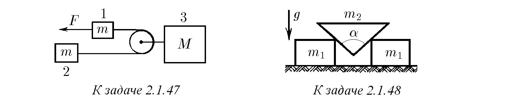

♦ 2.1.48. Между два еднакви гладки трупчета с маса $m_1$ всяко е вмъкнат клин с маса $m_2$ и ъгъл $\alpha$. Определете ускорението на телата.

  

♦ 2.1.49$^*$. Към свободния край на нишка, прикрепена към стена и прехвърлена през ролка, е окачен товар. Ролката е закрепена на трупче с маса $m_0$, което може да се плъзга по хоризонтална равнина без триене. В началния момент нишката с товара се отклонява от вертикалата на ъгъл $\alpha$ и след това се пуска. Определете ускорението на трупчето, ако ъгълът, образуван от нишката с вертикалата, не се променя при движение на системата. На колко е равна масата на товара?

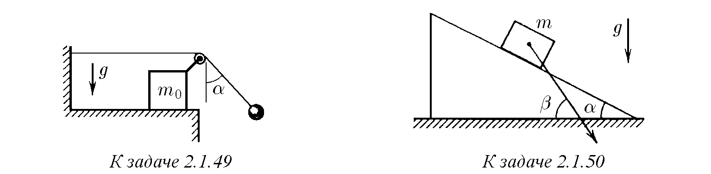

♦ 2.1.50. На гладка хоризонтална равнина се намира клин с ъгъл $\alpha$ при основата. Тяло с маса $m$, поставено на клина, се спуска с ускорение, насочено под ъгъл $\beta > \alpha$ към хоризонталата. Определете масата на клина.

  

♦ 2.1.51$^*$. Върху два валяка с различен радиус е поставена тежка плоча. Тя образува ъгъл $\alpha$ с хоризонта. Намерете ускорението на тази плоча. Няма приплъзване. Пренебрегнете масата на валяците.

  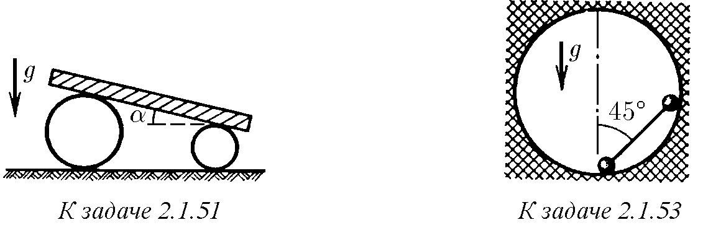

2.1.52. Ускорението на звездите, влизащи в състава на двойна звезда, е $a_1$ и $a_2$. Каква е масата на втората звезда, ако масата на първата е $m_1$?

♦ 2.1.53. В сферична кухина е поставена щанга (две топчета с маса $m$ всяко, съединени с безтегловен прът) по начина, показан на рисунката. Определете силата на натиск на топчетата върху стените веднага след като щангата е пусната. Радиусът на топчетата на щангата е много по-малък от радиуса на сферата.

  

2.1.54. Електроните, движещи се по окръжност с произволен радиус около заредена нишка, имат една и съща скорост $v$. Масата на електрона е $m_e$. Как зависи силата, действаща от страна на нишката върху електрона, от разстоянието между електрона и нишката? Опишете качествено началния участък на траекторията, по която ще се движи електронът, ако скоростта му при движение по окръжност изведнъж стане малко по-малка от $v$? малко по-голяма от $v$?

2.1.55. Две топчета с маса $m$ всяко, свързани с нишка с дължина $l$, се движат със скорост $v$ по хоризонтална маса в направление, перпендикулярно на нишката, която ги свързва (нишката не провисва). Средата на нишката се натъква на пирон. На колко е равна веднага след това силата на напрежение на нишката?

2.1.56. Тяло с маса $M$ е свързано с нишка с дължина $l$ към ос, около която то се върти с ъглова скорост $\omega$. Намерете силата на напрежение на нишката. Размерите на тялото са малки, пренебрегнете силата на тежестта. Заменете нишката с еднородно въже с маса $m$ и намерете силата на неговото напрежение на разстояние $x$ от оста на въртене.

♦ 2.1.57. На гладък телеен обръч с радиус $R$, разположен вертикално, е нанизана малка мънисто. Обръчът се върти с ъглова скорост $\omega$ около вертикална ос, минаваща по диаметъра на обръча. Къде се намира мънистото?

♦ 2.1.58. Към тежко топче, окачено на нишка с дължина $l$, е окачено второ тежко топче на нишка със същата дължина. При въртене на топчетата около вертикална ос, минаваща през горната точка на окачване, двете нишки лежат в една равнина и сключват с вертикалата постоянни ъгли $\alpha$ и $\beta$. Намерете ъгловата скорост на въртене на топчетата.

  

2.1.59. Товар с маса $m$, прикрепен с пружина с коефициент на еластичност $k$ към ос, се движи около тази ос по окръжност с радиус $R$ с ъглова скорост $\omega$. Каква е дължината на недеформираната пружина?

2.1.60$^*$. От тънък гумен сноп с маса $m$ и коефициент на еластичност $k$ е направен обръч с радиус $R_0$. Този обръч е развъртян около неговата ос. Намерете новия радиус на обръча, ако ъгловата му скорост на въртене е равна на $\omega$.

♦ 2.1.61$^*$. Пръстеновидна верижка с маса $m$ е нанизана на хоризонтален диск с радиус $R$. Силата на напрежение на нанизаната верижка е $T$. Намерете коефициента на триене между диска и верижката, ако при въртене на диска с ъглова скорост, равна или превишаваща $\omega$, верижката пада от него.

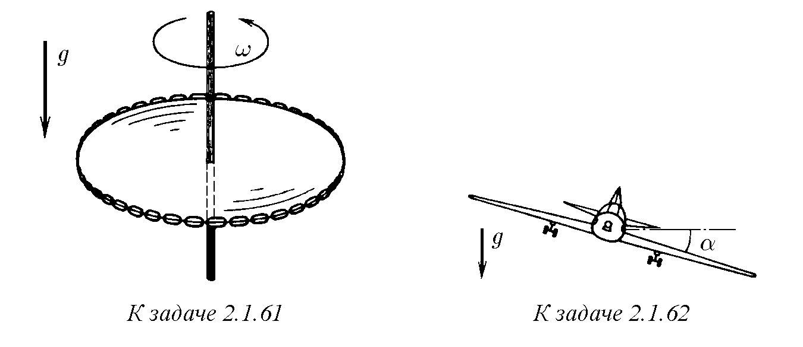

♦ 2.1.62. Самолет извършва вираж, движейки се по хоризонтална окръжност с радиус $R$ с постоянна скорост $v$. Какъв ъгъл сключва равнината на крилата на самолета с хоризонта?

2.1.63. Хоризонтален диск започва да се развърта около оста си с линейно нарастваща във времето ъглова скорост $\omega = \varepsilon t$. При каква ъглова скорост тялото, разположено на разстояние $r$ от оста на диска, ще започне да се плъзга от него, ако коефициентът на триене между тях е равен на $\mu$?

  

2.1.64. С каква максимална скорост може да се движи по хоризонтална равнина мотоциклетист, описвайки кръг с радиус $R$, ако коефициентът на триене е равен на $\mu$? На какъв ъгъл от вертикалата трябва да се отклони при това? Колко пъти ще се увеличи максимално допустимата скорост на мотоциклетиста при движение по наклонена писта с ъгъл на наклон $\alpha$ към хоризонта в сравнение с максимално допустимата скорост при движение по хоризонтална писта при същия радиус на завоя и същия коефициент на триене?

2.1.65$^*$. Кънкьор на ледена писта се старае да премине виража възможно най-близо до вътрешния ръб. Велосипедист на велописта, напротив, преминава виража възможно най-далеч от вътрешния ръб. Как да се обясни тази разлика в тактиката на преминаване на виража? Профилът на велопистата е все по-стръмен с отдалечаване от вътрешния й ръб.

♦ 2.1.66$^*$. В цирков атракцион мотоциклетист се движи по вътрешната повърхност на сфера с радиус $R$. След като се засили, той започва да описва хоризонтална окръжност в горната полусфера. След това за по-голям ефект долната полусфера се премахва. Определете минималната скорост на мотоциклетиста, ако коефициентът на триене на гумите по повърхността на сферата е равен на $\mu$, а ъгълът между вертикалата и направлението към мотоциклетиста от центъра на сферата е $\alpha$.

  

♦ 2.1.67$^*$. С каква ъглова скорост трябва да се върти около оста си хоризонтално разположен цилиндър, за да не се плъзгат малки частици вътре в цилиндъра от неговата повърхност? Коефициентът на триене между повърхността на цилиндъра и частиците е равен на $1$, вътрешният радиус на цилиндъра е $R$.

