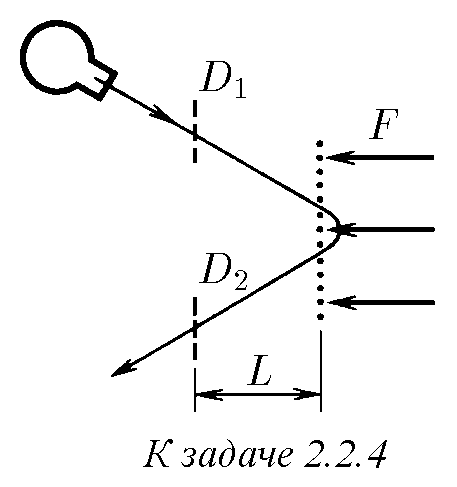
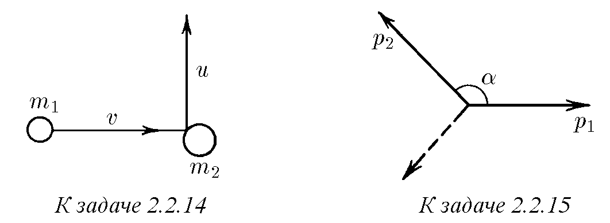
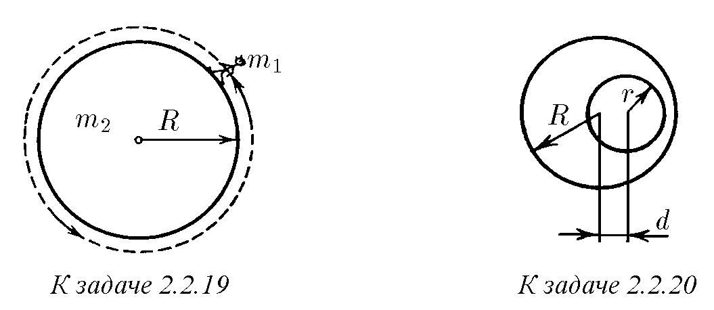
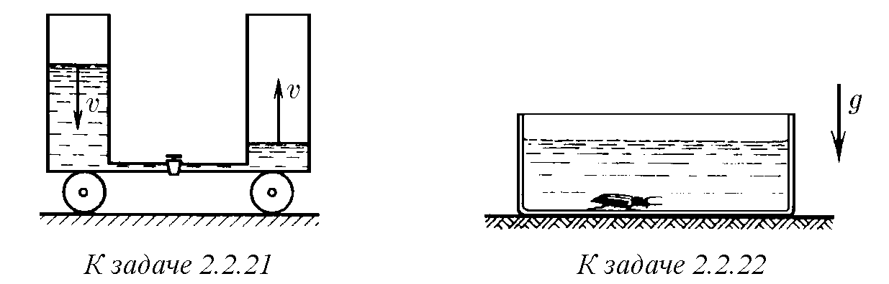
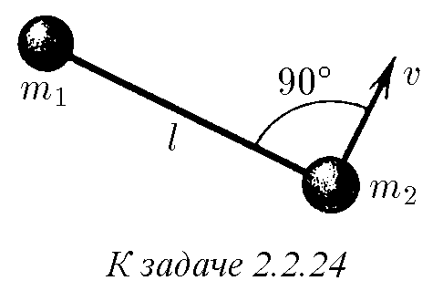
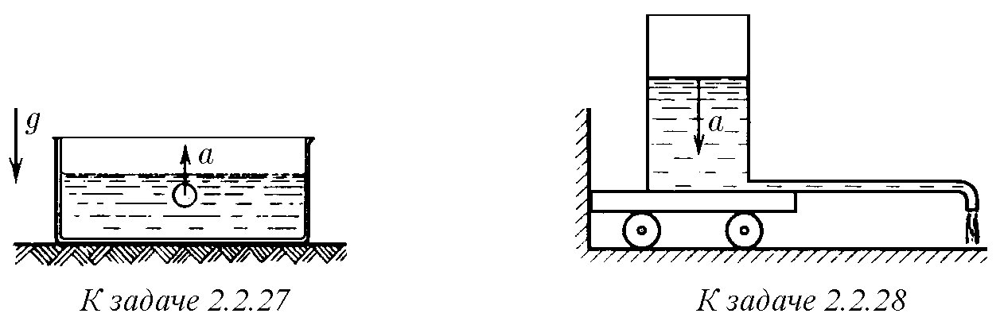
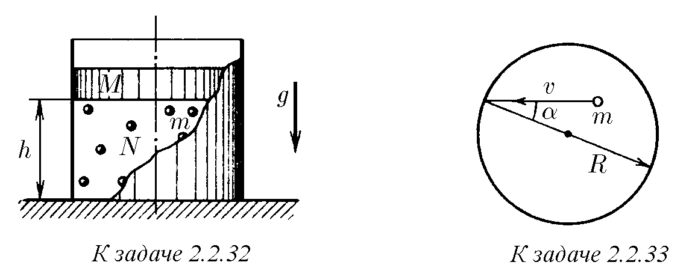
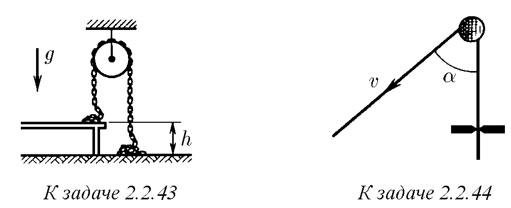

2.2.1. Частица с маса $m$ се движи със скорост $v$, а частица с маса $2m$ се движи със скорост $2v$ в посока, перпендикулярна на посоката на движение на

първата частица. На всяка частица започват да действат еднакви сили. След като

силите престанат да действат, първата частица се движи със скорост $2v$ в посока, обратна на първоначалната. Определете скоростта на втората частица.

2.2.2. Първоначално неподвижно тяло, намиращо се на хоризонтална равнина, е започнато да бъде дърпано с вързано към него въже с постоянна хоризонтална сила $F$. След време $\Delta t$ действието на тази сила е прекратено. Каква сила на триене е действала на тялото по време на неговото движение, ако то е спряло след време $3\Delta t$ от началото на движението?

2.2.3. Космически кораб трябва, променяйки курса си, да се движи с предишния по модул импулс $p$ под ъгъл $\alpha$ спрямо първоначалната посока. За какво най-малко време трябва да бъде включен двигателят със сила на тягата $F$ и как при това трябва да бъде ориентирана оста на двигателя?

♦ 2.2.4∗. В мас-пролетен спектрометър източникът излъчва сноп заредени частици, които първоначално летят свободно и преминават през първия датчик $D_1$, намиращ се на разстояние $L$ от мрежата. Зад мрежата по нормалата към нея върху частиците действа електрическа сила $F$. Частиците се завъртат и излитат през мрежата обратно, преминавайки през втория датчик $D_2$, намиращ се на същото разстояние от мрежата. От напрежението на източника зависи скоростта на излитащите частици, но точната ѝ стойност остава неизвестна. Променяйки напрежението, измерват времето между сработванията на датчиците и намират най-малката му стойност $\Delta t$. Каква е масата на частицата? Как може да се намери масата на частиците, ако източникът излъчва няколко вида частици с различна маса?

2.2.5∗. Сандък с пясък с маса $M$ лежи на хоризонтална равнина, коефициентът на триене с която е $\mu$. Под ъгъл $\alpha$ спрямо вертикалата в сандъка със скорост $v$ влита куршум с маса $m$ и почти мигновено засяда в пясъка. След какво време след попадането на куршума в сандъка, той, започвайки да се движи, ще спре? При каква стойност на $\alpha$ той изобщо няма да се помръдне?

2.2.6. Сестри стоят на кънки на гладък лед. По-голямата бута по-малката. И двете започват да се пързалят, но по-малката със забележимо по-голяма скорост от по-голямата. „Хайде, сега аз ще те бутна“, — казва по-малката. Въпреки нейните очаквания, тя отново се пързаля с по-голяма скорост от по-голямата сестра, при това със същия брой пъти по-голяма, както и преди. Защо се случва така?

2.2.7. При наблюдения от Земята може да се определи само радиалната скорост на звездите-партньори, влизащи в състава на двойна звезда (т. е. проекцията на скоростта върху правата Земя - звезда). При измерванията са получени стойности на радиалната скорост $v_1$ и $u_1$ на звездите-партньори на двойната звезда. При повторни измервания, проведени след една година, стойностите на тази скорост се оказали равни на $v_2$ и $u_2$. Намерете отношението на масите на звездите-партньори, влизащи в състава на тази двойна звезда. Защо трябва да се променят изчисленията, ако повторното измерване се провежда след месец или половин година?

2.2.8. Човек е решил да бяга по гумена лента, опъната върху два хоризонтални ролика, в осите на които няма триене. На пръв поглед изглежда, че това е невъзможно: човекът не може да предаде импулс нито на лентата, нито на роликите, тъй като техният пълен импулс е равен на нула. Следва ли от това, че човекът ще остане на място?

♦ 2.2.9∗. Върху покоящо се тяло с маса $m_1$ се сблъсква със скорост $v$ тяло с маса $m_2$. Силата, възникваща при взаимодействието на телата, линейно зависеща от времето, нараства от нула до стойност $F_0$ за време $t_0$, а след това равномерно намалява до нула за същото време $t_0$. Определете скоростта на телата след взаимодействието, като считате, че всички движения протичат по една права.

2.2.10. Космически кораб преди отделянето на последната степен на ракетата-носител е имал скорост $v$. След отхвърлянето на последната степен неговата скорост е станала равна на $1,01 v$, при това отделилата се степен се отдалечава спрямо кораба със скорост $0,04 v$. Каква е масата на последната степен, ако масата на кораба е $m_0$?

2.2.11. Протон с начална скорост $v$ лети право към първоначално покоящо се ядро на хелий. Каква е скоростта на частиците при най-голямото им сближаване? Масата на ядрото на хелий е близка до учетворената маса на протона.

2.2.12. Снаряд се разкъсва в най-високата точка на траекторията на разстояние $L$ по хоризонтала от оръдието на два еднакви осколъка. Един от тях се е върнал към оръдието по първоначалната траектория на снаряда. Къде е паднал вторият осколък?

2.2.13. Артилерист стреля от оръдие с ядро с маса $m$ така, че то да падне във вражеския лагер. Върху излетялото от оръдието ядро сяда барон Мюнхаузен, чиято маса е $5m$. Каква част от пътя до вражеския лагер ще му се наложи да измине пеша?

♦ 2.2.14. Частица с маса $m_1$, имаща скорост $v$, се сблъсква с покоящо се тяло с маса $m_2$ и отскача от него със скорост $u$ под прав ъгъл спрямо посоката на първоначалното движение. Каква е скоростта на тялото с маса $m_2$?

♦ 2.2.15. При $\beta$-разпадане на първоначално покоящ се неутрон се образуват протон, електрон и неутрино. Импулсите на протона и електрона са $p_1$ и $p_2$, ъгълът между тях е $\alpha$. Определете импулса на неутриното.

♦ 2.2.16. Радиоактивно ядро се е разпаднало на три осколъка с маси $m_1$, $m_2$, $m_3$, имащи взаимно перпендикулярни скорости $v_1$, $v_2$, $v_3$ съответно. Каква е била скоростта на ядрото преди разпадането?

2.2.17. Космонавт с маса $m_1$ се приближава към космически кораб с маса $m_2$ с помощта на лек трос. Първоначално корабът и космонавтът са неподвижни, а разстоянието между тях е равно на $l$. Какво разстояние ще изминат корабът и космонавтът до срещата?

♦ 2.2.18. Две заредени частици с маси $m$ и $2m$, имащи равни по модул импулси, едновременно излитат една срещу друга от точки $A$ и $B$. Частиците взаимодействат само помежду си. По траекторията на частицата с маса $2m$, приведена на рисунката, възстановете траекторията на другата частица.

♦ 2.2.19. Космическа станция представлява цилиндър с радиус $R$ и маса $m_2$. Космонавт с маса $m_1$ е започнал кръгов обход на станцията по нейната повърхност. Определете траекторията на космонавта и траекторията на центъра на станцията. Първоначално космонавтът и станцията са неподвижни.

♦ 2.2.20. Къде се намира центърът на масите: на еднороден прът, огънат по средата под прав ъгъл? на еднородна триъгълна пластинка? на гардеробно номерче във вид на диск с кръгъл отвор?

♦ 2.2.21. На първоначално неподвижна количка са установени два вертикални цилиндрични съда, съединени с тънка тръбичка. Площта на сечението на всеки съд е $S$, разстоянието между техните оси е $l$. Един от съдовете е запълнен с течност с плътност $\rho$. Кранът на съединителната тръбичка се отваря. Намерете скоростта на количката в момента на време, когато скоростта на нивата на течността е равна на $v$. Пълната маса на цялата система е $m$.

♦ 2.2.22∗. На гладък под стои съд, запълнен с вода с плътност $\rho_0$; обемът на водата е $V_0$. Оказал се на дъното на съда бръмбар с обем $V$ и плътност $\rho$ след известно време започва да пълзи по дъното на съда със скорост $u$ спрямо него. С каква скорост ще започне да се движи съдът по пода? Масата на съда да се пренебрегне, нивото на водата през цялото време остава хоризонтално.

2.2.23. За създаване на изкуствена сила на тежестта два отсека на орбиталната станция (отношението на масите е $1:2$) са разведени на разстояние $R$ един от друг и са развъртяни около техния общ център на масите. Определете времето на пълен оборот на отсеците, ако в по-масивния отсек изкуствената сила на тежестта е два пъти по-малка от силата на тежестта на Земята.

♦ 2.2.24∗. Две тела с маси $m_1$ и $m_2$ са свързани с опъната нишка с дължина $l$ и се движат по гладка хоризонтална повърхност. В определен момент от време се е оказало, че първото тяло е неподвижно, а скоростта на второто тяло, равна на $v$, е перпендикулярна на нишката. Определете силата на опън на нишката.

2.2.25∗. Космическа станция се състои от два отсека с маси $m_1$ и $m_2$, съединени с дълъг еднороден трос с дължина $L$. Станцията се върти около ос, перпендикулярна на троса. Каква е ъгловата скорост на въртене, ако силата на опън на троса в близост до първия отсек е $T_1$, а в близост до втория — $T_2$? Каква е масата на троса?

2.2.26∗. Три точкови маси $m_1$, $m_2$, $m_3$ са свързани с нишки с дължина $l$ и се въртят с ъглова скорост $\omega$ около центъра на масите, запазвайки конфигурацията на равностранен триъгълник. Намерете силата на опън на всички нишки.

♦ 2.2.27. В съд, напълнен с вода с плътност $\rho$, с ускорение $a$ изплува мехурче въздух, обемът на което е $V$. Намерете силата на налягане от страна на съда върху опората. Масата на съда заедно с водата е равна на $m$.

♦ 2.2.28∗. На количка е установен цилиндричен съд с площ на сечението $S$, напълнен с течност с плътност $\rho$. От съда успоредно на пода излиза дълга и тънка хоризонтална тръбичка, малък отрязък от която в близост до края е извит по вертикалата надолу. Разстоянието от оста на съда до отвора на тръбичката е равно на $L$. Нивото на течността в съда се спуска с ускорение $a$. С каква хоризонтална сила може да се задържи количката на място?

♦ 2.2.29∗. Маймуна с маса $m$ е уравновесена с противотежест на макара $A$. Макара $A$ е уравновесена с товар с маса $2m$ на макара $B$. Системата е неподвижна. Как ще се движи товарът, ако маймуната започне равномерно да изтегля въжето със скорост $u$ спрямо себе си? Масата на макарите и триенето да се пренебрегнат.

2.2.30. На трос виси малък сандък с пясък, в който засядат куршуми, летящи хоризонтално със скорост $v$. Масата на куршума $m_1$ е много по-малка от масата на сандъка $m_2$. Тросът се отклонява от вертикалата на ъгъл $\alpha$. Какъв брой куршуми попадат в пясъка за единица време?

2.2.31. На чаша на везна скачат $N$ топчета с маса $m$ всяко. Каква е средната сила, действаща на чашата на везната, ако скоростта на топчетата по модул не се променя? Увеличава ли се или намалява тази сила, ако след удара скоростта на всяко топче намалява?

♦ 2.2.32∗. В цилиндър под бутало с маса $M$ скачат, еластично удряйки се в буталото и дъното на цилиндъра, $N$ топчета с маса $m$ всяко. Силата на тежестта, действаща на буталото, е уравновесена от ударите на топчетата. Разстоянието между дъното на цилиндъра и буталото е равно на $h$. Пълната енергия на всяко топче е еднаква. На каква височина ще подскачат топчетата, ако буталото бързо се премахне? $N \gg 1$.

♦ 2.2.33∗. Вътре в сфера с радиус $R$ със скорост $v$ се движи частица с маса $m$, еластично удряйки се в нейните стени. Скоростта на частицата образува ъгъл $\alpha$ с радиуса, проведен до точката на удара. Каква по модул е средната сила, действаща от страна на стените на сферата върху частицата? Каква е средната сила, действаща на единица площ на сферата, ако в единица обем се съдържат $N$ такива частици? Частиците не се сблъскват помежду си.

♦ 2.2.34. Две колички с маса $M$ всяка се движат успоредно с начални скорости $v_1$ и $v_2$. Товар с маса $m$, който първоначално е лежал на първата количка, с почти нулева скорост спрямо тази количка се прехвърля на втората количка. След това с почти нулева скорост вече спрямо втората количка той се прехвърля обратно на първата. Каква ще стане разликата в скоростите на количките след $N$ такива прехвърляния на товара напред и назад? Опитайте се качествено да обясните вискозното триене, възникващо при приплъзване на слоевете газ един спрямо друг.

2.2.35. Ракета със сечение $S$, движейки се в космическото пространство със скорост $u$, попада в облак неподвижен прах с плътност $\rho$. Каква сила на тяга трябва да развиват двигателите на ракетата, за да може тя да продължи да се движи със същата постоянна скорост? Ударите на прашинките в ракетата да се считат за абсолютно нееластични. Промяната на масата на ракетата да се пренебрегне.

2.2.36. Ракета с маса $m$ е увиснала над повърхността на Земята. Колко гориво за единица време трябва да изразходва при това, ако скоростта на изтичане на газа е $u$? Как ще се промени резултатът, ако ракетата се издига с ускорение $a$?

2.2.37. Определете силата на тяга на въздушно-реактивен двигател на самолет, летящ със скорост $v$. Масовият разход на гориво и постъпващия в двигателя въздух е равен на $\mu_1$ и $\mu_2$ съответно. Скоростта на продуктите на горене спрямо самолета на изхода от двигателя е $u$.

2.2.38. Водометен катер се движи в спокойна вода. Силата на съпротивление на водата на движението на катера е $F = kv^2$. Скоростта на изхвърляната вода спрямо катера е $u$. Определете установилата се скорост на катера, ако сечението на потока захваната от двигателя вода е $S$, плътността на водата е $\rho$.

2.2.39. Тръба с радиус $r$ е запълнена с пористо вещество с плътност $\rho_0$. Бутало, върху което действа постоянна сила $F$, движейки се в тръбата, уплътнява веществото до плътност $\rho$. С каква скорост се движи буталото, ако уплътняването на веществото протича скокообразно, т. е. в тръбата се премества с някаква скорост границата на раздела, отдясно на която плътността на веществото е $\rho$, а отляво — $\rho_0$? В началния момент тази граница съвпада с повърхността на буталото.

2.2.40. На чаша на везна стоят пясъчен часовник. Когато пясъкът е долу, показанията на везната са $2P_0$. Теглото на пясъка е равно на $P_0$. Часовникът се обръща. Нарисувайте графика на зависимостта на показанията на везната от времето. Времето на падане на всяка песъчинка е $\Delta t$, времето на протичане на пясъка е $T$.

2.2.41. Еднородна верижка с единия край е окачена на нишка така, че с другия си край тя докосва повърхността на масата. Нишката се прегаря. Определете зависимостта на силата на налягане на верижката върху масата от дължината на още непадналата ѝ част. Ударът на звената в масата е нееластичен, масата на верижката е $m$, нейната дължина е $l$.

2.2.42. С каква сила натиска земята кобра, когато тя, готвейки се за скок, се издига вертикално нагоре с постоянна скорост $v$? Масата на змията е $m$, нейната дължина е $l$.

♦ 2.2.43. Верига с нееластични звена е прехвърлена през макара, при това част от нея лежи на масата, а част — на пода. След като веригата е пусната, тя е започнала да се движи. Намерете скоростта на установилото се равномерно движение на веригата. Височината на масата е $h$.

♦ 2.2.44∗. Въже, прехвърлено през гладък пирон, се провлачва със скорост $v$ през процеп. Силата на триене в процепа е $F$, масата на единица дължина на въжето е $\rho$. Определете силата, действаща на пирона, ако участъците на въжето от двете страни на пирона образуват ъгъл $\alpha$. При каква скорост въжето ще се отдели от пирона?

2.2.45. При промяна на скоростта на космическия кораб с $\Delta v$ неговата маса е намаляла $k$ пъти. Колко пъти при същата скорост на изтичане на газа (спрямо ракетата) би намаляла неговата маса при промяна на скоростта с величина, $n$ пъти по-голяма от $\Delta v$?

2.2.46∗. Скоростта на газа, изхвърлян от ракетата, спрямо нея е равна на $v$. Определете изменението на скоростта на ракетата след като нейната маса поради изтичане на газа е намаляла $n$ пъти.

2.2.47∗. Скоростта на газа, изхвърлян от ракетата, спрямо нея е равна на $2$ км/с. Оценете началната маса на ракетата, която може да изведе на орбита на Земята спътник с маса $10^4$ кг. Как ще се промени резултатът при двойно по-голяма скорост на изтичане на газа?