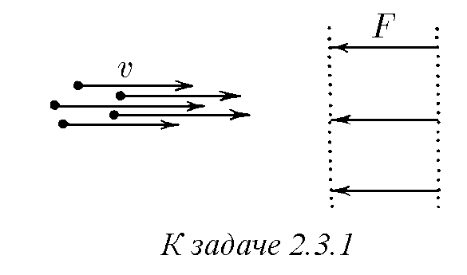
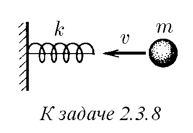
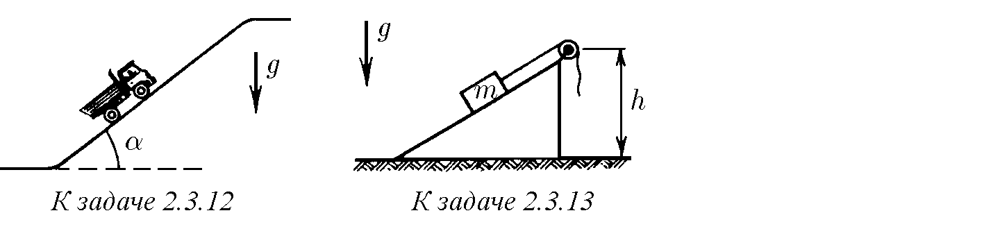
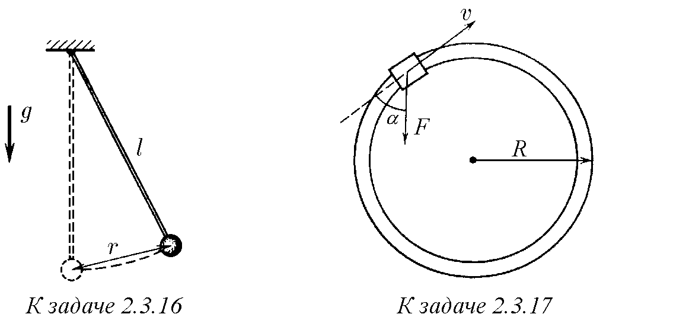
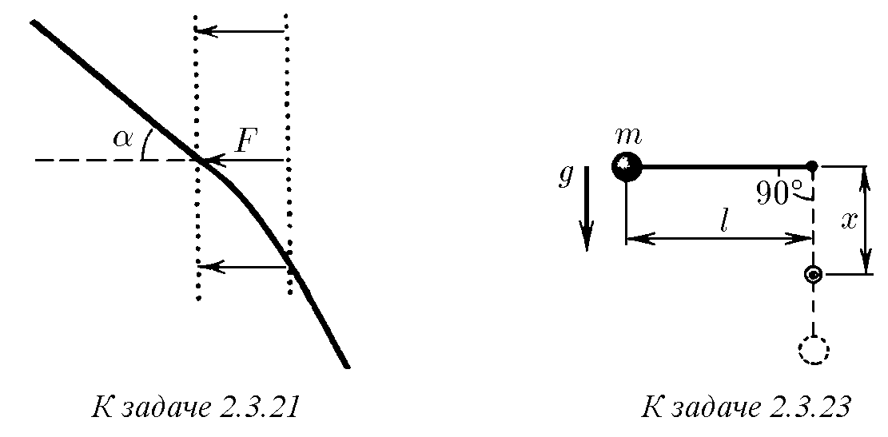
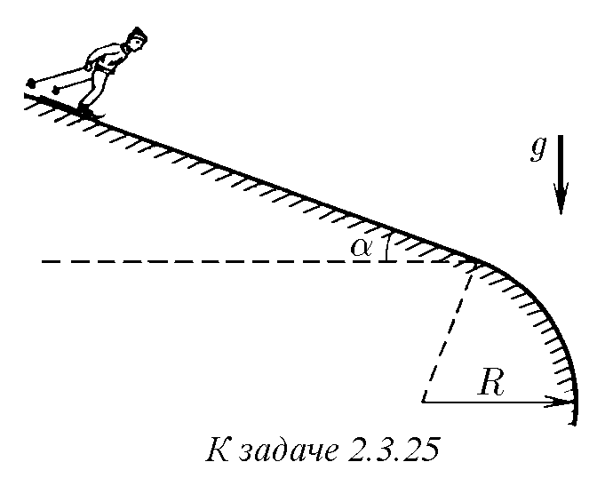
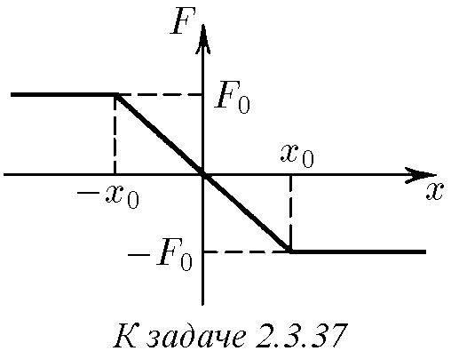
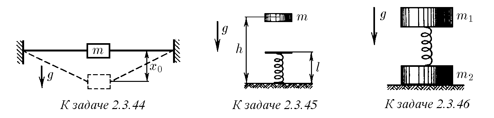

♦ 2.3.1. Сноп от заредени частици с различна маса, които имат една и съща

скорост v, е насочен нормално към два мрежести електрода, между които върху

всяка частица действа една и съща

сила F. При каква най-малка маса на частиците

в снопа всички те ще достигнат втория електрод, ако

ширината на пролуката между електродите е равна на l?

2.3.2. Определете силата, действаща

върху частица с маса m в пролука с ширина l между мрежестите електроди, ако скоростта ѝ

се е променила от стойност v1 при първия електрод до стойност v2 при втория. Как по стойностите на скоростта на частицата да се определи посоката на действащата върху нея сила?

  

2.3.3. За изпитване на оборудване в условия на претоварване и безтегловност

контейнер с него се изстрелва на височина 125 m с пневматично бутално

устройство, намиращо се на дъното на вакуумна шахта. С каква сила действа

буталото, изстрелвайки контейнера, ако при това то се изтегля на дължина h = 1 m,

а масата на контейнера с оборудването m = 2 t?

2.3.4. Оценете средната сила, развивана от краката на човек при приземяването му след скок от прозорец на втория етаж.

♦ 2.3.5. Силата, действаща върху снаряд с маса m в цевта на оръдието, нараства

равномерно от нула до F0 в участък от цевта с дължина l1, не се променя в участък

от цевта с дължина l2 и накрая, равномерно намалява до нула в участък от цевта

с дължина l3. Каква е скоростта на снаряда при излитане от цевта?

♦ 2.3.6. Еднороден блок, плъзгащ се по гладка хоризонтална повърхност, попада върху грапав участък от тази повърхност с ширина L, коефициентът на триене върху който е µ. При каква начална скорост той ще преодолее този

участък?

  

2.3.7. Прозоречна щора с маса 1 kg и дължина 2 m се навива на тънък валяк над прозореца. Каква е най-малката извършена при това работа? Пренебрегнете триенето.

♦ 2.3.8. Пружина с твърдост k е прикрепена с единия си край към неподвижна стена. Към другия ѝ край по протежение на пружината с начална скорост v се удря топка с маса m. Каква е най-голямата деформация на свиване на пружината? Отговорете

на същия въпрос за случая, когато пружината е предварително

свита и се задържа от неразтеглива нишка, свързваща краищата ѝ (началната

деформация на пружината е равна на x0).

2.3.9. От дълга гумена лента с твърдост k е направена прашка. Намерете

кинетичната енергия на „снаряда“, изстрелян от тази прашка, ако гумата е

разтегната със сила F и след това е отпусната.

2.3.10. Защо и прекалено опънатите, и прекалено слабо опънатите лъкове стрелят лошо? Как да се избере най-подходящият лък?

2.3.11. От горния край на дъска с дължина l, образуваща ъгъл α с вертикалата,

започва да се плъзга тяло с маса m. Каква кинетична енергия ще придобие то,

достигайки долния край на дъската? Разгледайте случая на липса на триене

и случая, когато коефициентът на триене между тялото и дъската е µ < ctg α.

♦ 2.3.12. Автомобил с работещ двигател се изкачва по заледен хълм, чиято повърхност образува ъгъл α с хоризонта. Каква височина на хълма може

да преодолее автомобилът, ако началната му скорост при навлизане в него е равна на v,

а коефициентът на триене на колелата върху леда е µ < tg α?

♦ 2.3.13. Товар с маса m бавно се повдига на височина h по наклонена равнина с помощта на макара и въже. При това се извършва работа A. След това въжето

се отпуска и товарът се плъзга надолу. Каква скорост ще набере той, спускайки се до

изходната точка?

♦ 2.3.14. Средновековен въртящ се чук има тежък боек с маса m на края

на лека щанга с дължина l. Той се привежда от хоризонтално в почти вертикално положение, като се завърта около ос, минаваща през другия край

на щангата. Каква е най-малката работа, която трябва да се извърши, за да се повдигне чукът?

Пренебрегнете триенето в оста.

  

2.3.15. Каква е най-малката работа, която трябва да се извърши, за да се постави

вертикално дълъг еднороден стълб с дължина l и маса m, лежащ на земята?

♦ 2.3.16. Тежест, окачена на нишка с дължина l, е отклонена на разстояние r

от точката на равновесие и е отпусната. Каква е най-голямата ѝ скорост?

♦ 2.3.17. По релси, образуващи хоризонтален кръгов път с радиус R, се търкаля

с вагонче с маса m. Работник тича след него и започва да го спира, като опъва

вързано за вагончето въже със сила F под ъгъл

π − α спрямо посоката на скоростта на вагончето. Колко оборота по кръга ще направи

вагончето до спиране? Пренебрегнете триенето.

  

♦ 2.3.18*. Въже е завързано за шейна и е прехвърлено през напречната греда

на порта с височина h. Момче, седящо на шейната, започва да прибира въжето,

като го опъва със сила T. Каква скорост ще набере то, преминавайки под напречната греда?

Началната дължина на опънатата част на въжето е 2l, масата на момчето с шейната е m.

Пренебрегнете триенето.

  

2.3.19. На две еднакви тела се съобщават равни скорости, насочени под един

и същ ъгъл спрямо хоризонта. Едното тяло се намира след хвърлянето в

свободно движение, а другото се движи без триене по права тръба. Кое тяло

ще се издигне на по-голяма височина?

♦ 2.3.20. Хоризонтални повърхности, отстоящи една от друга по височина

на h, плавно се съединяват. По горната повърхност се движи тяло със скорост v,

  

образуваща ъгъл α с нормалата към линията на съединяване. Намерете ъгъла между скоростта на тялото върху долната повърхност на равнината и нормалата към линията на съединяване.

Пренебрегнете триенето.

♦ 2.3.21. Частица с маса m със скорост v влита в област на действие на

спираща сила F под ъгъл α спрямо посоката на тази сила. Под какъв ъгъл спрямо

посоката на силата F тя ще излети от тази област? Ширината на областта на действие

на силата е l. При какво условие частицата няма да може да пресече тази област?

2.3.22. На нишка е окачено топче. Нишката се привежда в хоризонтално положение и след това топчето се отпуска. В коя точка от траекторията му ускорението

му е насочено вертикално нагоре? вертикално надолу? хоризонтално?

♦ 2.3.23. Нишка с дължина l с вързано за нея топче с маса m е отклонена

на 90◦ от вертикалата и е отпусната. На какво най-малко разстояние под точката

на окачване трябва да се постави пирон, за да се скъса нишката, след като се удари

в него? Нишката издържа сила на опън T.

  

2.3.24. На топчето на махалото с маса m е съобщена минималната скорост, при

която то все още може да описва окръжност във вертикална равнина. Каква

сила действа върху оста при преминаване на махалото през положението на равновесие? Разгледайте случаите на окачване на топчето на лека щанга и на нишка.

♦ 2.3.25. На какво минимално разстояние от мястото на заобляне на склона

трябва да се намира стартовата площадка

на скиорите, за да започнат свободен полет, след като достигнат заоблянето? Ъгълът

на склона е α, радиусът на неговото заобляне е R, коефициентът на триене между ските и снега

е µ < tg α. Пренебрегнете стартовата скорост на скиорите.

2.3.26. От върха на гладка полусфера с радиус R, неподвижно стояща на

хоризонтална равнина, се плъзга

малко тяло. На каква височина над тази

равнина то ще се откъсне от полусферата?

♦ 2.3.27. Количка се спуска по гладки релси, образуващи вертикална примка

с радиус R. От каква минимална височина от долната точка на примката

трябва да се спусне количката, за да не напусне релсите по цялата им дължина?

♦ 2.3.28*. По вертикално стояща гладка и твърда спирала се плъзга манисто

с маса m. Радиусът на примката на спиралата е равен на R, стъпката на спиралата (разстоянието по вертикала между съседните навивки) е h. С каква сила манистото действа върху

спиралата в момента, когато то се е спуснало по вертикала на разстояние H? Началната скорост на манистото е равна на нула.

  

2.3.29*. Манисто с маса m се плъзга по вертикално разположен вълнообразен участък от гладка тел. Дължината на вълната е много по-малка от дължината на участъка и много по-голяма от размерите на манистото, а дължината на телта в участъка е k пъти по-голяма от неговата дължина. С каква средна сила действа манистото върху този участък

от тел?

♦ 2.3.30. Определете силата, действаща върху вертикалната стена откъм

падащия дъмбел, когато оста на дъмбела образува ъгъл α с хоризонта. Дъмбелът

започва движение от вертикално положение без начална скорост. Масата на

всяко топче на дъмбела е m.

  

2.3.31. Дъмбел с дължина l с топчета с еднаква маса на краищата е поставен вертикално върху гладка хоризонтална равнина. След това дъмбелът се отпуска.

Определете скоростта на горното топче преди удара в равнината.

♦ 2.3.32*. Каква е работата на силата на триене за един оборот на аерошейна,

движеща се по вертикална кръгова пътека? Скоростта на шейната е постоянна

и е равна на v, масата на шейната е m, коефициентът на триене е µ.

♦ 2.3.33*. Тяло се плъзга по плоска повърхност, плавно преминаваща в

друга плоска повърхност, разположена под ъгъл α спрямо първата. Коефициентът

на триене е µ. Определете кинетичната енергия в края на участъка на съединяване на повърхностите, ако в началото тя е равна на K0.

  

2.3.34*. Зависимостта на дължината на пробега на ядрата на изотопите на водорода във фотоемулсия от началната кинетична енергия е дадена в таблицата. Постройте по тези

данни графика на зависимостта на спиращата ядрата сила от квадрата на скоростта и потвърдете или опровергайте предположението, че тази сила не зависи от масата

на ядрата. С добра точност масата на деутрона md = 2mp, масата на тритона mt = 3mp,

mp е масата на протона.

  

2.3.35. Частица с маса m влита в област, където върху нея действа спираща сила, зависеща само от разстоянието между частицата и границата на областта.

Намерете тази зависимост, ако дълбочината на проникване на частицата в областта на спиране е пропорционална на нейния начален импулс: l = αp.

2.3.36*. Дължината на пробега на частица с маса m е пропорционална на нейния начален импулс, ако спиращата частицата сила е пропорционална на нейната скорост (вж.

предишната задача). Убедете се в това и при зададено α (l = αp), намерете работата на спиращата сила по пътя x за частица, чиято маса е m, а началният

импулс е p.

♦ 2.3.37. Зависимостта на силата, действаща върху

движеща се праволинейно частица, от координатата на последната е дадена на графиката. Намерете

зависимостта на потенциалната енергия на частицата от координатата. Каква е областта на движение на частицата, ако най-голямата кинетична енергия на тази частица е равна на K?

2.3.38. Потенциалната енергия на електростатично взаимодействие на точкови заряди q и Q,

намиращи се на разстояние r един от друг, е U = kqQ/r. Намерете електростатичната сила. За кои заряди има отблъскване, а за кои привличане?

2.3.39. В един научноизследователски институт са решили да използват

израза за потенциалната енергия на точкови заряди във вида U 0 = kqQ/r −

kqQ/R, където R е постоянно разстояние, установено веднъж завинаги. Дали използването на U 0 вместо U = kqQ/r ще повлияе на резултатите от изчисленията на движението

на частиците?

2.3.40. Потенциалната енергия на взаимодействие на частица с неподвижен точков източник е U = V (l2 /r2 − 2l/r), където r е разстоянието между частицата и

източника, V и l са положителни постоянни величини, имащи размерност на енергия и разстояние съответно. В коя област протича праволинейно движението на частицата, ако пълната енергия на системата е равна на E?

♦ 2.3.41. От товар, висящ на пружина с твърдост k, се откъсва част с маса m. На каква височина ще се издигне след това останалата част от товара?

♦ 2.3.42. Товар с маса m, окачен на пружина с твърдост k, се намира на

подставка. При това пружината не е деформирана. Подставката бързо се премахва.

Определете максималното удължение на пружината и максималната скорост на товара.

  

2.3.43. Към тавана е завързан гумен шнур, чийто свободен край се намира на височина h над пода. Ако към него се окачи малка тежка тежест,

която след това плавно се отпусне, то краят на шнура с тежестта ще се спусне на разстояние h/3. На каква най-малка височина над пода трябва след това да се повдигне тежестта,

за да се удари в пода, след като бъде отпусната? Как ще се промени отговорът при

замяна на гумения шнур с пружина?

  

♦ 2.3.44. Неразтегнат гумен шнур с дължина 2l е прикрепен с краищата си

към стените. Към средата на шнура е закачен товар с маса m, който след това е отпуснат

без тласък. При възникналите колебания най-голямото разстояние, на което се

спуска товарът, е равно на x0. Каква е твърдостта на този шнур?

♦ 2.3.45. Тяло с маса m пада от височина h върху стояща вертикално на пода

пружина с твърдост k и дължина l. Определете максималната сила на натиск върху

пода. Обяснете защо при увеличаване на твърдостта на пружината тази сила нараства.

♦ 2.3.46. С каква сила трябва да се натисне горният товар с маса m1, за да

се откъсне от пода долният товар с маса m2, съединен с горния с пружина,

след прекратяване на действието на тази сила?

  

♦ 2.3.47*. Тяло с маса m, окачено на пружина с твърдост k, лежи на

дъска по такъв начин, че пружината не е деформирана. Дъската започва да се спуска

с ускорение a. Колко е удължението на пружината в момента на откъсване на тялото от дъската?

Колко е максималното удължение на пружината?

♦ 2.3.48*. Върху хоризонтална равнина лежат два блока с маса m1 и m2, съединени с недеформирана пружина. Определете каква най-малка постоянна сила

трябва да се приложи към левия блок, за да се измести и десният,

ако коефициентът на триене на товарите върху равнината е µ.

  

♦ 2.3.49. Върху хоризонтална маса се намира тяло с маса m0. За тялото е завързана

неразтеглива нишка, преметната през макара. Към свободния край на нишката е завързана

пружина. Каква маса товар трябва да се закачи към пружината, за да може, спускайки се, той

да измести тялото с маса m0 от мястото му, ако коефициентът на триене на тялото върху масата е µ?