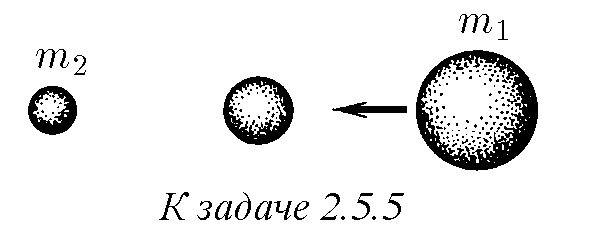
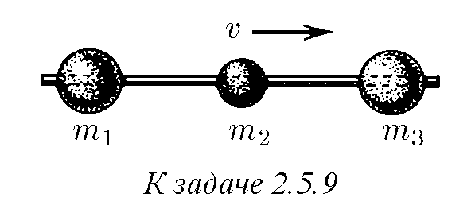
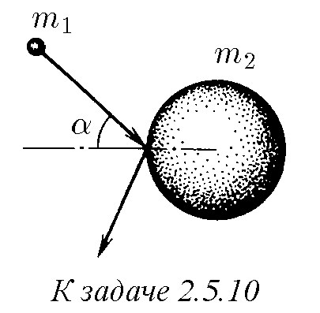
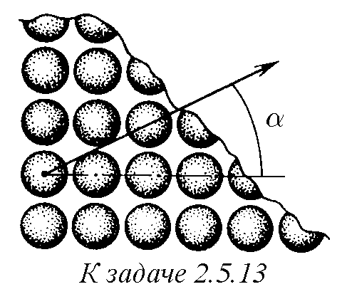
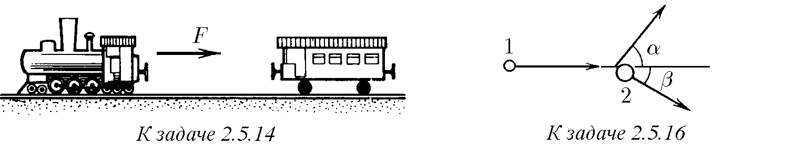
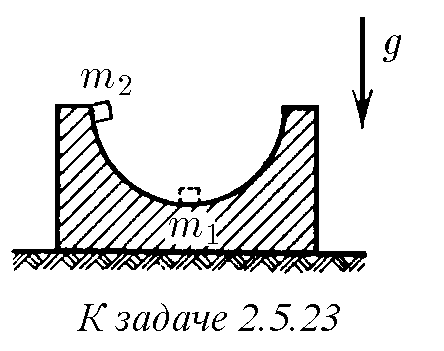
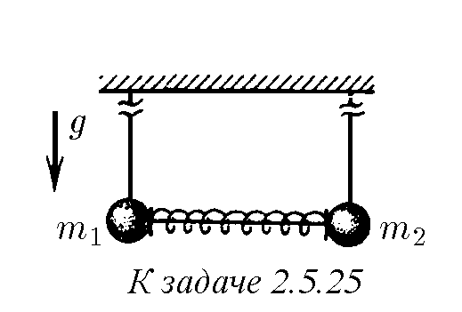
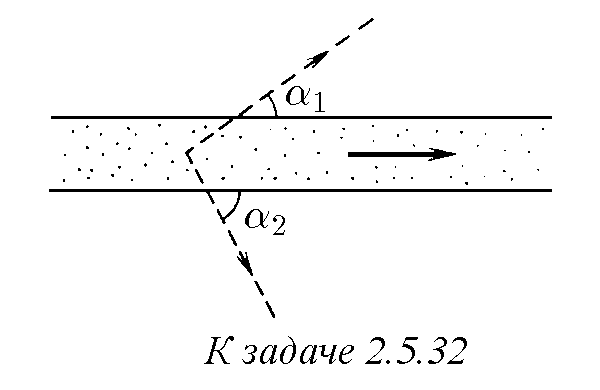
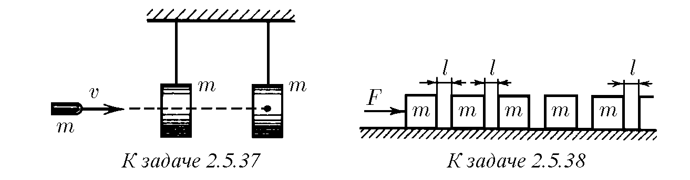

2.5.1. Две тела в резултат на сблъскване си разменили скоростите, продължавайки да се движат по една и съща права. Какво е отношението на масите на тези тела?

Еластичен ли е техният сблъсък?

2.5.2∗. В покойен шар се сблъсква шар със същата маса. Намерете ъгъла на разлет на шаровете след нецентрален еластичен удар.

2.5.3. В неподвижен шар се сблъсква със скорост $u$ шар, чиято маса е $k$ пъти по-голяма от масата на неподвижния шар. Намерете отношението на скоростта на шаровете след централен еластичен удар към скоростта $u$. Постройте графики на зависимостта на тези отношения от числото $k$.

  

2.5.4. И оловото, и тежката вода почти не поглъщат неутрони. Защо обаче в атомните реактори за забавяне на бързи неутрони се използва тежка вода, а олово - не?

♦ 2.5.5. Между неподвижен шар с маса $m_1$ и налитащ върху него шар с маса $m_2$ се намира неподвижен шар. Каква е масата на междинния шар, при която шарът с маса $m_2$ придобива най-голяма скорост след сблъсъка? Всички удари са централни и еластични.

2.5.6. Две еднакви частици се движат под ъгъл $\alpha$ една спрямо друга с начални скорости $v_1$ и $v_2$. След еластично взаимодействие скоростта на една от частиците станала равна на $u_1$. Намерете ъгъла на разлет.

2.5.7. В момента на най-голямо сближаване на телата при еластичен сблъсък тяхната скорост е еднаква и равна на $v$. Каква е скоростта на тези тела след разлета, ако преди сблъсъка тяхната скорост е била съответно $v_1$ и $v_2$? Телата се движат по една права.

2.5.8. Топчета с маси $m_1$ и $m_2$ се движат в неподвижна пръстеновидна тръба с начални скорости $v_1$ и $v_2$. Какви ще бъдат техните скорости след 1987, 1988 сблъсъка? Ударите са еластични, тръбата е гладка.

♦ 2.5.9∗. Мъниста с маси $m_1, m_2, m_3$ могат да се плъзгат по хоризонтална спица без триене, като $m_1 \ll m_2$ и $m_3 \ll m_2$. Определете максималните скорости на крайните мъниста, ако в началото те са били в покой, а средното мънисто е имало скорост $v$. Ударите са еластични.

  
  

♦ 2.5.10. Частица с маса $m_1$ налита на шар с маса $m_2$. Посоката на нейното движение сключва ъгъл $\alpha$ с нормалата към повърхността на шара. Под какъв ъгъл към тази нормала ще отскочи частицата от шара, ако шарът първоначално е бил в покой, а ударът е еластичен?

♦ 2.5.11. На два еднакви неподвижни шара налита същият трети, чийто център се движи по средната линия на отсечката, съединяваща центровете на неподвижните шарове. След еластичен удар налитащият шар спира. Какво е разстоянието между центровете на първоначално неподвижните шарове, ако радиусът на шаровете е $R$?

  
  

2.5.12. При облъчване на кристал с поток от неутрони от неговата повърхност, противоположна на бомбардираната, излитат атоми, като посоката на излитане зависи само от ориентацията на кристала и не зависи от посоката на потока неутрони. Обяснете това явление.

  

♦ 2.5.13. Еднакви шарове са разположени на плоскост така, че техните центрове образуват възли на квадратна решетка. Просветът между най-близките шарове е еднакъв и много малък в сравнение с техния радиус. На един от тези първоначално покойни шарове е съобщена скорост $v$ под ъгъл $\alpha$ към страната на квадратната клетка. Какво ще бъде по-нататъшното движение на шаровете, ако всички удари са еластични? Разгледайте качествено случая на решетка с клетка във формата на правилен триъгълник.

♦ 2.5.14. Локомотив с постоянна сила на теглене $F$ започнал да се движи към стоящ вагон и се сблъскал с него след време $\Delta t$. Намерете времето между последващите сблъсъци на локомотива с този вагон. Ударът е еластичен. Триенето в осите на колелата да се пренебрегне. Масите на вагона и локомотива не са еднакви.

2.5.15. Вътре в еднородна гладка неподвижна сфера с радиус $R$ се намира топче, чиято скорост е равна на $v$. В някакъв начален момент топчето еластично се сблъсква със сферата. Намерете интервала от време между първия и последващия удар на топчето в сферата, ако неговата скорост $v$ образува ъгъл $\alpha$ с радиуса на сферата, проведен в точката на първия удар.

♦ 2.5.16. При еластичен сблъсък на налитащата частица с покойна, първата е полетяла под ъгъл $\alpha$ към посоката на първоначалното движение, а втората - под ъгъл $\beta$. Намерете отношението на масите на тези частици.

  

2.5.17∗. Тежка частица с маса $m_1$ се сблъсква с покойна лека частица с маса $m_2$. На какъв най-голям ъгъл може да се отклони тежката частица в резултат на еластичен удар?

2.5.18∗. Частица с маса $m_1$ е налетятя със скорост $v$ на неподвижна частица с маса $m_2$, която след еластичен удар е полетяла под ъгъл $\alpha$ към първоначалната посока на движение на налитащата частица. Определете скоростта на частицата с маса $m_2$ след удара.

2.5.19. Космически кораб с маса $m_1$ е прелетял с изключени двигатели в близост до първоначално неподвижно космическо тяло. При това импулсът на кораба, в началото равен на $p_0$, станал равен на $p$, а посоката на неговото движение се е променила с ъгъл $\alpha$. Определете масата на космическото тяло.

♦ 2.5.20. За промяна на скоростта и посоката на полета на космически апарат без разход на гориво може да се използва „гравитационен удар“ при движението му в близост до някоя планета. При начална скорост на апарата $u_0$ далеч от планетата, чиято скорост $v$ има насрещна посока, апаратът прелита в такава близост от планетата, че в системата на отчитане на тази планета посоката на неговото движение се променя с $90^\circ$∗). Каква е скоростта на апарата след отдалечаване от планетата? Как се променя посоката на полета на апарата спрямо Слънцето?

∗) Стойностите на скоростта на космическите тела, ако не е уговорено друго, се дават спрямо Слънцето.

  

♦ 2.5.21∗. По хоризонтална плоскост може да се плъзга без триене гладка „баирка“ с височина $h$ и маса $m_1$. Баирката плавно преминава в плоскост. При каква най-малка скорост на баирката малко тяло с маса $m_2$, неподвижно лежащо в началото на нейния път, ще прехвърли върха?

  

2.5.22. Тяло с маса $m_2$ налита със скорост $v$ на неподвижна първоначално баирка, описана в предишната задача. Намерете скоростта на това тяло и на баирката, ако то отново се окаже на хоризонталната плоскост.

♦ 2.5.23∗. Поставка с маса $m_1$ с полусферична вдлъбнатина с радиус $R$ стои на гладка маса. Тяло с маса $m_2$ се поставя на края на вдлъбнатината и се отпуска. Намерете скоростта на тялото и на поставката в момента, когато тялото преминава долната точка на полусферата. С каква сила то натиска поставката в тази точка? Триенето да се пренебрегне.

2.5.24. Тела с маси $m_1$ и $m_2$ са свързани с недеформирана пружина с коефициент на еластичност $k$. Определете най-малката скорост, която е необходимо да се съобщи на тялото с маса $m_1$, за да се свие пружината с величина $x$. Какви ще бъдат скоростите на телата, когато пружината отново се окаже недеформирана?

♦ 2.5.25. Две топчета с маси $m_1$ и $m_2$ висят на дълги еднакви нишки. Между тях се намира свита пружина, която се задържа в свито състояние от свързваща я нишка. Потенциалната енергия на деформация на пружината е $U$. Нишката, свързваща пружината, се прерязва. Намерете максималната височина, на която ще се повдигнат топчетата.

♦ 2.5.26. Частица с маса $2m$ налита на неподвижна частица с маса $m$. След сблъсъка частиците се разлитат симетрично под ъгъл $45^\circ$ към посоката на началната скорост. Колко пъти е нараснала сумарната кинетична енергия след сблъсъка?

2.5.27. Неутрон с енергия 250 кеВ налита на ядро $^6Li$. При това се образува възбудено ядро $^7Li$. Намерете кинетичната енергия на образуваното ядро.

2.5.28. Атом с маса $m$ във възбудено състояние има вътрешна енергия, по-голяма от тази в основното състояние, с $E$. При каква най-малка енергия електрон с маса $m_e$ може да възбуди първоначално покойния атом?

2.5.29. Електрон може да йонизира покоен водороден атом, притежавайки енергия, не по-малка от 13,6 еВ. Каква минимална енергия трябва да притежава протон, за да йонизира също покоен водороден атом? Масата на протона $m_p = 1836m_e$, където $m_e$ е масата на електрона.

2.5.30. Неподвижно атомно ядро се разпада на два осколъка с маси $m_1$ и $m_2$. Определете скоростта на осколъците, ако при разпадането на ядрото се отделя енергия $E$.

2.5.31. В резултат на разпадане на движещо се ядро се появили два осколъка с маси $m_1$ и $m_2$ с импулси $p_1$ и $p_2$, разлитащи се под ъгъл $\theta$. Определете отделената при разпадането на ядрото енергия.

♦ 2.5.32. При двучастично разпадане на частици с кинетична енергия $K$ се образуват частици от два вида. Най-големият ъгъл, под който продуктите на разпадане излитат от снопа първични частици, е равен съответно на $\alpha_1$ и $\alpha_2$. Каква енергия се отделя при разпадането на първичната частица?

2.5.33. Реакцията на сливане на тежки изотопи на водорода с образуване на свръхтежък изотоп и протон ($^2H + ^2H \to ^3H + ^1H$) се изучава, като се насочват ускорени до енергия 1,8 МеВ йони на деутерий към деутериева мишена. Енергията на образуваните ядра на тритий е трудно да се измери и не се измерва. Измерва се само енергията на протоните, излетели перпендикулярно на снопа деутрони, тя е равна на 3,5 МеВ. Определете отделената в реакцията енергия.

2.5.34∗. Частица с маса $m$ с импулс $p$ се разпада на две еднакви частици. Какъв е максималният ъгъл на разлет на вторичните частици, ако при разпадането се отделя енергия $E$?

2.5.35. Две тела с маси $m_1$ и $m_2$ са прикрепени към нишки с еднаква дължина с обща точка на окачване и са отклонени - едното наляво, другото надясно - на един и същ ъгъл. Телата се отпускат едновременно. При удар едно в друго те се слепват. Определете отношението на височината, на която телата се повдигат след слепването, към височината, от която те са започнали своето движение надолу.

2.5.36. Куршум с маса $m_1$, имащ начална скорост $v$, пробива окачен на нишка оловен шар с маса $m_2$ и излита от него с половин скорост. Коя част от кинетичната енергия на куршума е преминала в топлина?

♦ 2.5.37. Куршум с маса $m$, имащ начална скорост $v$, пробива окачен на нишка товар със същата маса $m$ и засяда във втори такъв. Намерете отделеното в първия товар количество топлина, ако във втория товар се е отделило количество топлина $Q_2$. Времето на взаимодействие на куршума с товара да се пренебрегне.

♦ 2.5.38∗. По една права на гладка хоризонтална плоскост с равни интервали са разположени брусове с маса $m$ всеки. Към първия от брусовете се прилага постоянна хоризонтална сила $F$. Определете скоростта на брусовете преди $n$-тия сблъсък и веднага след него. Разгледайте пределната стойност на скоростта при $n$, стремящо се към безкрайност, ако ширината на интервалите между брусовете е равна на $l$. Ударите на брусовете са абсолютно нееластични.

  

2.5.39. Тяло налита на неподвижна стена под ъгъл $\alpha$ към нормалата. Коефициентът на триене в стената е $\mu$. Под какъв ъгъл тялото ще отлети от тази стена?