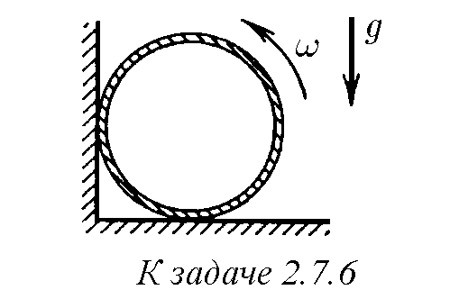
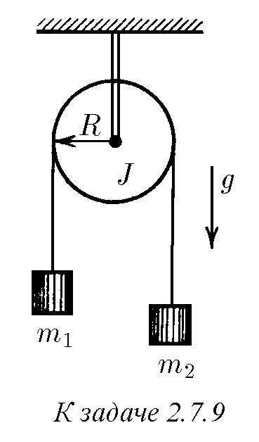
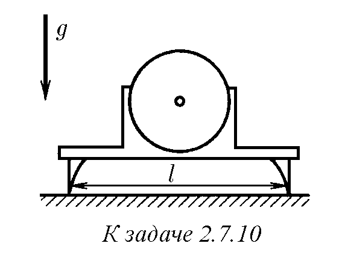
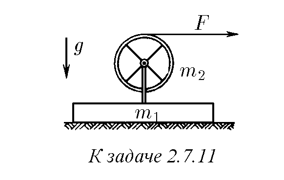
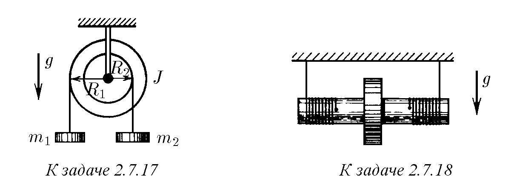
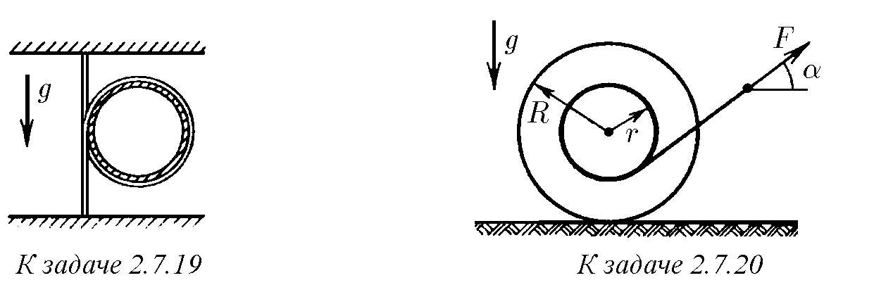
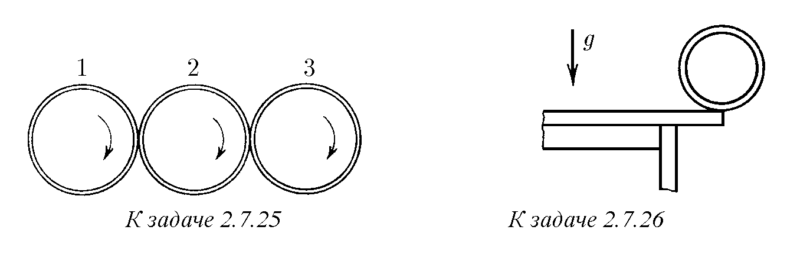
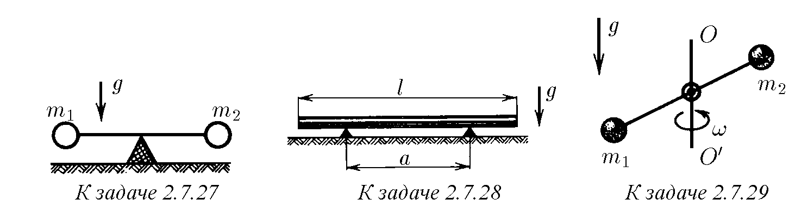
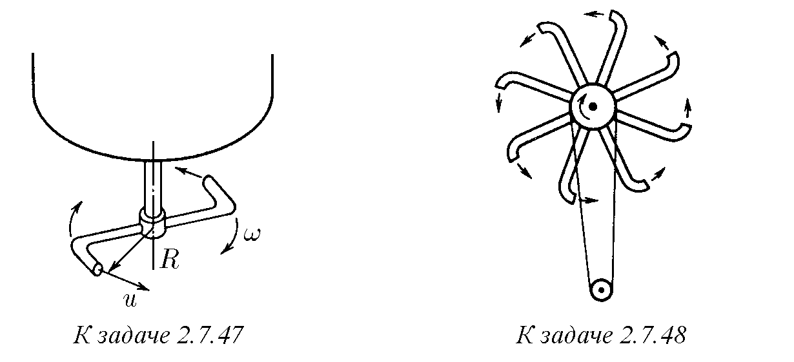

2.7.1. Две подобни маховика са направени от един и същ метал, като линейните размери на втория са два пъти по-големи от линейните размери на първия. Какво е отношението между кинетичните енергии на маховиците при една и съща ъглова скорост на въртене около оста?

2.7.2. Определете кинетичната енергия на тънък пръстен с радиус R и маса m, развъртян до ъглова скорост ω около оста си. По-голяма или по-малка е тази енергия в случай на плътен диск със същия радиус и маса?

2.7.3. Маховик във формата на пръстен с маса m и радиус R с безтегловни спици е развъртян до ъглова скорост ω. Той спира поради триене. Намерете момента на силата на триене, ако маховикът е спрял след време t; ако маховикът е направил N оборота до пълното спиране.

2.7.4. Тънък обръч с радиус R е развъртян около оста си до ъглова скорост ω и е поставен легнал върху хоризонтална маса. След какво време обръчът ще спре, ако коефициентът на триене между масата и обръча е равен на µ? Колко оборота ще направи обръчът до пълното спиране?

2.7.5∗ . Кинетичната енергия на твърдо тяло, въртящо се около ос, е пропорционална на квадрата на ъгловата скорост: K = Jω²/2. Коефициентът J се нарича момент на инерция относно дадената ос. Намерете момента на инерция за дъмбел, представляващ точкови маси m1 и m2 в краищата на лека пръчка, ако оста на неговото въртене е перпендикулярна на пръчката и се намира на разстояние r1 и r2 от точковите маси.

♦ 2.7.6. Тънкостенен цилиндър с радиус R е развъртян до ъглова скорост ω и е поставен в ъгъл, както е показано на фигурата. Коефициентът на триене между стените на ъгъла и цилиндъра е равен на µ. Колко оборота ще направи цилиндърът до пълното спиране?

2.7.7. Решете задача 2.7.6 в случай, че в ъгъла е поставен развъртян плътен еднороден цилиндър. Моментът на инерция на такъв цилиндър е J = mR²/2, където m е неговата маса.

2.7.8. Моментът на силите, действащи върху твърдо тяло относно неговата ос на въртене, е равен на M. Докажете, че работата на тези сили е равна на Mϕ, а ъгловото ускорение на тялото е равно на M/J, където ϕ е ъгълът на завъртане на тялото, а J е моментът на инерция на тялото относно оста на въртене.

  

♦ 2.7.9∗ . Определете ъгловото ускорение на макара с радиус R и момент на инерция J, причинено от два товара с маси m1 и m2, закрепени на краищата на нишка, преметната през макарата, ако нишката не се хлъзга по макарата.

♦ 2.7.10. Електродвигател е закрепен на стойка така, че неговата ос и общият център на масите се намират по средата между опорите, разстоянието между които е равно на l. Той е поставен върху гладка хоризонтална повърхност. Намерете силите на натиск на опорите на стойката върху повърхността, ако след включване роторът на двигателя се развърта с ъглово ускорение w, а неговият момент на инерция е равен на J. Масата на двигателя със стойката е m.

♦ 2.7.11. Върху гладка хоризонтална маса се намира блок с маса m1. Върху него е закрепен тънкостенен цилиндър с маса m2 и радиус R, който може да се върти без триене около оста си. Върху цилиндъра е навита безтегловна тънка нишка, за края на която се дърпа с хоризонтална сила F. Намерете ускорението на блока и ъгловото ускорение на цилиндъра.

2.7.12. Намерете ускорението, с което се търкаля без хлъзгане по наклонена равнина с ъгъл α тънкостенен цилиндър. Каква е силата на триене, действаща върху него?

♦ 2.7.13∗ . Оси на тънкостенен и плътен цилиндър са свързани с безтегловна щанга. Цилиндрите се търкалят без хлъзгане по наклонена равнина с ъгъл α. Радиусите на цилиндрите са еднакви, масата на всеки цилиндър е m. Определете силата на опън на щангата.

♦ 2.7.14∗ . Върху тънкостенен цилиндър е навита нишка, краят на която е закрепен на стойка така, че при търкаляне на цилиндъра по наклонената равнина нишката остава успоредна на наклонената равнина. Каква скорост е придобил цилиндърът, ако оста му е изминала разстояние l? Ъгълът на наклона на равнината е α, коефициентът на триене между равнината и цилиндъра е µ.

  

2.7.15. Плътен цилиндър с маса m1 е насаден на хоризонтална ос. Върху цилиндъра е навит шнур, към свободния край на който е окачена тежест с маса m2. С какво ускорение ще започне да се спуска тежестта, ако бъде пусната?

♦ 2.7.16. Твърдо тяло е насадено на хоризонтална ос, минаваща през неговия център на масите. На същата ос е насадена лека макара с радиус r, здраво прикрепена към тялото. Към свободния край на нишка, навита на макарата, е окачена тежест с маса m. Тежестта е пусната. След време t тя се спуска на разстояние h. Намерете момента на инерция на тялото.

♦ 2.7.17. На стъпаловиден цилиндричен блок са навити в противоположни посоки две нишки с окачени към тях товари с маси m1 и m2. Намерете ускорението на товарите и силата на опън на нишките. Моментът на инерция на блока е J, радиусът на съответните участъци на блока е R1 и R2.

♦ 2.7.18. На вал с радиус r е плътно насаден плътен диск. Моментът на инерция на тази система относно оста е J, масата е m. На вала са симетрично навити две нишки, на които системата е окачена на неподвижен статив. Нишките са вертикални. Системата е пусната. Намерете ускорението на оста на диска и силата на опън на нишките.

  

♦ 2.7.19∗ . Еднородно тежко въже, краищата на което са закрепени на една вертикала, обхваща безтегловен обръч. С какво ускорение пада обръчът, ако бъде пуснат?

♦ 2.7.20∗ . На хоризонтална равнина лежи макара с конци. Макарата се дърпа за конеца. При какви ъгли α между силата и хоризонталата макарата ще започне да се ускорява в посока на опънатия конец?

  

2.7.21∗ . Тънък пръстен с радиус R и маса m е развъртян до ъглова скорост ω0 и е поставен вертикално върху хоризонтална равнина. Как ще се движи пръстенът, ако коефициентът на триене на пръстена по равнината е равен на µ? Определете зависимостта от времето на скоростта на оста и ъгловата скорост на въртене. След какво време ще спре хлъзгането? Коя част от началната енергия ще премине в топлина?

2.7.22∗ . Еднороден цилиндър с радиус R и маса m е бутнат с начална скорост v0 без въртене по хоризонтална равнина. След какво време ще спре хлъзгането, ако коефициентът на триене на цилиндъра по равнината е равен на µ? Коя част от началната енергия ще премине в топлина?

  

2.7.23∗ . По грапава хоризонтална повърхност се търкаля без хлъзгане със скорост v тънък пръстен. След какво време след еластичен удар в гладка вертикална стена пръстенът ще спре, ако коефициентът на триене на пръстена по повърхността е равен на µ? Опишете качествено движението на плътен диск след удара.

2.7.24. Запознайте се с условията на задача 2.4.18. При каква начална ъглова скорост обръчът с радиус R ще се върне в изходната точка, движейки се с постоянно ускорение по хоризонталния под? Началната скорост на центъра на обръча е v.

♦ 2.7.25. Три еднакви цилиндъра са развъртяни до ъглова скорост ω и са допрени така, че левият и десният цилиндър се оказват притиснати към централния с еднаква сила. Оси на цилиндрите са успоредни и закрепени. Какви ще станат в крайна сметка ъгловите скорости на въртене на цилиндрите?

♦ 2.7.26. Центърът на тънък пръстен се намира точно над ръба на масата. Пръстенът започва да се търкаля от масата без хлъзгане от състояние на покой. На какъв ъгъл ще се завърти пръстенът до момента на откъсването му от ръба на масата? По-голям или по-малък ще бъде този ъгъл в случай, че от масата се търкаля сфера?

  

♦ 2.7.27∗ . Лека пръчка със закрепени на краищата товари с маси m1 и m2 се опира със средата си на твърда стойка. В началния момент пръчката се държи хоризонтално, а след това се пуска. С каква сила тя натиска стойката веднага след като е била пусната?

♦ 2.7.28∗ . Тънка еднородна пръчка с дължина l и маса m лежи симетрично на опори, разстоянието между които е равно на a. Една от опорите бързо се премахва. Каква е силата на реакция на останалата опора веднага след това?

♦ 2.7.29. Дъмбел с топчета с маси m1 и m2, свързани с безтегловна пръчка с дължина l, се върти около вертикална ос, минаваща през центъра на дъмбела, с ъглова скорост ω. Определете ъгъла, който образува оста на дъмбела с оста на въртене.

  

♦ 2.7.30. Два диска с моменти на инерция J1 и J2 се въртят с ъглова скорост съответно ω1 и ω2 около една и съща ос без триене. Дисковете са допрени един до друг. Поради възникналото между дисковете триене след известно време хлъзгането на единия диск по другия спира. Каква ще стане тогава ъгловата скорост на въртене на дисковете? Какво количество топлина ще се отдели?

  

2.7.31∗ . Въртящ се обръч с радиус R пада вертикално върху хоризонтална равнина и отскача от нея със скорост v под ъгъл 30◦, вече без да се върти. Каква е ъгловата скорост на обръча преди удара?

♦ 2.7.32∗ . По гладка хоризонтална равнина един срещу друг се движат два еднакви тънки въртящи се пръстена. Техните скорости v1 и v2 са насочени по правата, съединяваща центровете на пръстените. Ъгловите скорости на пръстените са ω1 и ω2. Определете ъгловата скорост на пръстените след сблъсъка, ако хлъзгането им един спрямо друг изчезва в последния момент на удара.

  

♦ 2.7.33. В цилиндър с маса m1 и радиус R, който е в покой върху гладка хоризонтална равнина, попада куршум с маса m2, летящ хоризонтално на височина h от оста на цилиндъра със скорост v. Считайки удара за абсолютно нееластичен и m2 << m1, намерете скоростта на оста и ъгловата скорост на цилиндъра.

  

2.7.34. Върху покоящ се еднороден хоризонтален диск с маса m1 и радиус R стои човек с маса m2. Дискът може без триене да се върти около вертикална ос, минаваща през неговия център. С каква ъглова скорост ще започне да се върти дискът, ако човекът тръгне по окръжност с радиус r около оста на диска със скорост v спрямо него? Радиусът на диска е много по-голям от ръста на човека.

2.7.35. На ръба на свободно въртящ се с ъглова скорост ω около вертикална ос диск, имащ радиус R и момент на инерция J, стои човек с маса m. Как ще се промени ъгловата скорост на въртене на диска, ако човекът премине от ръба на диска към центъра? Как ще се промени кинетичната енергия на системата при това? Размерите на човека да се пренебрегнат в сравнение с размерите на диска.

♦ 2.7.36. В инсталация, намираща се на полюса на Земята, малки, но тежки товари се държат с помощта на нишка на разстояние R от вертикалната ос. Нишката се прекъсва. Товарите се спускат и се оказват на разстояние r = 0,1R от оста. Колко оборота за час извършва след това инсталацията, ако в началото тя не се е въртяла спрямо Земята? Триенето да се пренебрегне.

2.7.37. Въздухът от субтропичния пояс на повишено налягане преминава в екваториалния пояс на понижено налягане. В каква посока — на запад или изток — той ще се отклонява при своето движение?

2.7.38∗ . През последните 40 години денонощието се е увеличило приблизително с 10⁻³ s. Някои геофизици смятат за основна причина за това топенето на полярната ледена шапка в Антарктида. Оценете каква маса лед в Антарктида се е стопила, ако това предположение е вярно, за 40 години.

  

♦ 2.7.39∗ . а. Известно е, че приливната деформация на самата Земя и приливите в океаните забавят въртенето на Земята. Обяснете как възниква необходимият за това момент на сили.

б. Слънчевият прилив в атмосферата на Земята достига максимум два часа по-рано от преминаването на Слънцето през зенита. Този прилив допринася или пречи за забавянето на денонощното въртене?

2.7.40∗ . Еднородна спица с дължина l, стояща на гладка хоризонтална повърхност, започва да пада от вертикално положение. Определете скоростта на горния край на спицата преди удара му в повърхността.

2.7.41. Тънка пръчка с маса m и дължина l лежи на гладка хоризонтална повърхност. Пластилиново топче с маса m със скорост v, перпендикулярна на пръчката, се удря в единия от нейните краища и прилепва към него. Какво количество топлина ще се отдели при такъв удар?

♦ 2.7.42. Пръчка с маса m1 и дължина l е окачена на шарнир. Малко парче пластилин с маса m2 прилепва към средата на пръчката, движейки се преди сблъсъка с нея хоризонтално със скорост v. Намерете максималния ъгъл на отклонение на пръчката от вертикалата. Триенето в шарнира да се пренебрегне.

2.7.43∗ . С кое място при фехтовка с пръчки трябва да се удрят една в друга, за да не се чувства откат? Пръчката се държи с една ръка за нейния край.

♦ 2.7.44. Моментът на инерция на твърдо тяло с маса m относно ос O е равен на J. Центърът на масите на тялото се намира на разстояние R от тази ос. Намерете силата, действаща върху оста при краткотрайно прилагане към твърдото тяло на сила F, перпендикулярна на отсечката с дължина x, която съединява точката на прилагане на силата и оста. При кое x силата, действаща върху оста, е най-малка?

  

♦ 2.7.45. Два еднакви дъмбела летят един срещу друг със скорост v1 и v2 така, както е показано на фигурата. Разстоянието между топчетата на дъмбела е l. Как ще се движат дъмбелите след еластичен сблъсък?

♦ 2.7.46∗ . На каква височина може да се подхвърли чувал с пясък с помощта на дъска с маса m1 и дължина l, ако на другия край на тази дъска от височина H пада същият чувал с пясък? Масата на чувала с пясък е равна на m2.

  

♦ 2.7.47∗ . На вертикална тръба, излизаща от дъното на съд с течност, е херметично надяна коленчато извита насадка — сигнерово колело. Ако в съда се налива течност, за да не се променя нивото на течността в него при нейното изтичане, сигнеровото колело се върти с постоянна ъглова скорост ω. Определете момента на силите на триене, действащ върху насадката, ако спрямо нея течността изтича със скорост u по допирателната към окръжност с радиус R. Дебитът на масата на течността за единица време е µ.

  

♦ 2.7.48∗ . Намерете, пренебрегвайки триенето, полезната мощност на турбина, устроена по принципа на сигнеровото колело. Данните вземете от предишната задача. Как зависи ъгловата скорост на въртене на турбината от момента на силите на натоварване?

