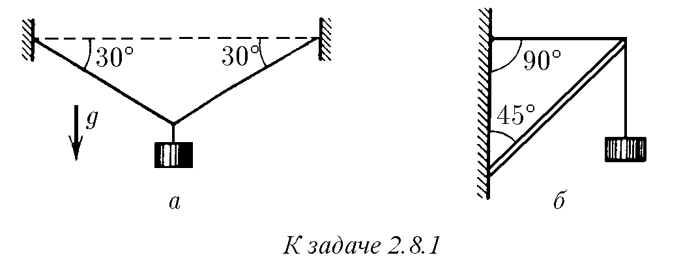
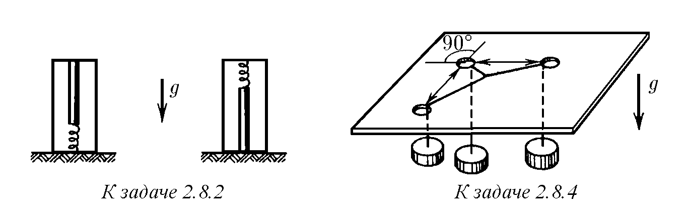
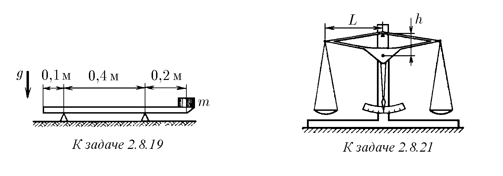
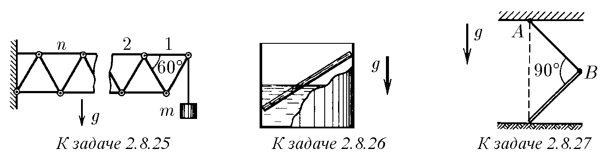
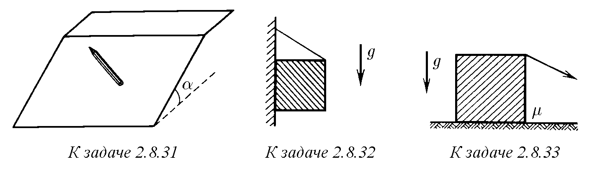
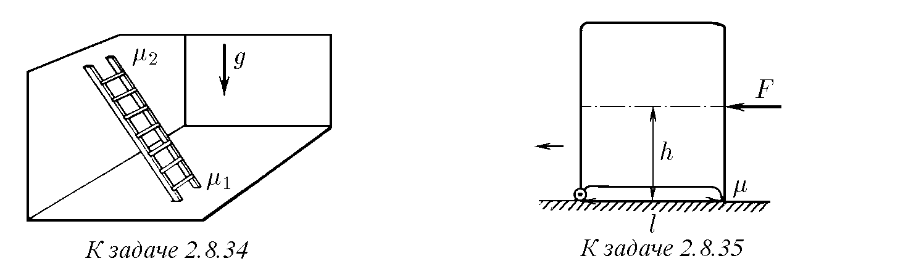
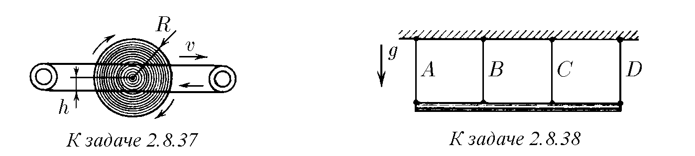

♦ 2.8.1. На чертежа са изобразени конструкции, които задържат товар с маса 10 кг. Въжетата са изобразени с тънки линии, прътът – с двойна линия.

Определете силата на опън на въжетата за случай а и силата, действаща на пръта от страна на преметнатото през него въже, за случай б.

♦ 2.8.2. Молив с маса 0,01 кг стои вертикално върху пружина в затворен несесер. Когато несесерът е обърнат, моливът започва да притиска капака 1,2 пъти по-силно. С каква сила е притискал той първоначално?

2.8.3. Определете най-голямата височина на стена, която може да се построи от тухли, ако границата на якост на натиск на тухлата е $10^7$ Ра, а нейната плътност е $1,5 \cdot 10^3$ кг/м$^3$.

♦ 2.8.4. През три отвора в капака на маса са прекарани нишки, свързани

в общ възел в единия край. Към другия край на всяка нишка са прикрепени еднакви товари. Намерете ъглите между нишките. Триенето да се пренебрегне.

♦ 2.8.5. Два товара с малки размери са свързани с нишка с дължина l и лежат върху цилиндрична гладка повърхност с радиус R. При равновесие на товарите ъгълът между вертикалата и радиуса, проведен към товара с маса $m_1$, е $\alpha$. Намерете масата на втория товар.

♦ 2.8.6. От тел е изработена рамка във формата на правоъгълен триъгълник,

която е поставена във вертикална плоскост така, както е показано на чертежа.

По телта могат да се плъзгат без триене свързани с нишка товари с маса

$m_1 = 0,1$ кг и $m_2 = 0,3$ кг. Намерете силата на опън на нишката и ъгъла между

нишката и дългия катет на триъгълника при равновесие.

  

♦ 2.8.7. С колко ще се премести краят на нишката (точка A), прехвърлена през

подвижен скрипец, ако към него се приложи сила F? Твърдостта на пружините е k.

2.8.8. Ако към долния край на вертикално висяща пружина се прикрепи

товар, то дължината ѝ ще стане равна на $l_1$. Ако същият товар се прикрепи към средата на

пружината, то дължината ѝ ще стане равна на $l_2$. Намерете дължината на недеформираната пружина.

♦ 2.8.9. Верижка с маса m е окачена за краищата си така, че в близост до точките на окачване

тя образува ъгъл $\alpha$ с хоризонталата. Определете силата на опън на верижката в най-долната ѝ точка и в точките на окачване.

♦ 2.8.10. Гладък тънък обръч с маса m виси до стената на един пирон (A)

и се опира на друг (B). Радиусът, проведен към пирон A от центъра на обръча,

образува ъгъл $\alpha$ с вертикалата. Радиусът, проведен към пирон B, образува

ъгъл $\beta$ с вертикалата. Намерете с каква сила действа обръчът на всеки пирон.

♦ 2.8.11. В гладка закрепена полусфера свободно лежи пръчица с маса m

така, че ъгълът ѝ с хоризонта е $\alpha$, а краят ѝ излиза извън ръба на полусферата.

С какви сили действа пръчицата на полусферата в точките на съприкосновение A

и B?

  

♦ 2.8.12. Тел, когато започнат да я режат с ножица, се изплъзва

към краищата им и едва когато ъгълът на отваряне на ножицата по време на движението

на телта намалее до стойност $\alpha_{min}$, ножицата срязва телта. Защо

се случва това? Определете коефициента на триене на телта върху острието на ножицата.

Силата на тежестта да се пренебрегне. Телта не е закрепена.

♦ 2.8.13. Валяците на прокатния стан имат радиус R. Въртейки се, те изтеглят

заготовката, ако дебелината ѝ е достатъчно малка. Коефициентът на триене между валяците и заготовката е $\mu$, а разстоянието между валяците е $d_0$. Намерете максималната дебелина

на заготовката. Заготовката не се подбутва.

♦ 2.8.14$^*$. Тяло с монтирани в изрезите му клинове е разположено между

две успоредни стени така, както е показано на чертежа. Намерете пределния ъгъл

при върха на клиновете, при който тялото може да се движи надясно и не

може да се движи наляво. Коефициентите на триене на клиновете върху стените и тялото са равни на $\mu_1$

и $\mu_2$ съответно.

  

♦ 2.8.15. Между еднакви блокчета с квадратно сечение, лежащи на

хоризонтална плоскост, е вмъкнат гладък клин със същата маса с сечение във

формата на равностранен триъгълник. При какъв коефициент на триене на блокчетата върху

плоскостта те ще започнат да се раздалечават?

2.8.16$^*$. На цилиндричен стълб е навит един витка въже. За да не се

плъзга въжето по стълба, когато се дърпа за единия му край със сила F, другият край

на въжето е достатъчно да се задържи със сила f. Как ще се промени задържащата сила,

ако на стълба са навити n витки? Витките на въжето не се допират една до друга.

♦ 2.8.17$^*$. За единия край на въже, обхващащо стълб по дъга с ъгъл $\theta$,

се дърпа със сила $F_0$. Каква минимална сила трябва да се приложи към другия край

на въжето, за да се задържи, ако коефициентът на триене на въжето върху стълба е равен на $\mu$?

  

♦ 2.8.18. На чертежа са изобразени греди, върху които има по два товара

с маса 10 кг всеки. Разстоянието между опорите на гредите е 4 м. Намерете силата на натиск на гредите върху опорите. Гредите са безтегловни.

♦ 2.8.19. Линийка с маса 0,01 кг лежи на две опори така, както е показано на

чертежа. На единия край на линейката е поставен товар. Каква е масата на товара, при която

е възможно равновесие?

2.8.20. Везни с неравни рамена са в равновесие. Ако на лявата им чинийка

се постави товар, той се уравновесява с теглилка с маса $m_1$ на дясната чинийка. Ако

същият товар се постави на дясната чинийка на везните, той се уравновесява с теглилка

с маса $m_2$ на лявата чинийка. Каква е масата на товара?

  

♦ 2.8.21. Центърът на масата на коромислото на везни с равни рамена се намира под точката на окачване на разстояние h от нея, а масата на коромислото е равна на $m_0$. На краищата на коромислото,

разстоянието между които е равно на 2L, на нишки са окачени еднакви чинийки.

С колко се различават масите на товарите, поставени на чинийките, ако коромислото

се е отклонило от хоризонталата на ъгъл $\alpha$?

♦ 2.8.22. Оста на коромислото на везни с равни рамена, имаща радиус r, е вмъкната в

прореза на стойката. При теглилка с маса m на едната чинийка и товар на другата коромислото остава в хоризонтално положение. Масата на коромислото заедно с чинийките

е равна на M, а дължината на коромислото е 2L. С колко може да се различава масата на товара от

масата на теглилката, ако коефициентът на триене между оста и стойката е равен на $\mu$?

♦ 2.8.23. Тежък прът е огънат по средата под прав ъгъл и е окачен

свободно за единия край. Какъв ъгъл с вертикалата образува горната половина

на пръта?

♦ 2.8.24. Еднородна греда с маса m има дължина L и височина h. Долният ляв ъгъл на гредата е свързан със стената с шарнир, а горният ляв ъгъл е прикрепен

към стената с хоризонтално въже. Гредата е хоризонтална. Определете силата на опън

на въжето и силата на натиск на гредата върху оста на шарнира.

  

♦ 2.8.25$^*$. Към система от еднакви пръти, свързани с шарнири, е окачен

товар с маса m, както е показано на чертежа. Определете силата, разтягаща

n-тия горен хоризонтален прът.

♦ 2.8.26. С каква сила притиска към стените на цилиндрична чаша пръчица

с маса m, наполовина потопена във вода? Ъгълът на наклон на пръчицата към хоризонталата е $\alpha$. Триенето да се пренебрегне.

♦ 2.8.27. Какъв трябва да бъде коефициентът на триене на еднороден прът върху пода,

за да може той да стои така, както е показано на чертежа? Дължината на нишката AB е равна на дължината

на пръта.

  

♦ 2.8.28. Разстоянието между вертикалните стени е равно на l. Каква дължина

трябва да има прът, вмъкнат наклонено между стените, за да не се спуска, ако коефициентът на триене между пръта и стените е равен на $\mu$?

♦ 2.8.29. На цилиндър е навита нишка, единият край на която е закрепен на стойка в

горната точка на наклонена плоскост. При какъв ъгъл на наклон на плоскостта цилиндърът

няма да се търкаля от нея, ако коефициентът на триене на цилиндъра върху плоскостта е равен на $\mu$?

♦ 2.8.30. Дълбочината на ямка в дъска, в която е вмъкнато топче, е два пъти по-малка от

радиуса на топчето. При какъв ъгъл на наклон на дъската с хоризонталата топчето ще изскочи

от ямката?

  

♦ 2.8.31$^*$. На чин с ъгъл на наклон $\alpha > 30^\circ$ се поставя шестогранен молив

така, че да не се търкаля надолу и да не се плъзга. При какъв най-малък ъгъл

между молива и хоризонталния край на чина е възможно това?

♦ 2.8.32. Еднороден куб с помощта на въже, завързано в средата на ръба му,

е окачен към вертикална стена. При какви стойности на ъгъла между въжето

и стената кубът се допира до стената с цялата си страна, ако коефициентът на триене

му върху плоскостта е равен на $\mu$?

♦ 2.8.33$^*$. На хоризонтална повърхност стои куб с маса m. С каква минимална сила и под какъв ъгъл към хоризонта трябва да се дърпа кубът за горния ръб,

за да започне да се преобръща без приплъзване, ако коефициентът на триене

на куба върху плоскостта е равен на $\mu$?

  

♦ 2.8.34. Стълба се опира на вертикална стена и под. При какви стойности

на ъгъла между стълбата и пода тя може да стои, ако коефициентите

на триене на стълбата върху пода и върху стената са равни на $m_1$ и $m_2$ съответно?

♦ 2.8.35$^*$. Центърът на масата на хладилник се намира на височина h от пода по средата

между опорите, разстоянието между които е равно на l. Задните опори са колелца с пренебрежимо малко триене в осите, предните опори са неподвижни

  

издатини, чийто коефициент на триене върху пода е равен на $\mu$. Ако към хладилника на

нивото на центъра на масата му е приложена хоризонтална сила F, то хладилникът

започва да се измества назад, към колелцата. Каква хоризонтална сила трябва

да се приложи на същото ниво в противоположно направление, за да се измести

хладилникът напред?

  

2.8.36. На въртяща се хоризонтална ос с радиус R е надета с малък

луфт лека втулка с прикрепен към нея радиално лек прът с дължина l. На края

на пръта е закрепен тежък товар. Определете ъгъла на отклонение

на пръта при въртене на втулката заедно с оста от радиалното направление, ако

коефициентът на триене между втулката и оста е $\mu$.

♦ 2.8.37$^*$. Колело с радиус R може свободно да се върти около оста си. Към

страничната повърхност на колелото на разстояние h от оста на въртене се притискат

задвижващи ремъци, движещи се със скорост v. Определете установената ъглова

скорост на колелото, ако съприкосновението му със задвижващия ремък става

само по обода.

♦ 2.8.38. Еднородна греда с дължина l виси на четири еднакви въжета, прикрепени на разстояние $l/3$ едно от друго. Въже A се отстранява. За намаляване на опасността от скъсване на въжетата се предлага да се отстрани и въже D. Разумно ли е това предложение?

♦ 2.8.39. Еднородна греда с дължина l и маса m на разстояние $l/3$ от края има ос на въртене. Към края на гредата е присъединена пружина, прикрепена към пода, и същата пружина е присъединена симетрично от другата страна на оста.

При хоризонтално положение на гредата и двете пружини не са деформирани. Намерете силите, с които гредата действа на оста и пружините. Деформациите на пружините са малки, затова гредата е почти хоризонтална.

  

♦ 2.8.40. Макара виси на нишка, навита по малкия радиус r на макарата.

По големия радиус R на макарата също е навита нишка, на края на която виси

товар. Каква е масата на товара, ако системата е в равновесие? Масата на макарата е M.

♦ 2.8.41. Намерете силата на опън на нишката, свързваща осите на шарнирите на горния

ромб на лека шарнирна окачване. Масата на товара е m.

2.8.42$^*$. На покрива на къща с ъгъл на наклон $\phi$ лежи оловен лист. Температурата на въздуха през денонощието се повишава, достигайки най-висока стойност $t_2$,

а след това се понижава до минимална температура $t_1$, при която дължината на листа

е равна на l. Намерете точките на листа, неподвижни при нагряване; при изстиване.

На какво разстояние ще се свлече листът за N денонощия стабилно време? Коефициентът на триене на листа върху покрива е $\mu > \text{tg} \phi$. Температурният коефициент на линейно

разширение на оловото е $\alpha$.

2.8.43. Мравка решила да завлече сламка до мравуняка. Как трябва да постъпи, ако силата, с която може да тегли сламката, е малко по-малка

от максималната сила на триене в покой?

  

♦ 2.8.44$^*$. Еднороден тънък прът с маса m лежи на хоризонтална плоскост.

С каква най-малка хоризонтална сила, приложена към края на пръта перпендикулярно на него, може да се придвижи от мястото му, ако коефициентът на триене

между пръта и плоскостта е равен на $\mu$?

