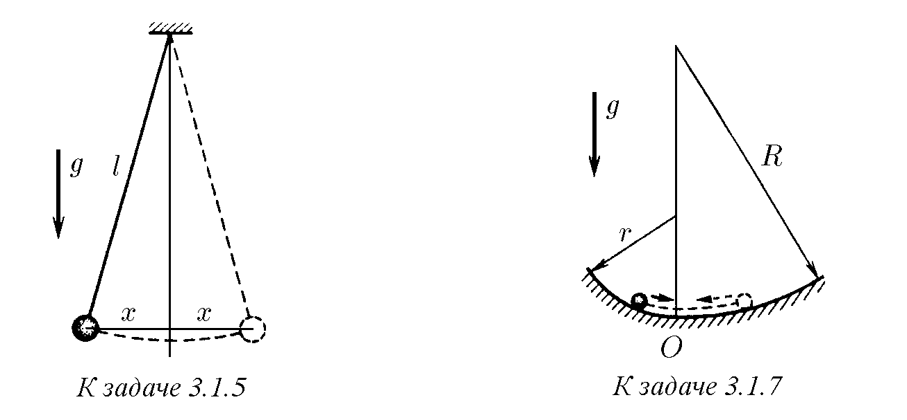
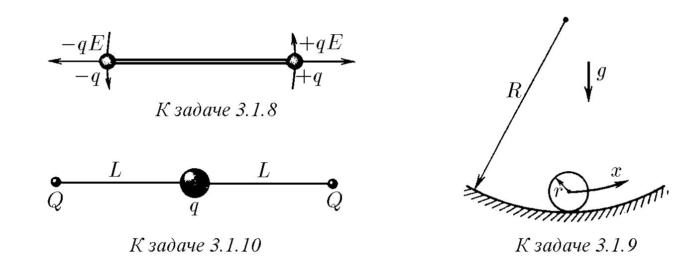
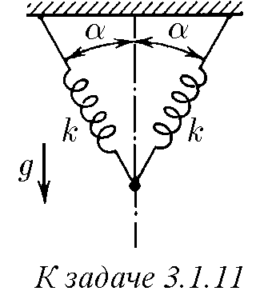

♦ 3.1.1. В средата на опъната струна с дължина 2l е закрепено топче. Каква е сумарната сила, действаща върху топчето от страна на струната, ако напречното му изместване от равновесното положение е x  l, а силата на опън на струната F не зависи от изместването? Защо при малки измествания може да се счита зависимостта на силата, действаща върху топчето, от x за линейна? Как е насочена тази сила по отношение на изместването? Намерете как зависи потенциалната енергия на топчето от малкото изместване x. Каква е скоростта на топчето при преминаване през равновесното положение, ако максималното му изместване е равно на x0? Масата на топчето е m.

3.1.2. Товар с маса m е окачен на пружина с коефициент на еластичност k. Как зависи сумарната сила, действаща върху товара, от изместването му на x от равновесното положение? Намерете зависимостта на потенциалната енергия на товара от изместването x.

3.1.3. а. Тяло с маса m, окачено на пружина, извършва трептения така, че най-голямата стойност на скоростта е v0, а най-голямото отклонение от равновесното положение е x0. Определете коефициента на еластичност на пружината.
б. Скоростта на тяло с маса m, окачено на пружина и извършващо трептения, зависи от координатата на тялото x по закона $v = v_0 \sqrt{1 - (x/x_0)^2}$. Намерете зависимостта на силата, действаща върху тялото, и потенциалната енергия на това тяло от координатата x. Зависи ли полученият резултат от природата на силата, караща тялото да се движи по посочения закон?

3.1.4. Защо изглежда, че бързо трептяща на пружина крушка примигва в крайните точки на своята траектория?

♦ 3.1.5. Дължината на нишката на математично махало е l, масата на топчето е m. Определете силата, действаща върху топчето, при отклоненията му от равновесното положение на x в случай, че x  l. Как зависи потенциалната енергия на топчето от x?

3.1.6. Определете максималната скорост на топчето на математично махало с дължина l, движещо се в една равнина, ако амплитудата на изместването при малки трептения на махалото е равна на x0.

♦ 3.1.7. Хоризонталният жлеб отляво на долната линия е извит по цилиндрична повърхност с радиус r, а отдясно – по повърхност с радиус R. Определете отношението на най-големите отклонения наляво и надясно при малки трептения на тяло в този жлеб.

♦ 3.1.8*. Две еднакви топчета със заряди ±q, здраво свързани с безтегловен прът с дължина l, се намират в електрическо поле, което действа върху тях със сила ±qE. Определете масата на топчето, ако амплитудата на малките напречни трептения на топчетата е x0, а максималната скорост на топчетата v0.

♦ 3.1.9. Топче с маса m и радиус r се плъзга по повърхността на вдлъбнатина, радиусът на кривината на която е R. Намерете зависимостта на потенциалната енергия на топчето от малкото изместване x от равновесното положение.

♦ 3.1.10*. Мънисто със заряд q може да се движи без триене по опъната нишка с дължина 2L, на краищата на която са закрепени заряди Q. Намерете нарастването на потенциалната енергия при изместване на мънистото на x по протежение на нишката от нейния център. Убедете се, че при малки измествания зависимостта на нарастването на потенциалната енергия от x е квадратична. Намерете на колко ще се измести мънисто с маса m, ако в равновесното положение му се съобщи малка скорост v.

♦ 3.1.11. Две пружини с коефициент на еластичност k, свързани, както е показано на фигурата, не са деформирани. Каква маса товар трябва да се окачи в точката на свързване на пружините, за да се спусне той на малко разстояние x в равновесното положение?

♦ 3.1.12. а. Малко заредено тяло с маса m може да се плъзга по вертикална спица, в долната точка на която е закрепен заряд, едноименен със заряда на тялото. Равновесното положение на тялото се намира на разстояние R от този заряд. Как зависи силата, действаща върху тялото, от малкото му изместване x от равновесното положение?

б. Масата на тялото е увеличена тройно, като зарядите са оставени непроменени. На какво разстояние сега от долния край на спицата се намира равновесното положение на тялото?
Как зависи силата, действаща върху тялото, от малкото му изместване от равновесното положение?

3.1.13. Върху тялото с маса m в задача 3.1.12а е поставен малък товар с маса ∆m и е пуснато. Намерете максималната скорост на тялото с товара.

♦ 3.1.14*. На нишки с дължина h, намиращи се на разстояние l една от друга, виси безтегловен прът с дължина L > l с товари с маса m на краищата. Прътът е хоризонтален. Покажете, че при завъртане на пръта около неговата вертикална ос на симетрия на малък ъгъл ϕ моментът на силите, действащи върху товарите, е пропорционален на ϕ, а промяната на потенциалната енергия на товарите е пропорционална на ϕ². Намерете максималната ъглова скорост на пръта, ако е пуснат, след като предварително е завъртян на ъгъл ϕ0.

♦ 3.1.15. Амплитудата на малките трептения на математично махало, стоящо на количка, е x0, а амплитудата на трептенията на количката y0. Дължината на нишката на махалото е l. Определете максималната скорост на махалото и количката. Триенето да се пренебрегне.

3.1.16. Определете в какви граници се променя силата на опън на нишката на математично махало, чиято амплитуда на трептения x0 е много по-малка от дължината на нишката l, ако масата на махалото е m.

3.1.17. Силата на нормално налягане на малко тяло при малките му трептения в близост до равновесното положение във вдлъбнатина с радиус R се променя от N до N + ∆, ∆  N. Определете амплитудата на трептенията на това тяло.