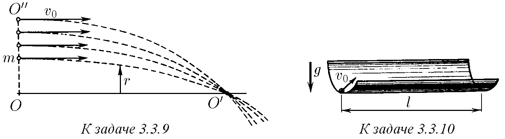
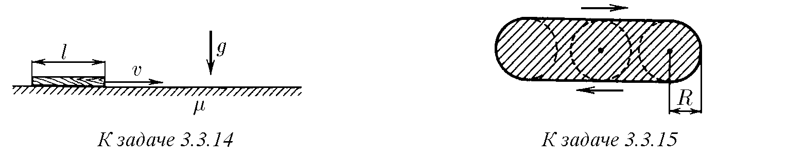
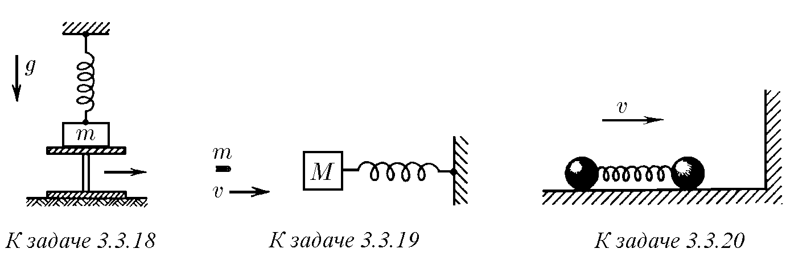
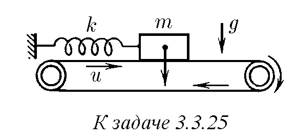
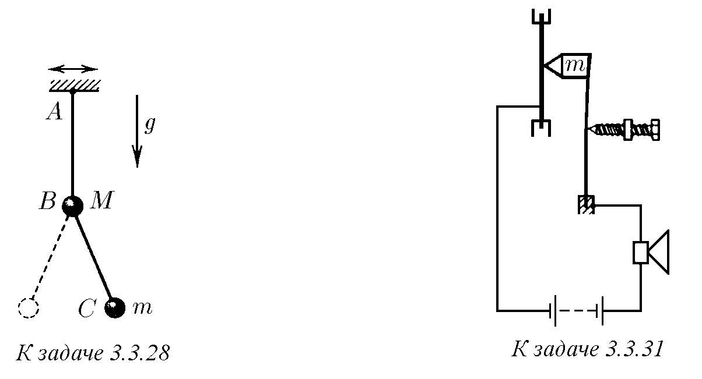

3.3.1. Тяло с маса $m$, прикрепено към пружина, осцилира свободно. Отместването на тялото зависи от времето по закона $x = A \cos \omega t$. Как се променят с времето скоростта и ускорението? Как зависи силата, действаща върху тялото, от неговото отместване и от времето? На какво е равна еластичната константа на пружината?

3.3.2. Амплитудата на трептене на математично махало е $5 \text{ mm}$, дължината на нишката му е $1 \text{ m}$. Как зависи отместването на топчето от времето? За начало на отчитане на времето да се приеме: а) моментът на преминаване през равновесното положение отляво надясно; б) моментът на преминаване през крайното дясно положение.

3.3.3. Товар, свободно осцилиращ на пружина, за време $0,01 \text{ s}$ се е изместил от разстояние $0,5 \text{ cm}$ от равновесното положение до най-голямото, равно на $1 \text{ cm}$. Какъв е периодът на неговото трептене?

3.3.4. Честотата на свободните трептения на тяло е $\omega$. След какво най-малко време неговата кинетична енергия намалява наполовина в сравнение с най-голямата си стойност?

3.3.5. Намерете периода на трептене на математично махало с дължина $l$, ако на пътя на нишката на разстояние $l/2$ вертикално надолу от точката на окачване е забит гвоздей.

3.3.6. Намерете периода на трептене на тялото в задача 3.1.7.

♦ 3.3.7*. Гладко еднородно въже с дължина $l$ се задържа във вертикалното коляно на огъната тръба така, че долният му край докосва хоризонталната част на тръбата. Въжето се пуска. След какво време то изцяло ще се окаже в хоризонталното коляно? Триенето да се пренебрегне. Как ще се промени това време, ако отначало част от въжето вече се е намирала в хоризонталното коляно?

♦ 3.3.8*. Балон при слаб удар в стената се деформира, както е показано на фигурата. При това максималната деформация на балона $x$ е много по-малка от неговия радиус $R$. Пренебрегвайки изменението на излишното налягане $\Delta p$ на въздуха в балона и еластичността на обвивката, оценете времето на сблъсъка със стената. Масата на балона е $m$.

♦ 3.3.9. Докажете, че сноп частици ще се събира (фокусира) в някои определени точки на оста $OO'$, ако скоростта на всяка частица от снопа в сечението $OO''$ е $v_0$, а силата, действаща върху частицата, е $F = -kr$, където $r$ е разстоянието от частицата до оста на снопа. На какво разстояние от сечението $OO''$ се фокусират частиците, ако масата на всяка от тях е $m$?

♦ 3.3.10. От долната точка на гладък хоризонтален цилиндричен улей с радиус $R$ под малък ъгъл спрямо неговата образуваща се изплъзва сa скорост $v_0$ малко топче. Колко пъти на дължина $l$ то ще пресече долната образуваща на улея?

♦ 3.3.11. Към наклонена стена е окачено махало с дължина $l$. Махалото е отклонено от вертикалата на малък ъгъл, два пъти по-голям от ъгъла на наклона на стената спрямо вертикалата, и е пуснато. Намерете периода на трептене на махалото, ако ударите в стената са абсолютно еластични.

♦ 3.3.12. Единият край на пружина е прикрепен към стена, на втория има топче, осцилиращо с амплитуда $A$ и период $T_0$. На какво разстояние от равновесното положение на топчето трябва да се постави плоча, за да стане периодът на неговото трептене равен на $T$? Ударите на топчето в плочата са абсолютно еластични.

♦ 3.3.13. Товар с маса $m$ пада от височина $H$ върху пружина с еластична константа $k$ и дължина $h$, чийто долен край е прикрепен към пода. Определете времето на контакт на товара с пружината, ако $mg < 2k(H - h)$.

♦ 3.3.14. По гладка хоризонтална равнина със скорост $v$ се плъзга тънък еднороден брус с дължина $l$. Брусът навлиза в обширен грапав участък на равнината. След какво време брусът ще спре, ако коефициентът на триене е $\mu$?

♦ 3.3.15*. Стрелец се опитва да улучи диск с радиус $R$, който осцилира хармонично толкова бързо, че стрелецът не може да го проследи. Тогава той се прицелва в центъра на областта на движение на диска. С каква вероятност стрелецът ще улучи диска, ако амплитудата на трептене на диска е $a \ll R$? Ако $A = 2R$? Ще се увеличи ли вероятността за попадане, ако стрелецът се прицели в точка на разстояние $R$ от края на областта?

♦ 3.3.16. Към единия край на първоначално недеформирана и неподвижна пружина с еластична константа $k$ е прикрепен товар с маса $m$. Свободният край на пружината започват да го дърпат с постоянна скорост, както е показано на фигурата, докато той се премести на разстояние $d$. След това рязко го спират. При каква скорост на този край на пружината товарът след спирането няма да осцилира? Формулирайте аналогична задача за математично махало.

3.3.17. Две еднакви махала имат обща точка на окачване. На едното махало с тласък е съобщена определена скорост, след това след време $\tau$ на другото махало също с тласък е съобщена същата скорост. След какво време след началото на движението на първото махало двете махала ще се срещнат, ако периодът на техните трептения е равен на $T$, а $\tau < T/2$?

♦ 3.3.18. Тяло с маса $m$, окачено на пружина с еластична константа $k$, лежи на подложка. Подложката моментално се премахва. Опишете движението на тялото, ако първоначално пружината: а) не е деформирана; б) е свита и нейната деформация е равна на $l$.

♦ 3.3.19. Куршум с маса $m$, летящ със скорост $v$, попада в тяло с маса $M$, свързано със стена чрез пружина с еластична константа $k$, и засяда в него. Избирайки момента на попадане на куршума за начало на отчитане на времето, намерете зависимостта на скоростта и координатата на тялото от времето.

♦ 3.3.20. По хоризонтална равнина със скорост $v$ се плъзгат две топчета с еднаква маса $m$, свързани с недеформирана пружина с еластична константа $k$. Топчетата се сблъскват с вертикална еластична стена. Опишете последващото движение на топчетата. Ще настъпи ли повторен удар на топчетата в стената?

3.3.21*. Тела с маси $m_1$ и $m_2$ са свързани с първоначално недеформирана пружина. На тялото с маса $m_1$ с удар се съобщава скорост $v$, насочена по протежение на пружината. Как с течение на времето ще започнат да се променят скоростите на тези тела, ако честотата на свободните трептения на телата е $\omega$?

3.3.22. Върху тяло, свързано със стена чрез пружина и намиращо се в равновесие, започва да действа по протежение на пружината постоянна сила $F$. На какво е равна най-голямата стойност на силата на опън на пружината и след какво време след включването на действието на силата $F$ върху тялото тя се достига? Периодът на свободните трептения на тялото е $T$.

3.3.23*. В момента от време $t_0$ координатата на тяло, извършващо трептения с честота $\omega$, е $x_0$, а скоростта е $v_0$. Докажете, че зависимостта на координатата на тялото от времето може да бъде представена във вида
$$x = x_0 \cos \omega(t - t_0) + (v_0 / \omega) \sin \omega(t - t_0).$$
3.3.24*. Тяло с маса $m$, окачено на пружина, осцилира по закона $x = A_0 \cos \omega t$. От момента на време $t_0$ върху тялото започва да действа по протежение на пружината постоянна сила $F$. Определете амплитудата на трептене спрямо новото равновесно положение. При кое $t_0$ тази амплитуда е най-голяма? най-малка?

♦ 3.3.25*. На хоризонталната лента на транспортьор, движеща се със скорост $u$, се намира товар с маса $m$, свързан с пружина с еластична константа $k$ с неподвижна стена. Нека в началния момент пружината не е деформирана и товарът поради триенето се движи заедно с лентата. Определете амплитудата на възникналите трептения.

3.3.26*. Нека в условието на задача 3.3.25* началната скорост на товара е нулева, а коефициентът на триене е $\mu$. При каква скорост на лентата движението на товара ще бъде хармонично трептене? Как зависи амплитудата на установените трептения от скоростта на лентата $u$?

3.3.27*. На хоризонтална равнина лежи тяло с маса $M$, свързано с пружина с еластична константа $k$ с неподвижна стена. Тялото е издърпано на разстояние $l$ от равновесното положение и е пуснато. Извършвайки $n$ трептения, тялото е спряло. На какво е равен коефициентът на триене между тялото и равнината, ако след спирането на тялото пружината се е оказала недеформирана?

♦ 3.3.28. Към махало $AB$ с топче с маса $M$ е окачено махало $BC$ с топче с маса $m$. Точката $A$ извършва хармонични трептения по хоризонтала с честота $\omega$. Намерете дължината на нишката $BC$, ако е известно, че нишката $AB$ през цялото време остава вертикална.

3.3.29. Тяло с маса $m$ осцилира по закона $x = A \cos (\omega t + \phi)$. Намерете зависимостта на силата, действаща върху тялото, от времето. На какво е равна нейната най-голяма стойност? В кои моменти силата приема най-голямата по модул стойност?

3.3.30. Хоризонтална мембрана извършва хармонични трептения по вертикалата с честота $\omega$ и амплитуда $A$. Върху мембраната лежи малък товар. При какво условие той ще осцилира заедно с мембраната, а при какво — ще започне да отскача? По-ниско или по-високо от средното положение на мембраната настъпва откъсването на товара от нейната повърхност?

♦ 3.3.31. За измерване на малки амплитуди на трептене на мембрана, извършваща хармонични трептения с висока честота $\omega$, се прилага „чукче“, включено в електрическа верига с мембраната и телефон. Чукчето с маса $m$ се притиска към мембраната със сила, която се регулира с микрометричен винт. Когато контактът на чукчето с мембраната се прекъсва, се прекъсва токът във веригата и в телефона се чува бръмчене. Определете амплитудата на трептенето, ако бръмченето е започнало от момента, когато силата, с която чукчето се притиска към мембраната, е достигнала стойност $F$.

3.3.32. На хоризонтална плоча лежи товар. Плочата започва да се движи нагоре, извършвайки по вертикалата хармонични трептения с честота $\omega$ и амплитуда $A$. На каква височина от началното положение на плочата ще подскочи товарът след своето откъсване от нейната повърхност?

3.3.33*. С каква амплитуда трябва да осцилира плочата (вж. задача 3.3.32), за да настъпи своеобразен резонанс: товарът, подхвърлян от плочата, след всеки удар да увеличава височината на своето издигане? Ударите да се считат абсолютно еластични.

♦ 3.3.34*. Пиезокварцова пластинка осцилира с честота $\omega = 10^7 \text{ s}^{-1}$. На края на пластинката е поставено тяло с маса, сравнима с масата на пластинката. Коефициентът на триене между тялото и пластинката е $\mu = 1$. Оценете, при каква амплитуда на трептене наличието на това тяло съществено влияе на честотата на трептене на пластинката. Оценете най-голямата скорост на тялото в установения осцилационен режим в случай, когато амплитудата на трептене на пластинката е $A = 10^{-6} \text{ cm}$.

3.3.35. Повърхността на тела, осцилиращи с ултразвукова честота, изглежда хлъзгава на допир, а предметите, поставени върху тази повърхност, „плуват“ по нея от най-малкото приложено към тях усилие. Обяснете това.

♦ 3.3.36*. Наклонена равнина извършва хармонични трептения с голяма честота по протежение на своята повърхност. Какво е установеното движение на тялото, намиращо се върху нея? Каква е средната скорост на това тяло за голямо време, ако $\operatorname{tg} \alpha \ll \mu$, където $\alpha$ е ъгълът на наклона на равнината, $\mu$ е коефициентът на триене, $v_0$ е амплитудата на скоростта на наклонената равнина?