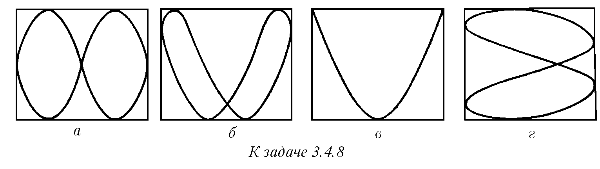
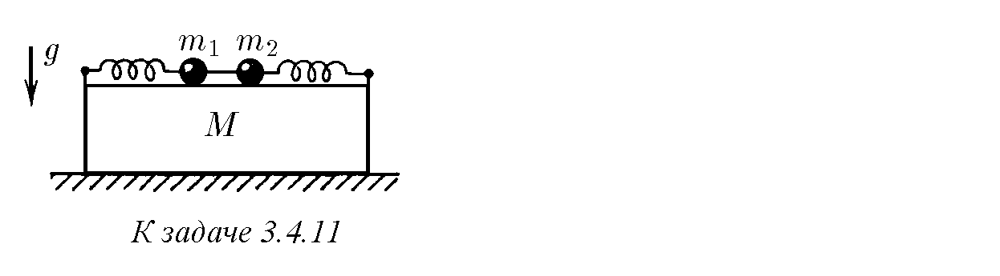
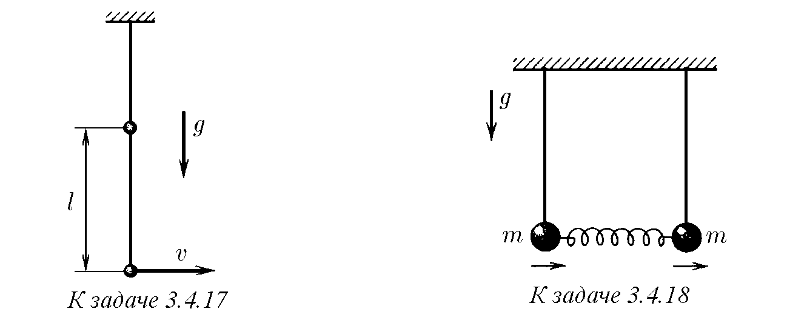
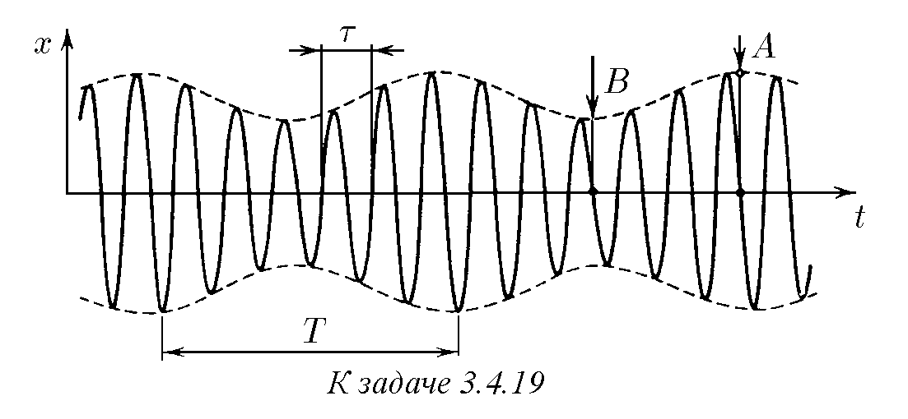

♦ 3.4.1. Краищата на пружините могат да се плъзгат без триене по неподвижна вертикална рамка, а с другите си краища са прикрепени към тяло с маса m. Какъв е характерът на движението на тялото в общия случай, когато $k_1 \neq k_2$? В какви направления е възможно праволинейно движение и как да се възбуди то?

3.4.2. Нека в условията на задача 3.4.1 $k_1 = k_2 = k/2$. Убедете се, че в равнината на рамката са възможни праволинейни трептения във всяко направление. По какъв начин трябва да се възбудят трептенията, за да се движи тялото по окръжност? Докажете, че при всякакъв начин на възбуждане траекторията на движение на тялото е затворена. Намерете периода на движение на тялото.

3.4.3. а. Математическо махало извършва малки трептения в една равнина. Амплитудата на трептенията му е $A$, честотата е $\omega$. В момента на максималното отклонение на топчето на махалото му е съобщена малка скорост $v$, насочена перпендикулярно на равнината на трептене. По каква траектория ще се движи топчето на махалото след това? В какви граници ще се променя разстоянието от топчето до равновесното положение?
б\*. Отговорете на първия въпрос за случая, когато скоростта $v$ е съобщена на топчето в момента, когато то се намира на разстояние $x$ от равновесното положение.

♦ 3.4.4. Движението на електронния лъч по екрана на осцилографа се описва с уравненията
$$x = A \cos (\omega t - \phi),$$
$$y = A \cos (\omega t + \phi).$$
За удобство на измерванията пред екрана е поставена квадратна мрежа. Определете по рисунката фазовата разлика на двете трептения.

3.4.5\*. В условията на задача 3.4.4 определете при каква фазова разлика на екрана се вижда отсечка; окръжност. За време $2\pi/\omega$ следата от лъча на екрана не успява да изгасне. Докажете, че в случай на произволна постоянна $\phi$ следата от лъча на екрана представлява елипса с полуоси, лежащи върху диагоналите на квадрата. Намерете тези полуоси.

3.4.6. При изучаване на хармоничните трептения на осцилатор електрическо напрежение, пропорционално на отместването на осцилатора, се подава на $x$-пластините на осцилографа, а напрежение, пропорционално на скоростта, – на $y$-пластините. Каква картина ще видим на екрана?
3.4.7. Отклонението на лъча на осцилографа се описва с уравненията
$$x = A \cos [(\omega - \Omega/2)t],$$
$$y = A \cos [(\omega + \Omega/2)t],$$
където $\Omega \ll \omega$, като следата от лъча на екрана гасне за време, много по-малко от $2\pi/\Omega$. Каква картина ще видим на екрана на осцилографа?

♦ 3.4.8. На $x$- и $y$-пластините на осцилографа се подават хармонични сигнали и на екрана се появяват картини, изобразени на рисунката. Как се отнасят периодите на трептенията по $x$ и $y$ в случаите а–г?

3.4.9. Точка, извършваща хармонични трептения в две взаимно перпендикулярни направления $x, y$, се движи по траектория, която се нарича фигура на Лисажу. Докажете, че ако честотите на трептенията се отнасят като цели числа, то тази фигура е затворена крива. Какъв вид има фигурата на Лисажу при равни честоти?
3.4.10. Докажете, че ако амплитудата на хармоничните трептения на точката по ос $x$ е $A$, а по ос $y$ е $B$, то фигурата на Лисажу се вписва в правоъгълник със страни $2A$ по ос $x$ и $2B$ по ос $y$. Нека фигурата докосва хоризонталните страни на този правоъгълник в $p=3$ точки, а вертикалните – в $q=4$ точки. Как се отнасят честотите на тези трептения?

♦ 3.4.11\*. Две топчета с маси $m_1$ и $m_2$, прикрепени към еднакви пружини, могат да трептят, плъзгайки се по бруска с маса $M$ без триене. Брускът лежи на хоризонтална равнина. Топчетата са свързани с нишка, силата на опън на която е $F$. Нишката се прерязва. При какъв най-малък коефициент на триене между равнината и бруска той няма да се премести?

3.4.12\*. Краищата на пружина с твърдост $k$ се преместват в надлъжно направление по хармоничен закон:
$$x_1 = A_1 \cos (\omega t + \phi_1),$$
$$x_2 = A_2 \cos (\omega t + \phi_2);$$
при това средната за периода сила на опън на пружината е равна на нула. Как се променя тази сила с времето? Определете най-голямата и средната за голямо време енергия на пружината. При каква разлика във фазите $\phi_2 - \phi_1$ средната енергия на пружината е най-голяма? най-малка?

3.4.13\*. Нека краищата на пружината (вж. задача 3.4.12) се преместват с различна честота:
$$x_1 = A \cos \omega_1 t, \quad x_2 = A \cos \omega_2 t.$$
Как в този случай се променя силата на опън на пружината с времето? Постройте графика на зависимостта на силата на опън от времето в случай на близки честоти. Защо тук може да се говори за биения? Определете в случай на неравни амплитуди и честоти средната енергия на пружината за голямо време.

3.4.14. Частица при действие на сила $F = F_0 \cos \omega t$ трепти по закона $x = A \cos (\omega t - \phi)$. Каква е средната мощност на тази сила?

♦ 3.4.15. а. На две топчета с маса $m$, които са свързани едно с друго и със стените чрез три пружини с твърдост $k$, е съобщена едновременно еднаква по модул скорост, насочена по протежение на пружините. Намерете честотата на трептенията на топчетата, ако техните скорости са противоположно насочени. Еднакво насочени.
б. Свободните трептения на сложни системи са сума (наслагване) на няколко хармонични трептения с различни честоти. Ако на първото топче в задача 3.4.15а се съобщи по протежение на пружината скорост $v$, то последващото движение на топчетата ще бъде сума от две движения: движение на топчетата, на които е съобщена скорост $v/2$ и $-v/2$, и движение на топчетата, на които е съобщена скорост $v/2$ и $v/2$. Определете, като използвате това, скоростта на топчетата в последващите моменти след началото на трептенията. На колко е равно максималното отместване на първото топче? на второто? максималното удължаване на средната пружина?
в. Решете задача 3.4.15б в случай, че на първото топче е съобщена скорост $3v$, а на второто – скорост $v$.

3.4.16\*. На кислороден атом в молекула на въглероден диоксид е съобщена малка скорост $v$ в направление към въглеродния атом. Определете с колко ще се приближи кислородният атом към въглеродния атом. Масата на кислородния атом е $M$, на въглеродния атом е $m$, а твърдостта на връзката между атомите е $k$.

♦ 3.4.17\*. Собствените честоти на двойно махало са $\omega_1$ и $\omega_2$. Дължината на нишката, свързваща топчетата на махалото, е $l$. В равновесно състояние на долното топче е съобщена малка скорост $v$. Определете максималното отклонение на долното топче от равновесното положение и дължината на нишката, свързваща горното топче с тавана.

♦ 3.4.18. Малките трептения на махала, свързани с пружина, протичат по закона
$$x_1 = B \cos (\omega_0 t + \phi) + A \cos \omega t,$$
$$x_2 = B \cos (\omega_0 t + \phi) - A \cos \omega t.$$
Определете твърдостта на пружината, свързваща махалата. В равновесно положение махалата са вертикални, масата на всяко топче е $m$.

♦ 3.4.19. На рисунката е изобразен график на зависимостта на координатата от времето за движение, което е сума от две хармонични трептения. Определете по него амплитудите и честотите на тези трептения.

