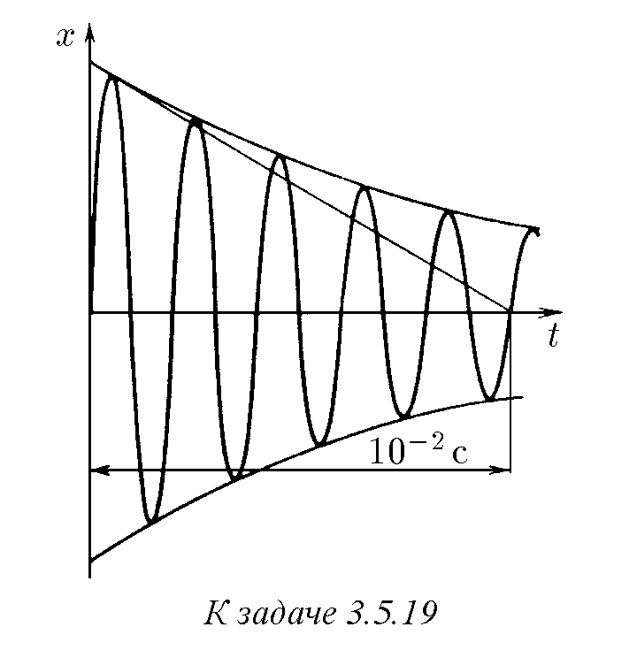
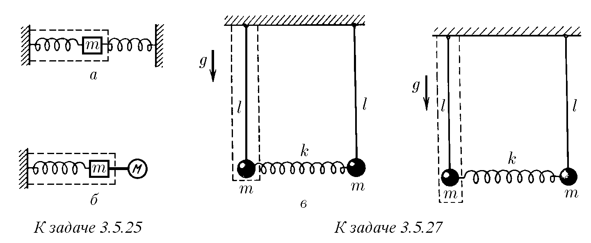
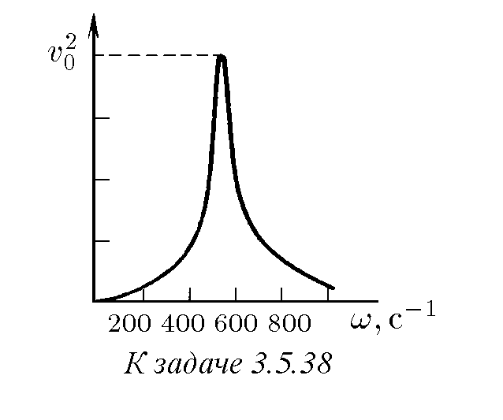

3.5.1. Махало с маса $m$ е подложено на кратки удари, като при всеки удар му се предава импулс $p_0$. Постройте графика на движението на махалото, ако се знае, че в началото то е било в покой, че няма затихване на трептенията, а ударите следват един след друг през интервали от време $T_0$ и $T_0/2$ ($T_0$ е периодът на собствените трептения на махалото).
3.5.2. На хармоничното трептене на тяло с маса $m$ може да се съпостави движението на точка по окръжност, чийто радиус съвпада с амплитудата на трептене $A$ на тялото, а ъгловата скорост – с честотата $\omega$. Координатата $x$ на тази точка съвпада с координатата на тялото, а координатата $y$, умножена по $m\omega$, – с импулса на тялото $p$. Кривите, описващи движението на тялото в променливите $p$, $x$, се наричат фазов портрет. Постройте фазовия портрет за махалото от задача 3.5.1.
3.5.3*. При условията на задача 3.5.1 махалото е имало в нулевия момент скорост $v_0$ и координата $x_0$. Каква ще бъде амплитудата на трептенията след $n$ удара, ако първият от тях е станал в нулевия момент? Постройте фазовия портрет.
3.5.4. Ваша приятелка седи на люлка. Вие я разлюлявате с кратки тласъци. Как трябва да се прави това, за да бъде люлеенето най-успешно?
3.5.5. През поток е прехвърлена дълга еластична дъска. Когато момче стои неподвижно на нея, тя провисва с $0.1 \text{ м}$. Когато обаче той върви със скорост $3.6 \text{ км/ч}$, дъската започва да се люлее така, че той пада във водата. Каква е дължината на крачката на момчето?
3.5.6. Камиони влизат по черен път към зърнохранилище от едната страна, разтоварват се и излизат от хранилището със същата скорост, но от другата страна. От едната страна на хранилището дупките по пътя са по-чести, отколкото от другата. Как по състоянието на пътя да се определи от коя страна на хранилището е входът и от коя е изходът?
3.5.7. Катер, плаващ по морето, започва силно да се люлее, въпреки че вълните са сравнително ниски. Капитанът променя курса на катера и неговата скорост. Ударите на вълните в катера стават при това два пъти по-чести, но въпреки това размахът на трептенията на катера значително намалява. Обяснете това.
3.5.8. Изглежда, че стреляйки с прашка по мост в такт с неговите собствени трептения и правейки много изстрели, той може силно да се разлюлее, но това едва ли ще се случи. Защо?
3.5.9. Силата на съпротивление в течна или газообразна среда при малки скорости на движение е пропорционална на скоростта на тялото и е насочена срещу нея: $f = -bv$. Как зависи разсейваната при движението на тялото мощност от неговата скорост?
3.5.10*. Нека кинетичната енергия на осцилатора е $K = mv^2/2$, а потенциалната $U = kx^2/2$. Покажете, че наличието на „загуби“ на мощност $N_п = bv^2$ на осцилатора е еквивалентно на наличието на допълнителна сила $f = -bv$, действаща върху него.
3.5.11. Качествено опишете движението на в началото покоящ се осцилатор под влияние на единичен тласък и серия еднакви тласъци, следващи един след друг през период, и постройте фазовия портрет на този осцилатор, ако силата на съпротивление на движението е пропорционална на неговата скорост.
3.5.12*. Колебателната система при наличие на съпротивление се нарича осцилатор със затихване, а неговите трептения в отсъствие на сила, която ги поддържа, – затихващи. Покажете, че уравненията на движение на два осцилатора, чиято сила на съпротивление на движение $f_1 = -b_1 v_1$, $f_2 = -b_2 v_2$, при $k_1 /m_1 = k_2 /m_2 = \omega_0^2$ и $b_1 /m_1 = b_2 /m_2 = 2\gamma$ имат еднакво решение при еднакви начални координати и скорости ($\omega_0$ – честота на свободните трептения в отсъствие на триене, $\gamma$ – коефициент на затихване, $k_1$, $k_2$ – коравина и $m_1$, $m_2$ – маса на осцилаторите).
3.5.13. Покажете, че ако затихващите трептения на осцилатора протичат по закон $x_1 = x_1 (t)$ и $v_1 = v_1 (t)$, то трептенията на такъв същ осцилатор с начални условия $x_2 (0) = nx_1 (0)$, $v_2 (0) = nv_1 (0)$ протичат по закон $x_2 = nx_1 (t)$, $v_2 = nv_1 (t)$.
3.5.14. Затихването на осцилатора може да бъде толкова голямо, че движението му да престане да има колебателен характер. Оценете по порядък на величината, при какво съотношение на величините $\gamma$ и $\omega_0$ това ще се случи (вж. задача 3.5.12).
3.5.15. Нека затихването е достатъчно слабо, така че осцилаторът, излязъл от началното равновесно положение със скорост $v$, след време $T$ отново преминава положението на равновесие със скорост $v/n$, $n > 1$. Какво може да се каже за скоростта на осцилатора след време $2T$, $3T$?
3.5.16. Амплитудата на затихващите трептения на осцилатора за време $\tau$ е намаляла наполовина. Как за това време се е променила механичната енергия на осцилатора? За какво време неговата енергия е намаляла наполовина?
3.5.17. На хоризонталните пластини на осцилографа се подава сигнал, пропорционален на изместването на осцилатора, извършващ слабозатихващи трептения, а на вертикалните – сигнал, пропорционален на неговата скорост. Изобразете следата на лъча на екрана на осцилографа.
3.5.18. Ако в момента $t = 0$ осцилаторът, трептящ със затихване, се намира в положение на равновесие и неговата скорост е равна на $v_0$, то неговата координата в момента от време $t \neq 0$ се определя по формулата
$$x = \frac{v_0}{\omega} \exp (-\gamma t) \sin \omega t,$$
където $\omega = \sqrt{\omega_0^2 - \gamma^2}$, $\gamma < \omega_0 = \sqrt{k/m}$, $k$, $m$ и $\gamma$ са съответно коравината, масата и коефициентът на затихване на осцилатора. Покажете, че свойствата на осцилатора, описани в задачи 3.5.12 и 3.5.15, не противоречат на това твърдение.
♦ 3.5.19. По вида на зависимостта $x$ от $t$ за затихващи трептения, получена на екрана на осцилографа, определете величината $\gamma$ и $\omega$. Защо при $\gamma \ll \omega_0$ може да се счита, че $\omega \approx \omega_0$?

3.5.20. а. Две последователни най-големи отклонения в една посока на секундно махало се различават едно от друго с $1\%$. Какъв е коефициентът на затихване на това махало?
б. Топчето на това махало е заменено с топче със същия радиус, но с маса четири пъти по-голяма. Как това ще се отрази на затихването на трептенията?
3.5.21*. а. Доброкачественост (Quality factor) на осцилатор се нарича отношението на неговата начална енергия към енергията, загубена от него за време на изменение на фазата с $1 \text{ рад}$. Изразете доброкачествеността чрез коефициента на затихване $\gamma$ и честотата на свободните трептения $\omega_0$ ($\gamma \ll \omega_0$). Как е свързана доброкачествеността $Q$ с броя на трептенията, за които енергията на осцилатора ще намалее $e$ пъти?
б. При монокристал от сапфир във вакуум при ниска температура и съответно окачване доброкачествеността е $Q = 10^8 - 10^9$. Честотата на трептения на монокристала е $\omega_0 = 10^4 \text{ с}^{-1}$. Оценете колко пъти ще се промени амплитудата на трептенията на кристала за едно денонощие.
3.5.22*. Всеки път, когато осцилаторът преминава в едно и също направление положението на равновесие, с удар му се съобщава допълнителен импулс $p$ в посока на скоростта. Какво ще бъде движението на осцилатора и каква ще се установи максимална скорост? Характеристиките на осцилатора са известни. Разгледайте два гранични случая: $2\pi\gamma/\omega \ll 1$ и $2\pi\gamma/\omega \gg 1$.
3.5.23. Дайте пример за система, в която въздействието от страна на една част от нея върху друга се описва със сила, променяща се хармонично с времето.
3.5.24. Върху частица с маса $m$ действа сила $F = F_0 \sin \omega t$, принуждаваща частицата да трепти около положението на равновесие. Представете си, че тази сила се развива от пружина, прикрепена към неподвижна стена, и намерете в този случай амплитудата на трептенията на частицата.
♦ 3.5.25*. В системите, изобразени на фигурата, протичат свободни трептения без триене. Покажете, че силата, действаща върху отделния с щрихова линия осцилатор, има хармоничен характер.

3.5.26. а. Тяло с маса $m$, свързано от две страни с пружини към стени, трепти с честота $\omega$ (вж. фигурата към задача 3.5.25*). Определете амплитудата на трептенията на тялото, ако е известно, че коравината на лявата пружина е $k$, а от страна на дясната пружина върху тялото действа сила $F_0 \sin \omega t$.
б. Тяло с маса $m$, свързано отляво със стена с пружина с коравина $k$, а отдясно твърдо съединено с друго тяло, трепти с честота $\omega$ (вж. фигурата към задача 3.5.25*). Определете амплитудата на трептенията на това тяло, ако е известно, че от страна на второто тяло върху тялото с маса $m$ действа сила $F_0 \cos \omega t$.
♦ 3.5.27*. Ако се отклонят еднакво тежестите на махалата в една посока и се пуснат, то в системата ще се възбудят трептения с честота $\omega_0 = \sqrt{g/l}$. Ако пък се отклонят на равно разстояние в противоположни посоки, ще възникнат трептения с честота $\omega = \sqrt{g/l + 2k/m}$. В общия случай движението на тежестите е резултат от наслагване на тези трептения:
$$x_1 = B \cos (\omega_0 t + \phi) + A \cos \omega t,$$
$$x_2 = B \cos (\omega_0 t + \phi) - A \cos \omega t.$$
Сега, разглеждайки силата $F_0 \cos \omega t$, действаща върху лявата тежест от страна на пружината като принуждаваща, определете величината $A$ чрез параметрите $F_0$, $m$, $\omega_0$ и $\omega$. Събираемото $B \cos (\omega_0 t + \phi)$ представлява свободно трептене на отделния осцилатор. От какво се определя изборът на параметрите $B$ и $\phi$?
3.5.28*. Резултатът от задача 3.5.27* е много важен: в общия случай движението на осцилатора при наличие на принуждаваща сила е сума от свободни и принудени трептения. При какви начални условия ще протичат само принудени трептения?
3.5.29*. Защо при линейна зависимост на принуждаващата сила от изместването и скоростта на осцилатора неговото общо движение е сума от свободни и принудени трептения?
3.5.30. Защо при принудени трептения на осцилатор с честота, по-малка от неговата собствена честота, направленията на изместването и принуждаващата сила съвпадат, а при честота, по-голяма от собствената, са противоположни?
3.5.31. При малки в сравнение със собствената честота на осцилатора честоти на принуждаващата сила неговото изместване може да се счита равно на $F(t)/k$, където $F(t)$ е принуждаващата сила, $k$ е коравината на колебателната система. При големи честоти на принуждаващата сила ускорението на осцилатора може да се счита равно на $F(t)/m$, където $m$ е масата на осцилатора. Обяснете това.
3.5.32*. В момента от време $t = 0$ върху покоящ се в положение на равновесие осцилатор започва да действа принуждаваща сила $F = F_0 \cos \omega t$. Масата на осцилатора е $m$, неговата собствена честота е $\omega_0$. Намерете зависимостта на координатата на осцилатора от времето и постройте нейния график за $|\omega - \omega_0| \ll \omega$. При построяването на графика се възползвайте от тъждеството
$$\cos \alpha - \cos \beta \equiv 2 \sin \frac{\alpha - \beta}{2} \sin \frac{\alpha + \beta}{2}.$$
3.5.33*. Размахът на трептенията, както се вижда от решението на задача 3.5.32*, се съпровожда от биения. При $\omega \to \omega_0$ размахът на биенията неограничено расте, но затова техният период, а следователно и времето на нарастване, неограничено се увеличават. Нека времето, изминало след началото на въздействието на принуждаващата сила, е много по-малко от $2\pi/|\omega - \omega_0|$. Възползвайте се от приближението $\sin \varepsilon \approx \varepsilon$ ($\varepsilon \ll 1$) и определете характера на размаха на трептенията в този случай.
3.5.34*. Характерът на размаха на трептенията при $\omega = \omega_0$ може да се изясни, като се премине в израза за координатата $x(t)$ към границата $\omega \to \omega_0$ (вж. отговора към задача 3.5.32*). Как да се обясни, че амплитудата на трептенията расте в този случай пропорционално на времето?
3.5.35*. Нека има трептения със слабо затихване: коефициентът на затихване е $\gamma \ll \omega_0$. Как то ще се отрази на размаха на трептенията на осцилатора от състояние на покой в положение на равновесие при $|\omega - \omega_0| \ll \gamma$ и при $\omega = \omega_0$? Защо в тези случаи е уместно да се говори за установяване на принудени трептения? Какво е характерното време на това установяване?
3.5.36. а. Каква е необходимата принуждаваща сила, за да започне осцилатор с маса $m$ с коефициент на затихване $\gamma$ да извършва хармонични трептения със собствена честота $\omega_0$ по закон $x = A \cos (\omega_0 t - \phi)$?
б. Амплитудата на принуждаващата сила е равна на $F_0$, нейната честота е $\omega = \omega_0$. Определете амплитудата на принудените трептения. Колко пъти тя е по-голяма от отклонението на осцилатора при действие на постоянна сила $F_0$?
3.5.37. Осцилаторът се движи по закон $x = x_0 \sin \omega t$, а принуждаващата сила, действаща върху него, е $F = F_0 \cos \omega t$. Какъв е коефициентът на затихване на осцилатора? Масата на осцилатора е $m$.
♦ 3.5.38. На фигурата е дадена зависимостта на квадрата на амплитудата на скоростта на принудените трептения от честотата на принуждаващата сила, чиято амплитуда е постоянна. Определете собствената честота на осцилатора, неговия коефициент на затихване и доброкачествеността.

3.5.39. За резонансно откриване на малки принуждаващи сили може да се използва монокристал от сапфир с доброкачественост $Q = 10^9$ и честота на собствените трептения $\omega_0 = 10^4 \text{ с}^{-1}$. Колко време (по порядък на величината) трябва да се чака, за да се установят трептенията в монокристала?
3.5.40. Иглата на звукоснимателя се движи по синусоидална бразда на грамофонна плоча. Честотата на собствените трептения на иглата е $\omega_0$. При каква скорост на иглата спрямо плочата тя ще започне да изскача от браздата? Извивките на браздата се повтарят през разстояние $\lambda$.
3.5.41*. Частици с маса $m$ всяка излитат от източника в момента $t = 0$ с почти нулева начална скорост. Веднага след излитането върху тях започва да действа сила $F = F_0 \sin \omega t$. Определете скоростта на частиците след време $t$ след излитането. Каква е средната скорост на тези частици? На какво разстояние от източника се достига най-голяма скорост? Отговорете на тези въпроси за частици, изпуснати в момента от време $t = \pi/\omega$, $\pi/(2\omega)$.
3.5.42*. От момента от време $t = 0$ върху частица с маса $m$ започва да действа в направление на оста $x$ сила $F_x = F_0 \sin \omega t$, а в направление на оста $y$ – сила $F_y = F_0 \cos \omega t$. Намерете траекторията на частицата, ако в началния момент тя е в покой. На колко е равна средната скорост на частицата за голямо време? Каква начална скорост трябва да има частицата, за да се движи при наличие на тези сили по окръжност? Какъв е радиусът на тази окръжност?