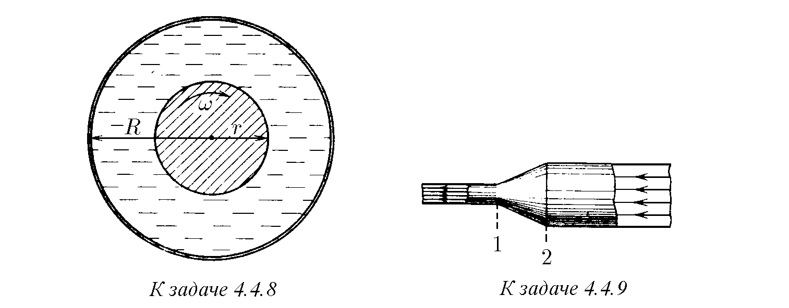

4.4.1. Пространството между две паралелни равнини е запълнено с течност с вискозитет η. Едната от равнините се движи със скорост v₀, а другата е в покой. Намерете разпределението на скоростта на течността между равнините и силата на вискозно триене, действаща на единица площ от всяка от равнините. Разстоянието между равнините е h.

4.4.2. Намерете разпределението на скоростта на течността при нейното установено течене между две равнини. Разстоянието между равнините е h, вискозитетът на течността е η. Намерете дебита на течността на единица ширина на потока, ако падът на налягането на единица дължина на потока (в посока на движение на течността) е P.

4.4.3*. а. Определете дебита на течността на единица ширина на потока, стичащ се по наклонена равнина под ъгъл α спрямо хоризонта. Вискозитетът и плътността на течността са съответно η и ρ. Дебелината на потока е h.
б. Оценете наклона на леглото на канал с дълбочина 2 м, средната скорост на движение на водата в който е 1 м/с. Вискозитетът на водата е 10⁻³ Н·с/м².

4.4.4*. Определете установената скорост на движение на шайба с маса m и радиус R по наклонена равнина, образуваща ъгъл α с хоризонта, в случая, когато между шайбата и равнината има слой смазка с дебелина Δ и вискозитет η.

4.4.5. Течност се изпомпва от един съд в друг през дълга тръба с радиус R и дължина l. Разликата в наляганията в краищата на тръбата е P, вискозитетът на течността е η. Определете зависимостта от разстоянието до стената на тръбата на: а) градиента на скоростта на течността; б*) скоростта на течността. Определете обема на течността, протичаща през тази тръба за единица време.

4.4.6. От вертикално разположена тънка тръба, запълнена с вискозна течност, за време T е изтекла половината от течността. За какво време ще изтече останалата част от течността?

4.4.7*. Тънка цилиндрична тръба с дължина l и диаметър d е изцяло запълнена с течност с плътност ρ и вискозитет η. Определете времето на изтичане на течността от тръбата, ако нейната ос е наклонена към хоризонта под ъгъл α.

♦ 4.4.8. Пространството между вал с радиус r, въртящ се около оста си, и неподвижна съосна с вала тръба с радиус R е запълнено с течност с вискозитет η. Моментът на силите, действащи на единица дължина на вала, е M. Определете зависимостта от разстоянието до оста на вала на: а) градиента на ъгловата скорост на течността; б*) ъгловата скорост на течността, а също и ъгловата скорост на вала.

♦ 4.4.9. В тръба с променливо сечение се поддържа стационарно течение на вискозна течност. В сечения 1 и 2 скоростта може да се счита за постоянна по сечението. Площите на сечения 1 и 2 са съответно S1 и S2, а налягането на течността в тях е съответно P1 и P2. Скоростта на течене на течността в сечение 1 е v1. Намерете силата, с която течността действа върху участъка от тръбата между сечения 1 и 2.