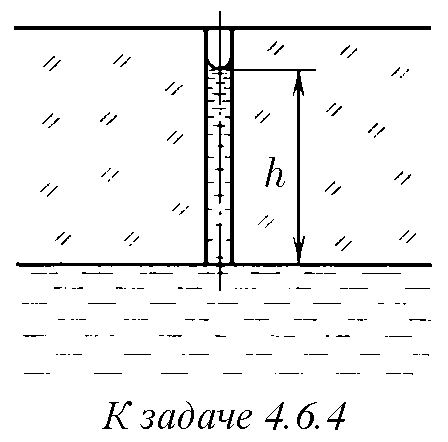
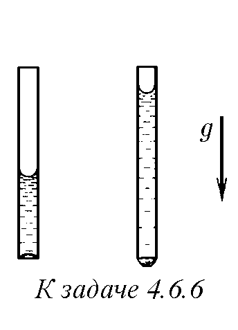
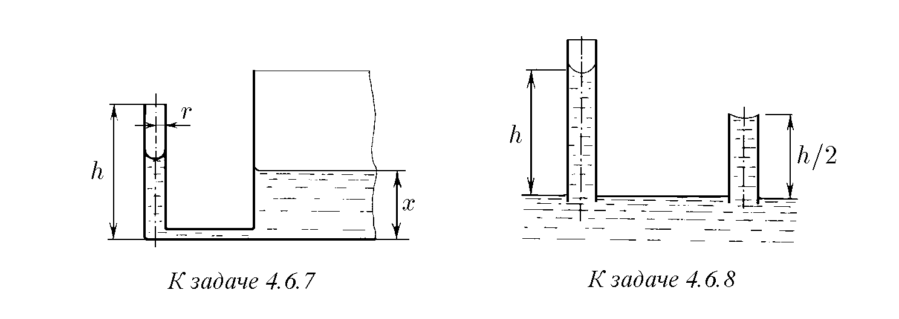
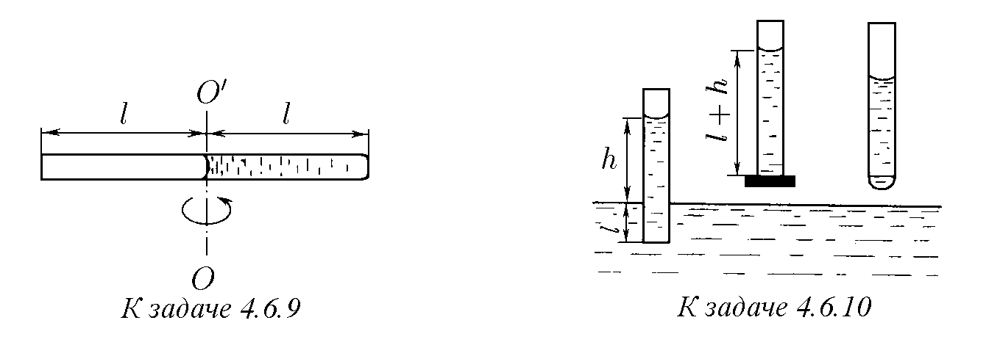
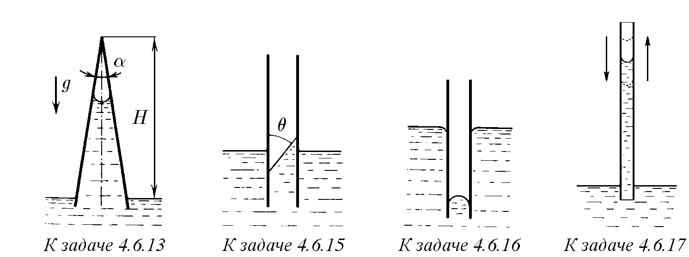

4.6.1. а. При отстраняване на мазно петно от повърхността на тъкан се препоръчва краищата на петното да се навлажняват с напоен с бензин памук, а не самото петно. Защо?
б. За да попие мазилото по-добре в ски обувките, как трябва да се нагряват те: отвън или отвътре?

4.6.2. Капиляр с радиус R се потапя в мокреща течност с повърхностно напрежение σ и плътност ρ. Определете височината, на която ще се издигне течността. Определете работата, извършена от силите на повърхностно напрежение, и потенциалната енергия на течността в капиляра. Защо тези величини не съвпадат?

4.6.3. Определете максималния радиус на капилярите на дърво на височина 10 m. Водата напълно мокри капилярите.

♦ 4.6.4*. а. Използвайки резултата от задача 4.4.5, определете обема течност, протичащ за единица време през капиляр с радиус r, свързан с течност, ако нейната повърхност в капиляра се е установила (поради изпарение) на разстояние h от неговата основа. Вискозитетът на течността е η, повърхностното напрежение е σ, течността напълно мокри капиляра. Пренебрегнете действието на силата на тежестта.
б. Оценете максималния обем кръв, който може да се подава към тъканите за 1 s по капиляри с радиус 10 μm и дължина 1 mm, напълно мокрени от кръвта, ако броят на капилярите е 10⁵, вискозитетът на кръвта е 5·10⁻³ N · s/m², а повърхностното напрежение е 7 · 10⁻² N/m.

4.6.5. Каква относителна грешка допускаме при измерване на атмосферното налягане по височината на живачен стълб, ако вътрешният диаметър на барометричната тръба, която не се мокри от живака, е 5 mm, повърхностното напрежение е 0,465 N/m, а плътността на живака е 13,6 g/cm³?

♦ 4.6.6. В два дълги, отворени от двата края капиляра, разположени вертикално, се намират стълбчета вода с дължина 2 и 4 cm. Намерете радиуса на кривината на долния мениск във всеки от капилярите, ако вътрешният им диаметър е 1 mm, а мокренето е пълно.

♦ 4.6.7. Вертикален капиляр с радиус r и височина h е свързан с широк съд чрез тръба на нивото на дъното на съда. Как зависи разликата в нивата на течността в съда и капиляра от височината x на нивото на течността в съда? При каква стойност на x течността ще започне да изтича от капиляра? Повърхностното напрежение на течността е σ, нейната плътност е ρ. Течността напълно мокри капиляра.

♦ 4.6.8. Течност в дълъг капиляр се издига на височина h. Определете радиуса на кривината на мениска в къс капиляр, чиято дължина е h/2. Радиусът на двата капиляра е r, а крайният ъгъл е θ.

♦ 4.6.9*. Капиляр, наполовина запълнен с течност, се върти около оста OO'. Дължината на капиляра е 2l, неговият радиус е r. Плътността на течността е ρ, а повърхностното напрежение е σ. Течността напълно мокри капиляра. При каква ъглова скорост на капиляра течността ще започне да изтича от него?

♦ 4.6.10. В капиляр, потопен вертикално във вода на дълбочина l, водата се е издигнала на височина h. Долният край на капиляра се затваря, капилярът се изважда от водата и се отваря отново. Определете дължината на стълба вода, останал в капиляра, ако мокренето е пълно.

♦ 4.6.11*. В съд с вода, чиято температура се променя, е потопен извит стъклен капиляр с радиус r = 0,1 mm. Графиката на температурната зависимост на повърхностното напрежение е показана на чертежа. При каква температура водата ще потече от съда, ако H = 15 cm?

4.6.12. Накъде ще се движи капка от мокреща и немокреща течност в хоризонтално разположен коничен капиляр?

♦ 4.6.13*. На каква височина ще се издигне течност по вертикален коничен капиляр с ъгъл при върха α ≪ 1 rad? Плътността на течността е ρ, нейното повърхностно напрежение е σ, височината на капиляра е H. Течността напълно мокри капиляра.

4.6.14. На каква височина ще се издигне течност между две вертикални пластини, разстоянието между които е ∆, ако крайният ъгъл при първата пластина е θ1, а при втората е θ2? Плътността на течността е ρ, нейното повърхностно напрежение е σ.

♦ 4.6.15. Каква сила действа на паралелни квадратни пластини със страна a, частично потопени в течност, ако крайният ъгъл при външните им повърхности е 90°, а при вътрешните е θ и π − θ? Плътността на течността е ρ, нейното повърхностно напрежение е σ.

♦ 4.6.16*. С каква сила се привличат една към друга две паралелни квадратни пластини със страна a, частично потопени в течност, ако те не се мокрят от течността? Плътността на течността е ρ, разстоянието между пластините е ∆, повърхностното напрежение на течността е σ.

♦ 4.6.17*. На каква височина ще се издигне течност с плътност ρ в напълно мокрещ се капиляр, ако напречното му сечение е S, а периметърът на това сечение е l? Как зависи периодът на малките вертикални трептения на течността в този капиляр от височината на течността? Повърхностното напрежение на течността е σ.