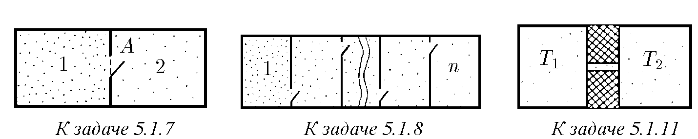

5.1.1. Оценете средната кинетична енергия и средноквадратната скорост на частици мъгла с диаметър 10 μm, намиращи се във въздух при температура 5 °C.

5.1.2. Колко пъти се различават средноквадратните скорости на две частици, извършващи брауново движение в капка вода, ако техните маси се различават четири пъти?

5.1.3. Оценете масата на инфузория, върху чието насочено движение със скорост 1 μm/s топлинното движение влияе слабо.

5.1.4. Определете средноквадратното отклонение на махало от равновесното му положение, предизвикано от топлинното движение на топчето на махалото. Температурата на въздуха е 20 °C. Масата на топчето е 1 mg, а дължината на нишката на махалото е 10 m.

5.1.5*. Огледалце на галванометър е окачено на кварцова нишка. Върху огледалцето пада тесен успореден светлинен лъч и, отразявайки се от него, попада върху екран, разположен на разстояние 20 m от огледалцето. Температурата на въздуха е 300 K. Оценете с колко ще се увеличи радиусът на светлинното петно върху екрана в резултат на топлинното движение на огледалцето, ако при завъртане на огледалцето на ъгъл ϕ върху него от страна на нишката действа момент на силите M = −κϕ, където κ = 1,38 · 10⁻¹⁵ N · m. Как ще се измени отговорът, ако температурата на въздуха се понижи до 100 K?

5.1.6. Съд е разделен на две секции с пореста преграда. В едната секция се намира газ, състоящ се от леки молекули, а в другата — от тежки. Налягането на газа в двете секции на съда в началния момент е еднакво. След известно време налягането в онази секция на съда, където са се намирали тежките молекули, се е увеличило. След това, след по-дълъг интервал от време, налягането в двете секции на съда се е изравнило. Обяснете този ефект.

♦ 5.1.7. В секция 1 на съд се намира смес от хелий и водород. Налягането на водорода и хелия е еднакво. В секция 2 на съда има вакуум. За кратко време в преградата се отваря отвор A. Определете отношението на налягането на хелия към налягането на водорода в секция 2.

♦ 5.1.8*. Съд е разделен чрез прегради на n изолирани секции. В началния момент в секция 1 се намира еднакъв брой молекули с моларна маса µ₁ и µ₂. В останалите секции има вакуум. За кратко време в преградите се отварят малки отвори, както е показано на фигурата. Оценете отношението на броя на молекулите с моларна маса µ₁ към броя на молекулите с моларна маса µ₂ в n-тата секция на съда.
124

5.1.9*. От съд през отвор в стената изтича за време τ половината от разреден газ. За какво време би изтекла половината от същия газ, ако всички размери на съда (включително и размерите на отвора) бяха n пъти по-големи?

5.1.10. Оценете колко пъти потокът от газ, изтичащ от съд през цилиндричен канал с радиус R и дължина L, е по-малък от потока газ, изтичащ през отвор с радиус R. Считайте, че стените на канала поглъщат молекулите.

♦ 5.1.11*. Два съда с еднакъв обем V са съединени с тесен канал. В съдовете се намира малък брой частици N (т.е. частиците са толкова малко, че почти не се удрят една в друга). Колко частици ще се окажат във всеки от съдовете, ако температурата на газа в единия съд е T₁, а във втория — T₂ > T₁? В съединителния канал е поставено леко флагче. В коя посока ще се отклони то?
