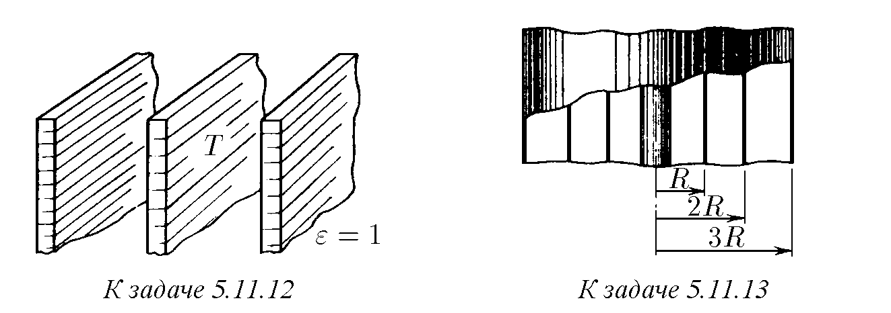
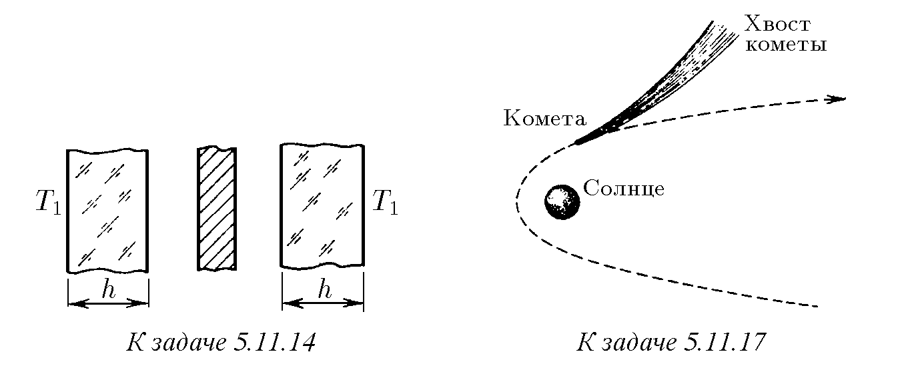

5.11.1. Тяло, нагрято до температура T, излъчва от единица площ на своята повърхност за единица време енергия (плътност на енергийния поток), пропорционална на четвъртата степен на температурата: ϕ = εσT⁴, където ε < 1 е степента на чернота на тялото, σ = 5,672 · 10⁻⁸ W/(m²·K⁴) е константата на Стефан – Болцман, T е температурата.
а. Оценете колко топлинна енергия излъчва за единица време вашето тяло (енергиен поток от повърхността на вашето тяло). Приемете степента на чернота на тялото равна на 0,3.
б. Слънцето излъчва като абсолютно черно тяло при температура 6300 K. Определете каква е плътността на енергийния поток от повърхността на Слънцето.

5.11.2. Оценете температурата на спиралата на електрически котлон с мощност 0,5 kW и на нажежаемата жичка на електрическа крушка с мощност 150 W. Приемете, че топлообменът се осъществява само чрез излъчване.

5.11.3*. Определете плътността на енергията на топлинното излъчване в кухина на тяло с температура T. Скоростта на светлината е 3 · 10⁸ m/s.

5.11.4. Използвайки условието за топлинно равновесие на две тела, които обменят енергия чрез топлинно излъчване, докажете, че степента на чернота на тялото е равна на коефициента на поглъщане на излъчването от това тяло.

5.11.5. а. „Нагрявайки парче стомана, при температура 800 °C ще наблюдаваме ярко вишнево-червено светене, но прозрачна пръчица от разтопен кварц при същата температура изобщо не свети“ (Ландсберг Г. С. Оптика). Обяснете този ефект.
б. Защо кредата изглежда тъмна сред нажежени въглени?

5.11.6*. а. Определете температурата на метална сфера в близост до плоска черна повърхност, нагрята до температура T₀.
б. Определете температурата на сфера, която се намира между две паралелни черни равнини, нагряти до температури T₁ и T₂.

5.11.7. а. Сфера с радиус R е нагрята до температура T₀. Степента на чернота на повърхността на сферата е ε. Определете температурата на сферична прашинка, намираща се на разстояние L от центъра на сферата.
б. Оценете плътността на енергията, идваща от Слънцето към Земята, ако средната температура на повърхността на Земята е 20 °C.

5.11.8. Разстоянията между Слънцето и планетите Земя, Меркурий, Венера и Марс са съответно 1,5 · 10⁸; 5,8 · 10⁷; 1,1 · 10⁸ и 2,3 · 10⁸ km. Средната температура на повърхността на Земята е 20 °C.
а. Оценете средната температура на повърхността на Меркурий, Венера и Марс.
б. Оценете потока на енергия от повърхността на Слънцето.
в. Оценете температурата на повърхността на Луната в момента, когато слънчевите лъчи са перпендикулярни на повърхността ѝ. Защо при същото условие такава температура не се наблюдава на повърхността на Земята?

5.11.9. Плътността на потока на излъчване от звездното небе е около 2 · 10⁻⁶ W/m². Оценете, използвайки тази величина, температурата на вътрегалактическия прах.

5.11.10. Каква температура ще се установи вътре в сферичен спътник, който се движи около Земята, оставайки през цялото време осветен от Слънцето? Спътникът няма вътрешни източници на енергия.

5.11.11*. Определете топлинния поток (топлинната мощност), предаван от една паралелна пластина към друга, ако температурата на пластините е T₁ и T₂, а степента на чернота — съответно ε₁ и ε₂. Площта на всяка пластина е S, а разстоянието между пластините е много по-малко от техните размери.

♦ 5.11.12. Температурата T на средна нагрята пластина се поддържа постоянна.
а. На колко е равна температурата на външните екраниращи пластини?
б. Колко екраниращи пластини трябва да се поставят от двете страни на средната пластина, за да се намали температурата на външната екранираща пластина до T/2?

♦ 5.11.13*. Нажежаема жичка с радиус r се екранира от три цилиндъра с радиуси R, 2R и 3R. Температурата на жичката е T₀. Определете температурата на външния екран. Материалът на жичката и екрана е еднакъв, степента на чернота ε = 1.

♦ 5.11.14*. Във вакуумна камера се намира нагрявана метална равнина, която от двете страни се екранира от метални пластини с дебелина h. Степента на чернота на равнината и на пластините е ε, топлопроводимостта на пластините е κ. Температурата на пластините от външните страни е T₁, температурата на вакуумната камера е T₂. Определете температурата на металната равнина.

5.11.15. Енергията на фотона E е свързана с неговия импулс p чрез съотношението p = E/c, където c е скоростта на фотона, равна на скоростта на светлината. Докажете, че налягането на фотонния газ P е свързано с плътността на енергията w чрез съотношението P = w/3.

5.11.16. „...Космическата яхта представлява нещо като сфера, чиято външна обвивка — необикновено тънко и леко платно — се надуваше и се преместваше в пространството, улавяйки налягането на светлинните лъчи... Ако това корабче останеше без управление в близост до някоя звезда... и силата на привличане беше малка, то би се устремило далеч от звездата по права линия“ (Пиер Бул, „Планетата на маймуните“).
а. Какво максимално ускорение може да развие тази космическа яхта на разстояние R от звездата, ако потокът на излъчване на звездата е Φ, площта на платното е S, а масата на яхтата е m?
б*. Каква скорост би придобила яхтата, изминавайки под действието на излъчването разстояние по радиуса от R₁ до R₂? Платното отразява напълно излъчването.

♦ 5.11.17. а. Обяснете формата на опашката на кометата, изобразена на фигурата. Пунктираната линия, заобикаляща Слънцето, е траекторията на кометата.
б. Оценете максималния размер на алуминиевите прашинки, които в космическото пространство под действието на слънчевото излъчване биха се отдалечавали от Слънцето.