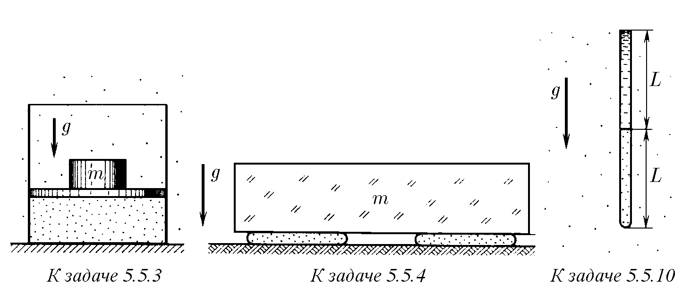
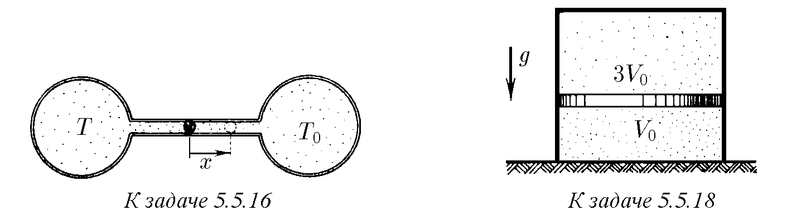
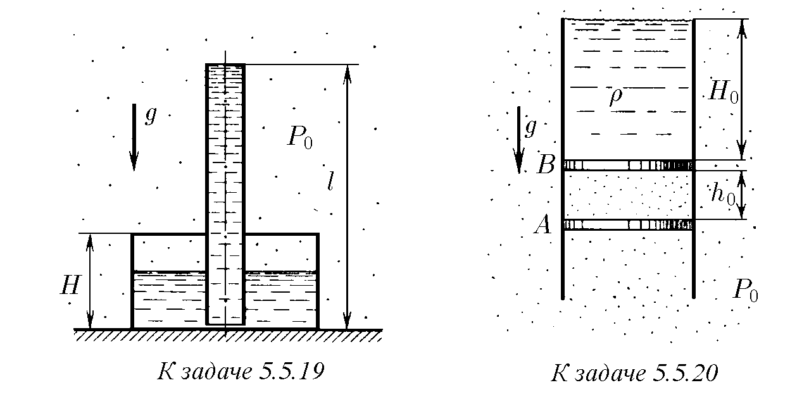
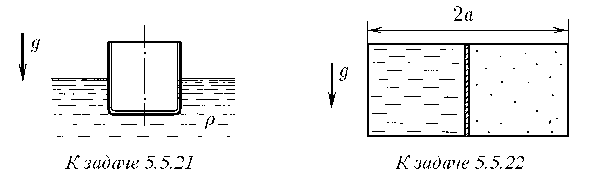
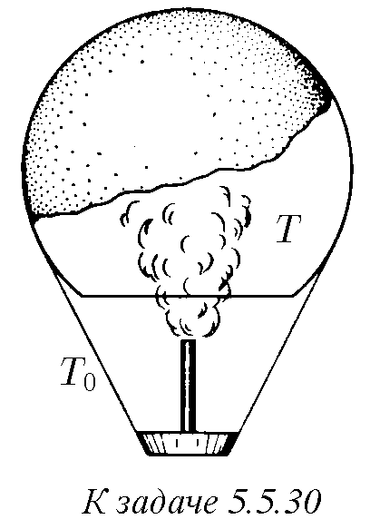
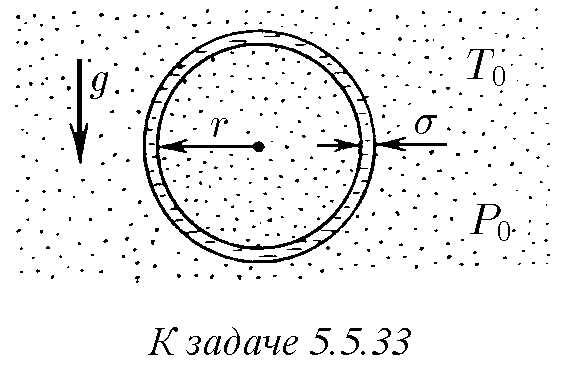
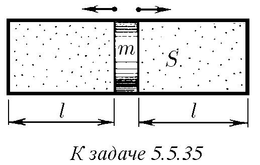
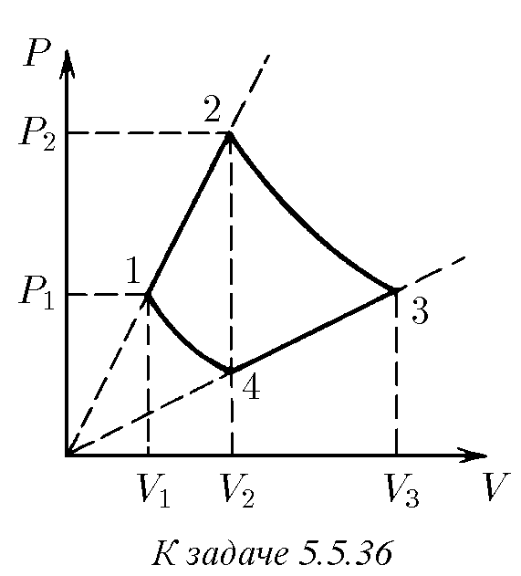

5.5.1. Обемът на газ е намален два пъти, а температурата е увеличена един път и половина. Колко пъти се е увеличило налягането на газа?

5.5.2. За измерване на собствения обем на насипен материал той се поставя в цилиндър, който се затваря херметически с бутало. След това се измерват наляганията на въздуха $P_1$ и $P_2$ при една и съща температура и две положения на буталото, когато сумарният обем на въздуха и материала е равен на $V_1$ и $V_2$. Какъв е обемът на материала според тези данни?

♦ 5.5.3. За да се намали изотермично обемът на газ в цилиндър с бутало $n$ пъти, върху буталото е поставен товар с маса $m$. Каква маса товар трябва да се добави, за да се намали обемът на газа изотермично още $k$ пъти?

♦ 5.5.4*. Върху две дълги цилиндрични торби с радиус $r$ и дължина $L \gg r$, направени от неразтеглив материал и запълнени с газ, е поставена плоча с маса $m$, в резултат на което те са се сплескали до дебелина $h \ll r$. Външното налягане е $P_0$. Определете началното налягане в торбите, ако температурата на газа в тях не се е променила.

5.5.5. Бутилка с вместимост 50 л е напълнена с въздух при 27 °C до налягане 10 МПа. Какъв обем вода може да се изтласка от цистерна на подводница с въздуха от тази бутилка, ако изтласкването се извършва на дълбочина 40 м? Температурата на въздуха след разширението е 3 °C.

5.5.6. На каква дълбочина в течност с плътност $\rho$ трябва да се потопи отворена тръба с дължина $L$, така че след затваряне на горния отвор да се извади стълб течност с височина $L/2$? Атмосферното налягане е $P$.

5.5.7. Газ се намира в съд при налягане 2 МПа и температура 27 °C. След нагряване с 50 °C в съда е останала само половината от газа (по маса). Определете установеното налягане.

5.5.8. Налягането на въздуха в бутилка е равно на 0,1 МПа при температура 7 °C. С колко трябва да се нагрее бутилката, за да изхвръкне тапата? Без нагряване тапата може да се извади чрез прилагане на сила 10 Н. Сечението на тапата е 2 см².

5.5.9. Защо електрическата крушка се запълва с инертен газ при налягане, значително по-ниско от атмосферното?

♦ 5.5.10*. Долният край на вертикална тясна тръба с дължина $2L$ (в мм) е запоен, а горният е отворен към атмосферата. В долната половина на тръбата се намира газ при температура $T_0$, а горната ѝ половина е запълнена с живак. До каква минимална температура трябва да се нагрее газът в тръбата, за да изтласка целия живак? Външното налягане в милиметри живачен стълб е равно на $L$.

5.5.11. За колко хода на бутална помпа с работен обем $V$ може да се повиши налягането от атмосферно $P_0$ до $P$ в съд, чиято вместимост е $V_0$? Пренебрегнете нагряването на газа.

5.5.12. За колко хода на бутална помпа с работен обем $V$ може да се понижи налягането в съд с вместимост $V_0$ от атмосферно $P_0$ до $P$?

5.5.13. Зависи ли подемната сила на аеростат от температурата на околния въздух?

5.5.14. Пламъкът на горелка пуши. Ако отгоре се поднесе вертикална стъклена тръба, саждите изчезват, но се появяват отново, ако тръбата се затвори отгоре. Обяснете това явление.
132

5.5.15*. Фабричен комин с височина 50 м отвежда дим при температура 60 °C. Определете разликата в налягането в комина, осигуряваща тягата. Температурата на въздуха е −10 °C, плътността на въздуха е 1,29 кг/м³.

♦ 5.5.16. Газов термометър се състои от два еднакви съда с вместимост $V_0$ всеки, съединени с тръба с дължина $l$ и сечение $S$. Тръбата е преградена от капка живак. Съдовете са пълни с газ. Ако температурата на газа в двата съда е еднаква, живакът се намира в средата на тръбата. Единият съд е поставен в термостат с температура $T_0$. Градуирайте термометъра, като намерите зависимостта на температурата на газа във втория съд от преместването на живака от равновесното положение.

5.5.17. Два съда с вместимост 200 и 100 см³ са разделени от подвижно бутало, което не провежда топлина. Първоначално температурата на газа в съдовете е 300 K, а налягането му е 1013 гПа, след това по-малкият съд е охладен с лед до 273 K, а по-големият е нагрят с пара до 373 K. Какво налягане ще се установи в съдовете?

♦ 5.5.18. В цилиндричен съд с газ се намира в равновесие тежко бутало. Масата на газа и неговата температура над и под буталото са еднакви. Отношението на вътрешния обем на горната част на съда към вътрешния обем на долната е равно на 3. Какво ще бъде това отношение, ако температурата на газа се увеличи два пъти?

♦ 5.5.19. В цилиндричен съд с височина $H$ през капака е вмъкната вертикално тънкостенна тръба с дължина $l$, която почти достига дъното на съда. Съединението на капака със съда и тръбата е херметично. В съда през тръбата се налива течност. Намерете височината на нивото на течността от дъното на съда, когато тръбата се запълни с течност. Атмосферното налягане е $P_0$, плътността на течността е $\rho$.

♦ 5.5.20. Във вертикален цилиндричен съд над бутало $A$ се намира газ, затворен от бутало $B$, върху което до върха на цилиндъра е налята течност с плътност $\rho$. На какво разстояние $x$ трябва да се повдигне бутало $A$, за да остане над бутало $B$ стълб течност с височина $H$? Пренебрегнете масата на бутало $B$ и триенето му в стените. Атмосферното налягане е $P_0$, началната височина на стълба течност е $H_0$, на стълба газ — $h_0$. Температурата на газа при преместването на буталото не се променя.

♦ 5.5.21. На повърхността на течност с плътност $\rho$ плува цилиндрична тънкостенна чаша, наполовина потопена в течността.
а. Колко ще потъне чашата в течността, ако се постави върху повърхността ѝ с дъното нагоре? Височината на чашата е $h$, налягането на въздуха е $P_0$.
б. На каква дълбочина трябва да се потопи обърнатата с дъното нагоре чаша, за да потъне на дъното заедно със затворения в нея въздух?

♦ 5.5.22. В правоъгълен съд с непроницаеми стени вляво се намира тежка течност (например живак), отделена от въздуха в дясната част на съда чрез подвижно тънко бутало. В началния момент буталото е в равновесие и разделя обема на съда наполовина. На колко се измества буталото надясно, ако температурата на системата се намали три пъти? Пренебрегнете топлинното разширение на живака и стените на съда. Няма триене. Дължината на съда е $2a$.

5.5.23*. Херметически затворен резервоар е запълнен с течност така, че на дъното му има въздушно мехурче. Налягането на дъното на резервоара е $P_0$. Какво ще стане то, ако въздушното мехурче изплува? Височината на резервоара е $H$, плътността на течността е $\rho$.

5.5.24*. Херметически затворен резервоар с височина 3 м е запълнен с вода така, че на дъното му се намират две еднакви въздушни мехурчета. Налягането на дъното на резервоара е 0,15 МПа. Какво ще стане налягането, ако изплува едно мехурче? две мехурчета?

5.5.25. Намерете формулата на съединение на азота с кислорода, ако 1 г от него в газообразно състояние в обем 1 л създава при температура 17 °C налягане 0,314 атм.

5.5.26*. За да се измери масата на водата в капчици мъгла, проба въздух при налягане 100 кПа и температура 0 °C се затваря херметически в съд с прозрачни стени, нагрява се до температура, при която мъглата в пробата изчезва, и се измерва налягането при тази температура. Оценете масата на мъглата в 1 м³ проба, ако температурата на изчезване на мъглата е 82 °C, а налягането в съда при тази температура е 180 кПа.

5.5.27. Колко пъти ще се промени подемната сила на въздушен балон, ако запълващият го хелий се замени с водород? Пренебрегнете теглото на обвивката на балона. Моларната маса на въздуха е 29 г/мол.

5.5.28. Водородът запълва само горната част на обвивката на стратостат. В долната част се намира въздух, който свободно прониква в обвивката през отвор отдолу. При каква най-голяма маса стратостатът ще започне да се издига, ако масата на водорода в обвивката е $m$?

5.5.29. При какъв най-малък радиус ще започне да се издига въздушен балон, напълнен с хелий, ако повърхностната плътност на материала на обвивката е 50 г/м², налягането на въздуха е 10⁵ Па, а температурата е 27 °C?

♦ 5.5.30. Въздухът вътре в обвивката на въздушен балон с вместимост $V$ се нагрява от газова горелка до температура $T$, превишаваща температурата $T_0$ на околния въздух. Каква е товароподемността на този въздушен балон при атмосферно налягане $P_0$? Моларната маса на въздуха е $\mu$.

5.5.31. Атмосферата на Венера се състои почти изцяло от въглероден диоксид. Температурата му при повърхността на планетата е около 500 °C, а налягането — приблизително 100 атм. Какъв обем трябва да има изследователска сонда с маса 1 т, за да плува в долните слоеве на атмосферата на Венера?

5.5.32. При стайна температура диазотният тетраоксид частично дисоциира, превръщайки се в азотен диоксид: $N_2O_4 \rightleftharpoons 2NO_2$. В евакуиран съд с вместимост 250 см³ се вкарват 0,92 г течен $N_2O_4$ при 0 °C. Когато температурата в съда се увеличи до 27 °C, течността се изпарява напълно, а налягането става равно на 128 кПа. Определете частта от диазотния тетраоксид, която е дисоциирала.

♦ 5.5.33. Сапунен мехур, запълнен с горещ въздух, виси неподвижно в атмосферата. Атмосферното налягане е $P_0$, а температурата е $T_0$. Плътността на сапунената ципа е $\rho$, нейната дебелина е $\delta$, а радиусът на мехура е $r$. Намерете температурата на въздуха вътре в мехура, ако повърхностното напрежение на сапунената вода е $\sigma$. Моларната маса на въздуха е $\mu$.

5.5.34. Два сапунени мехура с радиуси $r_1$ и $r_2$ се сливат в един. Намерете повърхностното напрежение на сапунената вода, ако радиусът на образувания мехур е равен на $r$, а атмосферното налягане е $P_0$.

♦ 5.5.35. Намерете периода на малките трептения на бутало с маса $m$, разделящо гладък цилиндричен съд със сечение $S$ на две части с дължина $l$ всяка. От двете страни на буталото се намира газ при налягане $P_0$ и температура $T_0$. При трептенето на буталото температурата на газа не се променя.

♦ 5.5.36. Един мол газ участва в процес, чиято графика е изобразена на $P, V$-диаграма. Участъците 1–2 и 3–4 от графиката са отсечки от прави, чиито продължения минават през началото на координатната система, а кривите 1–4 и 2–3 са изотерми. Начертайте графиката на този процес на $T, V$-диаграма. Намерете обема $V_3$, ако са известни обемите $V_1$ и $V_2 = V_4$.