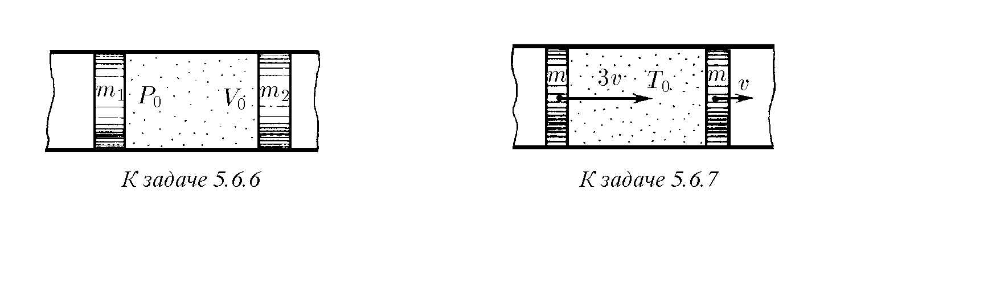
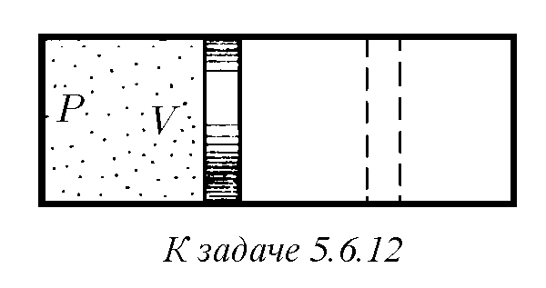
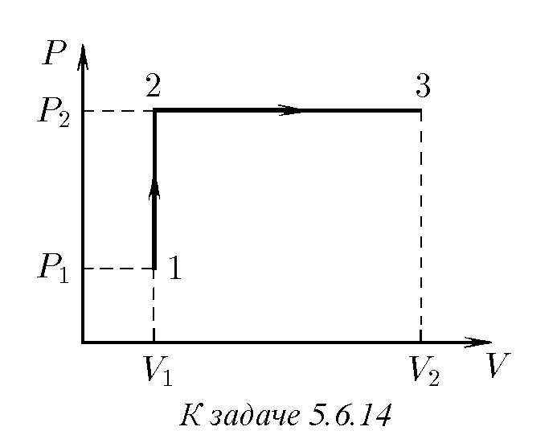
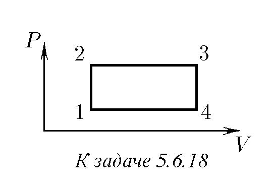
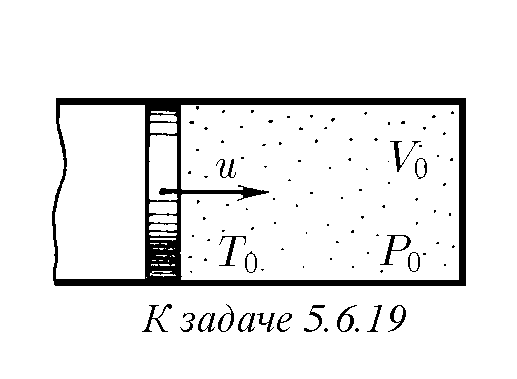
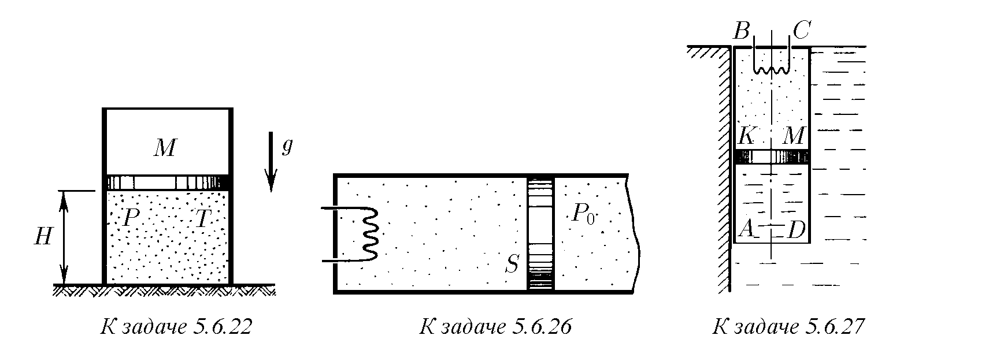
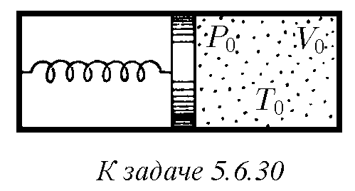

5.6.1. Средната енергия на една молекула газ в широк температурен диапазон се определя достатъчно точно от формулата $\bar{\epsilon} = (i/2)kT$, където $i$ е броят на степените на свобода на молекулата, равен на броя на координатите, определящи положението на молекулата. Като използвате тази формула, намерете средната енергия на молекулите $\text{H}_2$, $\text{N}_2$, $\text{H}_2\text{O}$, $\text{CH}_4$ при температура $T$.

5.6.2. На колко е равна вътрешната енергия (в джаули) при нормални условия на $1\text{ cm}^3$ въздух? На $1\text{ kg}$ въздух?

5.6.3. Въздухът в стая е нагрят от температура $T_0$ до $T$. При това налягането не се е променило. Изменила ли се е вътрешната енергия на въздуха вътре в стаята?

5.6.4. В съд с обем $V_1$ се намира едноатомен газ при налягане $P_1$ и температура $T_1$, а в съд с обем $V_2$ — едноатомен газ при налягане $P_2$ и температура $T_2$. Какво налягане и каква температура ще се установят в тези съдове след тяхното съединяване? Съдовете са топлоизолирани.

5.6.5. В топлоизолиран съд при температура $800\text{ K}$ се намират $1\text{ mol}$ въглероден диоксид ($\text{CO}_2$) и $1\text{ mol}$ водород ($\text{H}_2$). Протича химичната реакция
$\text{CO}_2 + \text{H}_2 = \text{CO} + \text{H}_2\text{O} + 40,1\text{ kJ/mol}$.
Колко пъти ще нарасне налягането в съда след приключване на реакцията?

♦ 5.6.6. В дълга гладка топлоизолирана тръба се намират топлоизолирани бутала с маси $m_1$ и $m_2$, между които в обем $V_0$ се намира едноатомен газ при налягане $P_0$. Буталата се освобождават. Определете техните максимални скорости, ако масата на газа е много по-малка от масата на всяко от буталата.

♦ 5.6.7. В дълга топлоизолирана тръба между две еднакви бутала с маса $m$ всяко се намира $1\text{ mol}$ едноатомен газ при температура $T_0$. В началния момент скоростите на буталата са насочени в една посока и са равни на $3v$ и $v$. До каква максимална температура ще се нагрее газът? Буталата не провеждат топлина. Масата на газа да се пренебрегне в сравнение с масата на буталата.

5.6.8. Оценете скоростта на излитане на куршум от патрон, хвърлен в огън.

5.6.9. Обяснете защо разширението на газ при постоянна температура (изотермно разширение) е възможно само при внасяне на топлина към газа.

5.6.10. Обемът на газ се е увеличил два пъти: веднъж изотермно, втория път изобарно. В кой от тези два случая газът ще извърши по-голяма работа?

5.6.11. Защо се нагрява помпата при напомпване на гума?

♦ 5.6.12. В цилиндричен съд с подвижно бутало е затворен обем газ $V$ при налягане $P$. От другата страна на буталото има вакуум. Буталото се освобождава. Каква работа ще извърши газът над буталото, ако обемът на газа при преместването на буталото се увеличи два пъти, а налягането му при това: а) остава постоянно; б) нараства линейно с увеличаването на обема до налягане $2P$?

♦ 5.6.13. На фигурата е дадена графика на зависимостта на налягането на газа от обема. Намерете графично работата на газа при разширението му от $2$ до $6\text{ l}$.

♦ 5.6.14. Един мол газ, участващ в процеса, чиято графика е представена на фигурата, преминава последователно през състояния 1, 2, 3. Вътрешната енергия на газа е пропорционална на температурата ($U = cT$). Намерете количеството топлина, погълната от газа в този процес.

5.6.15. Въздух, заемащ обем $2\text{ l}$ при налягане $0,8\text{ MPa}$, се е разширил изотермно до $10\text{ l}$. Определете работата, извършена от въздуха.

5.6.16. Газ, заемащ обем $2\text{ l}$ при налягане $0,1\text{ MPa}$, се разширява изотермно до $4\text{ l}$. След това, чрез изохорно охлаждане (при постоянен обем), налягането му е намалено два пъти. По-нататък газът се разширява изобарно до $8\text{ l}$. Намерете работата, извършена от газа. Начертайте графика на зависимостта на налягането от обема.

5.6.17. Един мол водород с температура $0^\circ\text{C}$ се нагрява при постоянно налягане. Какво количество топлина трябва да се съобщи на газа, за да се удвои обемът му? Каква работа ще бъде извършена от газа при това?

♦ 5.6.18. Един мол газ участва в цикличен процес, чиято графика, състояща се от две изохори и две изобари, е представена на фигурата. Температурата в точки 1 и 3 е съответно $T_1$ и $T_3$. Определете работата, извършена от газа за един цикъл, ако е известно, че точки 2 и 4 лежат на една и съща изотерма.

♦ 5.6.19. Бутало с маса $M$, затварящо обем $V_0$ едноатомен газ при налягане $P_0$ и температура $T_0$, се движи със скорост $u$. Определете температурата и обема на газа при максимално свиване. Системата е топлоизолирана, топлинните капацитети на буталото и съда да се пренебрегнат.

5.6.20. Сгъстен въздух постъпва в цилиндъра на пневматичен двигател от магистрала с постоянно налягане при температура $T_1$. След това достъпът на въздух от магистралата към цилиндъра се преустановява. Намиращият се в цилиндъра въздух продължава да движи буталото, разширявайки се без топлообмен, докато налягането падне до атмосферното, а температурата — до $T_2$. След това буталото се движи назад и през отворен клапан изтласква целия въздух от цилиндъра. След това целият цикъл се повтаря. Намерете работата на двигателя при консумация на $\nu$ мола сгъстен въздух.

5.6.21. Сух въздух се пренася от слаб вятър през планински проход с височина $1\text{ km}$. Оценете с колко температурата на въздуха на прохода е по-ниска от тази в подножието на планината.

♦ 5.6.22*. В изпомпано пространство вертикално стои цилиндричен съд, затворен отгоре с подвижно бутало с маса $M$. Под буталото се намира едноатомен газ при температура $T$ и налягане $P$. Вътрешното сечение на цилиндъра е $S$, височината на частта от съда, в която се намира газът, е $H$. Буталото е освободено. То започва да се движи. На колко е равна максималната скорост, развита от буталото, ако газът се свива изотермно? Адиабатно?

5.6.23*. Два компресора свиват адиабатно двуатомен газ. Първо работи единият компресор, свиващ газа от обем $V_0$ до междинен обем $V_1$. След това сгъстеният газ се охлажда до първоначалната температура, след което влиза в действие вторият компресор, свиващ газа до обем $V_2$. При какъв обем $V_1$ пълната работа на двата компресора е минимална и на колко е равна тя? Обемите $V_0$ и $V_2$ се считат за зададени, първоначалното налягане на газа е $P_0$. Работата на кой компресор при оптимална стойност на $V_1$ е по-голяма?

5.6.24. $1\text{ m}^3$ водород при $0^\circ\text{C}$ се намира в цилиндричен съд, затворен отгоре с лесно плъзгащо се бутало с маса $1\text{ t}$ и сечение $0,5\text{ m}^2$. Атмосферното налягане е $973\text{ hPa}$. Какво количество топлина ще е необходимо за нагряването на водорода до $300^\circ\text{C}$? Намерете изменението на вътрешната му енергия.

5.6.25. За нагряването на $1\text{ kg}$ неизвестен газ с $1\text{ K}$ при постоянно налягане са необходими $912\text{ J}$, а при нагряване при постоянен обем са необходими $649\text{ J}$. Какъв е този газ?

♦ 5.6.26*. Хоризонтално разположен цилиндър, съдържащ $1\text{ mol}$ газ при начална температура $T_0$ и налягане $P_0$, е затворен с бутало със сечение $S$. Отдясно на буталото има постоянно атмосферно налягане $P_0$. Газът се нагрява от нагревател. При движението на буталото върху него действа сила на триене $F$ от страна на стените на цилиндъра. Половината от топлината, отделена при триенето на буталото в стените на цилиндъра, отива в газа. Вътрешната енергия на газа е $U = cT$. Как зависи температурата на газа от количеството топлина, предадено на газа от нагревателя? Постройте графика на тази зависимост.

♦ 5.6.27. Цилиндър $ABCD$, затворен отгоре и отворен отдолу, е прикрепен към стената на басейн, запълнен с вода. В горната част на цилиндъра $KBCM$ се намира $1\text{ mol}$ хелий, отделен от водата с бутало ($BK = 2h$). Хелият се нагрява чрез пускане на ток през нагревател. Какво количество топлина трябва да се подведе към газа, за да слезе буталото на разстояние $h$, при условие че $AK > h$? Масата на буталото, триенето и топлопроводността да се пренебрегнат. Басейнът е широк. Плътността на водата е $\rho$, сечението на цилиндъра е $S$.

5.6.28*. Намерете моларния топлинен капацитет на едноатомен газ, разширяващ се по закона $PV^n = \text{const}$. При какви стойности на $n$ топлинният капацитет ще бъде равен на нула? На безкрайност?

5.6.29. Нагрява ли се или се охлажда газ, разширяващ се по закона $PV^2 = \text{const}$?

♦ 5.6.30*. Намерете топлинния капацитет на система, състояща се от затворен с бутало съд с едноатомен газ (параметри на газа $P_0, V_0, T_0$). Буталото се държи от пружина. Отляво на буталото има вакуум. Ако газът се изпомпа, буталото ще се допре до дясната стена на съда, а пружината няма да бъде деформирана. Топлинните капацитети на съда, буталото и пружината да се пренебрегнат.

5.6.31*. Във вакуумно пространство вертикално стои цилиндричен съд, затворен отгоре с подвижно бутало с маса $M$. Вътре в съда се намира едноатомен газ при налягане $P$. Вътрешното сечение на цилиндъра е $S$, а буталото се намира на височина $H$ над дъното му. Буталото е освободено. След кратки колебания то спира. На какво разстояние от първоначалното положение ще спре буталото, ако топлинният капацитет на газа при постоянен обем е много по-голям от топлинния капацитет на буталото и цилиндъра? Цялата система е топлоизолирана.