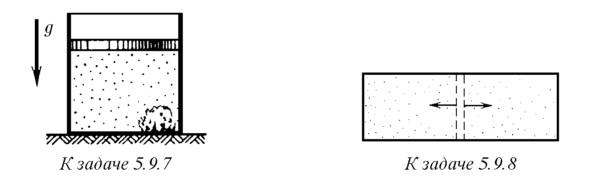
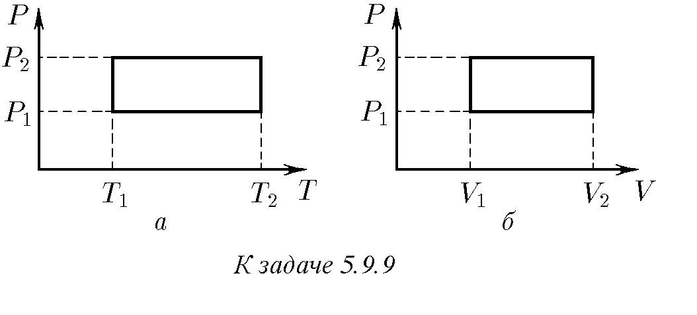
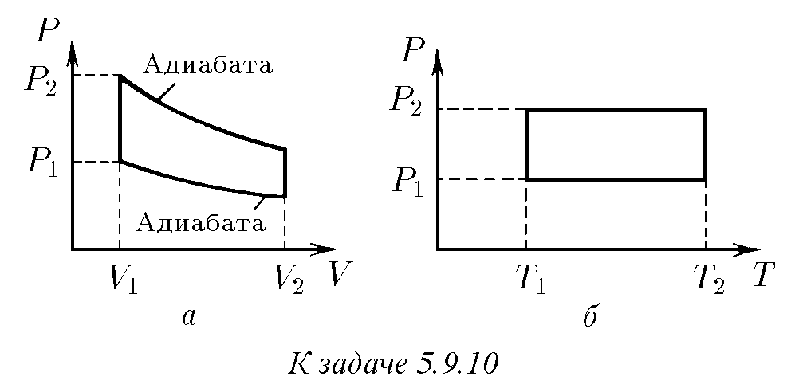

5.9.1. Две еднакви тела, нагрети до различни температури, се привеждат в топлинен контакт помежду си. Температурите на телата се изравняват. Покажете, че при този процес ентропията на системата се увеличава.

5.9.2. Намерете нарастването на ентропията на 1 kg лед при неговото топене.

5.9.3. С колко ще нарасне ентропията на 1 kg вода, намираща се при температура 293 K, при превръщането ѝ в пара?

5.9.4. Намерете нарастването на ентропията на водород при разширението му от обем V до 2V: а) във вакуум; б) при изотермен процес. Масата на газа е m.

5.9.5. Изчислете нарастването на ентропията на водород с маса m при прехода му от обем V₁ и температура T₁ към обем V₂ и температура T₂, ако газът: а) се нагрява при постоянен обем V₁, а след това се разширява изотермно; б) се разширява при постоянна температура T₁ до обем V₂, след което се нагрява при постоянен обем; в) се разширява адиабатно до обем V₂, а след това се нагрява при постоянен обем.

5.9.6∗. Парче лед с маса 0,1 kg при температура 0 °C се хвърля в топлоизолиран съд, съдържащ 2 kg бензол при 50 °C. Намерете нарастването на ентропията на системата след установяване на равновесие. Специфичният топлинен капацитет на бензола е 1,75 kJ/(kg · K).

♦ 5.9.7∗. В топлоизолиран съд се намират 0,5 kmol хелий и 1 kg лед. В началния момент температурата на леда е 273 K, а на хелия – 303 K. Съдът е затворен с подвижно бутало. Намерете нарастването на ентропията на системата при прехода към равновесие.

♦ 5.9.8. Съд с обем V е разделен на две еднакви части, в които се намират различни газове, с две прегради. Преградите са проницаеми само за „своя“ газ от тази част на съда, която всяка от тях първоначално отделя. Под действие на газовете преградите се движат до стените на съда. Намерете нарастването на ентропията при това движение, ако първоначалното налягане на газовете е P, а температурата е T. Защо такъв процес е невъзможен, ако газовете от двете страни са еднакви или е невъзможно по експериментален път да се отличи единият газ от другия (например, през миналия век е било невъзможно да се различават изотопи)?

♦ 5.9.9∗. Топлинна машина, чието работно тяло е 1 mol идеален едноатомен газ, работи по затворени цикли, изобразени на фигурата. Намерете нарастването на ентропията в машината за един цикъл.

♦ 5.9.10∗. Намерете КПД на циклите, изобразени на фигурата, ако работното тяло на топлинната машина е едноатомен идеален газ.

5.9.11. Съществува ли цикличен процес, при който цялата предадена на тялото от нагревателя топлина се превръща в работа?

5.9.12. Може ли практически цялата вътрешна енергия на газа да се превърне в механична работа?

5.9.13. Парна машина с мощност 14,7 kW консумира за 1 h работа 8,1 kg въглища със специфична топлина на изгаряне 3,3 · 10⁷ J/kg. Температурата на котела е 200 °C, а на охладителя – 58 °C. Намерете КПД на тази машина и го сравнете с КПД на идеална топлинна машина.

5.9.14. Покажете, че КПД на топлинната машина в цикличен процес е максимален, когато ентропията на системата не се променя.

5.9.15. Защо КПД на двигателя с вътрешно горене рязко пада при детонация (взривно изгаряне на горивната смес)?

5.9.16. В океана се намира лодка с парче лед с маса 1 kg при 0 °C на борда. Определете максималната работа, която може да се получи, използвайки процеса на топене на леда. Температурата на водата е 27 °C.

5.9.17. Каква работа може да се извърши, разполагайки с айсберг с обем 1 km³ като охладител и океана като нагревател? Какво време ще бъде необходимо на Красноярската ВЕЦ, за да произведе същото количество енергия? Мощността на Красноярската ВЕЦ е 6 GW.

5.9.18∗. Нагрято тяло с начална температура T се използва като нагревател в топлинна машина. Топлинният капацитет на тялото не зависи от температурата и е равен на C. Като охладител служи неограничена среда, чиято температура е постоянна и равна на T₀. Намерете максималната работа, която може да се получи за сметка на охлаждането на тялото.

5.9.19∗. Има две тела с начални температури T₁ и T₂. Топлинният капацитет на тези тела е C₁ и C₂ и не зависи от температурата. Едното тяло се използва като нагревател, а другото – като охладител в топлинна машина. Намерете максималната работа, която може да се получи по този начин. Направете изчислението, когато първото тяло е 1 kg вряща вода, а второто – 1 kg вода при температура 0 °C.

5.9.20. Как ще се промени температурата в стаята, ако вратата на работещ хладилник се остави отворена?

5.9.21. Идеална топлинна машина с КПД η работи по обратен цикъл. Какво максимално количество топлина може да се отнеме от охладителя, извършвайки механична работа A?

5.9.22. Абсолютната топлоизолация е невъзможна. На пръв поглед топлинната мощност от 0,1 W, постъпваща в хладилната камера поради несъвършенство на топлоизолацията, изглежда незначителна. Изчислете минималната мощност, която в този случай трябва да се разходва, за да се поддържа в камерата температура 10⁻⁴ K при температура на околната среда 20 °C. Направете аналогично изчисление за домашен хладилник, в чиято камера трябва да се поддържа температура −13 °C. (В инсталациите за получаване на рекордно ниски температури мощността на такъв „паразитен“ приток на топлина се свежда до 0,01 W и по-малко.)

5.9.23. Идеална топлинна машина, работеща по обратен цикъл, предава топлина от охладител с вода при температура 0 °C към нагревател с вода при температура 100 °C. Колко вода трябва да се замрази в охладителя, за да се превърне в пара 1 kg вода в нагревателя?

5.9.24∗. С помощта на електрическа печка с мощност 1 kW в стаята се поддържа температура 17 °C при температура на външния въздух −23 °C. Каква мощност би била необходима за поддържане на същата температура в стаята с помощта на идеална топлинна машина?

5.9.25∗. Каква минимална работа трябва да се разходи, за да се замрази 1 kg вода, намираща се при температура на околната среда 300 K?

5.9.26. Известно е, че при разтваряне на някои вещества във вода (например хипосулфит) температурата на разтвора се понижава. Използвайки този разтвор като охладител, а околната среда като нагревател, можем да получим известна работа. След това, изчаквайки изсъхването на разтвора, повтаряме цикъла. Ще получим ли по този начин вечен двигател от втори род?