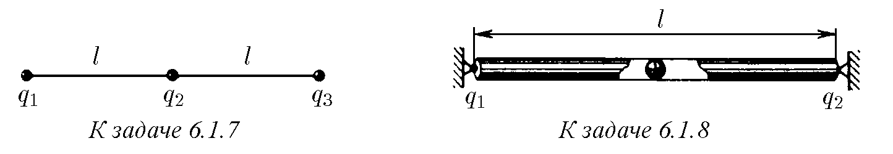
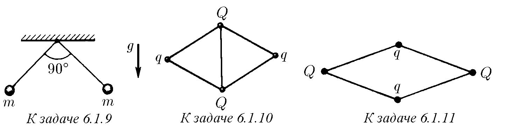
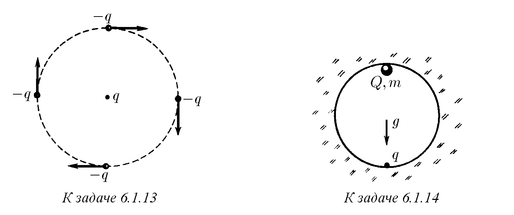
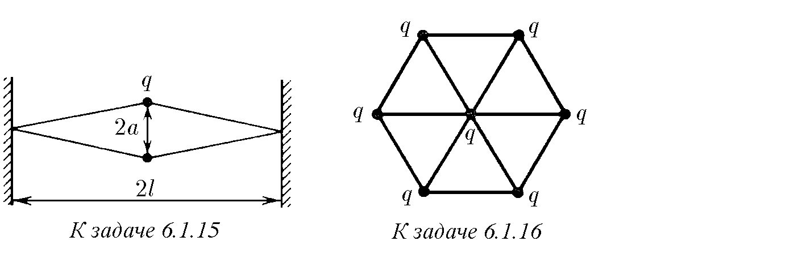
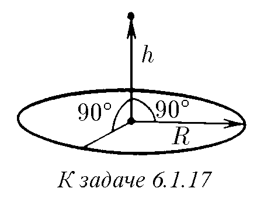
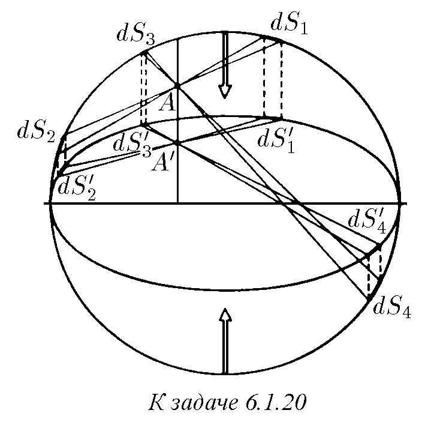

\* Ако в задачата не е посочена стойността на диелектричната проницаемост на веществото, считайте я за равна на единица.

6.1.1. а. Намерете силата на взаимодействие между заряди от 1 и 2 C на разстояние 1 км един от друг.
б. С каква сила си взаимодействат два електрона на разстояние $10^{-8}$ см? Колко пъти тази сила е по-голяма от силата на тяхното гравитационно привличане?

6.1.2. Силата на взаимодействие между два еднакви заряда на разстояние 1 м е равна на 1 N. Определете тези заряди в единици SI и в СГС.

6.1.3. а. Силата, действаща върху заряд 1 C, е равна на 1 N. На колко е равен интензитетът на електричното поле, действащо върху този заряд, в SI и СГС?
б. Силата, действаща върху заряд 10 СГС, е равна на 100 dyn. На колко е равен интензитетът на електричното поле, действащо върху този заряд, в SI и СГС?

6.1.4. На колко е равен интензитетът на електричното поле, създавано от заряд 10 C, в SI и СГС на разстояние 1 и 20 м от него? С каква сила действат тези електрични полета върху заряд 0,001 C? Върху заряд 1000 СГС?

6.1.5. Да предположим, че успеем да разделим 1 $\text{см}^3$ вода на разноименни заряди, които след това отдалечим един от друг на разстояние 100 км. С каква сила биха се привличали тези заряди?

6.1.6. Какъв заряд би придобил 1 $\text{см}^3$ желязо, ако успеем да отстраним 1% от съдържащите се в него електрони?

♦ 6.1.7. Три заряда $q_1, q_2, q_3$ са свързани помежду си с две нишки. Дължината на всяка нишка е $l$. Намерете силите на тяхното опъване.

♦ 6.1.8. В краищата на хоризонтална тръба с дължина $l$ са закрепени положителни заряди $q_1$ и $q_2$. Намерете равновесното положение на топче с положителен заряд $q$, поставено вътре в тръбата. Устойчиво ли е това равновесно положение? Ще бъде ли устойчиво равновесното положение на отрицателно заредено топче в тръбата?

♦ 6.1.9. Две еднакво заредени топчета с маса $m$, окачени в една точка на нишки с дължина $l$, се раздалечават така, че ъгълът между нишките става прав. Определете заряда на топчетата.

♦ 6.1.10. Четири положителни заряда $q, Q, q, Q$ са свързани с пет нишки, както е показано на фигурата. Дължината на всяка нишка е $l$. Определете силата на опъване на нишката, свързваща зарядите $Q > q$.

♦ 6.1.11. Четири положителни заряда $Q, q, Q, q$ са свързани с четири нишки, както е показано на фигурата. Дължината на всяка нишка е $l$. Определете ъглите между нишките.

6.1.12. В водородния атом електронът се движи около протона с ъглова скорост $10^{16}$ rad/s. Намерете радиуса на орбитата.

♦ 6.1.13. Около заряд $q$ по кръгова орбита се въртят четири еднакви частици с маса $m$ и заряд $-q$ всяка, разположени в ъглите на квадрат със страна $l$. Зарядът $q$ се намира в центъра на този квадрат. Определете ъгловата скорост на движение на частиците по орбитата.

♦ 6.1.14*. Какъв минимален заряд $q$ трябва да се закрепи в долната точка на сферична кухина с радиус $R$, така че в гравитационното поле малко топче с маса $m$ и заряд $Q$ да се намира в горната точка на кухината в положение на устойчиво равновесие?

♦ 6.1.15. Два заряда $q$, свързани с гумени шнурове към неподвижни стени, както е показано на фигурата, се намират на разстояние $2a$ един от друг. Разстоянието между стените е $2l$, а дължината на всеки недеформиран шнур е $l$. Определете тяхната коравина.

♦ 6.1.16*. Седем еднакви заряда $q$ са свързани помежду си с еднакви еластични нишки, както е показано на фигурата. Разстоянието между най-близките заряди е $l$. Определете силата на опъване на всяка нишка.
152

♦ 6.1.17. На колко е равен интензитетът на електричното поле в центъра на равномерно заредено тънко колело с радиус $R$? На колко е равен той по оста на колелото на разстояние $h$ от центъра? Зарядът на колелото е $Q$.

6.1.18*. На колко е равен интензитетът на електричното поле на равномерно заредена нишка с дължина $l$ върху права, която е продължение на нишката, на разстояние $x$ от най-близкия ѝ край? Зарядът на единица дължина на нишката е $\rho$.

♦ 6.1.19. Докажете, че съставящата на интензитета на електричното поле, перпендикулярна на повърхността на равномерно зареден участък от равнина, е равна на $E_\perp = \sigma\Omega/(4\pi\varepsilon_0)$, където $\Omega$ е пространственият ъгъл, под който се вижда този участък от разглежданата точка в пространството, а $\sigma$ е повърхностната плътност на заряда. Използвайки това, определете интензитета на електричното поле:
а) в центъра на куб, пет от стените на който са равномерно заредени с повърхностна плътност на заряда $\sigma$, а една стена не е заредена;
б) в центъра на правилен тетраедър, три от стените на който са заредени с повърхностна плътност $\sigma_1$, а четвъртата — с повърхностна плътност $\sigma_2$;
в) на равномерно заредена равнина, ако повърхностната плътност на заряда е $\sigma$;
г) по оста на дълга тръба със сечение във формата на правилен триъгълник, ако повърхностната плътност на заряда на стените на триъгълника на тръбата е съответно $\sigma_1, \sigma_2, \sigma_3$;
д*) във върха на конус с ъгъл при върха $\alpha$ и височина $h$, равномерно зареден с обемна плътност на заряда $\rho$;
е*) върху ръба на дълъг блок, равномерно зареден с обемна плътност на заряда $\rho$; напречното сечение на блока е правилен триъгълник със страна $l$.

♦ 6.1.20. а. Равномерно заредена сфера, заедно със закрепените по повърхността ѝ заряди, е свита в едно направление $n$ пъти, превръщайки я в елип-
153

соид. Докажете, че електричното поле вътре в такъв елипсоид е равно на нула. За доказателството разделете повърхността на елипсоида на двойки малки участъци, както е показано на фигурата.
б. Ще продължи ли да липсва поле вътре в дълга кръгла тръба с равномерно заредена повърхност, ако тя, заедно със закрепените повърхностни заряди, бъде свита в напречно направление?

6.1.21. а. Метално колело се е разкъсало от кулонови сили, когато зарядът на колелото е бил равен на $Q$. Направено е точно такова ново колело, но от материал, чиято якост е десет пъти по-голяма. Какъв заряд ще разкъса новото колело?
б. Какъв заряд ще разкъса ново колело, направено от стария материал, ако всички размери на новото колело са три пъти по-големи от размерите на старото?