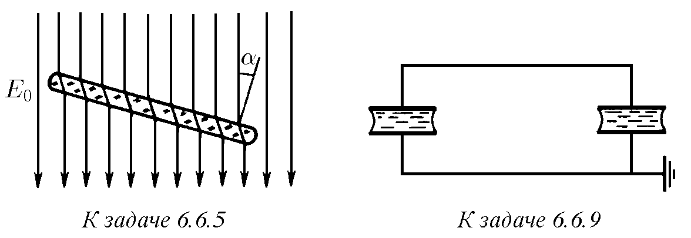
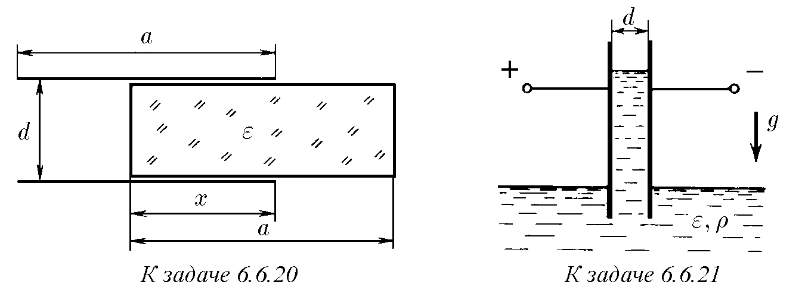

6.6.1. а. На какво се дължи намаляването на интензитета на електричното поле в веществото?
б. Какво е диелектрична проницаемост на веществото?
в. Как зависи диелектричната проницаемост на газа от неговото налягане?

6.6.2. Диелектричната проницаемост на хелия при температура 0 °C и налягане 1 атм е равна на 1,000074. Намерете диполния момент на хелиев атом в еднородно електрично поле с интензитет 300 В/см.

6.6.3. Налягането на наситените водни пари при 18 °C е равно на 2 · 10³ Па, а тяхната диелектрична проницаемост е 1,0078. От тези данни намерете средния диполен момент на водната молекула в електрично поле с интензитет 10³ В/м. В справочниците за диполния момент на водата се посочва стойност −0,61 · 10⁻²⁹ Кл · м. Как се обяснява разминаването в резултатите?

6.6.4. Две заредени паралелни равнини с повърхностна плътност на заряда ±σ са разположени на разстояние d една от друга и са разделени от подложка с дебелина h, чиято диелектрична проницаемост е ε. Намерете повърхностната плътност на индуцирания поляризационен заряд върху подложката, интензитета на електричното поле в пространството между плочите и потенциалната разлика между тях.

♦ 6.6.5. Плоча от диелектрик с диелектрична проницаемост ε е поставена в еднородно електрично поле така, че нейната нормала сключва ъгъл α с интензитета E₀. Намерете интензитета на полето вътре в плочата.

6.6.6. Колко пъти ще се промени капацитетът на кондензатор, ако пространството между неговите плочи се запълни с диелектрик с диелектрична проницаемост ε?

6.6.7. Потенциалната разлика на зареден и изключен от батерията кондензатор се е удвоила, когато запълващият го диелектрик е изтекъл. Определете диелектричната проницаемость на този диелектрик.

6.6.8. Кондензатор с капацитет C е свързан към източник на ток, който поддържа на плочите на кондензатора потенциална разлика V. Какъв заряд ще премине през източника при запълване на пространството между плочите с течност с диелектрична проницаемост ε?

♦ 6.6.9. Два еднакви кондензатора са запълнени с течен диелектрик с диелектрична проницаемост ε. Кондензаторите са свързани успоредно помежду си и са заредени до потенциална разлика V. Как ще се промени потенциалната разлика, ако от единия кондензатор изтече диелектрикът? Как ще се промени потенциалната разлика в батерия от n еднакви успоредно свързани кондензатора, заредена до потенциална разлика V, ако от единия кондензатор изтече диелектрикът?

6.6.10. Батерия от n последователно свързани еднакви кондензатора е заредена до потенциална разлика V. Кондензаторите са запълнени с течен диелектрик с диелектрична проницаемост ε. Как ще се промени потенциалната разлика, ако от k кондензатора изтече диелектрикът? Кондензаторите са изключени от източника на ток.

♦ 6.6.11. Пространството между плочите на плосък кондензатор е запълнено наполовина с диелектрик с диелектрична проницаемост ε₁ и наполовина с диелектрик с диелектрична проницаемост ε₂. Намерете капацитета на такъв кондензатор. Площта на всяка плоча е S, а разстоянието между тях е d.

♦ 6.6.12. Пространството между плочите на плосък кондензатор е запълнено с два слоя различни диелектрици с дебелини d₁ и d₂. Диелектричната проницаемост на диелектриците е ε₁ и ε₂. Площта на плочите е S. Намерете капацитета на кондензатора. Какъв заряд ще се индуцира на границата на раздела на диелектриците, ако върху плочите на кондензатора се разположи заряд ±q?

♦ 6.6.13. В плосък кондензатор с площ на плочите S₁ и разстояние между тях d₁ е поставена диелектрична пластинка с площ S₂ и дебелина d₂. Диелектричната проницаемост на пластинката е ε. Намерете капацитета на кондензатора.

6.6.14. Върху плочите на плосък кондензатор са разположени заряди ±q. Междината между плочите е запълнена с вещество, чиято диелектрична проницаемост се променя в перпендикулярно на плочите направление по закона ε = ε₀(1 + x/d)⁻¹, където x е разстоянието до положителната плоча, а d е разстоянието между плочите. Намерете обемната плътност на заряда като функция на x. Площта на плочите е S.

6.6.15. Електрофилтърът се състои от дълга метална тръба и нишка, насочена по оста ѝ. Между тях се създава потенциална разлика V. През тръбата се пропуска въздух с прах.
а. Към кой електрод — към нишката или към тръбата — се привличат прашинките?
б. На колко е равна силата, действаща върху прашинка с диелектрична проницаемост ε₂, ако силата, действаща върху прашинка със същия радиус, но с диелектрична проницаемост ε₁, е равна на F₁? Двете прашинки са еднакво отдалечени от нишката.
в. Как зависи силата на привличане от потенциалната разлика? От разстоянието до нишката?
г*. Колко пъти силата, действаща върху прашинка с радиус R, е по-голяма от силата, действаща върху прашинка с радиус r < R? Диелектричната проницаемост на прашинките е еднаква и те се намират на еднакво разстояние от нишката.

6.6.16. Далеч от точков заряд Q е разположена диелектрична пластинка с площ S, като линейните размери на пластинката са много по-малки от разстоянието R между нея и заряда. Равнината на пластинката е перпендикулярна на направлението към заряда. Дебелината на пластината е δ, а диелектричната проницаемост е ε. Намерете силата, с която пластинката се привлича към заряда.

6.6.17*. В еднородно електрично поле с интензитет E е внесена тънка пластинка с диелектрична проницаемост ε. Дебелината на пластинката е d, а нейната площ е S. Намерете момента на силите, действащ върху пластинката, ако нормалата към пластинката и направлението на полето сключват помежду си ъгъл α. Каква работа трябва да се извърши, за да се разположи пластинката перпендикулярно на полето?

6.6.18. Проводяща сфера с радиус r и заряд Q е обградена от слой диелектрик, чийто външен радиус е R. Диелектричната проницаемост на слоя е ε. Намерете повърхностната плътност на заряда върху вътрешната и външната повърхност на диелектричния слой. Начертайте интензитетните линии на електричното поле. Начертайте графика на зависимостта на интензитета и потенциала на полето от разстоянието до центъра на сферата.

6.6.19*. Метална сфера с радиус r и заряд Q е обградена от слой течен диелектрик с диелектрична проницаемост ε. Външният радиус на слоя диелектрик е R. Намерете налягането на диелектрика върху сферата.

♦ 6.6.20*. С каква сила се втегля диелектрична пластина в плосък кондензатор със заряд Q, когато тя влиза в пространството между плочите на дължина x? Диелектричната проницаемост на пластината е ε, а дебелината ѝ е малко по-малка от разстоянието между плочите d. Размерите на плочите, както и на пластината, са a × b.

♦ 6.6.21. В широк съд с течност се поставя вертикално плосък кондензатор така, че долната част на плочите му се потапя в течността. Кондензаторът е свързан към батерия, която поддържа на плочите му потенциална разлика V. Разстоянието между плочите е d, плътността на течността е ρ, а диелектричната проницаемост е ε. Течността е несвиваема. На каква височина ще се издигне течността? Пренебрегнете повърхностното напрежение.

♦ 6.6.22. Една от плочите на незареден кондензатор е направена от гъста мрежа и лежи върху повърхността на течност с плътност ρ и диелектрична проницаемост ε. Площта на всяка плоча е S. На каква височина ще се издигне нивото на течността в кондензатора, ако му се съобщи заряд Q?

6.6.23. Кондензатор с капацитет C без диелектрик има заряд q. Какво количество топлина ще се отдели в кондензатора, ако той се запълни с вещество с диелектрична проницаемост ε?

6.6.24. Кондензатор с капацитет C е свързан към батерия. Какво количество топлина ще се отдели в кондензатора, ако той се запълни с вещество с диелектрична проницаемост ε? Батерията поддържа на кондензатора постоянна потенциална разлика V.

6.6.25*. Кондензатор с капацитет C е свързан към източник на напрежение и е запълнен с вещество с диелектрична проницаемост ε₁. При поглъщане от това вещество на количество топлина W, то преминава в ново състояние с диелектрична проницаемост ε₂ > ε₁. Каква потенциална разлика трябва да се създаде на плочите на кондензатора, за да премине веществото от първото състояние във второто? Оценете при какъв интензитет на електричното поле в плосък кондензатор ще настъпи фазов преход лед — вода. Диелектричната проницаемост на леда е 3,1, а на водата — 88.

♦ 6.6.26. Кондензатор е запълнен с диелектрик и е зареден до потенциална разлика V. Плочите се съединяват една с друга за много кратко време. Когато потенциалната разлика е намаляла три пъти, плочите са били разединени. След това потенциалната разлика бавно нараства до 2/3 от първоначалната си стойност. Как може да се обясни този ефект? Намерете диелектричната проницаемост на веществото, запълващо кондензатора.

6.6.27. Кондензатор (виж задача 6.6.26), зареден до потенциална разлика V, е разреден чрез затваряне на ключ до нула за време, през което състоянието на поляризация на диелектрика не се е променило, а след това ключът е бил отворен.
а. Каква потенциална разлика ще се установи на кондензатора, ако диелектричната проницаемост на средата е ε?
б. Намерете с колко ще се промени температурата на диелектрика (ε = 81) при този процес. Специфичният топлинен капацитет на диелектрика е c = 4,18 Дж/(кг · К), неговата плътност е ρ = 1 · 10³ кг/м³, разстоянието между плочите на кондензатора е d = 1 мм, а потенциалната разлика е V = 300 В. Считайте, че диелектрикът не обменя топлина с околната среда.

6.6.28. Диелектричната проницаемост на аргона при температура 0 °C и налягане 1 атм е равна на 1,00056. Оценете радиуса на аргоновия атом, считайки, че зарядът на електроните е разпределен равномерно в обема на атома, а в центъра на атома се намира неговото ядро.

6.6.29. Намерете диполния момент на проводящо топче с радиус r, поставено в еднородно електрично поле с интензитет E. Използвайте решението на задача 6.2.14.

6.6.30. Среда е съставена от проводящи топчета с радиус r. Топчетата са разпределени равномерно в цялата среда. Техният брой в единица обем е n. Намерете диелектричната проницаемост на такава среда.