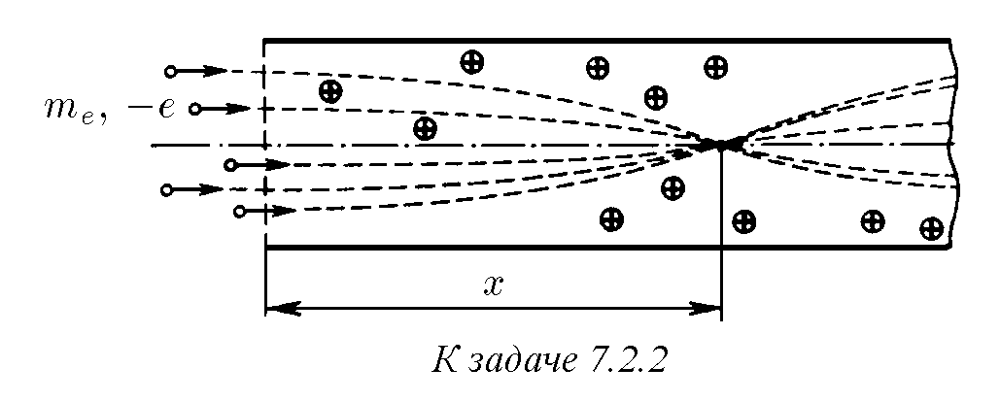
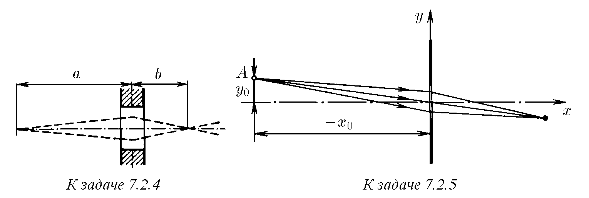
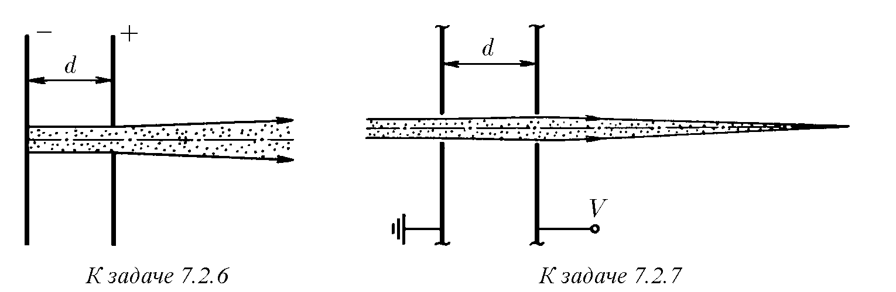
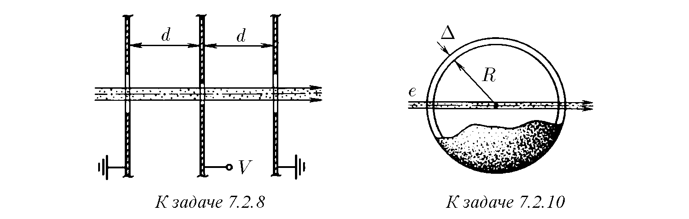
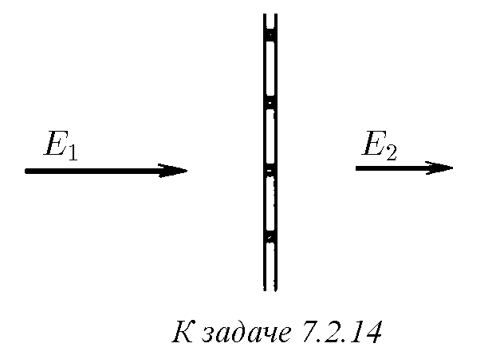

7.2.1. Паралелен сноп електрони, ускорени от потенциална разлика V₀, се фокусира върху детайл в случай, когато на електронната леща е подаден потенциал V. Как трябва да се промени потенциалът на лещата в случай, че енергията на електроните в снопа се увеличи два пъти?

♦ 7.2.2. Електронен сноп се фокусира от положителен обемен заряд на прав йонен сноп с кръгло сечение. На какво разстояние от входа в йонния сноп се фокусират електроните, ако тяхната скорост на входа е v, а плътността на заряда и дължината на йонния сноп са ρ и l?
175

7.2.3. Колко пъти ще се промени фокусното разстояние на дългофокусна тънка единична леща, ако: а) енергията на фокусираните частици се увеличи k пъти? б) напрежението на лещата се увеличи k пъти? При изчисляването на тънки единични лещи да се пренебрегне промяната на траекторията на частиците в областта на лещата, свързана с действието на полето на лещата върху частиците.

♦ 7.2.4. Изведете формулата за дългофокусна тънка леща
1/a + 1/b = 1/f,
където f е фокусното разстояние, a е разстоянието от източника на електрони до лещата, b е разстоянието от мястото, където се фокусират електроните, до лещата.

♦ 7.2.5. На какво разстояние от оста на лещата сноп електрони, излизащ от точка A с координати −x₀ и y₀, се фокусира от дългофокусна леща с фокусно разстояние f, разположена в началото на координатната система? y₀ << x₀, f.

♦ 7.2.6. За електрони, излъчвани от едната плоча на кондензатор, кръгъл отвор във втората плоча е единична леща, ако радиусът на отвора е много по-малък от разстоянието между плочите d.
а. Зависи ли фокусното разстояние на тази леща от потенциалната разлика между плочите?
б*. Определете фокусното разстояние на тази леща, като използвате формулата, дадена в задача 7.1.27а. Пренебрегнете началната скорост на електроните.

♦ 7.2.7*. Паралелен сноп протони, ускорени от потенциална разлика V₀, лети по оста на два малки кръгли съосни отвора в плочите на кондензатор. На какво разстояние от втората плоча ще се фокусира този сноп, ако потенциалът на втората плоча е V? Първата плоча е заземена. Разстоянието между плочите е d.

♦ 7.2.8*. Сложна леща се състои от три паралелни метални пластини, разположени на разстояние d една от друга, в които са направени малки кръгли отвори с обща ос. Крайните пластини са заземени, на централната пластина е подаден потенциал V. Определете фокусното разстояние на тази леща за електрони, ускорени от потенциал V₀ >> V.
176

7.2.9. Тънък паралелен сноп заредени частици, ускорени от потенциална разлика V₀, преминава през центъра на равномерно заредена сферична кухина. На какво разстояние ще се фокусира този сноп, ако потенциалът в центъра на сферата е V << V₀?

♦ 7.2.10. Къде ще се фокусира тънък паралелен сноп електрони, ускорени от потенциална разлика V₀, от електрично поле, създадено от две концентрични сфери с радиус R и R − ∆, ∆ << R? Външната сфера е заземена, потенциалът на вътрешната сфера е V << V₀, снопът преминава през центъра на сферите.

7.2.11*. Решете задача 7.2.10 в случая, когато сноп електрони, излъчвани от точка, разположена на разстояние L >> R от центъра на сферите, сключва малък ъгъл с нормалата към нейната повърхност.

7.2.12. Един електрод на плосък кондензатор е емитер на електрони, а другият се състои от паралелни жици, разстоянията между които са значително по-малки от разстоянието d между електродите. Потенциалната разлика между електродите е V. Определете разсейването на електроните, преминали през втория електрод, по „напречна“ енергия, ако разстоянието между жиците е a, а тяхната дебелина е b. Пренебрегнете началната скорост на електроните.

7.2.13. Определете потенциалната разлика между плочите на кондензатора, ако лентов сноп протони, перпендикулярен на плочите и преминал през два тесни паралелни процепа, се е фокусирал на разстояние l от втората плоча. Протоните са били ускорени от потенциална разлика V₀. Разстоянието между плочите на кондензатора е d. Първата плоча е заземена, l >> d.

♦ 7.2.14*. Докажете, че равномерно заредените нишки на мрежа с квадратни клетки фокусират паралелен сноп електрони, преминал през клетката, в точка, ако дебелината на нишките е много по-малка от размерите на клетката и снопът пада перпендикулярно на равнината на мрежата. На колко е равно фокусното разстояние на такава клетка, ако електричното поле далеч от равнината на мрежата е еднородно и отдясно е равно на E₁, а отляво на E₂, и енергията на електроните е равна на eV?