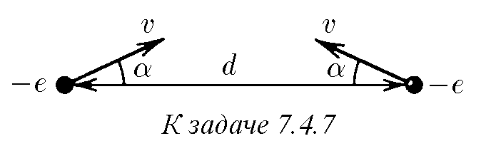
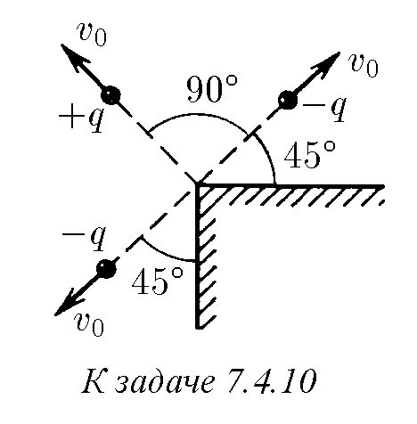
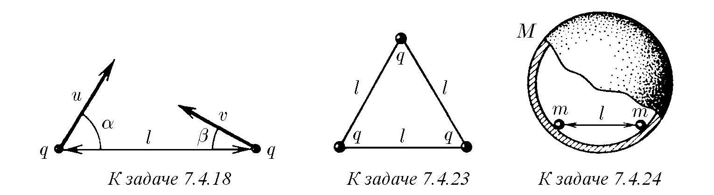
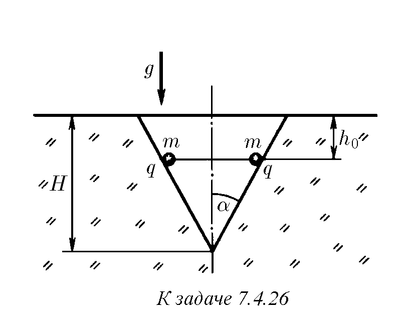
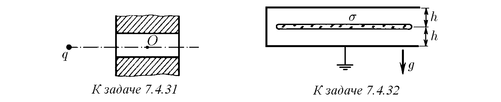
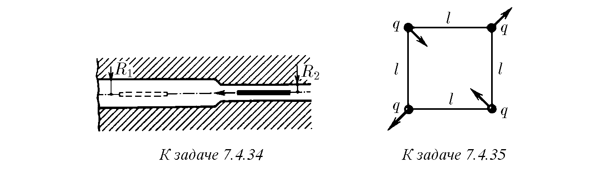
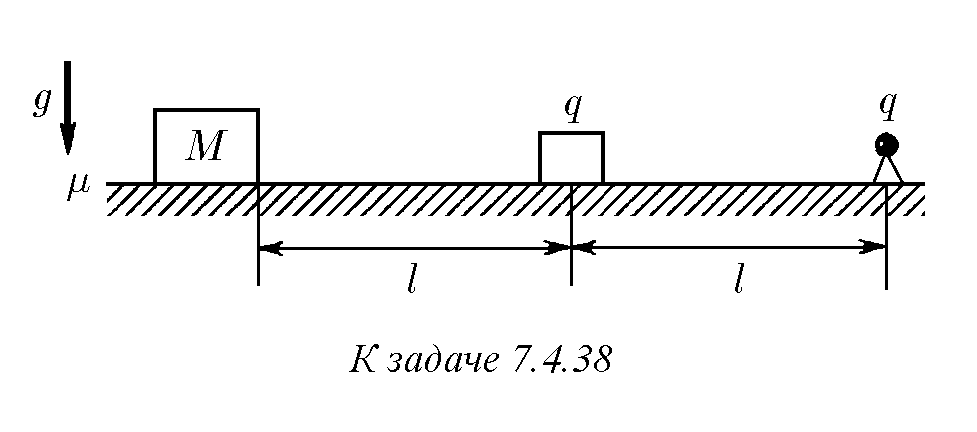

7.4.1. Колко ще бъде скоростта на два електрона на разстояние $\lambda r$ един от друг, ако те са започнали да се разлетяват, намирайки се на разстояние $r$ един от друг?

7.4.2. В ъглите на правилен квадрат със страна $a$ са поставени четири електрона. Под действие на електричните сили електроните се разлетяват. Определете техните скорости в безкрайността.

7.4.3*. В ъглите на правилен квадрат със страна $a$ по диагонал са поставени два протона и два позитрона. Оценете отношението на скоростите на протоните и позитроните в безкрайността. Масата на протона е 1840 пъти по-голяма от масата на позитрона, а зарядите са еднакви.

7.4.4. От безкрайността един срещу друг с еднаква скорост $v$ се движат два електрона. Определете минималното разстояние, на което те ще се доближат.

7.4.5. От голямо разстояние един срещу друг със скорости съответно $v_1$ и $v_2$ се движат два електрона. Определете минималното разстояние, на което те ще се доближат.

7.4.6. По посока към центъра на първоначално неподвижна заредена сфера от голямо разстояние се движи втора заредена сфера. Зарядите са разпределени по повърхността на сферите равномерно. Каква скорост трябва да притежава движещата се сфера, за да се сблъска с първата? Масата, зарядът и радиусът на първата сфера са $m_1, q_1, R_1$. Параметрите на втората сфера са $m_2, q_2, R_2$.

♦ 7.4.7. Скоростите на два електрона са равни на $v$, лежат в една равнина и при разстояние $d$ между електроните образуват ъгъл $\alpha$ с правата, свързваща електроните. На какво минимално разстояние ще се доближат електроните?

7.4.8*. Два електрона се намират на разстояние $r$ един от друг, като скоростта на единия от тях е нула, а скоростта на другия е насочена под остър ъгъл към линията, свързваща електроните. Какъв ще бъде ъгълът между скоростите на електроните, когато те отново се окажат на разстояние $r$ един от друг?

7.4.9*. От голямо разстояние към метална равнина се движи тяло с маса $m$, имащо заряд $q$. Определете скоростта на тялото в момента, когато то се намира на разстояние $d$ от равнината. Началната скорост на тялото е нула, размерите му са много по-малки от $d$.

♦ 7.4.10*. Скоростите на три заредени частици с маса $m$ са изобразени на фигурата. Разстоянието от всяка частица до ръба на метален двустенен ъгъл е $d$. Зарядите на първите две частици, летящи в противоположни посоки, са равни на $-q$, зарядът на третата частица е $q$. Определете скоростта на тези частици на голямо разстояние една от друга.

7.4.11. В един от моделите на йона $H_2^+$ електронът се движи по кръгова орбита, лежаща в равнината на симетрия на йона. Разстоянието между протоните е $R$. Намерете скоростта, с която се движи електронът по орбита с радиус $r$.

7.4.12. Около тежко ядро със заряд $Ze$ на разстояние $r$ се върти по кръгова орбита електрон. Каква минимална енергия трябва да се предаде на електрона, за да се откъсне от ядрото?

7.4.13*. Разстоянието между електрон и позитрон в позитроний е $r$. Каква минимална енергия трябва да се предаде на електрона, за да се разпадне позитроният?

7.4.14*. Две частици с маси $m$ и $M$ с противоположни заряди под влияние на електрично привличане се движат по окръжност. Скоростта на частицата с маса $m$ мигновено се увеличава $n$ пъти, без да се променя посоката ѝ. При какво минимално $n$ частиците след това ще се разлетят?

7.4.15*. Върху постоящ позитроний налита сноп от същите частици. Каква трябва да бъде минималната скорост на частиците в снопа, за да се случи понякога пълно „разрушаване“ на двата сблъскали се позитрония? Скоростта на орбиталното движение на електрона и позитрона в позитрония е $v$.

7.4.16. Възможно ли е безлъчисто захващане на електрон от свободен протон (образуване на водороден атом)?

7.4.17*. Върху постоящ протон налита от безкрайността друг протон със скорост $v$. Прицелен параметър $\rho$. Определете на какво разстояние ще се доближат те.

♦ 7.4.18*. Две еднакви частици със заряд $q$ и скорости $u$ и $v$, лежащи в една равнина и съставляващи съответно ъгли $\alpha$ и $\beta$ с линията, която ги свързва, се намират на разстояние $l$ една от друга. Определете масата на частиците, ако е известно, че минималното разстояние, на което те се доближават, е $r$.

7.4.19*. Два заряда са поставени на разстояние $l$ един от друг и са пуснати. След време $t_0$ разстоянието между зарядите се е удвоило. Същите тези заряди са поставени на разстояние $3l$ и са пуснати. След колко време разстоянието между зарядите ще се удвои?

7.4.20. Частица с маса $m$, имаща заряд $q$, се движи от голямо разстояние по посока към центъра на равномерно заредена незакрепена сфера. Радиусът на сферата е $R$, нейният заряд е $Q$, а масата ѝ е $M$. Каква скорост трябва да притежава частицата на голямо разстояние от сферата, за да прелети през нея през малки отвори? $qQ > 0$.

7.4.21. Частица с маса $m$, имаща заряд $q$, се приближава със скорост $v_0$ от голямо разстояние към заредено незакрепено колело (пръстен), движейки се по неговата ос. Радиусът на колелото е $R$, зарядът му е $Q$, масата му е $M$. Първоначално колелото е в покой. Колко ще бъде скоростта на частицата, когато тя преминава през центъра на колелото?

7.4.22*. Частица с маса $m$, имаща заряд $q$, се приближава от голямо разстояние към равномерно заредена незакрепена сфера (кълбо), движейки се към нейния център. Радиусът на сферата е $R$, зарядът ѝ е $Q$, масата ѝ е $M$. Първоначално сферата е в покой. Каква най-малка скорост трябва да има частицата на голямо разстояние от сферата, за да премине през нейния център?

♦ 7.4.23*. Три еднакви едноименно заредени топчета, имащи заряд $q$ и маса $m$, са свързани с безтегловни, неразтегливи и непроводящи нишки с дължина $l$. Една от нишките се прерязва. Определете максималната скорост на топчетата.

♦ 7.4.24. Вътре в гладка непроводяща сфера с маса $M$ и радиус $R$ се намират две еднакви мъниста с маса $m$, имащи заряд $q$. Разстоянието между мънистата е $l$. Намерете максималната скорост на сферата, ако мънистата бъдат освободени.

7.4.25. Върху хоризонтална равнина на разстояние $R$ едно от друго са поставени две тела с маса $m$, имащи заряд $Q$. В резултат на електричното взаимодействие телата започват да се движат по равнината. Какво разстояние ще измине всяко от телата, ако коефициентът на триене на телата с равнината е $\mu$? Каква максимална скорост ще придобият телата в процеса на движение?

♦ 7.4.26*. В конична ямка с дълбочина $H$ и ъгъл при върха $\alpha$, на $h_0$ под равнината на основата на ямката се намират две малки заредени тела, свързани с нишка. Нишката се прерязва и телата първо се плъзгат нагоре по стената на ямката, а след това излитат от нея. Коефициентът на триене на телата със стената на ямката е $\mu$, масата и зарядът на всяко тяло са $m$ и $q$. На каква височина ще се издигнат телата, излетели от ямката?

7.4.27. Две заредени сфери с маса $m$, имащи заряд $q$, се свързват с недеформирана пружина с дължина $l$ и се пускат. След известно време възникналите трептения на сферите поради триенето в пружината са спрели и сферите са се оказали на разстояние $2l$ една от друга. Определете количеството топлина, което се е отделило в пружината.

7.4.28. При трептене на две заредени топчета, свързани с пружина, дължината на пружината се променя от $l_1$ до $l_2$. Дължината на недеформираната пружина е $l_0$, зарядът на всяко топче е $q$. Определете коравината на пружината.

7.4.29. Сфера с маса $m$, имаща заряд $q$, в резултат на експлозия се разпада на голям брой еднакви отломки, чиято скорост в момента на експлозията е $v$ и е насочена по радиуса на сферата. Определете максималната скорост на отломките.

7.4.30. Две еднакви живачни капки с радиус $R$ летят една срещу друга, като на голямо разстояние имат скорост $v$. Настъпва сблъсък, в резултат на който капките се сливат в една. Определете количеството на отделената при сблъсъка топлина, ако: а) капките имат разноименни заряди $Q$ и $-Q$; б) едната капка има заряд $-q$, а другата $Q$. Плътността на живака е $\rho$, повърхностното напрежение е $\sigma$.

♦ 7.4.31. На оста на цилиндричен отвор в метална плоча на известно разстояние от последната се намира точков заряд $q$. Зарядът се пуска. Опишете качествено неговото движение.

♦ 7.4.32*. Между две заземени паралелни хоризонтални метални равнини на еднакво разстояние $h$ от тях се намира заредена тънка пластинка. Площта на пластината е $S$, масата ѝ е $m$, повърхностната плътност на заряда е $\sigma$. Каква минимална скорост трябва да се предаде на тази пластина, за да долети тя до горната равнина? Разстоянието до равнините $h$ е много по-малко от линейните размери на пластината.

7.4.33. Вътре в закрепена проводяща незаредена сфера с радиус $R$ има сферична кухина с радиус $r$, чийъо център съвпада с центъра на сферата. Каква минимална скорост е необходимо да се предаде на намираща се в центъра частица с маса $m$, имаща заряд $q$, за да може тя, преминавайки през тънък канал в сферата, да отиде на голямо разстояние от нея?

♦ 7.4.34*. По оста на дълъг цилиндричен канал, изрязан в проводник, прелита тънък прът, чиято линейна плътност на заряда е $\rho$. Дължината на пръта $l$ е много по-голяма от радиусите $R_1$ и $R_2$. Далеч от областта на стеснение на канала вдясно скоростта на пръта е $v_0$. Намерете скоростта на пръта далеч от областта на стеснение на канала вляво. Масата на пръта е $m$.

♦ 7.4.35*. На колко е равен периодът на малките трептения на четири заредени тела, свързани с еднакви нишки с дължина $l$ и движещи се така, както е показано на фигурата? Масата и зарядът на всяко тяло са $m$ и $q$.

7.4.36*. Плазмата се състои от електрони и тежки положително заредени йони. Броят на електроните и йоните в единица обем е еднакъв и равен на $n$. В слой плазма с дебелина $h$ на всички електрони е предадена еднаква скорост $v$ в посока, перпендикулярна на слоя. След какво време основната маса от електрони ще спре под действие на електричните сили, ако: а) $v \ll h e \sqrt{n/m_e}$; б) $v \gg h e \sqrt{n/m_e}$, където $e$ и $m_e$ са зарядът и масата на електрона? Оценете и в двата случая честотата на трептене на електроните.

7.4.37*. Три заредени тела с еднаква маса, разлетявайки се, образуват винаги равнобедрен триъгълник с ъгъл $\alpha$ при върха. Колко пъти зарядът на тялото, разположено във върха на триъгълника, е по-голям от заряда на тялото в неговата основа?

♦ 7.4.38*. Тяло със заряд $q$ се държи върху маса. Вдясно от него на разстояние $l$ е закрепен едноименен точков заряд $q$. Вляво на същото разстояние стои в покой трупче с маса $M$, което има коефициент на триене с масата $\mu$. Тялото се пуска и то започва да се плъзга без триене по масата, удряйки се еластично в трупчето, без да му предава при ударите своя заряд. На какво разстояние ще се измести трупчето в резултат на всички удари на тялото?