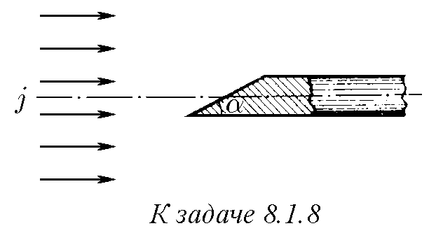
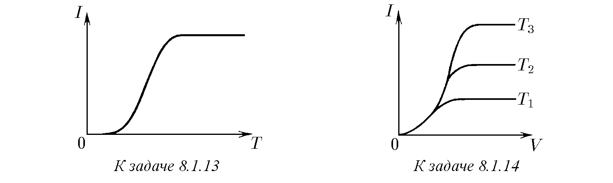
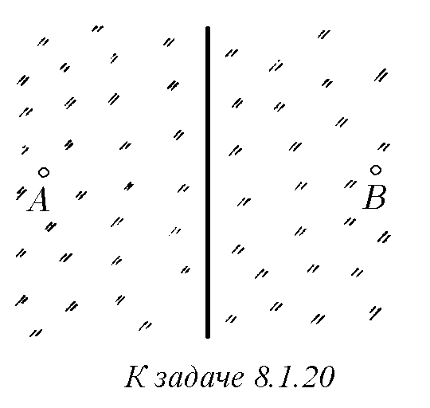

8.1.1. а. В синхротрон електроните се движат по приблизително кръгова орбита с дължина $l = 240$ м. По време на цикъла на ускорение в орбитата се намират приблизително $n = 10^{11}$ електрона, като тяхната скорост е практически равна на скоростта на светлината. На колко е равен токът?
б. Определете тока, създаван от електрон, движещ се по орбита с радиус $r = 0,5 \cdot 10^{-10}$ м в водороден атом.

8.1.2. В проводник с дължина $l$ пълният движещ се заряд, равномерно разпределен по проводника, е равен на $q$. Определете средната скорост на движение на зарядите, ако токът е $I$.

8.1.3. В генератор на Ван де Грааф гумирана лента с ширина $a = 30$ см се движи със скорост $v = 20$ м/с. Около долната ролка на лентата се съобщава толкова голям заряд, че от двете страни на лентата той създава поле с интензитет $E = 1,2 \cdot 10^6$ В/м. На колко е равен токът?

8.1.4. Токът в разрежен газ предизвиква движение на йони. Докажете, че сблъсъкът между еднакви йони не променя тока.

8.1.5. Ако се предположи, че броят на електроните на проводимост в метала е равен на броя на атомите, каква ще бъде средната скорост на електроните на проводимост в сребърен проводник с диаметър 1 мм, по който тече ток 30 А?

8.1.6. Лист фолио, покрит с $\beta$-радиоактивно вещество, излъчва от единица площ $\nu$ електрона за единица време. Тяхната скорост е $v$, като всяка посока на скоростта е равновероятна. Намерете плътността на тока. Защо тя не зависи от $v$?

8.1.7. В струя от $\beta$-радиоактивни прашинки, имащи скорост $u$, броят на електроните в единица обем е $n_e$. Скоростта на електрона спрямо излъчилата го прашинка е $v$, а всички посоки на скоростите са равновероятни. Определете плътността на електронния ток в струята.

♦ 8.1.8. В рентгенова тръба сноп електрони с плътност на тока $j = 0,2$ А/мм$^2$ попада върху скосения под ъгъл $30^\circ$ челен край на метален прът. Площта на този край е $s = 10^{-4}$ м$^2$, а самият прът е разположен по оста на снопа. Определете тока в пръта.
184

8.1.9. В протонен сноп с плътност на тока $j = 1$ мкА/см$^2$ е поставена метална сфера с радиус $r = 10$ см. Определете времето, за което сферата ще се зареди до потенциал $V = 220$ В. Пренебрегнете действието на полето на сферата върху снопа.

8.1.10. Плътността на тока в сноп електрони е $j$, а скоростта на електроните е $v$. Определете плътността на заряда в снопа.

8.1.11. В електронен сноп с кръгло сечение и начален радиус $r = 3$ см скоростта на електроните е $v = 10^8$ м/с при пълен ток в снопа $I = 100$ А. Оценете началния интензитет на електрическото поле на повърхността на снопа и разстоянието, на което радиусът на снопа под действие на собственото му електрическо поле ще се увеличи двойно.

8.1.12*. Между две паралелни мрежи е създадено задържащо електрическо поле с интензитет $E$. По нормалата към предната мрежа пада широк сноп електрони с плътност на заряда $\rho_0$ и скорост $v_0$. Като пренебрегнете взаимодействието на самите електрони, намерете разпределението на плътността на заряда между мрежите в случай, че: а) скоростта на електроните е толкова голяма, че те преминават през мрежите и не се връщат; б) електроните се отразяват от полето. От какви стойности на $\rho_0$ във втория случай трябва да се отчита полето на заряда между мрежите?

♦ 8.1.13. Във вакуумен диод има два електрода: катод, от който „се изпаряват“ електрони (той специално се нагрява), и анод, върху който попадат излетелите от катода електрони. Обяснете защо диодът може да се използва като изправител. На фигурата е показано как при постоянно напрежение между анода и катода токът в анодната верига зависи от температурата на катода. Обяснете качествено тази зависимост.

♦ 8.1.14. На фигурата са дадени три графики на зависимостта на анодния ток от напрежението на електродите на диода, снети при различни стойности на температурата на катода. Коя крива съответства на нискотемпературен катод и коя на високотемпературен?

8.1.15. Когато токът в диода е далеч от насищане, близо до повърхността на катода се образува тънък слой електрони, от който повечето електрони се връщат към катода, привличани от него, а част от тях дифундират в противоположна посока и се увличат от полето към анода. Защо на външната граница на този слой полето може да се счита за нулево?

8.1.16*. Катодът и анодът във вакуумен диод са две паралелни метални пластини с разстояние $d = 0,5$ см между тях. Площта на всяка пластина е $S = 10$ см$^2$. При напрежение $V = 5000$ В между катода и анода тече ток $I = 1$ А. Считайки електрическото поле между пластините за еднородно, определете плътността на заряда в зависимост от разстоянието до катода. Приемете началната скорост на електроните за нула. Може ли в разглеждания случай да се пренебрегне действието на пространствения заряд върху електроните?

8.1.17*. За отчитане на влиянието на пространствения заряд върху работата на плосък диод с междуелектродно разстояние $d$ трябва да се установи зависимостта на плътността
185

на заряда $\rho$, потенциала $\phi$ и скоростта на електроните $v$ от разстоянието до катода $x$. Скоростта на електроните и интензитетът на полето при катода при токове, далеч от насищане, могат да се считат за нулеви. В случая, когато катодът е заземен, потенциалът може да се представи във вида $\phi = V (x/d)^n$. Определете оттук $\rho(x)$ и $v(x)$, а след това, като използвате условието за стационарност на тока, намерете показателя $n$. Получете точни изрази за плътността на тока и тока през диода при дадено напрежение $V$. Площта на електродите е $S$.

8.1.18*. Анодът и катодът на диода имат произволна форма. Нека при определено напрежение на диода в режим, далеч от насищане, между електродите се установи пространствен заряд с плътност $\rho(x, y, z)$. Колко пъти ще се увеличи плътността на този заряд, ако напрежението на диода се увеличи $n$ пъти? Колко пъти ще се увеличи токът през диода?

8.1.19. Праволинеен проводник е заровен дълбоко в еднороден почвен слой. Токът на утечка от единица дължина на проводника е $i$. Определете плътността на тока на разстояние $r$ от проводника. Дължината на проводника е много по-голяма от $r$.

♦ 8.1.20. а. Към точка A от среда се подава ток $I$, а от точка B се отвежда ток $I$. Считайки, че всяка точка от средата независимо от останалите точки създава стационарно сферично-симетрично поле на тока, определете повърхностната плътност на тока в равнината на симетрия на точките A и B. Какъв е пълният ток през тази равнина? Как ще се измени решението, ако и към точка B се подава ток $I$?
б*. Определете разпределението на плътността на тока по повърхността на почвата, ако на дълбочина $h$ от повърхността се намира точков източник с ток $I$.

8.1.21*. Паралелно на повърхността на идеален проводник на разстояние $l$ от нея се движи със скорост $v$ точков заряд $q$. Определете на разстояние $r$ от този заряд линейната плътност на „индуцирания“ повърхностен ток в проводника; $r > l$.