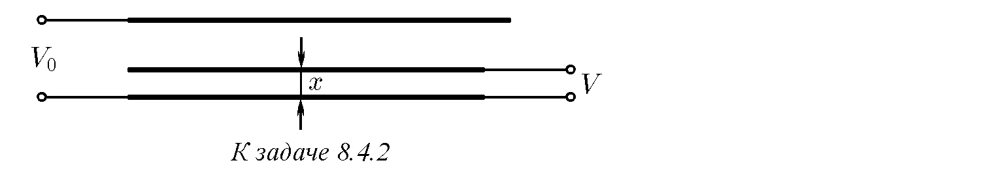
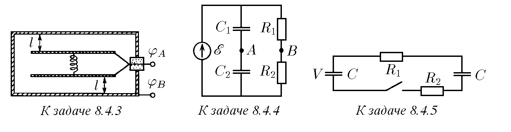
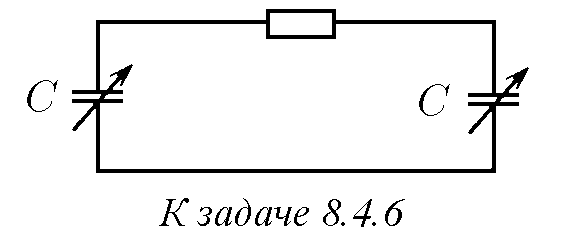
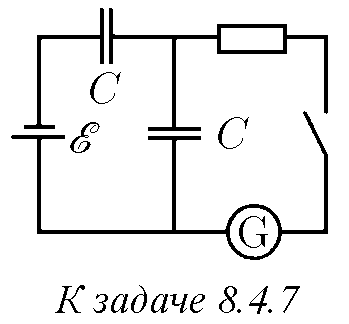
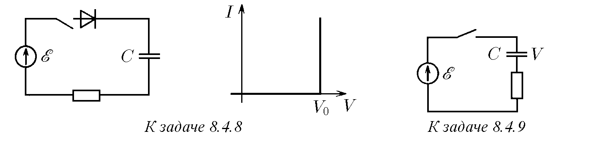
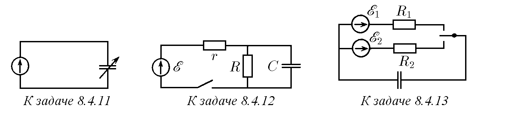
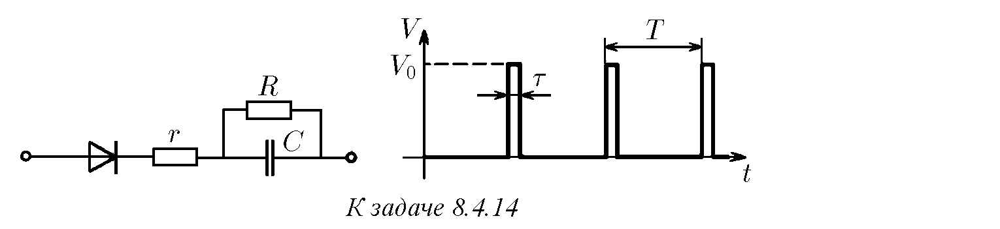
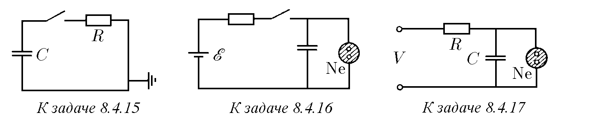
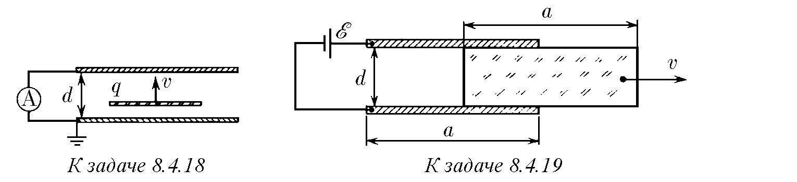

♦ 8.4.1. Схемите на вериги за постоянен ток с кондензатори са дадени на фигурата.
а. Определете заряда на кондензатор с капацитет 4 мкФ в стационарен режим.
б. На колко е равно напрежението между точките A и B в стационарен режим?
Какво ще отчете волтметър с вътрешно съпротивление 5 kΩ, ако бъде свързан към точките A и B?
в. Определете стационарното напрежение на всички кондензатори, ако всички съпротивления са еднакви.

♦ 8.4.2. Към фиксираните външни плочи е свързан източник на еталонно напрежение $V_0$. Измерваното напрежение $V$ се подава на долната външна плоча и подвижната вътрешна, която има същата площ като външните плочи. Подвижната плоча се премества в луфта, докато действащата върху нея електрическа сила стане нула, и се измерва разстоянието $x$ от нея до долната външна плоча. Намерете $V$, ако разстоянието между външните плочи е $l$, а размерите на плочите са много по-големи от това разстояние. Как да се промени схемата на свързване, за да се измерват напрежения $V > V_0$?

♦ 8.4.3. За измерване на напрежение се използват два типа волтметри: електромагнитни, измерващи напрежението по тока, преминаващ през рамката на прибора, и електростатични, чиято груба схема е дадена на фигурата. През изолираща тапа към две успоредни плочи е свързан проводник. Плочите се държат на място от пружина с коравина $k$. Потенциалът на проводимата кутия е $\phi_B$. Определете потенциала $\phi_A$, ако разтягането на пружината е равно на $x$. В неразтегнато състояние на пружината разстоянието от плочите до стените на кутията е $l$; площта на плочите е $S \gg l^2, x^2$.

♦ 8.4.4. Определете потенциалната разлика между точките A и B. С какъв волтметър трябва да се измери тя? Какви заряди ще има върху кондензаторите при присъединяване на електромагнитен волтметър? Защо електромагнитният волтметър е толкова по-добър, колкото по-голямо е неговото вътрешно съпротивление, а електростатичният волтметър — колкото по-малък е неговият капацитет?

♦ 8.4.5*. Намерете количеството топлина, отделено във всяко съпротивление след затваряне на ключа. Единият кондензатор първоначално е бил зареден до напрежение $V$, а вторият не е бил зареден.

♦ 8.4.6*. Намерете количеството топлина, отделено в съпротивлението, ако при последователна промяна на капацитета на кондензаторите от $C$ до $C/2$ се извършва работа $A$. Първоначалният заряд на всеки кондензатор е $q$.

♦ 8.4.7. Какъв заряд ще протече през галванометъра след затваряне на ключа? Какво количество топлина ще се отдели в съпротивлението?

♦ 8.4.8. Диодът има волт-амперна характеристика, изобразена на фигурата. При напрежение $V_0$ диодът се отваря. Кондензаторът първоначално не е зареден. Какво количество топлина ще се отдели в съпротивлението след затваряне на ключа?

♦ 8.4.9. Какво количество химическа енергия се запасява в акумулатора след затваряне на ключа в електрическата верига, изобразена на фигурата? Какво количество топлина се отделя при това?

8.4.10. Батерия с ЕДС $E$ се състои от $n$ последователно свързани еднакви елемента. Как трябва да се зарежда кондензатор с капацитет $C$, така че загубите да съставляват възможно най-малка част от запасената енергия? Каква е тази част?

♦ 8.4.11*. Началните капацитет и заряд на кондензатора са $C$ и $q$. Капацитетът на кондензатора започва да се променя във времето така, че токът във веригата остава постоянен и равен на $I$. Изчислете мощността, консумирана от генератора, и я сравнете с мощността, поглъщана от кондензатора. Защо сравняваните величини са различни?

♦ 8.4.12. Във веригата тече постоянен ток. Ключът се отваря. След колко време зарядът на кондензатора ще се промени с 1/1000 от първоначалната стойност?

♦ 8.4.13*. Ключът се затваря последователно с всеки от контактите за много малки еднакви интервали от време. Промяната на заряда на кондензатора, случваща се по време на всяко включване, е много малка. Какъв заряд ще има върху кондензатора след голям брой превключвания? Определете заряда на кондензатора в случая, когато времето, през което е затворена първата верига, е $k$ пъти по-малко от времето, през което е затворена втората верига.

♦ 8.4.14*. На входа на схемата се подават периодично повтарящи се правоъгълни импулси напрежение $V_0$. Продължителността на импулса е $\tau$, периодът на повторение е $T$. Импулсите се подават през диод, който може да се счита за идеален ключ. Определете установеното напрежение върху кондензатора, ако за всеки период напрежението върху него се променя много малко.

♦ 8.4.15*. Кондензатор с капацитет $C$, зареден до напрежение $V_0$, след затваряне на ключа се разрежда през съпротивление $R$. Как е свързана скоростта на промяна на напрежението върху кондензатора $dV/dt$ с напрежението върху него? На колко са равни напрежението върху кондензатора и токът във веригата след време $\tau$ след затваряне на ключа?

♦ 8.4.16. Включването на неонова лампа се осъществява с помощта на схемата, показана на фигурата. След затваряне на ключа кондензаторът започва да се зарежда. Когато напрежението върху кондензатора достигне определена стойност $V$, лампата ще светне. Минималното напрежение на лампата, при което тя още свети, е 80 V; при това токът през лампата е 1 mA. ЕДС на батерията е 120 V, 80 V < $V$ < 120 V. При какво съпротивление лампата ще свети постоянно (няма да изгасва)?

♦ 8.4.17*. Как зависи честотата на генератора, изобразен на фигурата, от напрежението $V$? Неоновата лампа светва при напрежение $V_1$ и изгасва при напрежение $V_0 < V_1$. Да се пренебрегне съпротивлението на светещата лампа.

♦ 8.4.18. а. Между плочите на кондензатор с постоянна скорост $v$ се движи равномерно заредена тънка пластина, чийто заряд е $q$. Определете тока във веригата, ако кондензаторът е съединен накъсо, а разстоянието между плочите е $d$.
б. Ще се промени ли резултатът, ако вътре в кондензатора, перпендикулярно на плочите, със скорост $v$ се движи точкова частица със заряд $q$?

♦ 8.4.19. Между обкладките на плосък кондензатор с размери $a \times a$ се намира плоска пластина със същия размер, запълваща целия обем между тях. Диелектричната проницаемост на пластината е $\varepsilon$, нейната дебелина е $d$. Между обкладките се поддържа постоянно напрежение $E$. Какъв ток тече във веригата на кондензатора, ако пластината се изважда от него с постоянна скорост $v$, насочена по протежение на една от страните на обкладките?

8.4.20. При положително напрежение $V$ на диода, токът през него е $I = \alpha V^2$; при отрицателно напрежение токът е нула. Намерете тока във веригата, ако този диод е свързан чрез съпротивление $R$ към батерия с ЕДС $E$.

♦ 8.4.21. Диод с волт-амперна характеристика, изобразена на фигурата, е свързан към батерия с ЕДС 6 V през съпротивление 1,5 kΩ. Определете тока във веригата. При какво съпротивление диодът спира да работи в линейния участък на характеристиката?