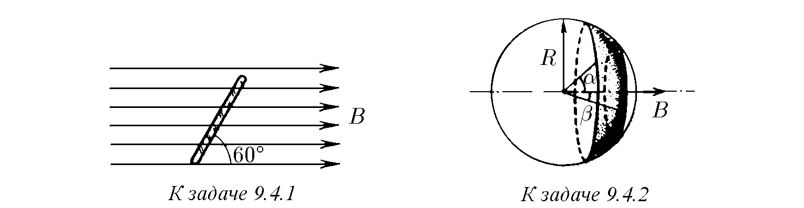
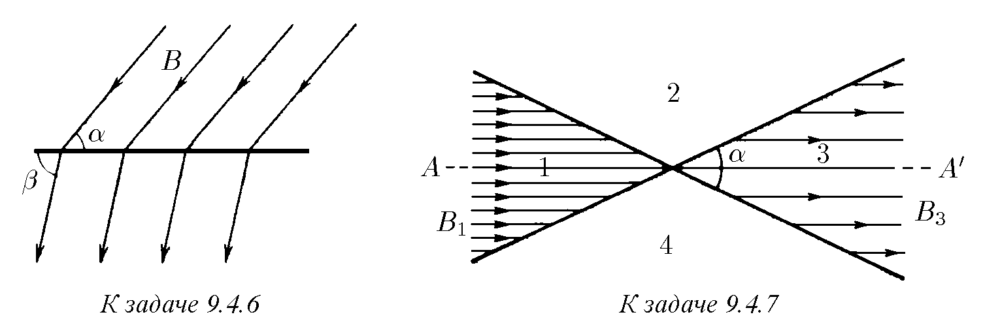
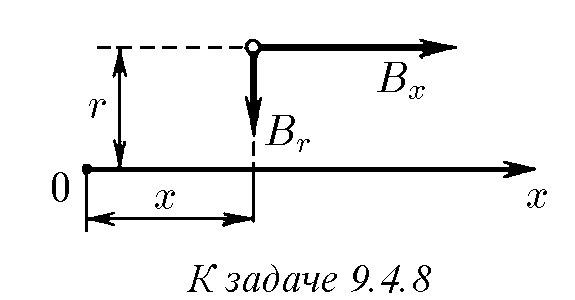

♦ 9.4.1. Индукцията на еднородно магнитно поле е $B$.
а. На колко е равен магнитният поток през квадрат със страна $a$, чиято равнина е разположена под ъгъл $60^\circ$ към посоката на магнитното поле?
б. На колко е равен магнитният поток през плоска повърхност с площ $S$, която е разположена под ъгъл $\alpha$ към посоката на магнитното поле?

♦ 9.4.2. Определете магнитния поток през отделената на фигурата част от сфера с радиус $R$. Индукцията на магнитното поле $B$ е насочена по оста на симетрия на тази част.

9.4.3. Покажете, че магнитният поток, създаван от равнина с линейна плътност на тока $i$, през всяка затворена повърхност е равен на нула.

9.4.4*. Докажете, че магнитният поток, създаван от елемент на тока, през всяка затворена повърхност е равен на нула.

9.4.5. Плоска хоризонтална граница разделя пространството на две части. В долната част индукцията на магнитното поле е нула. Докажете, че еднородното поле в близост до повърхността в горната част е насочено паралелно на нея.

♦ 9.4.6. Индукцията на магнитното поле $B$, преминавайки през плоска повърхност, променя ъгъла си на наклон към нея от $\alpha$ на $\beta$. Колко пъти ще се промени индукцията на полето? На колко е равна линейната плътност на тока върху повърхността?

♦ 9.4.7*. Равнини, пресичащи се под ъгъл $\alpha$, разделят пространството на четири области. Магнитното поле във всяка област е еднородно. В области 1 и 3 индукцията на полето е паралелна на равнината на симетрия $AA_0$, насочена е в една посока и е съответно $B_1$ и $B_3$. Определете индукцията на полето в области 2 и 4.

♦ 9.4.8. а. Съставната на индукцията на аксиално-симетрично магнитно поле, насочена по оста на симетрия на полето, зависи линейно от $x$: $B_x = B_0 x/x_0$, където $x_0$ и $B_0$ са константи. Определете зависимостта на радиалната съставна на индукцията на полето от разстоянието до оста. Как зависи ъгълът на наклон на полето към неговата ос на симетрия от $x$ и $r$? Начертайте индукционните линии на това поле.
б. Съставната на индукцията на магнитното поле в предходната задача се променя по оста по закона $B = B_0 (x/x_0)^n$. Определете радиалната съставна на индукцията на полето. Как се определя $B_r$ в общия случай, когато $B_x = B_0 f(x)$?

211

9.4.9. Съставната на индукцията на магнитното поле по оста на безкраен цилиндър с радиус $R$ се променя като $B_0 x/x_0$ вътре в цилиндъра, а отвън тази съставна е равна на нула. Как извън цилиндъра зависи радиалната съставна на индукцията от разстоянието до неговата ос?

9.4.10*. а. Определете магнитния поток през повърхността на полубезкраен цилиндър, по който циркулира напречен ток с линейна плътност $i$. Радиусът на цилиндъра е $R$.
б. С каква сила се привличат половините на дълъг соленоид с ток $I$? Радиусът на соленоида е $R$, броят на навивките на единица дължина на соленоида е $n$.

9.4.11. Два дълги пръта, намагнитени в надлъжно направление, са се притеглили един към друг със своите чела. За да се откъснат един от друг, трябва да се приложи в аксиално направление сила $F$. Сечението на прътите е еднакво, площта на сечението е $S$. Определете индукцията на магнитното поле на мястото на съединяване на прътите.

9.4.12. В нееднородно магнитно поле се намира соленоид с ток $I$. Броят на навивките на единица дължина на соленоида е $n$. Магнитният поток, влизащ и излизащ през челата на соленоида, е съответно $\Phi_1$ и $\Phi_2$. Определете силата, действаща на соленоида по неговата ос.

9.4.13. Взаимна индуктивност на два контура се нарича коефициентът на пропорционалност между тока в единия от контурите и създавания от него магнитен поток, преминаващ през втория контур. Определете взаимната индуктивност: а) на два кръгови контура с радиуси $r$ и $R$, разположени на една ос на симетрия на разстояние един от друг $l \gg r, R$; б) на дълъг соленоид с радиус $r$, съдържащ $n$ навивки на единица дължина, и кръгов контур, обхващащ този соленоид.