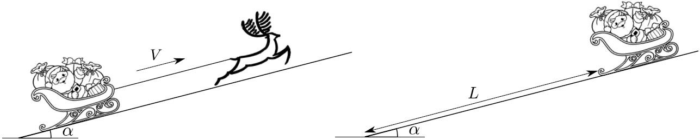
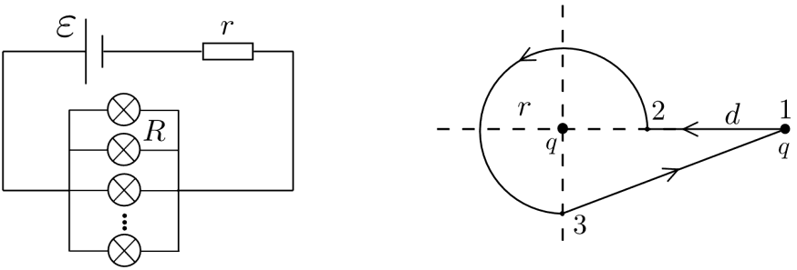
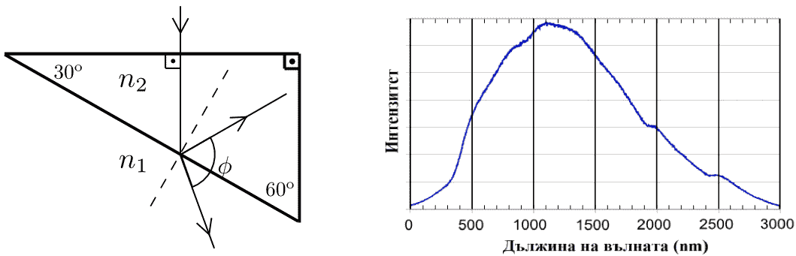

Задача 1. Механика

 Фиг. 1 а Фиг. 1 б
Елен тегли шейна по наклонена равнина с постоянна скорост V (фиг. 1 а). Равнината сключва
ъгъл $\alpha$ с хоризонта, масата на елена е M, a общата маса на шейната e m. Приемете, че
триенето между шейната и равнината е пренебрежимо. Земното ускорение е g. Намерете:

а) силата на опън T на въжето;

б) Работата А, която извършва еленът, за да измине разстояние L по равнината.

В даден момент, когато долният край на шейната се намира на разстояние L от основата на
наклонената равнина (фиг. 1 б), въжето се къса. Като отчетете, че шейната продължава да се
движи, намерете:

в) Времето $\tau$ , за което долният край на шейната достига до основата на наклонената
равнина, както и скоростта на шейната V2 в този момент.

Задача 2. Електричество

 Фиг. 2 а Фиг. 2 б
 
Част 1

От батерия с електродвижещо напрежение $\varepsilon$ и вътрешно съпротивление r е подадено
напрежение на N на брой успоредно свързани крушки (фиг. 2 а). Всяка крушка има
фиксирано съпротивление R, което не зависи от преминаващия през крушката ток. Намерете:

а) общата мощност на тези N на брой крушки;

б) При каква стойност на N тази мощност е максимална, ако r = R / 5 .
Упътване: изразът x / ( x + 1)2 има максимална стойност при x = 1 .

Част 2

в) На фиг. 2 б са изобразени два точкови заряда с големина q. Единият заряд е закрепен
неподвижно в пространството, а другият се движи от външна сила в полето на първия по
траектория, указана на фигурата. В началото подвижният заряд е в точка 1, след което той
бива преместван последователно в точки 2, 3 и накрая се връща в точка 1. Участъкът 1-2 е
отсечка с дължина d, 2-3 е част от окръжност с радиус r и ъгъл 270о , а 3-1 е отново отсечка.
Намерете работата, която извършва външната сила в трите участъка: 1-2, 2-3, 3-1, при
условие, че външната сила движи заряда с постоянна по големина скорост.

Упътване: Потенциалната енергия на премествания заряд се дава с израза W = kq2 / R ,
където R е разстоянието между зарядите.

Задача 3. Оптика

Част 1

Лазерен лъч пада върху стъклена призма с форма на правоъгълен триъгълник (фиг. 3 а).
Показателите на пречупване на околната среда и на стъклото са съответно n1 и n2 . Намерете:

а) ъгъла $\varphi$ от фиг. 3 а, изразен чрез ъгъла на падане $\alpha$ и ъгъла на пречупване $\beta$ ;

б) минималната стойност на $\varphi$ и отношението n2 / n1 , при което тази стойност се наблюдава;

в) отношението n2 / n1 , за което $\varphi$ = 90о .

Част 2

На фиг. 3 б е показан спектърът на крушка с нажежаема жичка. Определете:

г) температурата Т на жичката;

д) площта S на излъчващата повърхност на жичката, ако излъчваната мощност е 15 W.

Упътване: Жичката излъчва като абсолютно черно тяло;
 константа на Вин - b = 2.898 mm.K,
 константа на Стефан-Болцман - $\sigma$ = 5.67 10-8 W/ m2 K 4

 Всяка задача се оценява максимално с 10 точки!
