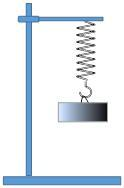
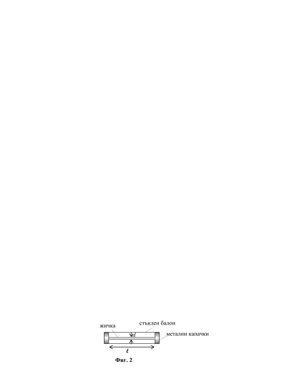

**Задача 1. Вертикално трептене**

 На вертикално висяща пружина с коефициент на еластичност
k = 40 N/m е окачена теглилка с маса m = 100 g (фиг. 1). Приемете, че
земното ускорение е g = 10 m/s2. В началния момент теглилката е
неподвижна, а пружината не е деформирана. Теглилката е оставена да
трепти свободно във вертикално направление.

а) Пресметнете периода T и честотата $\nu$, с които трепти теглилката.

 (2 точки)

б) Определете амплитудата A на трептенето. (2 точки) Фиг. 1

в) Намерете максималното разтягане $\Delta$lmax на пружината по време на трептенето. Колко е
ускорението a на теглилката, когато пружината е максимално разтегната? (3 точки)

г) Колко време t, след като теглилката е пусната, тя достига максимална скорост? Колко е
големината vmax на максималната скорост? (3 точки)

**Задача 2. Стопяем предпазител**

 Електрическите предпазители (бушони) служат за прекъсване на дадена
електрическа верига, когато токът във веригата достигне определена максимална стойност
Imax. На фиг. 2 е дадена принципна схема на стопяем електрически предпазител. Той се
състои от тънка медна жичка с дължина l = 2 cm и с диаметър d = 0,02 mm, която се
намира в херметично затворен стъклен балон. Балонът е изпълнен с разреден инертен газ
(аргон), с цел да се предпази жичката от окисление при висока температура.
Предпазителят е затворен с метални капачки, посредством които се свързва във веригата.
Диаметърът на жичката е подбран по такъв начин, че когато токът е равен на Imax, жичката
се разтапя.

Основни данни:
 Температура на топене на медта: t = 1085$^\circ$C;
 Специфично съпротивление на медта при температура t0 = 20$^\circ$C: $\rho_0$ = 1,68.10-8 $\Omega$.m;
 Атмосферно налягане: pA = 1,01.105 Pa;
 Константа на Стефан-Болцман: $\sigma$ = 5,67.10-8 W.m-2.K-4.

а) Колко е съпротивлението R на жичката, когато през нея тече максималният възможен
ток? Приемете, че специфичното съпротивление на медта е правопропорционално на
абсолютната температура Т. (3 точки)

б) При протичане на ток по жичката газът в балона се загрява до температурата, до която е
загрята жичката. За да се избегне спукване на стъкления балон, налягането на газа в
балона при стапянето на жичката не трябва да надвишава атмосферното налягане pA. За
целта при стайна температура t0 = 20$^\circ$C, налягането p0 на газа в балона се подбира по-
малко от атмосферното налягане pA. Колко е максималното възможно налягане p0 на газа в
балона при стайна температура? (2,5 точки)

в) Пресметнете тока Imax, при който жичката се стапя. Приемете, че жичката излъчва
топлина като абсолютно черно тяло. Топлообменът между жичката и металните капачки
се пренебрегва. Излъчването на жичката минава свободно през газа и през стъкления
балон. (2,5 точки)

г) Какъв максимален ток би пропускал предпазител със:
- същия диаметър, но с два пъти по-голяма дължина на жичката;
- същата дължина, но с два пъти по-голям диаметър на жичката? (2 точки)

**Задача 3. Лазерна ролетка**

 Лазерната ролетка е оптически уред, чрез който може да бъде определено
разстоянието до непрозрачен обект с грапава повърхност. Лазер излъчва кратък светлинен
импулс в дадена посока. Светлината се отразява дифузно (т.е. във всички посоки) от
грапавините по повърхността на обекта. Част от отразената светлина се връща обратно в
ролетката и се регистрира от фотодиод (фиг. 3). По електронен начин се определя времето
t между момента на излъчване на светлинния импулс и момента на приемане на
отразената светлина. Въз основа на измереното време автоматично се пресмята
съответното разстояние до обекта и пресметнатата стойност l се изобразява на цифров
дисплей. Ако поради слабо отражение ролетката не регистрира отразена светлина, на
дисплея ѝ се изписва съобщение за грешка. Лазерната ролетка дава точни показания,
когато измерванията се извършват във въздух. Приемете, че показателят на пречупване на
въздуха е единица.

Основни данни:

Скорост на светлината във вакуум: c = 3.108 m/s;

Показател на пречупване на водата: n = 1,33.

а) Връзката между показанието l на ролетката и времето t от момента на излъчване до
момента на приемане на светлината се дава с формулата: l = kt, където k е коефициент на
пропорционалност. Определете коефициента k. (3 точки)

б) Водолаз използва лазерна ролетка под вода, за да определи разстоянието до потънал
кораб. Показанието на ролетката е l = 12 m. Колко е действителното разстояние d от
водолаза до кораба? (3 точки)

в) За да определи на каква дълбочина се намира, водолазът поставя ролетката на дъното и
насочва лъча ѝ вертикално нагоре. Ролетката обаче не отчита никакво показание - на
дисплея се изписва съобщение за грешка. Тогава водолазът започва постепенно да накланя
лъча спрямо вертикалата. При ъгли спрямо вертикалата, над определена стойност $\theta_0$ ,
ролетката започва да отчита стойности.

 - Колко е ъгълът $\theta_0$ (достатъчно е да определите някаква тригонометрична функция
 на ъгъла)?
 - Обяснете накратко защо ролетката отчита стойности при ъгли $\theta \ge \theta_0$ .
 - Нарисувайте схематично хода на светлинния сигнал от излъчването до приемането
 му при ъгли $\theta \ge \theta_0$ .
 - При ъгъл $\theta$ = 60$^\circ$ спрямо вертикалата ролетката отчита l = 32 m. На каква
 дълбочината h се намира водолазът?
 (4 точки)

Приемете, че повърхността на водата е спокойна (т.е. без вълни), а дъното е хоризонтално.
Дифузното отражение на границата между водата и въздуха се пренебрегва.

 3
