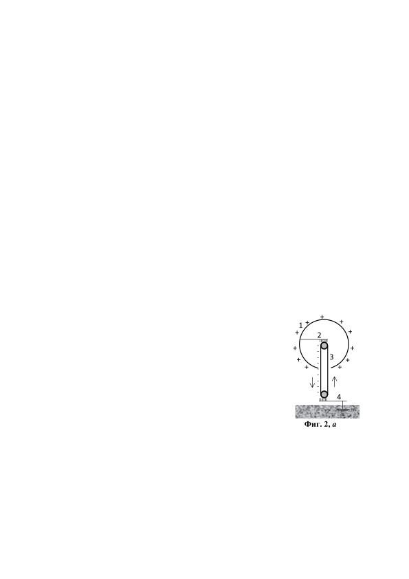
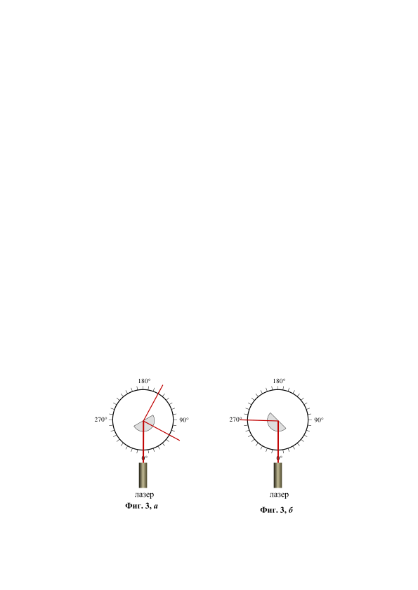

[[Състезания/2/10-12/2018|◂ 2018]] | [[Състезания/2/10-12r/2019|решения]] | [[Състезания/2/10-12/2020| 2020 ▸]]

**Задача 1. Куршум и пясък**

 Куршум с маса m = 10 g, движещ се с начална скорост v0 = 500 m/s, попада в
голяма купчина пясък и спира, след като изминава разстояние l = 20 cm в пясъка.
Можете да приемете, че в пясъка на куршума действа постоянна по големина сила на
съпротивление в посока, противоположна на посоката на движение на куршума.

а) Колко е големината f на силата на съпротивление? \[2,5 точки\]

б) Куршумът е изстрелян към неподвижно закрепена кутия с широчина d = 10 cm,
пълна с пясък. Стените на кутията са много тънки и не оказват влияние върху
движението на куршума. С каква скорост v1 куршумът ще излезе от кутията? \[2 точки\]

в) За колко време t куршумът минава през кутията? \[3 точки\]

г) Кутията с пясък е поставена върху гладка хоризонтална повърхност, по която може
да се хлъзга без триене, и куршумът е изстрелян в кутията. Общата маса на кутията и
пясъка е M = 1 kg. С каква скорост v2 ще се движи кутията, след като куршумът излезе
от нея? \[2,5 точки\]
Упътване. И в трите подусловия куршумът е изстрелян хоризонтално и действието на
силата на тежестта върху него може да се пренебрегне. В подточка г) е достатъчно да
дадете само числен отговор.

**Задача 2. Генератор на ван дер Грааф**

Генераторът на ван дер Грааф (фиг. 2, а) е електростатична машина, с чиято помощ може да се получат електрични напрежения до милиони волтове. Генераторът и до днес се използва в някои ядрени лаборатории като ускорител на протони или по-тежки йони. Генераторът се състои от куха метална сфера 1 с радиус R = 60 cm, която е свързана към метална "четка" 2, която се трие във въртящ се гумен ремък 3. Поради триенето между четката и ремъка, върху ремъка се натрупват електрони, а върху повърхността на металната сфера - същото количество положителен заряд. Електроните от ремъка се "отвеждат" към земята посредством втора заземена четка 4 (вж. фиг. 2, а).

В задачата можете да използвате факта, че електричното поле на зарядите по повърхността на металната сфера е еквивалентно на полето на точков заряд със същата големина, намиращ се в центъра на сферата. Приемете, че потенциалът на Земята е нула.

а) Върху сферата се натрупват заряди дотогава, докато във въздуха започнат да
прескачат искри. Известно е, че електричен пробив във въздуха настъпва при
интензитет на електричното поле E = 3.106 V/m. Колко е максималният заряд q, който
може да се натрупа върху сферата? \[2 точки\]

б) Колко е потенциалът $\varphi$ на сферата, когато зарядът ѝ достигне максималната си стойност? \[1 точка\]
в) Минимум каква работа A трябва да извърши устройството, което задвижва ремъка, така че сферата да се зареди максимално? Коментирайте с едно-две изречения, защо пресметната от вас работа е по-малка от реално извършената работа. \[4 точки\]
г) В ядрен експеримент метална пластина трябва да бъде облъчена с високоенергетични протони. За целта до повърхността на сферата е поставен източник И на протони с пренебрежимо малка начална скорост (фиг. 2, б). Протоните се ускоряват в дълъг вакуумиран канал, в чийто край е поставена заземената метална пластина М. С каква скорост v протоните достигат пластината? \[3 точки\]

Данни

Елементарен електричен заряд: e = 1,60.10-19 C;

Константа в закона на Кулон: k = 9,00.109 N. m2 /C2 ;

Маса на протона: m = 1,67.10-27 kg. Фиг. 2, б

Задача 3. Оптичен кръг

За демонстриране на явленията отражение и пречупване се използва т.нар. оптичен кръг (фиг. 3, а). Върху поставка е нанесена градусна скала. Стъклен полуцилиндър може да се върти около ос, минаваща през средата на плоската му повърхност и центъра на скалата (вж. фигурата). Светлинен лъч от лазер е насочен към центъра на кръга, като влиза в полуцилиндъра през кръглата му повърхност. На фигурата са показани отразеният и пречупеният от плоската повърхност лъч.

а) Колко е показателят n на пречупване на стъклото? Приемете, че показателят на пречупване на въздуха е единица? \[6 точки\]

б) Полуцилиндърът е завъртян в друго положение, както е показано на фиг. 3, б. Обяснете, като направите нужните пресмятания, защо в това положение на полуцилиндъра не се вижда пречупеният лъч? \[4 точки\]