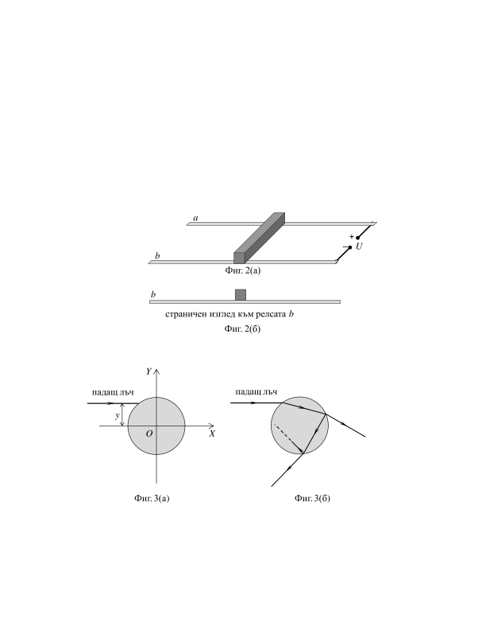

[[Състезания/2/10-12/2019|◂ 2019]] | [[Състезания/2/10-12r/2020|решения]] | [[Състезания/2/12/2021| 2021 ▸]]

**Задача 1. Свързани заряди**

а) Две малки метални топчета с еднаква маса m се намират на разстояние l едно от
друго (фиг. 1). На топчетата са придадени еднакви по големина и противоположни по знак
заряди +q и -q съответно. Топчетата се намират във външно еднородно електрично поле.
 - Определете големината Е и посоката на интензитета на външното поле (изобразете я
 на чертеж), ако е известно, че топчетата се намират в равновесие. (2,5 т.)
 - Устойчиво ли е равновесието на топчетата? Обосновете кратко отговора си, като
 използвате подходящ чертеж. (1,5 т.)
б) Двете топчета са свързани с неразтеглива изолираща нишка, без равновесието им
да бъде нарушено. Отрицателно зареденото топче е осветено за кратко с ултравиолетово
лъчение и поради фотоефект губи част от електроните си, като зарядът му става q' = -q/4.
В резултат на това топчетата започват да се ускоряват във външното поле.
 - Направете чертеж, на който да изобразите посоките на всички сили, действащи на
 топчетата. Определете големината Т на силата на опън на нишката. (6,0 т.)

**Задача 2. Магнитно задвижване**

 Пръчка графит с маса m = 10 g и с площ на напречното сечение S = 1,0 cm2 е
поставена върху две хоризонтални метални релси a и b, свързани съответно към
положителния и отрицателния полюс на източник на постоянно напрежение U = 12 V,
както е показано на фиг. 2(а). Дължината на пръчката е равна на разстоянието между
релсите. Пръчката и релсите се намират в еднородно магнитно поле с неизвестна
индукция В, чиято посока може да се променя. Приемете, че електричното съпротивление
на релсите е пренебрежимо спрямо съпротивлението на пръчката. За да бъде изведена
пръчката от равновесие, към нея се прилага външна сила, успоредна на релсите.
 Когато магнитното поле е перпендикулярно на равнината на релсите, минималната
сила, при която пръчката започва да се хлъзга по релсите, е F1 = 0,028 N. Ако полето е
успоредно на релсите, минималната стойност на силата е F2 = 0,064 N.

а) Във всеки от двата случая, изобразете на чертеж всички сили, действащи на пръчката,
както и посоката на магнитнота индукция на полето. Използвайте страничен изглед към
релсата b, както е показано на фиг. 2(б). (3,0 т.)

б) Намерете големината В на индукцията на полето и коефициента k на триене между
пръчката и релсите. (7,0 т.)

Данни:
 - земно ускорение, g = 10 m/s2;
 - специфично съпротивление на графита, $\rho$ = 5,0.10-5 $\Omega$. m.

Важно уточнение: Индуцираното в електрическата верига ЕДН поради промяна на
посоката на магнитното поле или поради отместване на пръчката графит се пренебрегва.

**Задача 3. Светлинен многоъгълник**

Цилиндър от плексиглас (прозрачна пластмаса) с радиус R = 10,0 cm е поставен така, че центърът му се намира в началото O на координатна система OXY (фиг. 3(а)).
Върху околната повърхност на цилиндъра пада светлинен лъч, успореден на оста X. Вертикалното отместване y на лъча спрямо центъра на цилиндъра може да се променя от 0 до R.

В тази задача е достатъчно да получите само числени отговори за търсените величини, без да давате буквени изрази.

а) Ако лъчът пада така, че почти да се допира до повърхността на цилиндъра, т.е. y $\approx$ R, пречупеният в плексигласа лъч достига отново повърхността на цилиндъра в точка на разстояние L = 14,9 cm от точката на падане на светлината върху цилиндъра.
 - Начертайте хода на падащия и на пречупения лъч и означете на чертежа съответно ъгъла на падане и ъгъла на пречупване. (1,5 т.)
 - Определете показателя n на пречупване на плексигласа. (3,5 т.)

б) След като пречупеният лъч достига отново повърхността на цилиндъра, той частично се пречупва във въздуха и частично се отразява обратно в плексигласа. Така след неколкократни отражения светлината се разпространява в плексигласа по начупена линия, както е показано на фиг. 3(б). При определени стойности на отместването y на падащия
лъч спрямо центъра е възможно начупената линия да се "затвори" така, че да образува правилен многоъгълник.
 - Възможно ли е за цилиндър от плексиглас лъчите в цилиндъра да образуват равностранен триъгълник или квадрат? Ако да, при какви стойности на y? (5,0 т.)
*Упътване.* При падане на светлина върху цилиндрична повърхност ъглите на падане, отражение и пречупване се отчитат спрямо радиуса, минаващ през точката на падане.