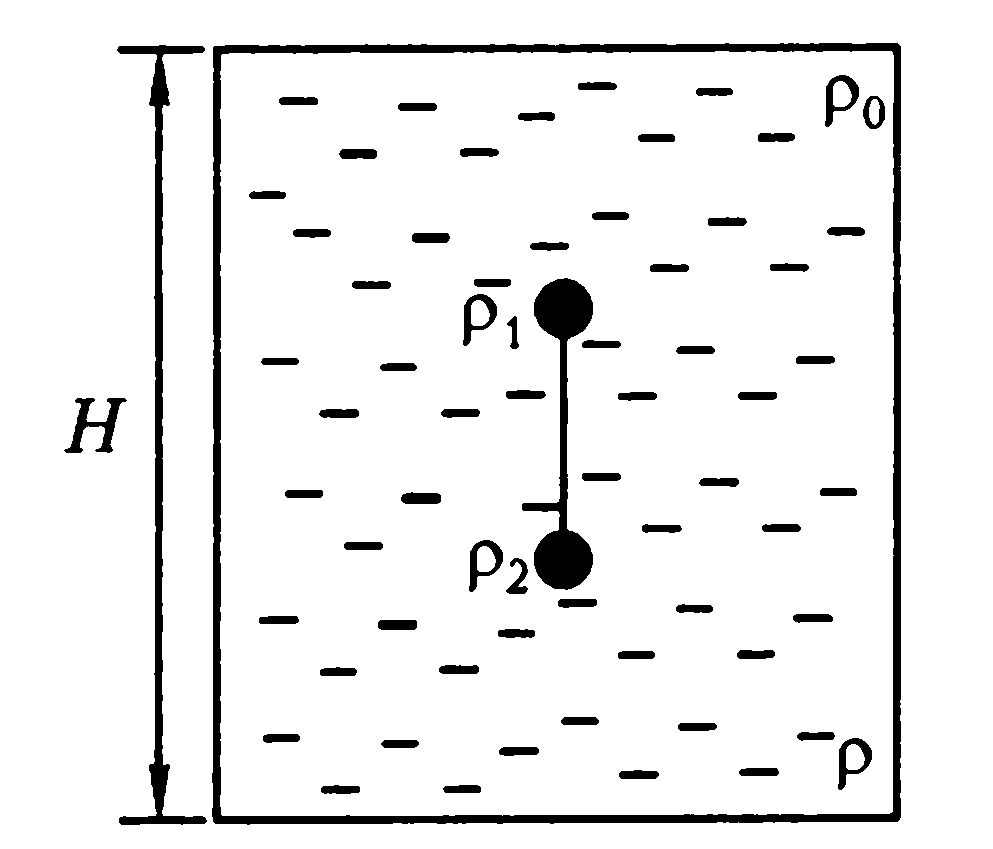

Задача 1. Електростатика

Големината на общия заряд на две малки метални топчета е 6 $\mu$C . Когато топчетата се
намират на разстояние 3 m едно от друго, те си взаимодействат с електрична сила
8 mN . Какви са възможните стойности на зарядите q1 и q 2 , ако те са:

а) едноименни \[6 т.\]

б) разноименни\[4 т.\]

Приемете, че по големина зарядът 1 има по-голяма стойност от заряда 2.
 N.m 2
 Константата в закона на Кулон е k = 9.109 .
 C2

Задача 2. Плаване на телата

Съд с дълбочина Н е запълнен с течност, чиято плътност се изменя линейно от $\rho$ 0 на
повърхността до $\rho$ на дъното на съда. В течността се потопяват две малки топчета с
еднакъв обем V , които са свързани с тънка неразтеглива нишка с дължина l и
пренебрежима маса. Плътността на едното топче е $\rho$ 1 , а плътността на другото е $\rho$ 2 .
След известно време при опъната нишка топчетата заемат положенията, показани на
фиг. 1.

 Фиг.1, а.

 а) Като използвате графиката от фиг. 1, б, изразете плътността на течността $\rho$ x
на дълбочина x от повърхността на течността чрез указаните величини. \[1,5 т.\]

б) Начертайте всички сили, които действат на всяко едно топче, и запишете
условията за равновесието им. \[5 т.\]

в) Намерете силите T1 и T2 , с които нишката действа на топче 1 и топче 2.\[2,5 т.\]
г) При каква разлика между плътностите $\rho$ 1 и $\rho$ 2 нишката действа на топчетата?
 \[1 т.\]

Задача 3. Електрическа верига

Електрическата схема на фиг. 2 включва три еднакви източника с ЕДН $\varepsilon$ и вътрешно
съпротивление r . Полупроводниковият диод се разглежда като идеален, т. е. неговото
съпротивление при ток в права посока е равно на нула, а в обратна посока - безкрайно
голямо. Във веригата е свързан резистор със съпротивление R , като в зависимост от
стойността му могат да се реализират и двата режима на работа на диода.

а) Начертайте схемата на електрическата верига и намерете напрежението U
между краищата на резистора със съпротивление R , когато диодът е в режим с
безкрайно голямо съпротивление. \[1,5 т.\]

б) Начертайте схемата на електрическата верига и определете напрежението U
между краищата на резистора със съпротивление R , когато диодът е в режим със
съпротивление равно на нула. \[4 т.\]

в) Какви условия трябва да удовлетворява съпротивлението R , за да се
реализират двата режима на работа на идеалния диод? \[1,5 т.\]

г) Начертайте графиката на напрежението U в зависимост от съпротивлението
R на резистора, като изберете подходящи променливи. \[3 т.\]
