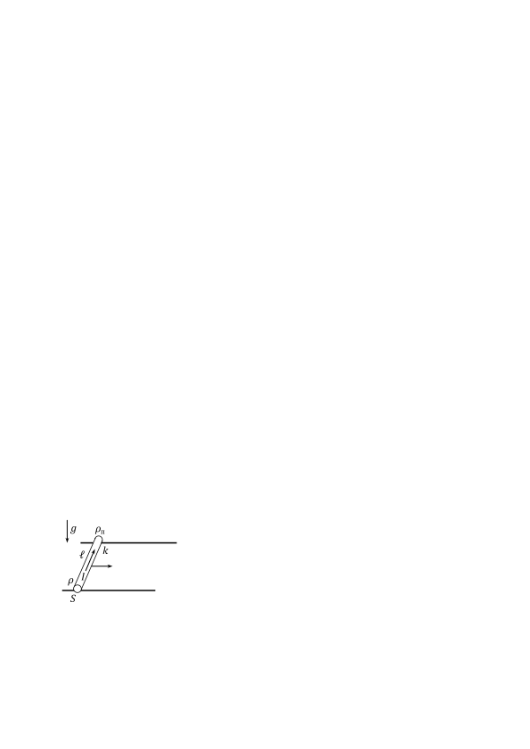

Задача 1. Батерии и резистори

а) Идеален амперметър, свързан за кратко време с батерия, показва ток . След това амперметърът се заменя с идеален волтметър, който измерва напрежение . Намерете електродвижещото напрежение и вътрешното съпротивление на батерията. \[1,5 т.\]

б) Нека да свържем последователно две такива батерии. Какви ще са показанията и на амперметъра и волтметъра, ако са свързани поотделно към краищата на системата от две батерии? \[1,5 т.\]

в) Нека след това да свържем резистор със съпротивление към същата система от две батерии. Определете големината на тока през резистора и отделената мощност в резистора. \[2,5 т.\]

г) Ако във веригата от предишното подусловие свържете успоредно на първия още един такъв резистор, намерете новата мощност , която се отделя във всеки един от двата резистора. \[2 т.\]

д) Дадено е, че отношението . Колко пъти съпротивлението е по-голямо от вътрешното съпротивление на една от батериите? \[2,5 т.\]

Задача 2. Електрон и позитрон

Електрон с маса и заряд се движи със скорост към първоначално неподвижен позитрон (позитронът е елементарна частица с маса равна на масата на електрона и противоположен по знак заряд). В даден момент разстоянието между двете частици е . В същия момент е включено еднородно електрично поле с интензитет , насочен от електрона към позитрона. Двете частици се движат така, че може да се пренебрегне взаимодействието между тях.

а) Намерете минималното разстояние между частиците по време на тяхното движение.
На колко е равна скоростта на електрона в този момент? \[6,5 т.\]

б) На колко е равно разстоянието между двете частици в момента, когато скоростта на електрона става равна на нула? \[1,5 т.\]

в) Намерете колко пъти скоростта на позитрона е по-голяма от скоростта на електрона в момента, когато електронът се връща в първоначалната си позиция (когато е включено електричното поле). \[2 т.\]

Задача 3. Проводник в магнитно поле

 Цилиндричен проводник с дължина е поставен
 перпендикулярно на две проводящи хоризонтални успоредни
 релси, които са на разстояние една от друга (вж. фигурата
 вляво). Проводникът е с напречно сечение , плътност и
 специфично електрично съпротивление . Коефициентът на
 триене между проводника и релсите е . Първоначално
 проводникът се хлъзга надясно с постоянна скорост, като през
 него протича ток с големина и посока от предната към
задната релса. Системата е поставена в еднородно магнитно поле, чиято магнитна индукция е перпендикулярна на проводника и релсите. Земното ускорение е . Съпротивлението на въздуха да се пренебрегне.

а) Определете посоката на магнитната индукция и нейната големина . \[4,5 т.\]

б) Ако напрежението между краищата на проводника се увеличи така, че отделената мощност в проводника стане равна на , да се намери ускорението , с което ще започне да се движи проводникът върху релсите. \[5,5 т.\]
