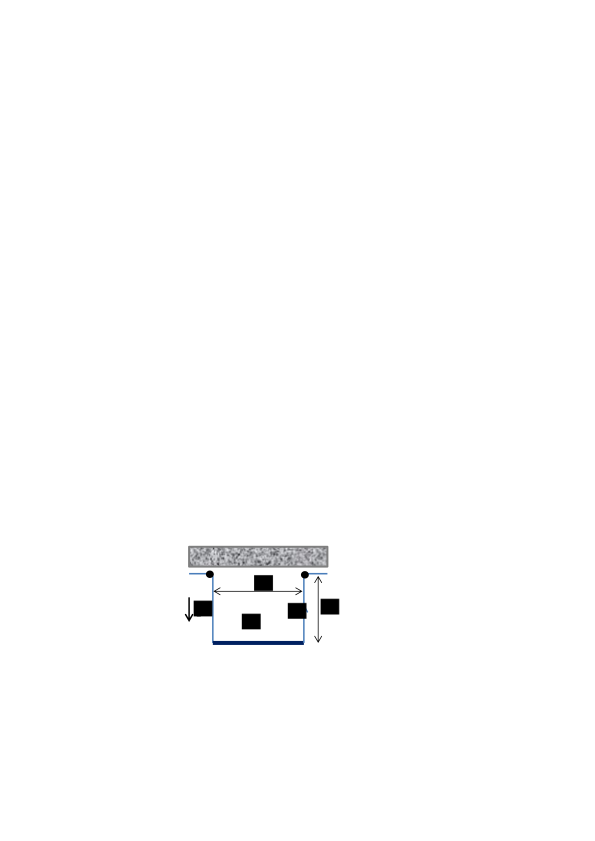
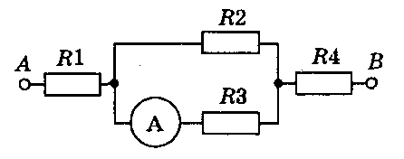

[[Състезания/2/10/2025|◂ 2025]] | [[Състезания/2/10r/2026|решения]]

**Задача 1. Заредено малко тяло**
Малка заредена сферична сачма, направена от материал с плътност $\rho$, пада вертикално в машинно масло с плътност $\rho_0$. Тя достига постоянна скорост $v_g$, понеже ѝ действа сила на триене:
$$F_v = \alpha r v,$$
зависеща от радиуса $r$ на сачмата, от скоростта ѝ $v$ и от коефициента $\alpha = \text{const}$, характерен за конкретната течност. Земното ускорение $g$ се приема за известно.

**а)** Какви сили действат на сачмата? Запишете изрази за тяхната големина и определете посоката им. \[3,5 т.\]
**б)** Изразете радиуса на сачмата чрез величините, посочени по-горе в условието. \[2 т.\]

Ако на заредената сачма започне да действа вертикално еднородно електрично поле с интензитет $E$, тя променя посоката си на движение и достига постоянна скорост $v_0$, движейки се нагоре.

**в)** Определете посоката на интензитета на електричното поле при това движение. \[2 т.\]
**г)** Изразете заряда $q$ на сачмата чрез дадените в условието величини. \[2,5 т.\]
Приемете, че сачмата не променя заряда си при своето движение.

**Задача 2. Махало в магнитно поле**

П-образна проводникова рамка е окачена на хоризонтална ос и се намира в еднородно хоризонтално магнитно поле с индукция $B$. Рамката е съставена от хоризонтална пръчка с дължина $l$ и маса $m$ и две вертикални метални пръчки с пренебрежима маса и дължина $h$ (фиг. 1). През рамката тече постоянен ток $I$ в показаната на фигурата посока. Приемете земното ускорение $g$ за известно.

*(Изображение Фиг. 1: П-образна рамка в магнитно поле с означени $l, h, I, B$ и $g$)*

**а)** Определете големината и посоката на силите $R_1$ и $R_2$, с които всяка от вертикалните пръчки действа върху хоризонталната пръчка. Разгледайте двете възможни посоки на магнитната индукция – $\odot$ (от чертежа към вас) и $\otimes$ (от вас към листа). \[4,5 т.\]
**б)** При малко отклонение на рамката от вертикалното ѝ положение тя започва да трепти хармонично. Намерете периодите $T_1$ и $T_2$ на трептене на рамката при двете възможни ориентации на индукцията на магнитното поле и ги сравнете с периода $T_0$ на трептене на рамката при отсъствие на магнитно поле. \[5,5 т.\]

**Задача 3. Електрически вериги**
Двете части на задачата са независими една от друга.

**А.** В електрическата верига на фиг. 2 показанието на амперметъра е $2\text{ А}$, а съпротивленията на резисторите са $R_1 = 2\text{ }\Omega, R_2 = 10\text{ }\Omega, R_3 = 15\text{ }\Omega, R_4 = 4\text{ }\Omega$.

Определете тока през всеки резистор и напрежението между краищата му, а така също и напрежението $U_{AB}$ между крайните точки. \[4,5 т.\]

**Б.** Когато във верига с два последователно свързани резистора със съпротивления съответно $R_1$ и $R_2$ се подаде напрежение $U = 12\text{ V}$, токът във веригата е $I_1 = 0,3\text{ A}$. Ако резисторите са свързани успоредно, при подаване на същото напрежение токът във веригата е $I_2 = 1,6\text{ A}$. Определете възможните стойности на съпротивленията. \[5,5 т.\]