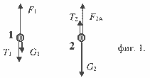
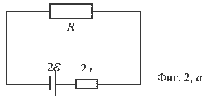
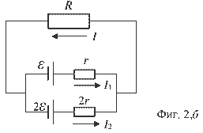
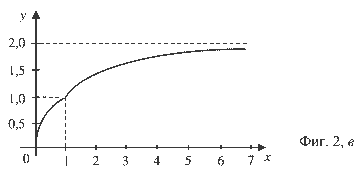

[[Състезания/2/10-12/2019|◂ 2019]] | [[Състезания/2/10/2020|условия]] | [[Състезания/2/10/2021| 2021 ▸]]

Задача 1. а) Да озаначим с $|q_1|$ и $|q_2|$ големините на двата заряда. Условието

$|q_1 + q_2| = q > 0$ \[0,5 т\]

при едноименни заряди е еквивалентно на равенството

$|q_1| + |q_2| = q$, \[0,5 т\]

от което следва $|q_2| = q - |q_1|$. Като заместим този израз в израза за електричната сила на взаимодействие между зарядите имаме

$F = k \frac{|q_1||q_2|}{r^2} = k \frac{|q_1|(q - |q_1|)}{r^2}$, \[0,5 т\]

което може да се запише във вид на квадратно уравнение

$|q_1|^2 - q|q_1| + \frac{Fr^2}{k} = 0$. \[0,5 т\]

Неговите решения са

$\left(|q_1|\right)_{1,2} = \frac{1}{2} \left[ q \pm \sqrt{q^2 - \frac{Fr^2}{k}} \right] = \begin{cases} 4 \, \mu \text{C} \\ 2 \, \mu \text{C} \end{cases} \quad [1 \, \text{т}]$

от което следва

$\left(|q_2|\right)_{1,2} = \begin{cases} 2 \, \mu \text{C} \\ 4 \, \mu \text{C} \end{cases}$, \[0,5 т\]

т. е. ако въведем изискването, че $|q_1| > |q_2|$ \[0,5 т.\], имаме $|q_1| = 4 \, \mu \text{C}$, $|q_2| = 2 \, \mu \text{C}$ \[0,5 т.\].

Тогава при положителни заряди

$q_1 = +4 \, \mu \text{C}, \quad q_2 = +2 \, \mu \text{C},$ \[0,75 т\]

а при отрицателни заряди

$q_1 = -4 \, \mu \text{C}, \quad q_2 = -2 \, \mu \text{C}.$ \[0,75 т\]

б) При разноименни заряди, когато $|q_1| > |q_2|$ \[0,5 т.\], имаме

$|q_1| - |q_2| = q$. \[0,5 т\]

Тогава от уравнението

$|q_1|^2 - q|q_1| - \frac{Fr^2}{k} = 0$ \[1т\]

намираме $|q_1| = 7,12 \, \mu \text{C}$, $|q_2| = 1,12 \, \mu \text{C}$ \[0,5 т.\]. Ето защо са възможни следните два случая:

$q_1 = +7,12 \, \mu \text{C}, \quad q_2 = -1,12 \, \mu \text{C}$, \[0,75 т\]

$q_1 = -7,12 \, \mu \text{C}, \quad q_2 = +1,12 \, \mu \text{C}$. \[0,75 т\]

Забележка. Когато с $q_1$ и $q_2$ са означени големините на зарядите, се изисква допълнителното конкретизиране „положителен“ или „отрицателен“.

**Задача 2.** a) От подобието на двата правоъгълни триъгълника с катети $x, \rho_x - \rho_0$ и $H, \rho - \rho_0$ имаме

$$ \frac{\rho_x - \rho_0}{\rho - \rho_0} = \frac{x}{H}, \qquad [1 т.] $$

откъдето намираме

$$ \rho_x = \rho_0 + \frac{x}{H} (\rho - \rho_0). \qquad [0,5 т.] $$

б) Вж. фиг. 1, където $G_1$ и $G_2$ са силите на тежестта, $T_1$ и $T_2$ са силите, с които нишката дърпа топчетата, $F_{1A}$ и $F_{2A}$ са Архимедовите сили [1 т.].

На първото топче действат надолу силата на тежестта $G_1 = \rho_1 Vg$ \[0,5 т.\] и силата $T_1$, с която нишката го дърпа, а нагоре-изтласкващата сила $F_{1A} = \rho_{x_1} Vg$ \[0,5 т.\], като

$$ \rho_1 Vg + T_1 = \rho_{x_1} Vg. \qquad [1 т.] $$

На второто топче надолу действа силата на тежестта $G_2 = \rho_2 Vg$ \[0,5 т.\], а нагоре силата $T_2$, с която нишката го дърпа, и изтласкващата сила $F_{2A} = \rho_{x_2} Vg$ \[0,5 т.\], като

$$ \rho_2 Vg = T_2 + \rho_{x_2} Vg. \qquad [1 т.] $$

в) Тъй като топчетата дърпат нишката съответно със сили $T_1$ и $T_2$ (трети принцип на механиката), а тя е с пренебрежима маса и неподвижна, следва $T_1 = T_2 = T$ \[0,5 т.\]. От почленното изваждане на двете равенства намираме

$$ T = \frac{1}{2} \left[ \rho_{x_1} - \rho_{x_2} + \rho_2 - \rho_1 \right] Vg. \qquad [1 т.] $$

Като отчетем, че

$$ \rho_{x_1} - \rho_{x_2} = \frac{l}{H} (\rho_0 - \rho), \qquad [0,5 т.] $$

имаме

$$ T = \frac{1}{2} \left[ \rho_2 - \rho_1 - \frac{l}{H} (\rho - \rho_0) \right] Vg. \qquad [0,5 т.] $$

г) Тъй като $T > 0$ \[0,5 т.\], намираме $\rho_2 - \rho_1 > l(\rho - \rho_0)/H$. \[0,5 т.\]

**Задача 3.** a) От схемата на фиг. 2, a \[0,5 т.\] намираме тока през резистора

$I = \frac{2\mathcal{E}}{R + 2r}, \quad [0,5 \text{ т.}]$

като за напрежението между краищата на резистора получаваме

$U(R) = \frac{2\mathcal{E}R}{R + 2r}. \quad [0,5 \text{ т.}]$

б) Нека означим токовете през източниците в схемата на фиг. 2, б \[0,5 т.\] съответно с $I_1$ и $I_2$, а тока през резистора с $I$. Тогава от запазването на електричния заряд следва равенството

$(1) \quad I_1 + I_2 = I. \quad [0,5 \text{ т.}]$

Напрежението между краищата на резистора се дава с изразите

$IR = \mathcal{E} - I_1r = 2\mathcal{E} - I_2(2r), \quad [0,5 \text{ т.}]$

които можем да препишем във вида

$(2) \quad 2I_2 - I_1 = \frac{\mathcal{E}}{r}, \quad \mathcal{E} - I_1r = IR. \quad [1 \text{ т.}]$

Тогава от (1) и (2) намираме

$I_1 = \frac{2}{3}I - \frac{\mathcal{E}}{3r}, \quad I = \frac{4\mathcal{E}}{3R + 2r}, \quad [1 \text{ т.}]$

при което за напрежението между краищата на резистора имаме

$U(R) = \frac{4\mathcal{E}R}{3R + 2r}. \quad [0,5 \text{ т.}]$

в) Диодът е с нулево съпротивление, когато $I_1 > 0$ \[0,5 т.\]. Тогава имаме $R < 2r$ \[0,5 т.\]. При $I_1 = 0$ диодът е „запушен“, т. е. $R = 2r$, и остава такъв при $R > 2r$ \[0,5 т.\].

г) При избор на променливите $y = U / \mathcal{E}$ \[0,5 т.\] и $x = R / 2r$ \[0,5 т.\] зависимостта на напрежението има универсален вид

$$y = \begin{cases} 4x / (3x + 1), & x < 1 \\ 1, & x = 1 \\ 2x / (x + 1), & x > 1 \end{cases} \quad [0,5 \text{ т.}] $$

В таблицата са показани няколко стойности на $x$ и $y$.

| x   | 0,3  | 0,6  | 0,9  | 1,0 | 1,1  | 1,5 | 2,0 | 4,0 | 7,0  |
| --- | ---- | ---- | ---- | --- | ---- | --- | --- | --- | ---- |
| y   | 0,63 | 0,86 | 0,97 | 1,0 | 1,05 | 1,2 | 1,3 | 1,6 | 1,75 |

Следва да се отбележат две особености:

1) \text{ Тъй като } $\frac{2x}{x+1} < \frac{2x}{x} = 2$, \text{ напрежението } $U < 2\mathcal{E}$ \text{ и с увеличаването на } $R$ \text{ се приближава към } $2\mathcal{E}$.\[0,5 т.\]

2) При $x=1$ графиката има чупка, която се установява при разглеждане на близки точки върху графиката, симетрични по $x$ (вж. таблицата). \[0,5 т.\]

 

На фиг. 2, в е показана търсената графика. \[0,5 т.\].