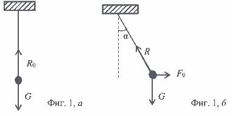
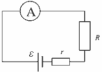

[[Състезания/2/10/2020|◂ 2020]] | [[Състезания/2/10/2021|условия]] | [[Състезания/2/10/2022| 2022 ▸]]

Задача 1. Заредено махало в електростатично поле. 

а) В равновесното положения A на топчето действат две сили – силата на тежестта G и реакцията на нишката $R_0$ \[0,5 т.\] (фиг. 1, а), а в равновесното положение B – силата на тежестта G, електричната сила $F_0$ и реакцията на нишката R \[0,75 т.\] (фиг. 1, б). 

 

б) Равнодействащата сила F на G и $F_0$, която уравновесява реакцията на нишката R, е хипотенуза в правоъгълен триъгълник с остър ъгъл $\alpha$ и катети G и $F_0$ \[0,5 т.\]. Тогава имаме 

$$ \operatorname{tga} = \frac{F_0}{G} . \qquad [0,5 т.] $$

Тъй като са в сила изразите 

$$ F_0 = qE, \quad G = mg, \quad \operatorname{tga} = \frac{1}{\sqrt{3}}, \qquad [1,25 т.] $$

намираме 

$$ E = \frac{mg}{\sqrt{3q}} \approx 5,8 \cdot 10^3 \frac{\text{N}}{\text{C}} = 5,8 \cdot 10^3 \frac{\text{V}}{\text{m}}. \qquad [1 т.] $$

в) Периодът на незареденото махало е 

$T_0 = 2\pi \sqrt{\frac{l}{g}}$.  \[0,5 т.\]

За да намерим периода T на зареденото махало, ще определим силата F: 

$$ F = \sqrt{G^2 + F_0^2} = \sqrt{(mg)^2 + (qE)^2}. \qquad [1 т.] $$

Тя може да се запише във вида 

$$ F = mg \sqrt{1 + \left(\frac{qE}{mg}\right)^2} = mg', \qquad [0,5 т.] $$

където 

$g' = g \sqrt{1 + \left(\frac{qE}{mg}\right)^2}$. \[1 т.\]

Тогава по аналогия с периода на махалото при $E=0$, имаме 

$T = 2\pi \sqrt{\frac{l}{g'}} = \frac{T_0}{\left[1 + \left(\frac{qE}{mg}\right)^2\right]^{1/4}}$, \[1 т.\]

откъдето следва 

$\frac{|\Delta T|}{T_0} = 1 - \frac{1}{\left[1 + \left(\frac{qE}{mg}\right)^2\right]^{1/4}} \approx 1 - \left(\frac{3}{4}\right)^{1/4} \approx 0,07$. \[1,5 т.\]

**Задача 2. Електростатика** 

а) В равновесие при едноименни заряди пружината е разтегната. \[0,5 т.\] Тя действа на всеки един от зарядите със сила, чиято големина във въздух е 

$F_1 = k_0(l_1 - l_0)$. \[0,5 т.\]

Тази сила се уравновесява от електричната сила на отблъскване между зарядите 

$F_1' = k \frac{|q_1||q_2|}{l_1^2}$. \[0,5 т.\]

При потопяване в течността разтегнатата пружина действа на всеки един от зарядите със сила 

$F_2 = k_0(l_2 - l_0)$, \[0,5 т.\]

която уравновесява електричната сила 

$F_2' = k \frac{|q_1^*||q_2^*|}{l_2^2} = k \frac{|q_1||q_2|}{\varepsilon l_2^2}$. \[0,5 т.\]

От равенствата 

$F_1' = F_1, \quad F_2' = F_2$, \[1 т.\]

чрез почленно делене намираме 

$\frac{\varepsilon l_2^2}{l_1^2} = \frac{l_1 - l_0}{l_2 - l_0}$. \[0,5 т.\]

От това равенство можем да изразим $l_0$, при което получаваме 

$l_0 = \frac{l_1^3 - \varepsilon l_2^3}{l_1^2 - \varepsilon l_2^2} = l_2 \left(\frac{\left(\frac{l_1}{l_2}\right)^3 - \varepsilon}{\left(\frac{l_1}{l_2}\right)^2 - \varepsilon}\right)$. \[1 т.\]

б) Естествената дължина на пружината удовлетворява неравенствата $0 < l_0 < l_2$ \[0,5 т.\]. Тогава от условието $l_0 > 0$, имаме 

$1 < \varepsilon < \left(\frac{l_1}{l_2}\right)^2 \approx 1,26, \quad \varepsilon > \left(\frac{l_1}{l_2}\right)^3 \approx 1,43$. \[1 т.]

докато от условието $l_0 < l_2$ следва 

$\varepsilon > \left(\frac{l_1}{l_2}\right)^2 \approx 1,26$. \[0,5 т.]

Тогава от удовлетворяването на двете неравенства $0 < l_0 < l_2$, намираме 

$\varepsilon > \left(\frac{l_1}{l_2}\right)^3 \approx 1,43$. \[1 т.]

в) Минималната възможна целочислена стойност е $\varepsilon = 2,0$ \[1 т.\]. Следователно с точност до две значещи цифри определяме 

$l_0 = l_2 - \left(\frac{l_1}{l_2}\right)^3 \approx 13 \text{ cm}$. \[1 т.\]

$\varepsilon - \left(\frac{l_1}{l_2}\right)^2 \approx 1,3 \text{ cm}.$

**Задача 3. Електрична верига** 

а) Съществено за описаната ситуация е наличие на вътрешно съпротивление $r$ на източника \[1 т.\]. Тогава на фиг. 2 е показана еквивалентната схема на веригата при свързване към източника на съпротивление $R$ и амперметър. \[1,5 т.\] 

б) При първото свързване токът във веригата е 

$I_1 = \frac{\varepsilon}{R_1 + r}$. \[1 т.]

а при второто 

$I_2 = \frac{\varepsilon}{R_2 + r}$. \[1 т.]

За да намерим ЕДН $\varepsilon$, изразяваме r по два начина 

$r = \frac{\varepsilon}{I_1} - R_1, \quad r = \frac{\varepsilon}{I_2} - R_2$. \[1 т.]

Тогава от приравняването на двата израза 

$\frac{\varepsilon}{I_1} - R_1 = \frac{\varepsilon}{I_2} - R_2$. \[0,5 т.]

намираме 

$\varepsilon = \frac{I_1 I_2}{I_1 - I_2} (R_2 - R_1) = 7,5 \, \text{V}$. \[1,5 т.]

в) По определение токът на късо съединение е 

$I_0 = \frac{\varepsilon}{r}$. \[1 т.]

Като заместим r с единия от двата израза, намираме 

$I_0 = \frac{\varepsilon I_1}{\varepsilon - I_1 R_1} = \frac{\varepsilon I_2}{\varepsilon - I_2 R_2} = 5 \, \text{A}$. \[1,5 т.]