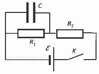

[[Състезания/2/10/2021|◂ 2021]] | [[Състезания/2/10/2022|условия]] | [[Състезания/2/10/2023| 2023 ▸]]

**Задача 1. Електрическа верига с кондензатор.**

**а)** Веднага след момента на затварянето на ключа кондензаторът още не е започнал да се зарежда, следователно напрежението върху него е нула. \[1 т.\] Нула е и напрежението върху резистора $R_1$. Следователно токът $I_1 = 0$. \[1 т.\]

**б)** След като напрежението върху резистора $R_1$ е нула, то напрежението върху резистора $R_2$ ще бъде $\mathcal{E}$. \[1 т.\] Следователно токът $I_2$, течащ през резистора $R_2$ веднага след момента на затварянето на ключа, е $I_2 = \frac{\mathcal{E}}{R_2}$. \[1 т.\]

**в)** След като токът във веригата престане да се променя (когато кондензаторът престане да се зарежда повече), този ток ще е един и същ и през двата резистора. Тогава токът $I$, течащ през източника на напрежение, е $I = \frac{\mathcal{E}}{R_1 + R_2}$. \[2 т.\]

**г)** Преди да се отвори ключът, кондензаторът ще е зареден до напрежение $U_C = R_1 I = \frac{R_1 \mathcal{E}}{R_1 + R_2}$. \[0,5 т.\] Когато ключът $K$ се отвори, напрежението върху резистора $R_1$ ще е колкото върху кондензатора \[0,5 т.\] и токът $I_3$, течащ през резистора $R_1$ веднага след момента на отварянето на ключа ще бъде $I_3 = \frac{U_C}{R_1} = \frac{\mathcal{E}}{R_1 + R_2}$. \[1 т.\]

**д)** Тъй като намаляването на тока през резистора $R_1$ ще зависи само от съпротивлението $R_1$ на резистора и капацитета $C$ на кондензатора, то трябва да се провери коя комбинация от тези величини има размерност на време. Използвайки познати формули, може да проверим първо произведението им каква размерност има. $[R] \cdot [C] = \frac{[U]}{[I]} \cdot \frac{[Q]}{[U]} = \frac{[Q]}{[I]} = \frac{[Q]}{\frac{[Q]}{[t]}} = [t]$. \[1 т.\] Така проверихме, че произведението има размерност на време и характерното време $\tau = R_1 \cdot C$. \[1 т.\]

**Задача 2. Свойства на проводник в електростатично поле.**

**а)** Допускаме противоположното, т.е. че в проводника има електростатично поле. Тогава обаче на свободните заряди, намиращи се вътре в него, ще действа кулонова сила и те ще започнат да се движат, следователно няма да имаме статичен случай. Следователно допускането не е вярно и електростатичното поле вътре е нула. \[2 т.\]

**б)** Нека да вземем две произволни точки от проводника (намиращи се вътре или на повърхността му). Нека придвижим един подвижен заряд от едната точка до другата. Тъй като електростатичното поле е нула, силата, действаща на заряда от страна на електростатичното поле, е нула и механичната работа ще е нула. Следователно в двете точки електростатичната потенциална енергия ще е една и съща и съответно потенциалите ще са равни. Тъй като двете точки са произволни, потенциалът на всички точки от проводника (вътре в него и на повърхността му) е постоянен, $\varphi_{\Pi} = const$. \[2 т.\]

**в)** Нека вземем две произволни точки от повърхността на проводника. Тъй като те имат един и същ потенциал, извършената работа от електростатичното поле за придвижване на заряд от едната до другата по повърхността ще е нула. Тъй като точките са произволни, това е възможно само ако електростатичната сила винаги е перпендикулярна на преместването. Следователно интензитетът на електричното поле е перпендикулярен на повърхността на проводника и съответно силовите линии на електростатичното поле от външната страна на повърхността на проводника са перпендикулярни на повърхността му. \[3 т.\]

**г)** Нека да допуснем, че в кухината има електростатично поле. Тъй като в кухината няма нищо, т.е. няма и заряди, а силовите линии започват и завършват на заряд, тогава една силова линия започва от една точка на повърхността и завършва на друга точка от повърхността. Ако придвижим електричен заряд по тази линия, извършената работа от полето ще е различна от нула, следователно двете точки от повърхността ще имат различни потенциали. Това е невъзможно, следователно вътре в кухината не може да има електростатично поле. \[3 т.\]

**Задача 3. Ефект на Хол**

**а)** Силата $F_B$, с която магнитното поле действа на проводника, е $F_B = B \cdot I \cdot l$. \[1 т.\]

**б)** Тъй като токът е преминалите заряди за единица време през сечението на проводника, то за време $\Delta t$ през сечението на проводника ще преминат зарядите, намиращи се в обем с основа $S$ и височина $\Delta l = v \cdot \Delta t$. \[1 т.\] Следователно $I = \frac{\Delta q}{\Delta t} = \frac{n \cdot e \cdot S \cdot v \cdot \Delta t}{\Delta t} = n \cdot e \cdot S \cdot v$, откъдето $v = \frac{I}{n \cdot e \cdot S}$. \[1 т.\]

**в)** Силата $F_e$, с която магнитното поле действа на един свободен електрон, е силата $F_B$, разделена на броя електрони, $F_e = \frac{F_B}{n \cdot S \cdot l} = \frac{B \cdot I \cdot l}{n \cdot S \cdot l} = \frac{B \cdot I}{n \cdot S} = e \cdot v \cdot B$. \[1 т.\]

**г)** Тъй като $F_E = F_B$, то $e \cdot E_H = e \cdot v \cdot B$, \[1 т.\] откъдето $E_H = v \cdot B = \frac{I \cdot B}{n \cdot e \cdot S}$. \[1 т.\]

**д)** Холовото напрежение $U_H = E_H \cdot h$, \[1 т.\] откъдето $U_H = \frac{I \cdot B \cdot h}{n \cdot e \cdot b \cdot h} = \frac{I \cdot B}{n \cdot e \cdot b}$. \[1 т.\]

**е)** За да е чувствителен такъв сензор, концентрацията на свободните заряди (електроните) трябва да е малка (полупроводниците ще са по-подходящи от металите) \[1 т.\] и размерът $b$ трябва да е малък (да се използват тънки слоеве). \[1 т.\]