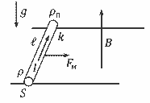

[[Състезания/2/10/2023|◂ 2023]] | [[Състезания/2/10/2024|условия]] | [[Състезания/2/10/2025| 2025 ▸]]

**Задача 1. Батерии и резистори**
**а)** Идеалният волтметър е с много голямо съпротивление, така че във веригата не протича ток и волтметърът измерва електродвижещото напрежение на батерията, т.е. $\mathcal{E} = U_1$. \[0,5 т.\] Обратно, идеалният амперметър има пренебрежимо съпротивление и от закона на Ом следва, че $r = \frac{\mathcal{E}}{I_1} = \frac{U_1}{I_1}$. \[1 т.\]

**б)** Батериите са свързани последователно, така че амперметърът ще измери ток $I_2 = \frac{2\mathcal{E}}{2r} = \frac{\mathcal{E}}{r} = I_1$. \[1 т.\] Новото измерено напрежение ще бъде $U_2 = 2\mathcal{E} = 2U_1$. \[0,5 т.\]

**в)** Елементите във веригата са свързани последователно и от закона на Ом следва, че $I_R = \frac{2\mathcal{E}}{2r+R} = \frac{2U_1 I_1}{2U_1 + RI_1}$. \[1,5 т.\] Отделената мощност ще бъде $P_R = I_R^2 R = \frac{4U_1^2 I_1^2 R}{(2U_1 + RI_1)^2}$. \[1 т.\]

**г)** Успоредно свързаните резистори са еквивалентни на резистор със съпротивление $R/2$ и през всеки от тях минава половината от тока през батериите, откъдето следва, че $P_R' = \frac{4U_1^2 I_1^2 R}{(4U_1 + RI_1)^2}$. \[2 т.\]

**д)** От изразите за мощностите и отношението между тях може да се съобрази, че $(4U_1 + RI_1)^2 = 2(2U_1 + RI_1)^2$. \[1 т.\] Оттук $\frac{RI_1}{U_1} = \frac{R}{r} = 2\sqrt{2}$, т.е. приблизително 2,8 пъти. \[1,5 т.\]

**Задача 2. Електрон и позитрон**

**а)** Тъй като електронът е отрицателно зареден, електричната сила $F$ върху него е обратна на посоката на полето, т.е. е обратна на посоката на първоначалното му движение. \[0,5 т.\] Това означава, че отначало електронът ще се движи равнозакъснително с ускорение $a = \frac{F}{m_e} = \frac{eE}{m_e}$. \[1 т.\] Позитронът е с положителен заряд и съответно ще се ускорява по посока на полето със същото по големина ускорение. \[0,5 т.\] Минималното разстояние се достига, когато скоростите на частиците се изравнят. \[0,5 т.\] Ако измерваме времето $t$ спрямо момента на включване на полето, отначало скоростите на двете частици имат вида: $v_e = v_0 - at$ и $v_p = at$. \[0,5 т.\] Понеже в момента на максимално сближаване на двете частици $v_e = v_p$, изминалото време ще бъде $t_{dmin} = \frac{v_0}{2a}$. \[0,5 т.\] За това време електронът изминава път $v_0 t_{dmin} - \frac{at_{dmin}^2}{2}$, а позитронът изминава $\frac{at_{dmin}^2}{2}$. \[1 т.\] Търсеното разстояние $d_{min} = d_0 - (v_0 t_{dmin} - \frac{at_{dmin}^2}{2} + \frac{at_{dmin}^2}{2}) = d_0 - v_0 t_{dmin} + at_{dmin}^2 = d_0 - \frac{v_0^2}{2a} + \frac{v_0^2}{4a} = d_0 - \frac{v_0^2}{4a} = d_0 - \frac{m_e v_0^2}{4eE}$. \[1,5 т.\] Скоростта на електрона в този момент ще бъде $v_{dmin} = v_0 - at_{dmin} = \frac{v_0}{2}$. \[0,5 т.\]

**б)** Когато скоростта на електрона става равна на нула, изминалото време става $\frac{v_0}{a}$. \[0,5 т.\] Разстоянието между частиците ще бъде $d_{v=0} = d_0 - \frac{v_0^2}{a} + \frac{v_0^2}{2a} + \frac{v_0^2}{2a} = d_0$. \[1 т.\]

**в)** След като скоростта на електрона става нулева, той започва да се движи равноускорително в обратната посока. До този момент електронът изминава път $\frac{v_0^2}{2a}$ за време $\frac{v_0}{a}$ и съответно трябва да измине наобратно същия път, за да се върне в изходна позиция. \[0,5 т.\] Може да се съобрази, че това движение наобратно се случва за същото време $\frac{v_0}{a}$. \[0,5 т.\] Скоростта на електрона в първоначалната му позиция е отново $v_0$, докато позитронът е развил вече скорост $2v_0$, т.е. скоростта му е двойно по-голяма от скоростта на електрона. \[1 т.\]

**Задача 3. Проводник в магнитно поле**

**а)** Проводникът се движи надясно, така че магнитната сила $F_M$ върху него също трябва да е насочена надясно, както е показано на чертежа вляво. \[0,5 т.\] Като знаем посоките на тока и силата, от правилото на дясната ръка следва, че магнитното поле е насочено *вертикално нагоре*. \[1 т.\] Проводникът се движи с постоянна скорост, т.е. сумарната сила е нула, откъдето следва, че магнитната сила е равна на силата на триене: $BI\ell = k \rho_n S \ell g$. \[2,5 т.\] Магнитната индукция има големина $B = \frac{k \rho_n S g}{I}$. \[0,5 т.\]

**б)** Съпротивлението на проводника е $R = \frac{\rho \ell}{S}$. \[1 т.\] От връзката между тока и мощността следва, че новият ток има големина $\sqrt{\frac{P}{R}} = \sqrt{\frac{PS}{\rho \ell}} > I$. \[1 т.\] С увеличаване на напрежението нарастват токът през проводника и магнитната сила, докато силата на триене остава същата. \[0,5 т.\] От II принцип на Нютон следва, че $B \sqrt{\frac{PS}{\rho \ell}} - k \rho_n S g = \rho_n S a$. \[2 т.\] Оттук $a = \frac{B}{\rho_n S} \sqrt{\frac{PS}{\rho \ell}} - kg = \frac{kg}{I} \sqrt{\frac{PS}{\rho \ell}} - kg = kg \left( \frac{1}{I} \sqrt{\frac{PS}{\rho \ell}} - 1 \right)$. \[1 т.\]

**Внимание! (важи за решенията на всички задачи)**
**За всякакви алтернативни решения, обяснени ясно и получаващи същите резултати, да се присъжда пълният брой точки, посочени за съответното подусловие.**