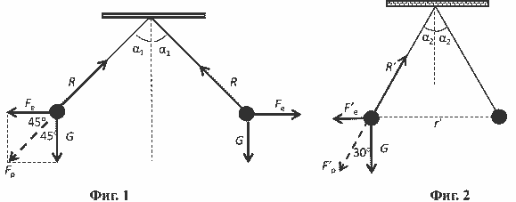
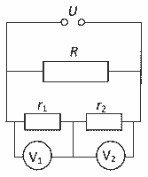
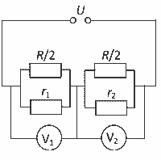

[[Състезания/2/10/2024|◂ 2024]] | [[Състезания/2/10/2025|условия]]

**Задача 1. Електростатично взаимодействие**
а) На всяко топче действат три сили – сила на тежестта $G = mg$, насочена вертикално надолу \[0,5 т.\]; електрична сила на отблъскване $F_e$, насочена хоризонтално съответно наляво (надясно) \[1 т.\]; сила $R$ на опън на нишката, която е успоредна на съответната нишка (фиг. 1) \[1 т.\]. Тъй като системата е симетрична по отношение на вертикалната права, минаваща през точката на окачване на нишките, ще разглеждаме само едното от топчетата (напр. лявото).

б) Равнодействащата $F_p$ на силата на тежестта и на електричната сила уравновесява силата на опън на нишката, т.е. действа надолу и наляво под ъгъл $45^\circ$ спрямо вертикалата. От чертежа на фиг. 1 е ясно, че при $\alpha_1 = 45^\circ$ силите $F_e$ и $G$ образуват квадрат, т.е. $F_e = G$. \[1 т.\]
От закона на Кулон:
$$F_e = \frac{kq^2}{r^2} \quad \text{[0,5 т.]}$$
където $r$ е разстоянието между топчетата. Понеже нишките сключват ъгъл $90^\circ$, $r^2 = l^2 + l^2 = 2l^2$. Следователно:
$$\frac{kq^2}{2l^2} = mg \quad \text{[1 т.]}$$
и окончателно намираме:
$$q = l \sqrt{\frac{2mg}{k}} \approx 1,7 \cdot 10^{-6} \text{ C} = 1,7 \text{ μC} . \quad \text{[1 т.]}$$
(0,5 т. за буквен израз + 0,5 т. за числена стойност)

в) При ъгъл между нишките, равен на $60^\circ$, топчетата и точката на окачване образуват равностранен триъгълник, т.е. $r = l$ (фиг. 2). Следователно големината на електричната сила в този случай е:
$$F'_e = \frac{kq'^2}{l^2} \quad \text{[1 т.]}$$
От чертежа е ясно, че $\alpha_2 = 30^\circ$. Тогава силите $F'_e$ и $G$ са съответно срещулежащ и прилежащ катет в правоъгълен триъгълник с ъгъл при върха $30^\circ$, т.е.
$$\frac{F'_e}{G} = \text{tg} 30^\circ = \frac{1}{\sqrt{3}} \quad \text{или} \quad \frac{kq'^2}{l^2} = \frac{mg}{\sqrt{3}} \quad \text{[1 т.]}$$
откъдето:
$$q' = l \sqrt{\frac{mg}{k\sqrt{3}}} = \frac{q}{\sqrt{2\sqrt{3}}} \approx 0,54q \quad \text{[1 т.]}$$
Следователно зарядът на топчето е намалял с $\Delta q = q - q' = 0,46q$, т.е. относителната част на „изгубения” заряд е:
$$x = 0,46. \quad \text{[1 т.]}$$

**Задача 2. Реални (неидеални) волтметри**
а) На фиг. 3 е показана еквивалентната схема на електрическата верига. \[1 т.\]

б) Показанията на волтметрите в този случай са $U'_1$ и $U'_2$, като $U'_1 + U'_2 = U$. \[0,5 т.\] Тъй като $r_1$ и $r_2$ са свързани последователно, в сила е равенството
$$\frac{U'_1}{U'_2} = \frac{r_1}{r_2} . \quad \text{[0,5 т.]}$$
Тогава намираме
$$U'_1 = \frac{r_1}{r_1 + r_2} U \approx 132 \text{ V}, \text{[0,5 т.]} \quad U'_2 = U - U'_1 \approx 88 \text{ V}. \text{[0,5 т.]}$$

в) Еквивалентната схема на веригата е показана на фиг. 4. \[1 т.\]
Показанията на волтметрите са съответно $U''_1$ и $U''_2$, като $U''_1 + U''_2 = U$. \[0,5 т.\] Двете групи съпротивления $R''_1$ и $R''_2$ са свързани последователно. Тогава имаме:

$$\frac{U''_1}{U''_2} = \frac{R''_1}{R''_2} . \quad \text{[0,5 т.]}$$
Тъй като успоредно свързаните съпротивления дават
$$R''_1 = \frac{r_1 R/2}{r_1 + R/2} = \frac{r_1 R}{2r_1 + R}, \text{[0,5 т.]} \quad R''_2 = \frac{r_2 R}{2r_2 + R}, \text{[0,5 т.]}$$
намираме
$$U''_1 = \frac{r_1 (2r_2 + R)}{4r_1 r_2 + (r_1 + r_2)R} U \approx 121 \text{ V}, \text{[0,5 т.]} \quad U''_2 \approx 99 \text{ V}. \text{[0,5 т.]}$$

г) При изравняване на показанията на волтметрите съответните еквивалентни съпротивления трябва да са равни, т.е. имаме
$$\bar{R}_1 = \frac{r_1 R_1}{r_1 + R_1} = \frac{r_2 R_2}{r_2 + R_2} = \bar{R}_2, \text{[0,5 т.]}$$
което е еквивалентно на равенството
$$\frac{R_1 R_2}{R_2 - R_1} = \frac{r_1 r_2}{r_1 - r_2}. \quad \text{[1 т.]}$$
То се превръща в тъждество при $R_1 = r_2 = 4 \text{ k}\Omega$ и \[0,5 т.\] $R_2 = r_1 = 6 \text{ k}\Omega$. \[1 т.\]

**Задача 3. Трептене на заредена частица**
а) В равновесното положение резултантната сила, действаща на частицата, е равна на нула. \[0,5 т.\] Това е възможно, когато силите, с които еднородното електрично поле и зарядът $Q$ действат нa заряда $q$, имат противоположни посоки. \[0,25 т.\] За положителен заряд $q$ силата $F_Q$ е насочена надясно. \[0,5 т.\] Тогава силата $F_E$ трябва да е насочена наляво, което означава, че интензитетът $E$ на еднородното поле ще е насочен наляво към заряда $Q$ \[0,5 т.\]. За отрицателен заряд $q$ силата $F_Q$ сменя посоката си (насочена е наляво), като при същата посока на интензитета силата $F_E$ ще е насочена надясно. \[0,25 т.\]
Следователно, независимо от знака на заряда $q$, само при една ориентация на интензитета (наляво) ще има равновесно положение. \[0,5 т.\]

б) Когато зарядът $q$ се намира в равновесното положение имаме
$$F_Q = k \frac{qQ}{r_0^2}, \text{[0,5 т.]} \quad F_E = qE. \text{[0,5 т.]}$$
От равенството на силите намираме
$$r_0 = \sqrt{\frac{kQ}{E}}. \quad \text{[0,5 т.]}$$

в) При отклоняване на тялото с положителен заряд $q$ на разстояние $x$ надясно силата $F_Q$ намалява, а силата $F_E$ остава постоянна по големина. \[0,5 т.\] Тогава резултантната сила $F = F_E - F_Q$ има посока наляво към равновесното положение (връщаща сила). \[0,5 т.\] При отклоняване наляво имаме $F_Q > F_E$, като резултантната сила е насочена надясно – отново към равновесното положение. \[0,5 т.\] Следователно, при отклоняване на положителен заряд $q$ от равновесното положение възниква връщаща сила. \[0,25 т.\] При отклонението на отрицателен заряд $q$ надясно $F_E > F_Q$ и резултантната сила е насочена надясно, т.е. тя отдалечава частицата от равновесното положение. \[0,25 т.\] При отклонение наляво имаме $F_Q > F_E$ и посоката на резултантната сила е наляво. \[0,25 т.\] Следователно в случай на отклонение на отрицателен заряд $q$ не възниква връщаща сила. \[0,25 т.\]

г) Връщащата сила се дава с израза
$$F = qE - k \frac{qQ}{(r_0 + x)^2} = q \frac{Er_0^2 - kQ + 2Er_0 x + Ex^2}{(r_0 + x)^2}. \quad \text{[1 т.]}$$
Като отчетем израза за $r_0$ и неравенството $x \ll r_0$, намираме
$$F \approx \frac{2qE}{r_0} x = 2q \sqrt{\frac{E^3}{kQ}} x = Kx. \quad \text{[1 т.]}$$
където:
$$K = 2q \sqrt{\frac{E^3}{kQ}}$$
е коефициент на пропорционалност между връщащата сила и отклонението, т.е. ефективен „коефициент на еластичност”. Следователно подвижното тяло извършва хармонично трептене с период:
$$T = 2\pi \sqrt{\frac{m}{K}}. \quad \text{[0,5 т.]}$$
Окончателно намираме:
$$T = \pi \sqrt{\frac{2m}{q} \sqrt{\frac{kQ}{E^3}}}. \quad \text{[1 т.]}$$