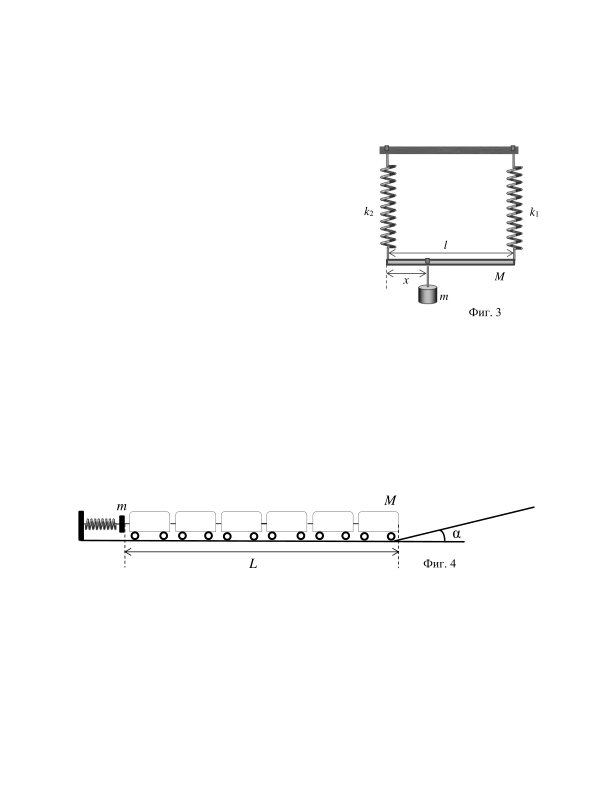
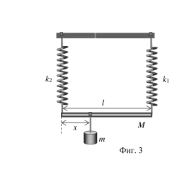
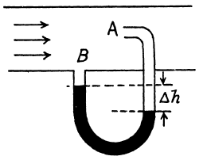

Задача 1. Две дървени трупчета, с маси $m_1$ и $m_2$, са свързани с нишка (Фиг. 1). Трупчето с маса $m_2$ се намира върху хоризонтална поставка, а нишката преминава през безтегловна макара. Коефициентът на триене между $m_2$ и поставката е $k$. В началото системата се намира в покой.

А) Намерете ускоренията на трупчетата $a_1$, $a_2$ и силите на опън $T_1$ и $T_2$ , действащи в двата края на нишката.

Б) Определете големината и посоката на силата $F$, с която нишката действа върху макарата.

В) Намерете ускоренията на трупчетата $a_1$ и $a_2$, силите на опън $T_1$ и $T_2$ , действащи в двата края на нишката, ако равнината сключва ъгъл $\alpha$ с хоризонта (Фиг. 2). Приемете, че трупчето с маса $m_1$ се спуска надолу.

Г) При какво отношение между масите $m_1/m_2 =$ ? трупчетата ще се движат равномерно?

Д) Какво ще бъде ускорението a в подусловие А), ако макарата се приеме за диск с радиус $R$ и маса $М$. Инерчен момент на въртящ се около оста си диск е $I = \frac{1}{2} MR^2$. Нишката не приплъзва по макарата.

Задача 2. Част 1. Еднородна пръчка с маса $M$ и дължина $l$ е закачена за две пружини с коефициенти на еластичност $k_1$ и $k_2$ съответно. Двете пружини имат еднаква дължина, когато не са в деформирано състояние. След това се закачa допълнителна теглилка с маса m, така че пръчката e хоризонтална (Фиг. 3).

A) Намерете силите на опън $F_1$ и $F_2$, действащи на двете пружини.

Б) На какво разстояние x от левия край на пръчката трябва да се постави теглилка с маса $m$?

В) Намерете вертикалният период на трептене $Т$ на полученото махало.
 
Част 2. Влак-играчка с обща маса $M$ и с обща дължина $L$ се състои от голям брой малки вагони (Фиг. 4). От едната страна влакът се допира до бутало с маса $m$, което е закрепено към недеформирана пружина с коефициент на еластичност $k$. Другият край на влака се намира в основата на наклонена равнина, сключваща ъгъл $\alpha$ с хоризонта. Влакът се отмества на разстояние d вляво така, че пружината да се свие. След като бъде освободена, пружината избутва влака към наклонена равнина. Влакът спира, когато част от дължината на композицията се намира върху наклонената равнина.

А) Колко време $t_0$ пружината ще действа върху играчката?

Б) Намерете с каква скорост $v_0$ играчката ще достигне наклонената равнина.

В) След колко време $t$ играчката ще спре, след като започне да се изкачва по наклона?

Триенето да се пренебрегне. Да не се отчитат дължината на вагоните и разстоянията между тях.

Задача 3. Част 1. В древна Гърция са използвали водни часовници - голям съд с малък отвор, през който изтича водата (Фиг. 5). Времето се е отчитало по нивото на водата в съда.

А) С каква скорост изтича v водата от съда, ако приемете, че напречното сечение на съда е много широко спрямо отвора (формула на Торичели), ако височината на водния стълб е h?

Б) Изведете "уравнението за непрекъснатост", т.е. връзката между скоростта $v$, с която флуидът минава през дадено напречно сечение и площта $S$ на сечението.

В) Каква трябва да бъде формата на съда, така че скалата на времето да бъде равномерна, т.е. стойностите на деленията от скалата да са равни. Да се намери формата на съда означава да се намери функционалната зависимост $y = y(x)$ между координатите $y$ и $x$ на точките от стената на съда.

Г) Обяснете защо при много ниско ниво, т.е. нивото е близо до
отвора, грешката между теоретичните пресмятания и
експериментални данни е много голяма.

Фиг. 5

Част 2. Тръба на Пито. На фигурата е показана широка тръба от газопровод. В тръбата е монтирана тънка тръбичка, както е показано на чертежа (Фиг. 6). Извитата част от тръбичката се намира в средата на газопровода. Тънката тръбичка съдържа живак. Разликата в нивата на живачния стълб в двете колена на тънката тръбичка е $\Delta h$. Плътността на живака е $\rho$, а на газа е $\rho_1$.

А) Намерете скоростта $v$ на гaза в газопровода.

Б) Намерете преминалия обем $Q$ през напречното сечение на газопровода за единица време. (Приемете, че флуидът е идеален)

В) Разбира се, че ще има разлика между опитните стойности от измерването и теоретичните. Обяснете кои фактори биха повлияли на точността на измерването. Фиг. 6
