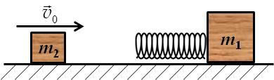

[[Състезания/2/11/2021|◂ 2021]] | [[Състезания/2/11r/2022|решения]] | [[Състезания/2/11/2023| 2023 ▸]]

**Задача 1. Пряк свободен удар**

 Футболист изпълнява пряк свободен удар, като изритва топката от земната
повърхност с начална скорост $v_0 = 17\ \mathrm{m/s}$ под определен ъгъл спрямо хоризонта.
Топката достига максимална си височина със скорост $v_1 = 15\ \mathrm{m/s}$ и пада на земята, без да се удари по пътя си в друг играч или във вратата. Съпротивлението на въздуха се пренебрегва. Приемете, че $g = 10\ \mathrm{m/s^2}$.

Намерете максималната височина $H$, на траекторията на топката и разстоянието $L$, на което топката пада от точката на изпълнение на удара. \[10 точки\]

*Упътване.* Търсените величини може да бъдат определени в различна последователност в зависимост от метода на решаване на задачата.

**Задача 2. Удар с пружина**

 Върху хоризонтална повърхност е поставено неподвижно трупче с маса $m_1 = 300\ \mathrm{g}$ , към което е закрепена хоризонтална пружина с коефициент на еластичност $k = 3,0.10^3\ \mathrm{N/m}$, както е показано на фигурата. Масата на пружината е много по-малка от масата на трупчето. Към пружината се хлъзга друго трупче с маса $m_2 = 100\ \mathrm{g}$, което се движи със скорост $v_0 = 5,0\ \mathrm{m/s}$. Триенето между трупчетата и хоризонталната повърхност се пренебрегва.

а) Намерете максималната деформация (свиване) $\Delta l$ на пружината, след като трупчето 2 се удари в пружината. \[6 точки\]

б) Определете големините и посоките на скоростите $\vec v_1$ и $\vec v_2$, с които се движат двете трупчета, след като трупчето 2 се отдели от пружината. \[4 точки\]

**Задача 3. Препятствие**

Гимнастичка пуска обръч с радиус $R$ и маса $m$ да се търкаля без да приплъзва по хоризонталния под на залата. Скоростта на центъра на обръча е $v_0$. Обръчът достига заоблено препятствие с височина $h$, което в горната си част има форма на дъга от окръжност с радиус $r$, както е показано на фигурата. Обръчът преминава препятствието, без да се отдели от повърхността му и без да приплъзва (т.е. търкаляйки се).

а) Колко е инерчният момент $I$ на обръча спрямо ос, минаваща през центъра му и перпендикулярна на неговата равнина? \[1 точка\]

б) На колко е равна ъгловата скорост $\omega_0$ и кинетичната енергия $E_{\text{к}0}$ на обръча, докато се търкаля по хоризонталния под? \[4 точки\]

в) Колко е скоростта $v_1$ на центъра на обръча, когато той минава през върха на
препятствието (вж. фигурата)? \[2 точки\]

г) Определете максималната начална скорост $v_{0,\max}$, при която обръчът може да
премине препятствието, без да се отдели (т.е. без да подскочи) от повърхонсстта му. \[3 точки\]