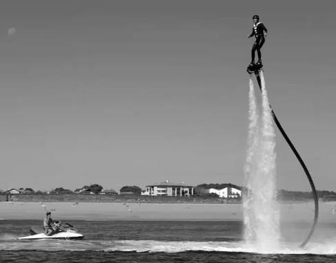

Задача 1. Фонтан.

Фонтан има формата на кръг с радиус $R = 6,4\ \mathrm{m}$. Точно в центъра на основата му има пръскалка, представляваща надупчено полукълбо с малки (пренебрежими) размери. От всичките ѝ дупки излизат водни струи с една и съща скорост, но под всякакви ъгли. Струите пръскат основата на целия фонтан, точно до ръба му. Приемете, че земното ускорение е $g = 10\ \mathrm{m/s^2}$.

а) Получете началния ъгъл $\alpha$ на струята, която пръска най-надалеч (до ръба на фонтана). \[4 т.\]

б) На каква максимална височина $h$ се издига струята, която пръска най-надалеч (до ръба на фонтана)? \[2 т.\]

в) На каква максимална височина $H$ пръска фонтанът? \[2 т.\]

г) Каква е началната скорост $v_0$ на струите, излизащи от фонтана? \[2 т.\]

Задача 2. Телескопът "Джеймс Уеб"

В прост модел може да се приеме, че телескопът "Джеймз Уеб" се движи по такава кръгова орбита, че той винаги лежи на правата Слънце-Земя, като се намира по-далеч от Слънцето в сравнение със Земята, както е показано на фигурата. Приемете, че Земята се движи по кръгова орбита и периодът ѝ на обикаляне е $T = 365$ дни. Приемете, че масата на Слънцето M е много по-голяма от масата на Земята m, а масата на Земята m е много по-голяма от масата на телескопа $\mu$. Разстоянието Слънце-Земя се бележи с $L$, а разстоянието Земя-телескоп се бележи с x. Оказва се, че $x \ll L$. Гравитационната константа е $G$.

а) Получете формула за масата на Земята $m$, изразена чрез $G$, земното ускорение g и радиуса на Земята $R$. \[2 т.\]

б) Получете формула за x (изразено чрез G, m, и T). \[4 т.\]

Използвайте приближението: ако $|y| \ll 1$ и n е реално число, то $(1 + y)^n \approx 1 + ny$.

в) Преобразувайте формулата за x от предното подусловие, като сега изразите x чрез периода T, земното ускорение g и радиуса на Земята R. \[2 т.\]

г) Изчислете x като приемете, че $g = 9,81\ \mathrm{m/s^2}$, a $R = 6400\ \mathrm{km}$. \[2 т.\]

Задача 3. Флайборд (Flyboard)

Флайбордът е устройство, изобретено през 2012 г. Представлява платформа, върху която стъпва човек. Платформата е свързана с дебел маркуч (шланг) с воден джет. Когато джетът подаде вода с достатъчно голям дебит по маркуча, платформата се издига във въздуха, като излизащата вода изтича надолу (виж снимката). Да допуснем най-простия модел: водата е идеален флуид (няма вискозитет), маркучът е вертикален и изтичащите струи вода също са вертикални, като скоростите на идващата вода и изтичащата вода са равни. Земното ускорение е $g = 9,81\ \mathrm{m/s^2}$, общата маса на човека, платформата и висящата част на маркуча е M = 100 kg, плътността на водата е $\rho$ = 1000 kg/m3, а вътрeшния диаметър на маркуча е d = 11,0 cm.

a) Получете формула и изчислете с каква скорост v трябва да се движи водата по маркуча, така че човекът да "виси във въздуха". \[6 т.\]

б) Каква е минималната мощност P на двигателя на джета, за да осигури движението на водата по описания начин? Приемете, че човекът "виси" на височина h = 7,0 m. \[4 т.\]