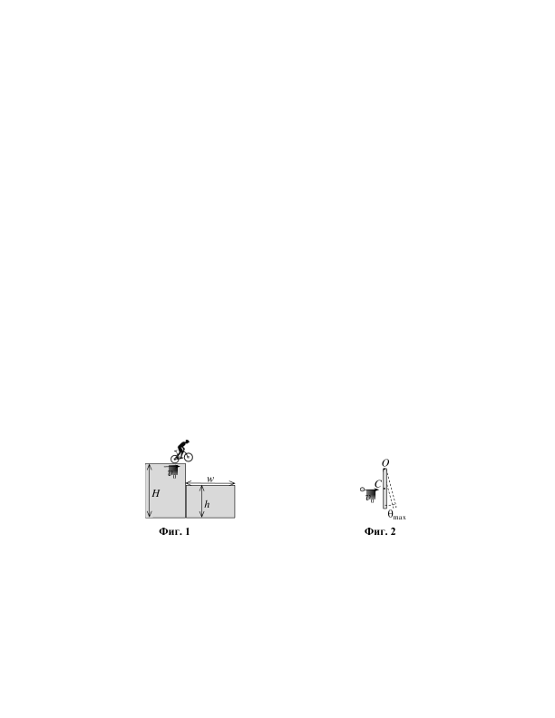

[[Състезания/2/11/2023|◂ 2023]] | [[Състезания/2/11r/2024|решения]] | [[Състезания/2/11/2025| 2025 ▸]]

Във всички задачи може да приемете, че земното ускорение е известно и има стойност $g = 9,8\ \mathrm{m/s^2}$ .

При решение на задачите, ако не разполагате с подходящ калкулатор, може да използвате таблицата на тригонометричните функции, дадена на трета страница.

**Задача 1. Скок като на кино**

 В екшън-филм главният герой скача с велосипед от хоризонталния покрив на
сграда с височина и прелита над контейнер с широчина $w = 4,5\ \mathrm{m}$ и височина $H = 5,0\ \mathrm{m}$, допиращ се до стената на сгадата. Скоростта $\vec v_0$ на велосипеда в момента на скока е хоризонтална. Разглеждайте системата от велосипеда и велосипедиста като материална точка.

а) При каква минимална големина на началната скорост велосипедът може да прелети над контейнера, без да се удари в него? \[4,0 т\]

Ако велосипедистът скочи с минималната възможна начална скорост, определете:

б) разстоянието $L$ от контейнера, на което се приземява велосипедът; \[2,0 т\]

в) ъгъла $\alpha$, който сключва с хоризонта векторът $\vec v$ на скоростта на велосипеда в момента на приземяването. Изразете отговора с точност до цяло число градуси. \[4,0 т\]

**Задача 2. Балистично махало**

 Балистичното махало, показано на фиг. 2, е прост уред, с чиято помощ може да се определи скоростта на куршум или друг бързодвижещ се обект. Състои се от еднородна дъска с маса $M = 10,0\ \mathrm{kg}$ и дължина $l = 0,500\ \mathrm{m}$, която може да се люлее без триене около хоризонталната ос $O$ (перпендикулярна на чертежа)\*. Първоначално дъската е вертикална и неподвижна. После, курщум с маса $m = 0,010\ \mathrm{kg}$ е изстрелян хоризонтално с неизвеста начална скорост $v_0$ към центъра C на дъската и остава в нея. Дъската започва да се люлее, като се отклонява на максимален ъгъл $\theta_{\max}$ спрямо вертикалата.

а) Кои/кой от следните закони за запазване са/е в сила по време на удара между куршума и дъската: (1) закон за запазване на механичната енергия; (2) закон за запазване на импулса; (3) закон за запазване на момента на импулса? Обосновете накратко отговора си. \[1,5 т\]

б) Получете израз за ъгловата скорост $\omega$ на дъската непосредствено след удара с куршума като функция на $M,l,m$ и $v_0$. \[3,5 т\]

в) Получете израз и пресметнете началната скорост $v_0$ на куршума. \[5,0 т\]

\* *Упътване.* Инерчният момент на еднородна пръчка или дъска с маса M и дължина спрямо ос, минаваща през единия ѝ край, е: $I = Ml^2/3$.

**Задача 3. Кръгови траектории**

 Малко топче (материална точка) с маса $m$ е окачено на лека и неразтеглива нишка с дължина $l$, закрепена неподвижно в точка О. Земното ускорение $g$ се приема за дадено. В тази задача ще изследвате два различни вида движение на топчето.

а) Топчето е отклонено така, че нишката сключва ъгъл $\alpha$ с вертикалата, както е показано на фиг. 3, а.

 - Направете чертеж, на който да изобразите силите, действащи на топчето. \[1,0 т\]
 - Каква начална скорост $v_0$ трябва да бъде придадена на топчето в хоризонтално направление, перпендикулярно на чертежа, така че то да започне да обикаля по окръжност около вертикалната ос OO', минаваща през точката на окачване (вж. фиг. 3, а)? \[3,5 т\]
 - Колко ще бъде при това периодът $T$ на обикаляне по окръжността? \[1,0 т\]

б) Махалото е поставено така, че топчето е в равновесие, т.е. вертикално под точката на окачване (фиг. 3, б). Колко е минималната начална скорост $v_1$, която трябва да бъде придадена на топчето, за да опише вертикална окръжност около т. О? \[4,5 т\]