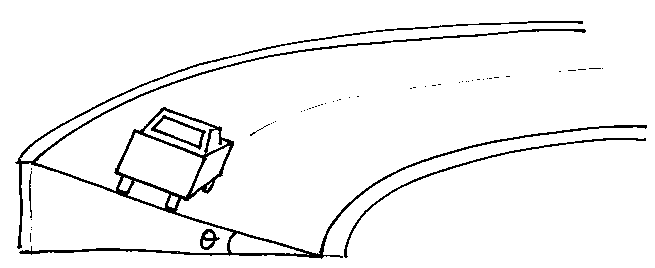
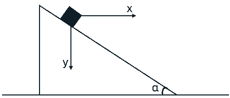

[[Състезания/2/11/2025|◂ 2025]] | [[Състезания/2/11r/2026|решения]]

**Задача 1. Спасителен сигнал**

От палубата на кораб от височина $h_0$ над морската повърхност е изстреляна сигнална ракета с начална скорост $v_0$ под ъгъл $\alpha$ спрямо хоризонта. Да се намерят:

**а)** максималната височина $H$, на която се издига ракетата над морето; \[2 т.\]
**б)** времето $T$ на полета на ракетата до падането ѝ в морето; \[3 т.\]
**в)** хоризонталната далечина $L$ на полета на ракетата; \[2 т.\]
**г)** при какъв ъгъл $\alpha$ далечината на полета е максимална и колко е $L_{max}$? Достатъчно е да намерите тригонометрична функция от търсения ъгъл. \[3 т.\]

**ЗАДАЧА 2. Завой**

Автомобил с маса $m$, движещ се равномерно, навлиза в завой, който е част от окръжност с радиус $R$. Пътят е наклонен под ъгъл $\theta$ спрямо хоризонта (вж. фигурата). Автомобилът се разглежда като материална точка. Ускорението на свободното падане е $g$. Съпротивлението на въздуха се пренебрегва. Коефициентът на триене между гумите и настилката на пътя е $k$.

**а)** Пътят е хоризонтален ($\theta = 0$). Да се намери максималната скорост $v_{max}$, при която автомобилът може да вземе завоя, без гумите му да приплъзват. \[2 т.\]
**б)** Пътят е наклонен под ненулев ъгъл $\theta$, но триенето е пренебрежимо малко ($k = 0$). Да се намери скоростта $v_0$, при която автомобилът може да вземе завоя без приплъзване. \[2 т.\]
**в)** Пътят е наклонен под ъгъл $\theta$, а триенето не е пренебрежимо ($k > 0$). Да се намери минималната скорост $v_{min}$, при която автомобилът ще следва завоя, без да се приплъзва надолу по наклона. \[3 т.\]
**г)** На писта от сериите НАСКАР със следните параметри $R = 305\text{ m}$ и $\theta = 33^\circ$ е постигната скорост от $v = 216\text{ mph}$ (мили в час). Да се намери минималният коефициент на триене $k_{min}$, необходим автомобилът да вземе завоя без приплъзване. \[3 т.\]

*Данни:* $g = 9,81\text{ m/s}^2$; $1\text{ mile (миля)} = 1,609\text{ km}$.

**ЗАДАЧА 3. Трупче върху клин**

Клин с маса $M$ и ъгъл при основата $\alpha$ се намира върху гладка хоризонтална повърхност. Върху наклонената страна на клина е поставено малко тяло (трупче) с маса $m$. Триенето между всички повърхности, както и съпротивлението на въздуха, се пренебрегват. Земното ускорение е $g$. В началния момент системата е в покой, след което се освобождава. За описание на движението въведете координатна система, при която оста $Ox$ е хоризонтална, а оста $Oy$ е насочена надолу. Клинът започва да се движи наляво с постоянно ускорение с големина $a_M$, а трупчето с ускорение, чиито компоненти спрямо осите $Ox$ и $Oy$ са съответно $a_x$ и $a_y$.

**а)** Докажете кинематичната връзка между компонентите на ускорението на трупчето $a_x$ и $a_y$, ускорението на клина $a_M$ и ъгъла $\alpha$: \[2 т.\]
$$\frac{a_y}{a_x + a_M} = \text{tg } \alpha$$

**б)** Намерете израз за големината $a_M$ на ускорението на клина. Изразете отговора чрез $m, M, g$ и $\alpha$. \[3 т.\]
**в)** Намерете големината на силата на нормална реакция $N$, с която трупчето действа върху повърхността на клина по време на движението. \[2 т.\]
**г)** Намерете относителното ускорение $a_{rel}$ на трупчето спрямо клина, т.е. ускорението му, ако разглеждаме клина като отправно тяло. \[3 т.\]