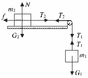
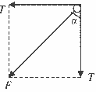
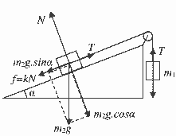
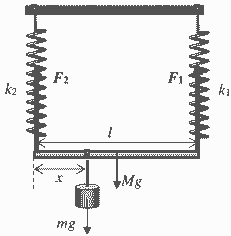
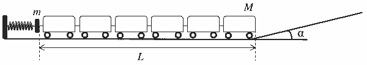
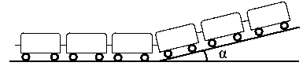

[[Състезания/2/10-12/2020|◂ 2020]] | [[Състезания/2/11/2021|условия]] | [[Състезания/2/11/2022| 2022 ▸]]

**Задача 1.** Прилагаме закона на Нютон за двете тела:

А) \[Максимум 2 точки\] За $m_1$: $G_1 – T = m_1a_1$

За $m_2$: $T – f = m_2a_2$ (по хоризонтална ос)

$N – G_2 = 0$ (по вертикална ос)

**За правилно написана система уравнения (1 т.)**

Ускоренията на телата са равни, защото нишката е неразтеглива ($a_1 = a_2 = a$).
Отбелязаните сили на опън са равни ($T_1 = T_2 = T$), защото макарата е безтегловна.

След като отчетем, че $f = kN$ решаваме системата уравнения и се получава:
$$a = \frac{m_1 - km_2}{m_1 + m_2}g$$
$$T = \frac{m_1m_2(1 + k)}{m_1 + m_2}g$$
**За достигане до правилен отговор (1 т.)**

Б) \[Максимум 2 точки\] векторната сума на двете сили $T$ (виж чертежа) ще действат на макарата. Понеже силите са равни и сключват прав ъгъл, то търсената сила $F$ ще бъде насочена под ъгъл $\alpha = 45^\circ$ (виж чертежа). След прилагане на питагорова теорема се получава големината на силата $F$:
$$F = T \cdot \sqrt{2} = \frac{m_1m_2(1 + k)}{m_1 + m_2}g\sqrt{2}$$
**За достигане на верен отговор (1 т.)**

В) \[Максимум 2 точки\] след прилагане на втори закон на Нютон за двете тела (аналогично на подусловия А)) и отчитане, че двете сили на опън $T_1 = T_2 = T$ и $a_1 = a_2 = a$:

За $m_1$: $m_1g – T = m_1a$

За $m_2$: $T – m_2g\sin\alpha – km_2g\cos\alpha = m_2a$

**За вярна система уравнения (1 т.)**

След решаване на системата уравнения се получават търсените отговори:
$$a = \frac{m_1 - m_2(\sin\alpha - k\cos\alpha)}{m_1 + m_2}g$$
$$T = \frac{m_1m_2(1 + \sin\alpha + k\cos\alpha)}{m_1 + m_2}g$$
**За верен отговор (1 т.)**

Г) \[Максимум 2 точки\] За да се движат равномерно е необходимо ускорението $a = 0$ …**(1 т.)**
$$a = \frac{m_1 - m_2(\sin\alpha - k\cos\alpha)}{m_1 + m_2}g = 0$$
$$m_1 - m_2(\sin\alpha - k\cos\alpha) = 0$$
$$\frac{m_1}{m_2} = \sin\alpha - k\cos\alpha$$
**За верен отговор (1 т.)**

Д) \[Максимум 2 точки\] Ускоренията на телата ще са равни, т.е. $a_1 = a_2 = a$, но $T_1 \neq T_2$.

За $m_1$: $m_1g – T_1 = m_1a$

За $m_2$: $T_2 – km_2g = m_2a$

За макарата: $(T_1 - T_2)R = \frac{1}{2}MR^2 \cdot \frac{a}{R}$

**За вярна система уравнения (1 т.)**

В последното уравнение сме отчели връзката между въртящия момент, инерчния момент и ъгловото ускорение, т.е. $M = I \cdot \varepsilon$. При липса на хлъзгане ъгловото ускорение $\varepsilon = a/R$.

След решаване на системата уравнения се получава и търсеният отговор:
$$a = \frac{(m_1 - km_2)g}{m_1 + m_2 + \frac{M}{2}}$$
**За верен отговор (1 т.)**

**Задача. 2. Решение**

А) \[Максимум 1,5 точки\] Двете пружини са с еднаква дължина в недеформирано състояние. За да бъде пръчката хоризонтална след като е закачена допълнителната теглилка, това означава, че деформациите на двете пружини са равни, т.е.

$\Delta x_1 = \Delta x_2 = \Delta x$ …**(0,5 т.)**

Записваме условието за равновесие на пръчката:

$Mg + mg – F_1 – F_2 = 0$

$(M + m)g = (k_1 + k_2)\Delta x$
$$\Delta x = \frac{(M + m)g}{k_1 + k_2}$$
**За намиране на деформацията на пружините (0,5 т.)**

След като сме намерили деформацията $\Delta x$ на двете пружини лесно се намират силите на еластичност $F_1 = k_1\Delta x$ и $F_2 = k_2\Delta x$.
$$F_1 = k_1\frac{(M + m)g}{k_1 + k_2}$$
$$F_2 = k_2\frac{(M + m)g}{k_1 + k_2}$$
**За получаване на верен отговор (0,5 т.)**

Б) \[Максимум 1,5 точки\] За да определим разстоянието $x$ ще използваме второто условие за равновесие на твърдо тяло, свързано с моментите на въртене. Избираме ос на въртене - левия край на пръчката.
$mgx + Mgl/2 – F_2l = 0$

**За правилно написано условие за равновесие (0,5 т.)**

лесно се намира търсеното $x$:
$$x = \frac{F_2l - Mgl/2}{mg}$$
Като използваме намерената вече сила $F_2$ и заместим:
$$x = \frac{l}{m}\left(\frac{k_2(M + m)}{k_1 + k_2} - \frac{M}{2}\right)$$
**За верен отговор (1 т.)**

В) \[Максимум 1 точка\] За да намерим периода на трептене на полученото махало е необходимо да намерим еквивалентния коефициент на еластичност. От подусловие А) е ясно, че еквивалентният коефициент на еластичност е $k = k_1 + k_2$ …**(0,5 т.)**

Периодът е: $T = 2\pi\sqrt{\frac{m + M}{k_1 + k_2}}$

**За намиране на периода на трептене (0,5 т.)**

**Част 2.**

А) \[Максимум 1 точка\] Пружината ще действа със сила върху играчката, докато деформацията на пружината не стане равна на нула, т.е. търсеното време е една четвърт от периода на полученото хоризонтално пружинно махало:
$$t_0 = \frac{\pi}{2}\sqrt{\frac{m + M}{k}}$$
**За достигане до верен отговор (0,5 т.)**

След това буталото намалява скоростта си, заради разтягането на пружината, а влакът се отделя от буталото и продължава движението си по инерция. …**(0,5 т.)**

Б) \[Максимум 1 точка\] Използваме закона за запазване на енергията. Потенциалната енергия на свитата пружина ще се превърне изцяло в кинетична, при достигане на равновесното положение:
$$\frac{kd^2}{2} = \frac{(m + M)v_0^2}{2}$$
**За правилно прилагане на закона за запазване на енергията (0,5 т.)**
$$v_0 = d\sqrt{\frac{k}{m + M}}$$
**За верен отговор (0,5 т.)**

В) \[Максимум 4 точки\] Разглеждаме произволен момент от време, когато върху наклона се е изкачила $x$ част от композицията на влака-играчка. Центърът на масата на изкачената част се намира по средата.

Следователно височината на центъра на масата е:

$h = x\sin\alpha/2$ …**(0,5 т.)**

Масата на изкачената част е $m = Mx/L$. …**(0,5 т.)**

Прилагаме закона за запазване на енергията:
$$\frac{Mv_0^2}{2} = \frac{Mv^2}{2} + mgh$$
$$\frac{Mv_0^2}{2} = \frac{Mv^2}{2} + \frac{Mx}{2L}g \cdot x\sin\alpha$$
$$\frac{Mv_0^2}{2} = \frac{Mv^2}{2} + \frac{Mg\sin\alpha}{L} \cdot \frac{x^2}{2}$$
**За достигане на уравнението (1 т.)**

Лявата страна на равенството $\frac{Mv_0^2}{2} = const$. Дясната страна се явява аналог на енергия на махало, извършващо хармонично трептене. От коефициентите пред $x^2$ и $v^2$ лесно намираме кръговата честота $\omega$ на това трептене.

$$\omega = \sqrt{\frac{g\sin\alpha}{L}}$$
Тогава периодът е $T = 2\pi\sqrt{\frac{L}{g\sin\alpha}}$ … **За определяне на периода (1 т.)**

Играчката ще спре напълно след време четвърт период – аналог на движение на махало, преминаващо през равновесното положение и достигащо максимална височина:
$$t = \frac{\pi}{2}\sqrt{\frac{L}{g\sin\alpha}}$$ … **За определяне на времето (1 т.)**

**Задача. 3. Част 1.**

А) \[Максимум 1 точка\] За достигане до формулата на Торичели: $v = \sqrt{2gH}$ …**(1 т.)**

Б) \[Максимум 1 точка\] За доказателство уравнение на непрекъснатост: $Sv = const$, или $S_1v_1 = S_2v_2$ …**(1 т.)**

В) \[Максимум 3 точки\] Отвора, от който изтича водата е малък и следователно можем да приложим формулата на Торичели:
$$v = \sqrt{2gy}$$
Площта на горната повърхност на водата е $S = \pi x^2$. Скоростта $v_1$, с която се спуска горното ниво на водата ще намерим от уравнението за непрекъснатост:
$sv = Sv_1$

За да бъде скалата равномерна, т.е. стойността на деленията да са равни е необходимо скоростта $v_1 = const$. **(за правилно разсъждение 1 т.)**
$$v_1 = \frac{sv}{S} = \frac{s\sqrt{2gy}}{\pi x^2}$$
**За определяне на $v_1$ (1 т.)**

Повдигаме на квадрат двете страни и се получава търсения отговор:
$$y = \frac{\pi^2 v_1^2}{2gs^2}x^4$$
т.е. $y = a \cdot x^4$.
**За верен отговор (1 т.)**

Г) \[Максимум 1 точка\] За посочване на поне два фактора за увеличаване на грешката ……**(1 т.)**:
*   формула на Торичели е с приближение при условие, че отношението на сеченията $S/s$ е много голямо;
*   не се отчита вискозитета на течността;
*   когато горното ниво се доближи до отвора може да се получат завихряне като от сифона на мивката и това ще доведе до увеличаване на грешката.
И/или други фактори, които имат отношение към увеличаване на грешката.

**Част 2.**
А) \[Максимум 1 точка\] След прилагане на уравнение на Бернули:
$$\rho g\Delta h = \frac{\rho_1 v^2}{2}$$
$$v = \sqrt{\frac{\rho g\Delta h}{\rho_1}}$$
**За достигане на верен отговор (1 т.)**

Б) \[Максимум 2 точки\] $Q = S \cdot v$ …**(1 т.)**
$$Q = S\sqrt{\frac{\rho g\Delta h}{\rho_1}}$$
**За верен отговор (1 т.)**

В) \[Максимум 1 точка\] За посочване на поне два фактора за увеличаване на грешката … **(1 т.)**:
*   тръбичката никога не може да бъде поставена точно в средата на тръбата;
*   приема се, че скоростта на газа е една и съща по напречното сечение на тръбата;
*   приема се, че тръбичката не променя ламинарния поток на газа в тръбата.
И/или други фактори, които имат отношение към увеличаване на грешката.