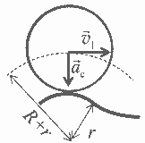

[[Състезания/2/11/2021|◂ 2021]] | [[Състезания/2/11/2022|условия]] | [[Състезания/2/11/2023| 2023 ▸]]

**Задача 1. Пряк свободен удар**
Тъй като съпротивлението на въздуха е пренебрежимо, приемаме, че пълната механична енергия на топката се запазва. От закона за запазване на механичната енергия следва, че:

(1) $\frac{mv_0^2}{2} = \frac{mv_1^2}{2} + mgH$ **(1 т)**

откъдето намираме:

(2) $H = \frac{v_0^2 - v_1^2}{2g} = 3,2 \text{ m.}$ **(1 т)**

*Коментар.* При липсващ аналитичен израз или при грешен числен отговор се отнемат по 0,5 точки.

При движение под действие на силата на тежестта хоризонталната компонента на скоростта на топката се запазва, т.е. $v_x = \text{const}$. От друга страна, вертикалната компонента на скоростта е нула в най-високата точка от траекторията. Следователно:

(3) $v_x = v_1$. **(1 т)**

В момента на изстрелването на топката $v_0^2 = v_x^2 + v_{0y}^2$, където $v_{0y}$ е вертикалната компонента на началната скорост. Следователно:

(4) $v_{0y} = \sqrt{v_0^2 - v_1^2}$ **(1 т)**

След изстрелването на топката, хоризонталната ѝ координата $x$ и вертикалната ѝ координата $y$ (т.е. височината над земната повърхност) се променят съответно по закона:

(5) $x = v_x t = v_1 t$ **(1 т)**

(6) $y = v_{0y} t - \frac{gt^2}{2}$ **(1 т)**

В момента $t_2$, когато топката се приземява, вертикалната ѝ координата е нула, т.е.

(7) $v_{0y} t_2 - \frac{gt_2^2}{2} = 0$. **(1 т)**

Оттук намираме времето за полета на топката:

(8) $t_2 = \frac{2v_{0y}}{g}$ **(1 т)**

и съответно изразяваме далечината на полета:

(9) $L = v_1 t_2 = \frac{2v_1 \sqrt{v_0^2 - v_1^2}}{g}$ **(1 т)**

След като заместим с числените данни, получаваме:

(10) $L = \frac{2 \cdot 15 \text{ m/s} \cdot 8 \text{ m/s}}{10 \text{ m/s}^2} = 24 \text{ m.}$ **(1 т)**

**Алтернативно решение**

Възможно е ученикът първо да определи разстоянието $L$, като следва стъпките от (3) до (10), за което му се присъждат предвидените в решението общо 8 точки. След това, височината $H$ може да бъде намерена кинематично в следните три стъпки, които носят общо 2 точки.
Вертикалната компонента на скоростта на топката се променя по закона:

(11) $v_y = v_{0y} - gt$. **(0,5 т)**

В момента на достигане на максимална височина $v_y = 0$, откъдето изразяваме времето за издигане на топката:

(12) $t_u = \frac{v_{0y}}{g}$. **(0,5 т)**

След като заместим времето в уравнение (6) и вземем предвид уравнение (4), определяме максималната височина:

(13) $H = y(t_u) = \frac{v_0^2 - v_1^2}{2g} = 3,2 \text{ m.}$ **(1 т)**

Както при енергетичния метод за решаване, при липсващ аналитичен израз или при грешен числен отговор се отнемат по 0,5 точки.

**Задача 2. Удар с пружина**

а) След като трупчето 2 се допре до пружината, тя започва да се свива. Под действие на силата на еластичност трупчето 1 започва да се ускорява, а трупчето 2 – да се забавя. Пружината ще бъде максимално свита, когато скоростите на двете трупчета се изравнят, т.е. $\vec{v}_1 = \vec{v}_2 = \vec{v}$. **(1 т)**

Тъй като силата на еластичност е вътрешна за системата, общият импулс на системата се запазва:

(1) $m_2 \vec{v}_0 = (m_1 + m_2) \vec{v}$, **(1 т)**

откъдето скоростта на трупчетата в момента на максимална деформация е:

(2) $\vec{v} = \frac{m_2 \vec{v}_0}{m_1 + m_2}$ **(1 т)**

В момента на максимална деформация, пружината има потенциална енергия:

(3) $W = \frac{k\Delta \ell^2}{2}$. **(1 т)**

Тъй като в системата не действат неконсервативни сили (триене, съпротивление), механичната ѝ енергия се запазва:

(4) $\frac{m_2 v_0^2}{2} = \frac{(m_1 + m_2)v^2}{2} + \frac{k\Delta \ell^2}{2}$, **(1 т)**

откъдето намираме максималната (по модул) деформация на пружината:

(5) $\Delta \ell = v_0 \sqrt{\frac{m_1 m_2}{k(m_1 + m_2)}} = 0,025 \text{ m} = 2,5 \text{ cm.}$ **(1 т)**

б) Трупчето 2 се отделя от пружината в момента, когато тя възстанови първоначалната си дължина. В този момент потенциалната енергия на пружината е нула. Следователно в този момент сумарната кинетична енергия на трупчетата е равна на кинетичната енергия на трупчето 2 преди удара:

(6) $\frac{m_2 v_0^2}{2} = \frac{m_1 v_1^2}{2} + \frac{m_2 v_2^2}{2}$. **(1 т)**

Избираме ос $X$ в посоката на началната скорост на трупчето 2. В тази подточка с $v_1$ и $v_2$ означаваме компонентите на скоростите на двете трупчета по оста $X$, т.е. величини със знак, който зависи от посоката на движение на трупчетата. Тогава от закона за запазване на импулса получаваме:

(7) $m_2 v_0 = m_1 v_1 + m_2 v_2$. **(1 т)**

След като решим системата уравнения (6) и (7), получаваме:

(8) $v_1 = \frac{2m_2 v_0}{m_1 + m_2} = 2,5 \text{ m/s}$ **(1 т)**

и

(9) $v_2 = \frac{(m_1 - m_2) v_0}{m_1 + m_2} = -2,5 \text{ m/s}$ **(1 т)**

Знакът минус на скоростта $v_2$ означава, че след удара второто трупче се движи в посока, противоположна на първоначалната му посока на движение.

**Задача 3. Препятствие**

а) Тъй като всички точки от обръча се намират на еднакво разстояние от оста му, инерчният момент на обръча е:

(1) $I = mR^2$ **(1 т)**

б) При търкаляне ъгловата скорост и скоростта на центъра на обръча са свързани с равенството $v = \omega r$. Следователно:

(2) $\omega_0 = \frac{v_0}{R}$. **(1 т)**

Кинетичната енергия на обръча е сума от енергията на постъпателно движение:

(3) $E_{\text{пост}} = \frac{mv^2}{2}$ **(1 т)**

и енергията на въртеливо движение спрямо ос, минаваща през центъра му:

(4) $E_{\text{върт}} = \frac{I\omega^2}{2}$. **(1 т)**

Като вземем предвид връзката между скоростта на центъра и ъгловата скорост при търкаляне, намираме кинетичната енергия на обръча, докато се търкаля по хоризонталната повърхност:

(5) $E_{k0} = \frac{mv_0^2}{2} + \frac{I\omega_0^2}{2} = \frac{mv_0^2}{2} + \frac{mR^2(v_0/R)^2}{2} = mv_0^2$. **(1 т)**

в) Тъй като обръчът се търкаля през цялото време, следва, че кинетичната му енергия, когато достига върха на препятствието, е $E_{k1} = mv_1^2$. Приемаме пода на залата за нулево ниво на потенциалната енергия. Тогава центърът на обръча се намира на височина $R$, докато се търкаля по пода, и на височина $R+h$, когато минава през върха на препятствието. От закона за запазване на енергията следва:

(6) $mv_0^2 + mgR = mv_1^2 + mg(R + h)$, **(1 т)**

откъдето изразяваме скоростта на центъра на обръча, когато минава през върха на препятствието:

(7) $v_1 = \sqrt{v_0^2 - gh}$. **(1 т)**

г) Когато обръчът минава през върха на препятствието, центърът му се движи по окръжност с радиус:

(8) $R_1 = R + r$ **(0,5 т)**

и има центростремително ускорение с големина:

(9) $a_c = \frac{v_1^2}{R_1} = \frac{v_0^2 - gh}{R + r}$ **(0,5 т)**

и с посока вертикално надолу, както е показано на чертежа.

На обръча действат две сили във вертикално направление – силата на тежестта $G = mg$ надолу и силата $N$ на нормална реакция нагоре. От II принцип на механиката следва, че:

(10) $ma_c = mg - N$, **(0,5 т)**

откъдето изразяваме силата на нормална реакция:

(11) $N = mg - ma_c = mg - m \frac{v_0^2 - gh}{R + r} = m \frac{g(R + r + h) - v_0^2}{R + r}$ **(0,5 т)**

Ако обръчът преминава препятствието, без да се отделя от повърхността му:

(12) $N \ge 0$ **(0,5 т)**

Следователно максималната скорост, при която обръчът няма да подскочи, е:

(13) $v_{0, \text{max}} = \sqrt{g(R + r + h)}$. **(0,5 т)**