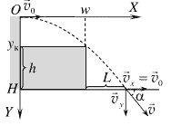
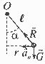
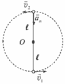

**Задача 1. Скок като на кино**

**а)** Избираме координатна система с начало в точката на скачане (ръба на сградата), хоризонтална ос $X$ и ос $Y$ с посока вертикално надолу, както е показано на фигурата.

Движението по оста $X$ e равномерно и се описва със закона:

(1) $x = v_0 t$ \[1,0 т\]

По оста $Y$ движението е равноускорително с ускорение $g$ и с нулева компонента на началната скорост:

(2) $y = \frac{gt^2}{2}$ \[1,0 т\]

$Y$-координата на покрива на контейнера е:

(3) $y_к = H - h$ \[0,5 т\]

Следователно велосипедът се оказва на височината на контейнера в момента:

(4) $t_1 = \sqrt{\frac{2(H - h)}{g}}$ \[0,5 т\]

За да прелети велосипедът над контейнера, е нужно $x(t_1) \geq w$, т.е.

(5) $v_0 t_1 = v_0 \sqrt{\frac{2(H - h)}{g}} \geq w$

Следователно минималната начална скорост е:

(6) $v_0 = w \sqrt{\frac{g}{2(H - h)}} \approx 7,0 \text{ m/s}.$ \[1,0 т\]

(0,5 т за буквен отговор + 0,5 т за верен числен отговор със записана единица)

**б)** В момента, когато велосипедът достига пътя, $y = H$. Следователно общото време на полета е:

(7) $t_2 = \sqrt{2H/g}$ \[0,5 т\]

Хоризонталната координата в този момент е:

(8) $x_2 = v_0 t_2$, \[0,5 т\]

а разстоянието до стената на контейнера – съответно:

(9) $L = x_2 - w = w \left( \sqrt{\frac{H}{H - h}} - 1 \right) \approx 2,6 \text{ m}.$ \[1,0 т\]

(0,5 т за буквен отговор + 0,5 т за верен числен отговор със записана единица)

**в)** Компонентата на скоростта по $Y$ е в момента на приземяването е:

(10) $v_y = gt_2 = \sqrt{2gH}$ \[1,0 т\]

От друга страна, хоризонталната компонента на скоростта не се променя:

(11) $v_x = v_0$ \[1,0 т\]

За ъгъла $\alpha$ е изпълнено:

(12) $\text{tg } \alpha = \frac{v_y}{v_x} = 2 \frac{\sqrt{H(H - h)}}{w} \approx 1,405$ \[1,0 т\]

От таблицата на тригонометричните функции виждаме, че на тази стойност на тангенса най-точно съответства ъгъл:

(13) $\alpha \approx 55^\circ$. \[1,0 т\]

**Задача 2. Балистично махало**

**а)** Ударът е абсолютно нееластичен, защото куршумът и дъската продължават да се движат като едно цяло тяло. Следователно част от кинетичната енергия се преобразува във вътрешна енергия (топлина) и механичната енергия не се запазва. \[0,5 т\] Импулсът също не се запазва, защото в момента на удара в горния край на дъската действа сила на реакция от страна на оста. \[0,5 т\] Запазва се единствено моментът на импулса спрямо оста, защото всички външни сили или са приложени в оста, или действат по права, минаваща през оста. \[0,5 т\]

**б)** Куршумът попада на разстояние $r = \ell/2$ от оста на въртене със скорост, перпендикулярна на радиус-вектора. Следователно преди удара моментът на импулса на куршума е:

(1) $L_0 = m v_0 r = m v_0 \frac{\ell}{2}$. \[0,5 т\]

След удара дъската и куршумът образуват едно цяло тяло с инерчен момент спрямо оста на въртене:

(2) $I = \frac{1}{3} M\ell^2 + mr^2 = \left( \frac{1}{3} M + \frac{1}{4} m \right) \ell^2$. \[0,5 т\]

Моментът на импулса на системата дъска + куршум след удара е:

(3) $L = I \omega$. \[0,5 т\]

От закона за запазване на момента на импулса, $L_0 = L$, следва:

(4) $m v_0 \frac{\ell}{2} = \left( \frac{1}{3} M + \frac{1}{4} m \right) \ell^2 \omega$, \[1,0 т\]

откъдето намираме ъгловата скорост на дъската след удара:

(5) $\omega = \frac{6 m v_0}{(4M + 3m)\ell}$. \[1,0 т\]

**в)** След удара системата продължава да се люлее без триене в оста, т.е. пълната механична енергия ще се запазва. Кинетичната енергия на системата след удара е:

(6) $E_к = \frac{I \omega^2}{2} = \frac{3 m^2 v_0^2}{2(4M + 3m)}$. \[1,0 т\]

В момента на максимално отклонение центърът на масата на системата се издига на височина:

(7) $h = \frac{\ell}{2} (1 - \cos \theta_{\max})$ \[1,0 т\]

и съответно потенциалната енергия на системата е:

(8) $E_п = (M + m)gh = (M + m)g \frac{\ell}{2} (1 - \cos \theta_{\max})$. \[1,0 т\]

От закона за запазване на механичната енергия, $E_к = E_п$, получаваме:

(9) $\frac{3 m^2 v_0^2}{2(4M + 3m)} = (M + m)g \frac{\ell}{2} (1 - \cos \theta_{\max})$ \[1,0 т\]

и намираме началната скорост:

(10) $v_0 = \frac{\sqrt{3(M + m)(4M + 3m)g\ell(1 - \cos \theta_{\max})}}{3m} \approx 470 \text{ m/s}.$ \[1,0 т\]

(0,5 т за верен израз и 0,5 т за числена стойност. Числената стойност се приема за вярна, ако след закръгляне към число, кратно на 10 m/s, дава 470 m/s.)

**Задача 3. Кръгови траектории**

**а)** На топчето действат две сили – силата на тежестта $\vec{G}$ надолу, и силата на опън $\vec{R}$ на нишката към точката на окачване.

**За всяка сила с правилно означена посока $\times$ 0,5 т; общо** \[1,0 т\]
Когато обикаля по окръжност с радиус $r$, топчето има центростремително (нормално) ускорение:

(1) $a_n = \frac{v_0^2}{r}$ \[1,0 т\]

в хоризонтална посока – към оста на въртене. Пълен брой точки се дава само ако е даден изразът за ускорението и е указана неговата посока – словесно или на чертеж. Ако посоката не е дадена, а е написана само формула, се отнемат 0,5 т.

Радиусът на окръжността се дава с израза:

(2) $r = \ell \sin \alpha$. \[0,5 т\]

Въвеждаме координатна система с хоризонтална ос $X$ в посока от топчето към оста на въртене и вертикална ос $Y$. Вторият принцип на механиката $m \vec{a}_n = \vec{G} + \vec{R}$, записан в проекции по осите на координатната система, има вида:

(3) $\frac{m v_0^2}{\ell \sin \alpha} = R \sin \alpha$ (по $X$); \[0,5 т\]

(4) $mg - R \cos \alpha = 0$ (по $Y$). \[0,5 т\]

Пълният брой точки за (3) и (4) се дава и при друг избор на координатна система, стига векторите на силите и ускорението да са правилно проектирани.

След кратки алгебрични преобразования на уравнения (3) и (4), намираме търсената скорост:

(5) $v_0 = \sin \alpha \sqrt{\frac{g\ell}{\cos \alpha}}$. \[1,0 т\]

Обиколката на окръжността е:

(6) $s = 2\pi r = 2\pi \ell \sin \alpha$. \[0,5 т\]

Следователно периодът на обикаляне е:

(7) $T = \frac{s}{v_0} = 2\pi \sqrt{\frac{\ell \cos \alpha}{g}}$. \[0,5 т\]

**б)** Нека $v_2$ е скоростта на топчето, когато минава през най-високата точка от окръжността, т.е. вертикално над точката на окачване. От закона за запазване на механичната енергия имаме:

(8) $\frac{m v_1^2}{2} = \frac{m v_2^2}{2} + 2mg\ell$. \[1,0 т\]

В най-високата точка топчето има само нормално ускорение с посока към т. $O$:

(9) $a_n = \frac{v_2^2}{\ell}$. \[0,5 т\]

Точките се дават само ако е даден изразът за ускорението и е указана неговата посока – словесно или на чертеж.

В най-високата точка силите $\vec{G}$ и $\vec{R}$ действат в посока към т. $O$ – словесно обяснение или чертеж. \[0,5 т\]

От II принцип на механиката:

(10) $m \frac{v_2^2}{\ell} = mg + R$. \[0,5 т\]

За да опише топчето окръжност, нишката през цялото време трябва да бъде опъната, т.е. $R > 0$. Следователно минималната възможна скорост съответства на случая, когато в момента на минаване през горно положение:

(11) $R = 0$. \[1,0 т\]

В този случай скоростта на топчето в най-високата точка е:

(12) $v_2 = \sqrt{g\ell}$.

Като заместим тази стойност в закона за запазване на механичната енергия, получаваме търсената начална скорост:

(13) $v_1 = \sqrt{5g\ell}$. \[1,0 т\]